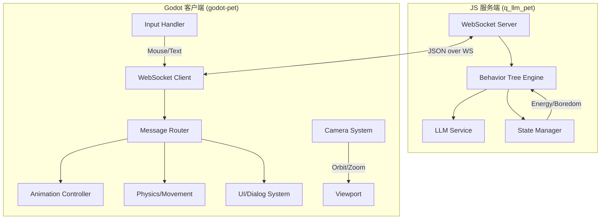

# Godot 3D 萌宠系统设计方案 (V2.0)

## 文档概述

本文档详细描述了 Godot 3D 萌宠客户端的设计方案，包括与现有 JS 后端（q_llm_pet）的集成方案、WebSocket 通信协议、3D 场景结构、动画控制逻辑等。

**文档版本**：v2.0
**最后更新**：2024
**适用项目**：

- **Godot 客户端**：godot-pet
- **JS 服务端**：q_llm_pet
- **技术栈**：Godot 4.x + Node.js + WebSocket

---

## 1. 项目概述

### 1.1 项目背景

本项目旨在开发一个 3D 版本的 Godot 萌宠客户端，并将其接入现有的 JS 后端（q_llm_pet）。后端将作为"大脑"，通过 WebSocket 协议驱动 Godot 客户端的表现逻辑（动作、表情、位置、对话），实现与 Web 版萌宠一致的交互体验。

### 1.2 核心目标

#### 🎯 3D 表现力

- 利用 Godot 4.x 的 3D 渲染和动画系统，打造生动的萌宠形象
- 支持高质量的 3D 模型渲染和动画混合
- 实现物理引擎驱动的真实物理交互

#### 🔄 跨平台控制

- 同一套 JS 后端逻辑（LLM + 行为树）同时支持 Web 端和 Godot 端
- 统一的行为树决策引擎，确保多端表现一致性
- 共享的 LLM 对话和意图理解逻辑

#### 🖱️ 双向交互

- **文字指令**：支持自然语言输入控制萌宠行为
- **鼠标拖拽**：实现直观的物理交互体验
- **点击互动**：支持多种点击反馈和响应
- **视角跟随**：智能的第三人称相机控制

#### 📡 统一协议

- 定义标准化的 WebSocket 消息格式
- 确保 Web 端和 Godot 端的通信协议完全兼容
- 支持扩展新的交互模式和数据类型

### 1.3 项目优势

1. **渐进式开发**：可以在现有 q_llm_pet 项目基础上逐步添加 Godot 支持
2. **技术成熟**：WebSocket + JSON 的通信方案简单可靠
3. **性能优化**：Godot 的高性能 3D 引擎确保流畅的视觉体验
4. **可扩展性**：架构设计支持未来添加多人协作、语音交互等功能

---

## 2. 系统架构



### 2.1 职责划分原则

| 组件                   | 位置      | 职责                                                                                        | 特点                                   |
| ---------------------- | --------- | ------------------------------------------------------------------------------------------- | -------------------------------------- |
| **JS 服务端**    | Node.js   | **决策层**：运行行为树，处理 LLM 意图解析，维护数值状态（能量、无聊度），规划动作序列 | 实际执行行为树计算，逻辑复杂但计算量大 |
| **Godot 客户端** | Godot 4.x | **表现层**：渲染 3D 模型，执行动画混合，处理本地物理，响应用户输入                    | 专注视觉表现和高频渲染，性能敏感       |

### 2.2 关键设计原则

1. **决策与表现分离**：服务端负责"思考"，客户端负责"表现"
2. **状态同步机制**：关键状态（如能量、无聊度）在服务端计算，客户端同步显示
3. **事件驱动通信**：基于 WebSocket 的 JSON 事件模式
4. **渐进式增强**：从简单指令执行开始，逐步添加复杂交互

---

## 3. WebSocket 通信协议

### 3.1 协议设计原则

- **基于 JSON**：易于调试和扩展的数据格式
- **事件驱动**：明确的消息类型和数据结构
- **双向通信**：支持客户端主动上报和服务端推送
- **版本兼容**：消息格式支持向后兼容
- **错误处理**：包含错误码和错误信息字段

### 3.2 客户端 → 服务端 (指令与状态上报)

| 消息类型 (`type`) | 数据内容 (`data`)                                | 描述                   | 频率        |
| ------------------- | -------------------------------------------------- | ---------------------- | ----------- |
| `handshake`       | `{"client_type": "godot", "version": "1.0"}`     | 连接建立时的身份声明   | 连接时      |
| `user_input`      | `{"text": "跳个舞吧"}`                           | 用户输入的文字指令     | 按需        |
| `interaction`     | `{"action": "click", "position": [x,y,z]}`       | 鼠标点击或拖拽事件     | 实时        |
| `interaction`     | `{"action": "drag_start", "start_pos": [x,y,z]}` | 拖拽开始               | 实时        |
| `interaction`     | `{"action": "drag_end", "end_pos": [x,y,z]}`     | 拖拽结束               | 实时        |
| `state_sync`      | `{"position": [x,y,z], "orientation": [x,y,z]}`  | 客户端坐标同步（低频） | 每秒 1-5 次 |

**消息格式示例：**

```json
{
  "type": "user_input",
  "timestamp": 1234567890,
  "client_id": "godot_client_001",
  "data": {
    "text": "跳个舞吧"
  }
}
```

### 3.3 服务端 → 客户端 (执行指令与状态推送)

| 消息类型 (`type`) | 数据内容 (`data`)                                             | 描述                     | 频率    |
| ------------------- | --------------------------------------------------------------- | ------------------------ | ------- |
| `bt_output`       | `{"action": "DANCE", "expression": "HAPPY", "duration": 4.0}` | 播放指定的身体动作和表情 | 按需    |
| `move_to`         | `{"target": [x,y,z], "speed": 2.0, "path": [...]}`            | 引导萌宠移动到特定位置   | 按需    |
| `chat`            | `{"content": "好的，看我为你表演！", "emotion": "excited"}`   | 萌宠的对白，显示在 UI 上 | 按需    |
| `status_update`   | `{"energy": 85, "boredom": 10, "mood": "happy"}`              | 数值状态同步，更新 UI 条 | 每 2 秒 |
| `error`           | `{"code": 1001, "message": "Invalid action"}`                 | 错误信息反馈             | 异常时  |

**消息格式示例：**

```json
{
  "type": "bt_output",
  "timestamp": 1234567891,
  "data": {
    "action": "DANCE",
    "expression": "HAPPY",
    "duration": 4.0,
    "position": [0, -1, 0],
    "energy": 95,
    "boredom": 10,
    "chat_messages": [
      {"role": "assistant", "content": "好的，我来跳舞给你看！"}
    ],
    "action_sequence": [
      {"action": "WALK", "target_pos": [2, -1, 0], "duration": 2.0},
      {"action": "DANCE", "duration": 4.0},
      {"action": "IDLE", "duration": 1.0}
    ]
  }
}
```

### 3.4 协议扩展性

**版本控制：**

```json
{
  "protocol_version": "2.0",
  "supported_features": ["actions", "expressions", "chat", "physics"]
}
```

**自定义扩展：**

```json
{
  "type": "custom_event",
  "event_name": "pet_special_ability",
  "data": {
    "ability_type": "fire_breath",
    "power": 100
  }
}
```

---

## 4. Godot 客户端实现细节

### 4.1 3D 场景结构

基于 `godot-demo-projects/3d/platformer` 的设计模式：

#### 🐧 Pet (CharacterBody3D) - 萌宠主体

```gdscript
# 场景树结构
Pet (CharacterBody3D)
├── MeshInstance3D (萌宠模型)
├── AnimationTree (动画控制器)
├── CollisionShape3D (碰撞检测)
├── AudioStreamPlayer3D (音效播放)
└── ParticleSystem (特效系统)
```

**核心特性：**

- **MeshInstance3D**：萌宠 3D 模型，支持 LOD (Level of Detail)
- **AnimationTree**：使用 StateMachine 或 BlendTree 实现动作平滑过渡
- **CollisionShape3D**：用于检测鼠标点击、拖拽和物理碰撞
- **CharacterBody3D**：集成 Godot 物理引擎，支持重力、碰撞等

#### 📷 Main Camera (Camera3D) - 主相机

```gdscript
# 相机系统结构
CameraRig (Node3D)
├── SpringArm3D (弹性臂)
│   └── Camera3D (实际相机)
└── CameraController (控制脚本)
```

**核心特性：**

- **SpringArm3D**：实现第三人称跟随视角，带弹性缓冲
- **鼠标右键旋转**：支持 360° 水平旋转和垂直角度限制
- **滚轮缩放**：支持距离缩放，有最小/最大距离限制
- **平滑插值**：所有相机移动都使用 Tween 动画

#### 🌍 Environment - 环境系统

```gdscript
# 环境配置
WorldEnvironment
├── Environment (环境资源)
│   ├── Background: Custom Color (渐变天空)
│   ├── Ambient Light: Color + Energy
│   └── Tonemap: ACES (电影级调色)
└── DirectionalLight3D (主光源)
    ├── Shadow: Enabled
    └── Color Temperature: 6500K (日光色温)
```

### 4.2 动画控制逻辑

#### 动画系统架构

```gdscript
class_name AnimationController
extends Node

@onready var animation_tree: AnimationTree = $AnimationTree
@onready var expression_player: AnimationPlayer = $ExpressionPlayer

func on_bt_output_received(data: Dictionary) -> void:
    # 播放身体动画
    if data.has("action"):
        var action_name = data["action"].to_lower()
        animation_tree.get("parameters/playback").travel(action_name)

    # 播放表情动画（通常作为叠加层）
    if data.has("expression"):
        var expression_name = data["expression"].to_lower()
        expression_player.play(expression_name)

    # 处理动作序列
    if data.has("action_sequence"):
        play_action_sequence(data["action_sequence"])
```

#### 动作序列处理

```gdscript
func play_action_sequence(sequence: Array) -> void:
    for action_data in sequence:
        var tween = create_tween()
        tween.tween_callback(func():
            on_bt_output_received(action_data)
        )
        tween.tween_interval(action_data.get("duration", 1.0))
    await tween.finished
```

#### 动画混合设置

- **StateMachine**：用于离散动作切换 (IDLE → WALK → RUN)
- **BlendTree**：用于连续动作混合 (行走速度渐变)
- **Additive Layer**：用于表情叠加 (基础动作 + 表情动画)

### 4.3 视角移动控制

#### 第三人称相机实现

```gdscript
class_name CameraController
extends Node3D

@onready var spring_arm: SpringArm3D = $SpringArm3D
@onready var camera: Camera3D = $SpringArm3D/Camera3D

@export var mouse_sensitivity: float = 0.002
@export var zoom_speed: float = 0.1
@export var min_zoom: float = 2.0
@export var max_zoom: float = 10.0

func _input(event: InputEvent) -> void:
    # 鼠标右键旋转
    if event is InputEventMouseMotion and Input.is_mouse_button_pressed(MOUSE_BUTTON_RIGHT):
        rotation.y -= event.relative.x * mouse_sensitivity
        spring_arm.rotation.x -= event.relative.y * mouse_sensitivity
        spring_arm.rotation.x = clamp(spring_arm.rotation.x, -PI/3, PI/6)

    # 滚轮缩放
    if event is InputEventMouseButton:
        if event.button_index == MOUSE_BUTTON_WHEEL_UP:
            spring_arm.spring_length = max(min_zoom, spring_arm.spring_length - zoom_speed)
        elif event.button_index == MOUSE_BUTTON_WHEEL_DOWN:
            spring_arm.spring_length = min(max_zoom, spring_arm.spring_length + zoom_speed)
```

#### 智能跟随逻辑

```gdscript
func _physics_process(delta: float) -> void:
    # 平滑跟随萌宠位置
    var target_position = pet.global_position + Vector3(0, 2, 0)  # 头顶上方
    global_position = global_position.lerp(target_position, follow_speed * delta)

    # 自动调整距离（基于萌宠移动速度）
    if pet.velocity.length() > 1.0:
        spring_arm.spring_length = lerp(spring_arm.spring_length, 4.0, delta)
    else:
        spring_arm.spring_length = lerp(spring_arm.spring_length, 3.0, delta)
```

#### 文字控制视角

```gdscript
func on_server_command(command: String) -> void:
    match command:
        "look_at_user":
            look_at_player()
        "follow_closely":
            spring_arm.spring_length = 2.0
        "back_away":
            spring_arm.spring_length = 6.0
```

---

## 5. JS 服务端迁移方案 (q_llm_pet)

### 5.1 架构调整目标

将 `q_llm_pet` 从单机 Web 应用改造为支持多客户端连接的 WebSocket 服务端。

### 5.2 核心改动

#### 📦 依赖添加

```json
// package.json
{
  "dependencies": {
    "ws": "^8.14.0",
    "uuid": "^9.0.0"
  }
}
```

#### 🏗️ 服务端架构

```typescript
// BTServer.ts - 新增独立的服务端文件
import WebSocket from 'ws';
import { Blackboard } from './services/bt/core/Blackboard';
import { createMainBT, createActiveServiceBT, createIntentBT, createEmotionBT } from './services/bt/trees';

interface ConnectedClient {
  id: string;
  ws: WebSocket;
  blackboard: Blackboard;
  lastActivity: Date;
}

class BTWebSocketServer {
  private wss: WebSocket.Server;
  private clients: Map<string, ConnectedClient> = new Map();

  constructor(port: number = 8080) {
    this.wss = new WebSocket.Server({ port });
    this.setupEventHandlers();
    console.log(`BT WebSocket Server started on port ${port}`);
  }

  private setupEventHandlers() {
    this.wss.on('connection', (ws: WebSocket) => {
      const clientId = this.generateClientId();
      const blackboard = new Blackboard();

      // 初始化行为树
      const trees = {
        mainBT: createMainBT(),
        activeBT: createActiveServiceBT(),
        intentBT: createIntentBT(),
        emotionBT: createEmotionBT()
      };

      const client: ConnectedClient = {
        id: clientId,
        ws,
        blackboard,
        lastActivity: new Date()
      };

      this.clients.set(clientId, client);
      this.setupClientHandlers(client, trees);
    });
  }
}
```

#### 🔄 黑板同步机制

```typescript
// 为每个客户端维护独立的黑板实例
private setupClientHandlers(client: ConnectedClient, trees: any) {
  const { ws, blackboard } = client;

  ws.on('message', (message: Buffer) => {
    try {
      const data = JSON.parse(message.toString());

      // 处理客户端消息
      switch (data.type) {
        case 'handshake':
          this.handleHandshake(client, data);
          break;
        case 'user_input':
          this.handleUserInput(client, trees, data);
          break;
        case 'interaction':
          this.handleInteraction(client, data);
          break;
      }
    } catch (error) {
      console.error('Message parsing error:', error);
    }
  });
}
```

#### 🎯 行为树执行引擎

```typescript
// 提取自 App.tsx 的 BT 控制器逻辑
private startBTExecution(client: ConnectedClient, trees: any) {
  const { blackboard } = client;

  // 1. 低频：主动服务 (每2秒执行一次)
  setInterval(() => {
    trees.activeBT.tick(null, blackboard);
    this.syncStatusToClient(client);
  }, 2000);

  // 2. 按需：意图理解 (由 hasNewInput 触发)
  const intentLoop = () => {
    if (blackboard.get('hasNewInput')) {
      const status = trees.intentBT.tick(null, blackboard);
      if (status === 1 || status === 2) { // SUCCESS or FAILURE
        blackboard.set('hasNewInput', false);
      }
    }
    setTimeout(intentLoop, 100); // ~10fps
  };
  intentLoop();

  // 3. 高频：核心逻辑 (每帧执行)
  const mainLoop = () => {
    trees.emotionBT.tick(null, blackboard);
    trees.mainBT.tick(null, blackboard);
    this.sendBTOutputToClient(client);
    setTimeout(mainLoop, 16); // ~60fps
  };
  mainLoop();
}
```

#### 📡 消息路由

```typescript
private sendBTOutputToClient(client: ConnectedClient) {
  const { ws, blackboard } = client;

  // 收集 BT 输出
  const btOutput: any = {};

  const action = blackboard.get('bt_output_action');
  if (action) {
    btOutput.action = action;
    blackboard.set('bt_output_action', null);
  }

  const expression = blackboard.get('bt_output_expression');
  if (expression) {
    btOutput.expression = expression;
    blackboard.set('bt_output_expression', null);
  }

  // 发送消息
  if (Object.keys(btOutput).length > 0) {
    ws.send(JSON.stringify({
      type: 'bt_output',
      timestamp: Date.now(),
      data: btOutput
    }));
  }
}
```

### 5.3 LLM 适配

确保 LLM 输出的动作指令能正确路由到对应的 WebSocket 连接：

```typescript
// LLM 服务适配
private async handleUserInput(client: ConnectedClient, trees: any, data: any) {
  const { blackboard } = client;

  // 设置输入到黑板
  blackboard.set('lastUserInput', data.data.text);
  blackboard.set('hasNewInput', true);

  // 触发意图理解
  const status = trees.intentBT.tick(null, blackboard);

  // LLM 推理会在这里被触发 (通过 ToolRegistry)
  // 结果会写入黑板，然后通过 sendBTOutputToClient 发送给客户端
}
```

---

## 6. 开发规划 (Todo List)

### 6.1 第一阶段：基础架构搭建 (1-2 周) ✅

#### [Godot] 3D 场景搭建 ✅
- [x] 创建 Godot 4.x 项目，设置 3D 场景
- [x] 导入或创建萌宠 3D 模型 (GLTF/GLB 格式)
- [x] 配置 AnimationTree，支持基础动作 (IDLE, WALK, DANCE 等)
- [x] 实现 CharacterBody3D 物理系统

#### [Godot] WebSocket 客户端基础 ✅
- [x] 创建 WebSocketClient 脚本
- [x] 实现连接/断开逻辑
- [x] 添加 JSON 消息解析和发送
- [x] 实现心跳保活机制

#### [Godot] 第三人称相机控制 ✅
- [x] 实现 SpringArm3D 跟随系统
- [x] 添加鼠标右键旋转控制
- [x] 实现滚轮缩放功能
- [x] 添加相机边界限制

### 6.2 第二阶段：通信协议实现 (1 周) [进行中]

#### [JS] 服务端改造

- [ ] 在 q_llm_pet 中添加 `ws` 依赖
- [ ] 创建 BTServer.ts，提取 BT 执行逻辑
- [ ] 实现多客户端连接管理
- [ ] 添加消息路由和错误处理

#### [Protocol] 通信协议标准化

- [ ] 定义完整的 JSON 消息格式
- [ ] 实现握手和状态同步
- [ ] 添加协议版本控制
- [ ] 编写协议文档和测试用例

### 6.3 第三阶段：功能集成 (2 周)

#### [Sync] 联调测试

- [ ] 实现"文字指令 → LLM → BT → WS → Godot 动画播放"闭环
- [ ] 测试鼠标拖拽交互
- [ ] 验证状态同步 (能量、无聊度)
- [ ] 优化网络延迟和性能

#### [UI] 用户界面

- [ ] 在 Godot 中添加聊天界面
- [ ] 实现状态条显示 (能量、无聊度)
- [ ] 添加连接状态指示器
- [ ] 支持多语言界面

### 6.4 第四阶段：优化和扩展 (1-2 周)

#### [Performance] 性能优化

- [ ] 实现动画预加载和缓存
- [ ] 优化物理计算频率
- [ ] 添加网络异常处理和重连
- [ ] 实现资源 LOD 系统

#### [Features] 高级功能

- [ ] 支持动作序列播放
- [ ] 添加环境交互 (草地变形、水面反射)
- [ ] 实现粒子特效系统
- [ ] 添加音效和背景音乐

---

## 7. 技术风险评估

### 7.1 潜在风险

| 风险等级 | 风险描述             | 影响程度 | 应对方案                   |
| -------- | -------------------- | -------- | -------------------------- |
| 中       | WebSocket 连接稳定性 | 高       | 实现自动重连和心跳机制     |
| 低       | Godot 4.x 学习曲线   | 中       | 利用现有 demo 项目快速上手 |
| 中       | 跨端状态同步一致性   | 高       | 严格的服务端权威原则       |
| 低       | 3D 模型资源获取      | 中       | 先用程序生成的几何体测试   |
| 中       | 性能优化挑战         | 高       | 分阶段开发，逐步优化       |

### 7.2 成功标准

- [ ] WebSocket 连接稳定，延迟 < 100ms
- [ ] 文字指令响应时间 < 2秒
- [ ] 3D 动画播放流畅，60fps
- [ ] 鼠标交互响应即时，无明显延迟
- [ ] 跨端表现一致性 > 95%

---

## 8. 其他推荐方案：WebRTC (进阶)

### 8.1 WebRTC 的优势

如果你未来需要 **超低延迟** 的物理交互或 **远程语音流**，可以考虑在后期将 WebSocket 升级为 WebRTC 方案。

#### 🎯 适用场景

1. **高频物理同步**：实时拽着萌宠甩来甩去，要求 Web 端和 Godot 端动作完全同步
2. **语音交互**：通过麦克风实时对话，萌宠实时语音回复
3. **多人协作**：多个客户端同时操控同一只萌宠
4. **视频流传输**：萌宠"看到"用户（摄像头输入）

#### 🚀 技术特点

- **延迟极低**：通常 < 50ms，比 WebSocket 快 2-4 倍
- **P2P 直连**：减少服务器带宽压力
- **原生音视频**：内置 WebRTC 的 SRTP 协议和音频处理

### 8.2 实现复杂度

**当前阶段建议：坚持使用 WebSocket**

理由：

- ✅ **实现成本低**：Node.js + Godot 的 WebSocket 支持都非常成熟
- ✅ **开发效率高**：不需要额外的信令服务器和 STUN/TURN 服务器
- ✅ **调试简单**：可以直接用浏览器开发者工具查看消息
- ✅ **足够满足需求**：对于 LLM + 行为树的场景，WebSocket 性能完全够用

**何时升级到 WebRTC：**

- 发现 WebSocket 在弱网环境下有明显延迟问题
- 需要添加实时语音交互功能
- 需要支持多人实时协作
- 需要传输视频流数据

### 8.3 混合架构建议

在实际的高端项目中，通常会**同时使用**两种协议：

- **WebSocket**：用于信令交换、关键逻辑下发和聊天消息
- **WebRTC**：用于高频数据同步（坐标、物理状态）和媒体流

这种方案既保证了可靠性，又获得了极致的实时性能。

---

## 9. 总结

### 9.1 项目价值

本设计方案实现了：

- **技术创新**：将先进的 AI 技术 (LLM + 行为树) 与 3D 游戏引擎结合
- **用户体验**：提供沉浸式的 3D 萌宠交互体验
- **架构优雅**：清晰的职责分离和模块化设计
- **扩展性强**：支持未来添加更多复杂功能

### 9.2 实施建议

1. **从小开始**：先实现基础的 WebSocket 通信和简单动画播放
2. **快速迭代**：每个功能模块完成后立即测试联调
3. **用户优先**：始终以用户体验为导向，性能优化为辅助
4. **文档同步**：随着开发进展及时更新设计文档

### 9.3 预期成果

- 一个功能完整的 3D 萌宠客户端
- 与现有 Web 版完全兼容的交互体验
- 可扩展的架构，支持未来功能增强
- 详细的技术文档和开发指南

---

## 10. 附录

### 10.1 参考资料

- [Godot 官方文档](https://docs.godotengine.org/en/stable/)
- [WebSocket 协议规范 (RFC 6455)](https://tools.ietf.org/html/rfc6455)
- [Node.js WebSocket 库 (ws)](https://github.com/websockets/ws)
- [Godot 网络教程](https://docs.godotengine.org/en/stable/tutorials/networking/)

### 10.2 相关项目

- `godot-demo-projects/3d/platformer` - 3D 平台跳跃游戏示例
- `godot-demo-projects/networking/websocket_minimal` - WebSocket 通信示例
- `q_llm_pet` - 原版 Web 萌宠项目

### 10.3 版本历史

| 版本 | 日期    | 主要变更                                 |
| ---- | ------- | ---------------------------------------- |
| v1.0 | 2024-01 | 初始设计方案                             |
| v2.0 | 2024-01 | 完善通信协议，添加实现细节，扩展功能规划 |

---

**文档版本**：v2.0
**最后更新**：2024
**维护者**：开发团队
**状态**：设计阶段，待实施
