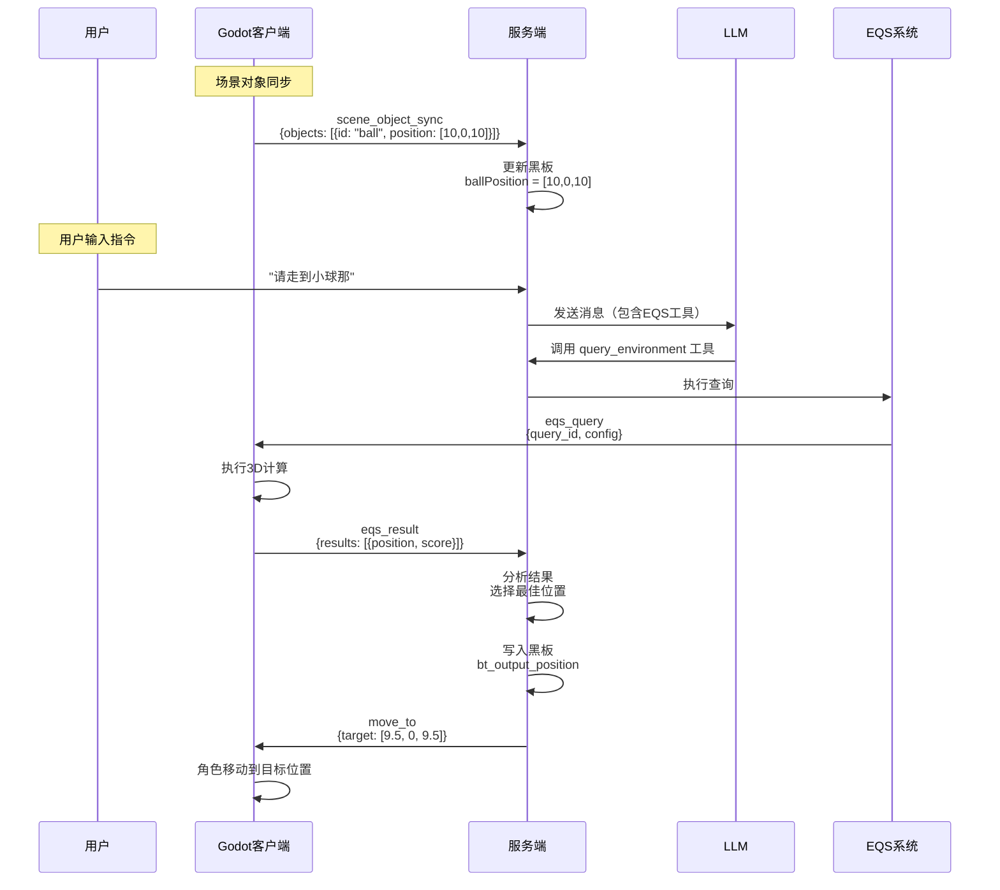

# EQS 环境查询系统使用说明

## 快速开始

### 测试场景：走到小球那

1. **启动服务端**
   ```bash
   cd AVATAR/q_llm_pet
   npm run dev
   ```

2. **启动 Godot 客户端**
   - 打开 `godot-pet` 项目
   - 运行场景 `main.tscn`
   - 确保 WebSocket 连接到服务端

3. **小球位置自动上报**
   - 场景中的小球位置会自动每 0.5 秒上报到服务端
   - 服务端会将小球位置存储在黑板中（`ballPosition`）

4. **使用 LLM 命令**
   - 在 UI 中输入："请走到小球那"
   - LLM 会调用 `query_environment` 工具
   - EQS 系统会查询小球附近的最佳位置
   - 角色会自动移动到该位置

## 工作流程



## LLM 工具调用示例

### 工具定义

EQS 已注册为 LLM 工具，工具名：`query_environment`

### 工具参数

```json
{
  "goal": "走到小球那",
  "constraints": ["可达"],
  "max_results": 5,
  "min_score": 0.3
}
```

### LLM 调用示例

当用户说"请走到小球那"时，LLM 会返回：

```json
{
  "tool_calls": [{
    "function": {
      "name": "query_environment",
      "arguments": "{\"goal\": \"走到小球那\", \"constraints\": [\"可达\"]}"
    }
  }]
}
```

## 代码示例

### 服务端：在行为树中使用 EQS

```typescript
// 在行为树中直接使用 EQSQueryNode
import EQSQueryNode from './actions/EQSQueryNode';

const tree = new BehaviorTree();
tree.root = new Sequence({
  children: [
    new EQSQueryNode({
      goal: '走到小球那',
      constraints: ['可达']
    }),
    new MoveToTargetAction() // 使用查询结果移动
  ]
});
```

### 客户端：场景对象同步

小球位置会自动上报，无需额外代码。如果需要添加其他对象：

```gdscript
# 在 scene_object_sync.gd 中添加
func _find_scene_objects():
    # 查找小球
    var ball = get_node_or_null("/root/Main/PhysicsTest/Ball")
    if ball:
        scene_objects.append(ball)
        tracked_objects[ball.get_path()] = "ball"
    
    # 添加其他对象
    # var item = get_node_or_null("/root/Main/Items/Item1")
    # if item:
    #     scene_objects.append(item)
    #     tracked_objects[item.get_path()] = "item_1"
```

## 测试

运行测试：

```bash
cd AVATAR/q_llm_pet
npm test -- EQS.test.ts
npm test -- EQS_integration.test.ts
```

## 常见问题

### Q: 小球位置没有上报？

A: 检查：
1. 场景中是否有 `PhysicsTest/Ball` 节点
2. `scene_object_sync.gd` 是否正确添加到 `pet_controller`
3. WebSocket 连接是否正常

### Q: LLM 没有调用 EQS 工具？

A: 检查：
1. LLM 设置中是否包含 EQS 工具定义
2. 工具是否已注册：`ToolRegistry.autoRegisterActionNodes()`
3. LLM 的 system_instruction 是否包含 EQS 工具说明

### Q: 查询结果为空？

A: 检查：
1. 目标位置是否正确（小球位置是否已上报）
2. 查询配置是否合理（半径、点数等）
3. 测试条件是否太严格（min_score 等）

## 扩展

### 添加新的查询目标

在 `ServerEQS.ts` 的 `planQuery` 方法中添加新的目标类型：

```typescript
if (goalLower.includes('你的新目标')) {
  generator = {
    type: 'Points_Circle',
    params: { radius: 15.0, points_count: 24 }
  };
  // 添加测试器...
}
```

### 添加新的测试器

在 `eqs_adapter.gd` 中添加：

```gdscript
func _run_test(point: Vector3, test_type: String, params: Dictionary, context: Dictionary) -> float:
    match test_type:
        "Test_Custom":
            return _test_custom(point, params, context)
        # ... 其他测试器
```
