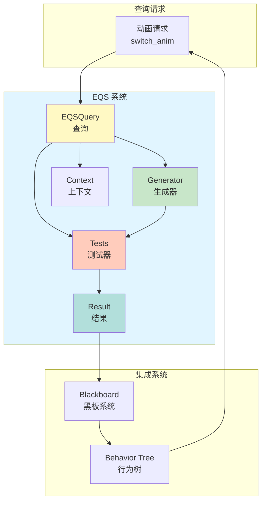
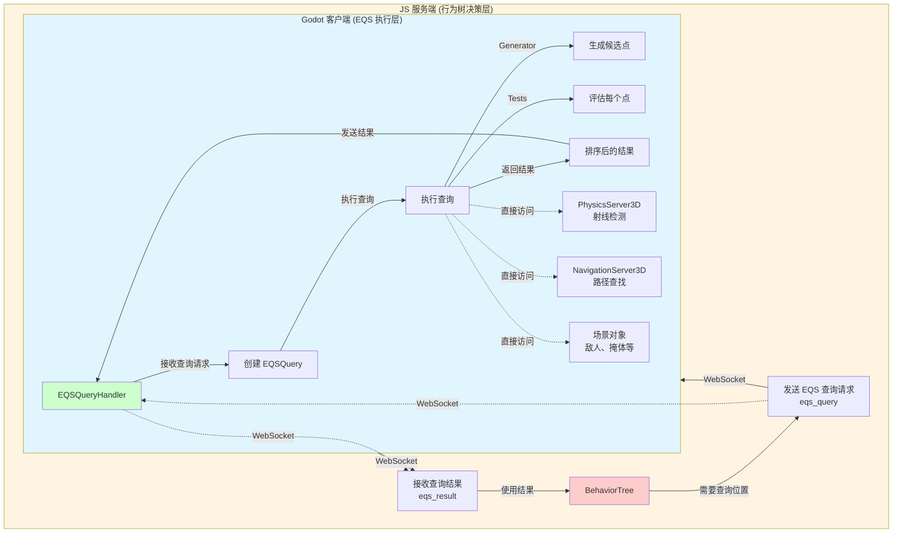
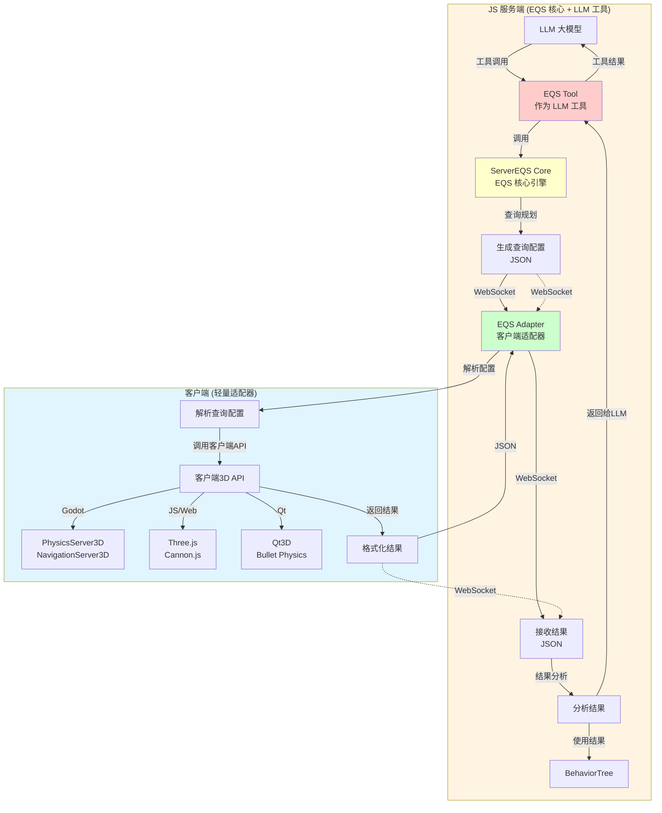
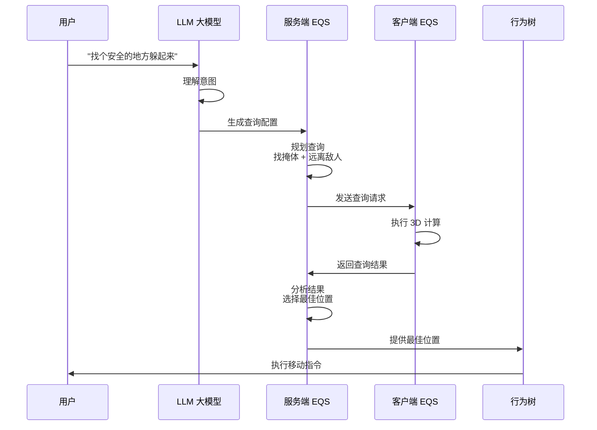
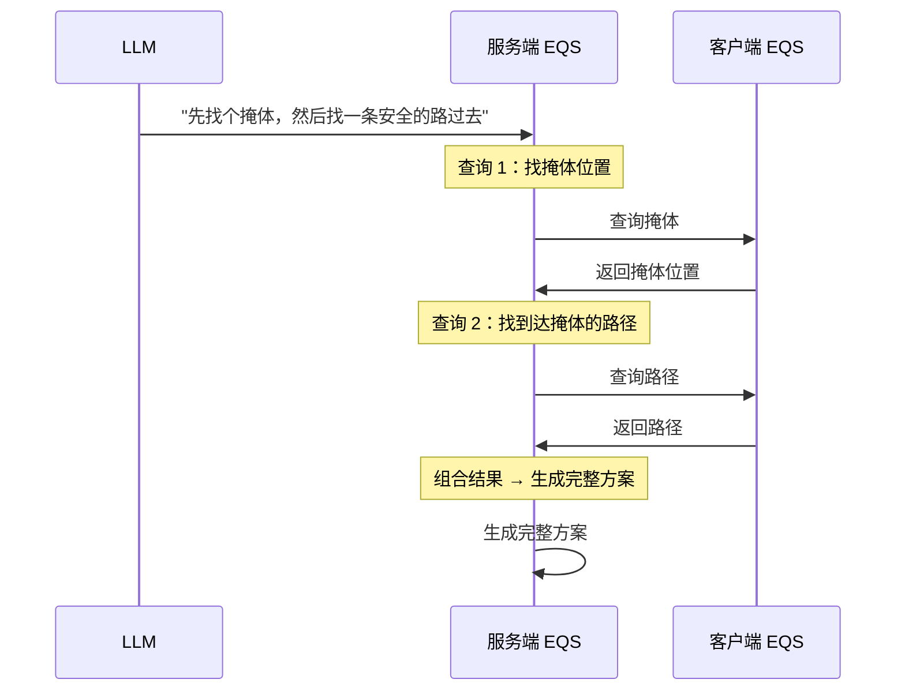
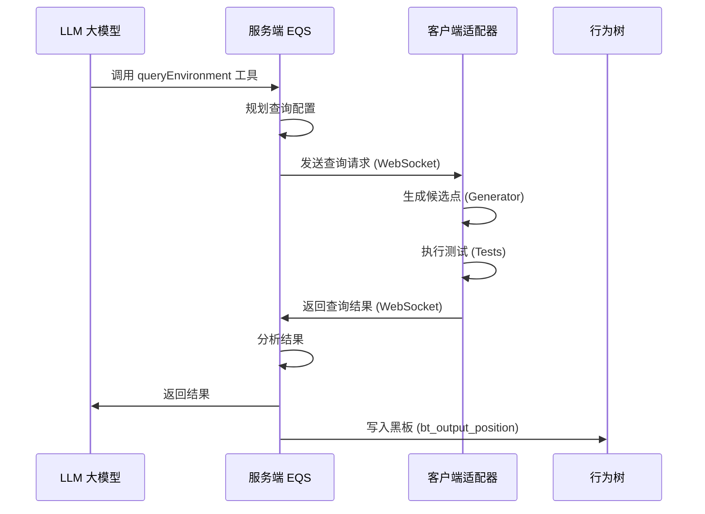
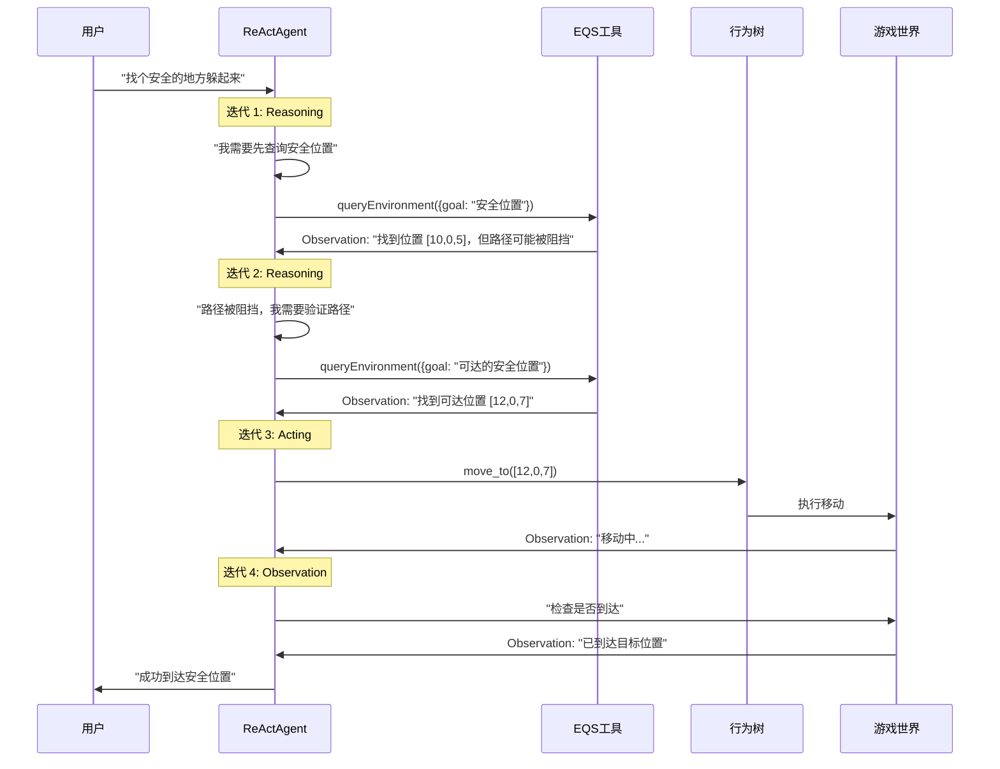
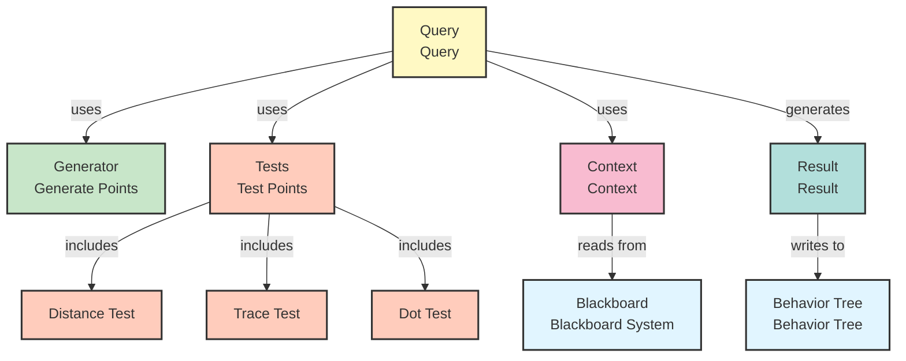
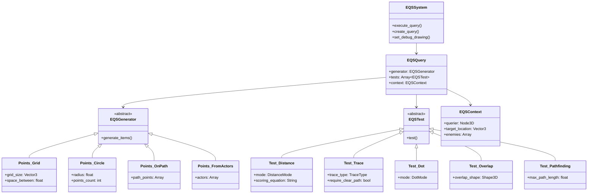
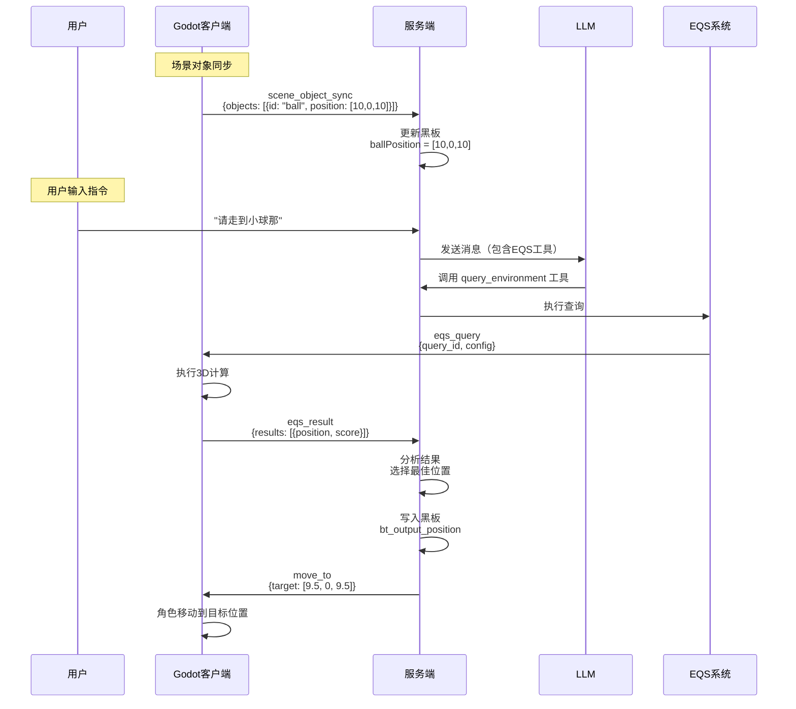

# EQS 环境查询系统设计开发文档

## 目录
1. [系统概述](#系统概述)
2. [核心概念](#核心概念)
3. [部署架构决策](#部署架构决策)
4. [当前实现状态](#当前实现状态)
5. [EQS 与 ReActAgent 的关系](#eqs-与-reactagent-的关系)
6. [架构设计](#架构设计)
7. [核心组件](#核心组件)
8. [查询生成器（Generators）](#查询生成器generators)
9. [测试器（Tests）](#测试器tests)
10. [上下文（Context）](#上下文context)
11. [集成方案](#集成方案)
12. [使用示例](#使用示例)
13. [快速开始和使用指南](#快速开始和使用指南)
14. [LLM 工具调用指南](#llm-工具调用指南)
15. [移动工具说明](#移动工具说明)
16. [代码示例](#代码示例)
17. [测试](#测试)
18. [常见问题](#常见问题)
19. [扩展](#扩展)
20. [性能优化](#性能优化)
21. [扩展开发](#扩展开发)

---

## 系统概述

### 什么是 EQS？

**Environment Query System (EQS)** 是一个用于在游戏环境中智能查询和评估位置的系统。它可以帮助 AI 找到：
- 最佳攻击位置
- 安全掩体位置
- 巡逻路径点
- 逃跑路线
- 物品收集点
- 任何基于环境条件的理想位置

### 为什么需要 EQS？

在传统 AI 开发中，位置选择通常通过硬编码实现：
```gdscript
# 传统方式：硬编码
var target_pos = enemy.position + Vector3(5, 0, 5)  # 固定偏移
```

**问题**：
- 不够灵活，无法适应动态环境
- 难以处理复杂条件（如：需要视野、远离危险、靠近掩体）
- 代码难以维护和扩展

**EQS 的优势**：
- **声明式查询**：描述"想要什么"，而不是"如何计算"
- **组合式测试**：通过组合多个测试条件，实现复杂查询
- **可视化调试**：可以可视化显示查询结果和评分
- **易于扩展**：添加新的查询条件只需实现新的测试器

### 系统目标

1. **灵活性**：支持多种查询模式和条件组合
2. **性能**：高效的空间查询和评分计算
3. **可扩展性**：易于添加新的生成器和测试器
4. **可调试性**：提供可视化调试工具
5. **集成性**：与现有黑板和行为树系统无缝集成

### 系统架构概览



---

## 核心概念

### 1. 查询（Query）

一个查询定义了"在什么范围内，寻找什么样的位置"。

**组成要素**：
- **生成器（Generator）**：生成候选位置点
- **测试器（Tests）**：评估每个候选点的得分
- **上下文（Context）**：提供查询所需的环境信息

### 2. 生成器（Generator）

生成器负责在空间中生成候选位置点。

**常见类型**：
- `Points_Grid`：网格生成器，在指定区域内生成网格点
- `Points_Circle`：圆形生成器，在圆形区域内生成点
- `Points_OnPath`：路径生成器，沿路径生成点
- `Points_FromActors`：从指定 Actor 周围生成点

### 3. 测试器（Tests）

测试器评估每个候选点的"可取性"，返回 0.0 到 1.0 的分数。

**常见类型**：
- `Distance`：距离测试（靠近/远离目标）
- `Dot`：方向测试（朝向/背对目标）
- `Trace`：射线检测（是否有视野、是否被遮挡）
- `Overlap`：碰撞检测（是否与物体重叠）
- `Project`：投影测试（投影到导航网格）
- `Pathfinding`：路径查找测试（是否可达）

### 4. 上下文（Context）

上下文提供查询所需的环境信息，如：
- 查询者位置
- 目标位置
- 敌人位置
- 掩体位置
- 等等

### 5. 查询结果（Query Result）

查询返回一个排序后的位置列表，每个位置包含：
- **位置坐标**：Vector3
- **总分**：float（0.0 - 1.0）
- **详细分数**：Dictionary（每个测试器的分数）

---

## 部署架构决策

### 问题：EQS 应该放在客户端还是服务端？

**当前架构**：
- **行为树在服务端（JS）**：负责 AI 决策
- **Godot 客户端**：负责物理表现和执行
- **通信方式**：WebSocket 双向通信

### 分析对比

#### 方案 A：EQS 在服务端（JS）

**优势**：
- ✅ 与行为树在同一位置，逻辑集中
- ✅ 决策和查询都在服务端，便于统一管理

**劣势**：
- ❌ **缺少 3D 环境信息**：服务端没有 3D 场景、物理引擎、导航网格
- ❌ **需要大量数据传输**：客户端需要频繁上报环境数据（碰撞体、敌人位置、掩体等）
- ❌ **性能问题**：空间查询计算在服务端效率低
- ❌ **延迟问题**：每次查询都需要网络往返
- ❌ **实现复杂**：需要在 JS 中实现 3D 空间计算、射线检测等

**结论**：❌ **不推荐**

#### 方案 B：EQS 在客户端（Godot）

**优势**：
- ✅ **完整的 3D 环境**：直接访问物理引擎、导航网格、场景对象
- ✅ **高性能**：利用 Godot 的原生 API（PhysicsServer、NavigationServer）
- ✅ **零延迟**：本地计算，无需网络往返
- ✅ **易于实现**：使用 Godot 的 API，代码简洁
- ✅ **可视化调试**：可以直接在编辑器中可视化查询结果

**劣势**：
- ⚠️ 需要将查询结果通过网络传输到服务端
- ⚠️ 查询配置需要从服务端下发（或客户端本地配置）

**结论**：✅ **强烈推荐**

### 推荐方案：混合架构

**核心思路**：EQS 在客户端执行，但查询配置和结果通过 WebSocket 与行为树交互。

#### 架构图



### 实现方案

#### 1. 查询请求协议（服务端 → 客户端）

```json
{
  "type": "eqs_query",
  "query_id": "find_cover_001",
  "timestamp": 1234567890,
  "data": {
    "context": {
      "querier_position": [0, 0, 0],
      "target_position": [10, 0, 10],
      "enemy_ids": ["enemy_1", "enemy_2"]
    },
    "generator": {
      "type": "Points_Circle",
      "params": {
        "radius": 20.0,
        "points_count": 32,
        "generate_around": "Querier"
      }
    },
    "tests": [
      {
        "type": "Test_Distance",
        "params": {
          "mode": "DISTANCE_TO_ENEMIES",
          "scoring_equation": "Inverse",
          "min_distance": 10.0
        }
      },
      {
        "type": "Test_Trace",
        "params": {
          "trace_type": "LINE_OF_SIGHT",
          "trace_from": "Item",
          "trace_to": "Target",
          "require_clear_path": false
        }
      }
    ],
    "options": {
      "max_results": 5,
      "min_score": 0.5
    }
  }
}
```

#### 2. 查询结果协议（客户端 → 服务端）

```json
{
  "type": "eqs_result",
  "query_id": "find_cover_001",
  "timestamp": 1234567890,
  "data": {
    "status": "success",
    "results": [
      {
        "position": [10.5, 0.0, 5.2],
        "score": 0.95,
        "test_scores": {
          "Test_Distance": 0.9,
          "Test_Trace": 1.0
        }
      },
      {
        "position": [8.3, 0.0, 3.1],
        "score": 0.87,
        "test_scores": {
          "Test_Distance": 0.85,
          "Test_Trace": 1.0
        }
      }
    ],
    "execution_time_ms": 15.2
  }
}
```

#### 3. 客户端实现（Godot）

```gdscript
# eqs_query_handler.gd
extends Node

signal eqs_result_received(query_id: String, results: Array)

var eqs_system: EQSSystem

func _ready():
    eqs_system = EQSSystem.get_instance()

func handle_query_request(message: Dictionary):
    var query_id = message.get("query_id", "")
    var data = message.get("data", {})
    
    # 创建上下文
    var context = _create_context_from_data(data.get("context", {}))
    
    # 创建生成器
    var generator = _create_generator_from_data(data.get("generator", {}))
    
    # 创建测试器
    var tests = _create_tests_from_data(data.get("tests", []))
    
    # 创建查询
    var query = EQSQuery.new(generator, tests)
    query.min_score = data.get("options", {}).get("min_score", 0.0)
    
    # 执行查询（异步）
    _execute_query_async(query, context, query_id)

func _execute_query_async(query: EQSQuery, context: EQSContext, query_id: String):
    # 在后台线程执行查询
    var thread = Thread.new()
    thread.start(func():
        var results = eqs_system.execute_query(query, context)
        call_deferred("_on_query_complete", query_id, results, thread)
    )

func _on_query_complete(query_id: String, results: Array, thread: Thread):
    thread.wait_to_finish()
    
    # 格式化结果
    var formatted_results = []
    for item in results:
        formatted_results.append({
            "position": [item.position.x, item.position.y, item.position.z],
            "score": item.total_score,
            "test_scores": item.test_scores
        })
    
    # 发送结果
    eqs_result_received.emit(query_id, formatted_results)
```

#### 4. 服务端实现（JS/TypeScript）

```typescript
// EQSQueryNode.ts - 行为树节点
export class EQSQueryNode extends BTAction {
  private queryId: string;
  private queryConfig: any;
  private pendingResult: any = null;

  constructor(config: any) {
    super(config);
    this.queryId = `eqs_${Date.now()}_${Math.random()}`;
    this.queryConfig = config.queryConfig;
  }

  tick(tick: Tick): number {
    const blackboard = tick.blackboard;
    
    // 如果已经有结果，直接返回
    if (this.pendingResult) {
      const bestResult = this.pendingResult.results[0];
      blackboard.set("eqs_best_position", [
        bestResult.position[0],
        bestResult.position[1],
        bestResult.position[2]
      ]);
      this.pendingResult = null;
      return SUCCESS;
    }
    
    // 发送查询请求
    const wsClient = tick.target.wsClient;
    wsClient.send("eqs_query", {
      query_id: this.queryId,
      data: {
        context: this._build_context(blackboard),
        generator: this.queryConfig.generator,
        tests: this.queryConfig.tests,
        options: this.queryConfig.options || {}
      }
    });
    
    // 注册结果监听
    wsClient.once(`eqs_result_${this.queryId}`, (result: any) => {
      this.pendingResult = result;
    });
    
    return RUNNING;  // 等待结果
  }

  private _build_context(blackboard: Blackboard): any {
    return {
      querier_position: blackboard.get("penguinPosition") || [0, 0, 0],
      target_position: blackboard.get("targetPosition") || null,
      enemy_ids: blackboard.get("enemyIds") || []
    };
  }
}
```

### 性能考虑

#### 1. 查询频率控制

```gdscript
# 限制查询频率，避免过载
var query_cooldown: Dictionary = {}
var min_query_interval: float = 0.1  # 100ms

func can_execute_query(query_id: String) -> bool:
    var last_time = query_cooldown.get(query_id, 0.0)
    var current_time = Time.get_ticks_msec() / 1000.0
    if current_time - last_time < min_query_interval:
        return false
    query_cooldown[query_id] = current_time
    return true
```

#### 2. 结果缓存

```gdscript
# 缓存查询结果，相同查询短时间内复用
var result_cache: Dictionary = {}
var cache_duration: float = 0.5  # 0.5秒缓存

func get_cached_result(cache_key: String) -> Array:
    var cached = result_cache.get(cache_key)
    if cached and Time.get_ticks_msec() - cached.timestamp < cache_duration * 1000:
        return cached.results
    return []
```

#### 3. 异步执行

```gdscript
# 复杂查询使用异步执行，不阻塞主线程
func _execute_query_async(query: EQSQuery, context: EQSContext, callback: Callable):
    var thread = Thread.new()
    thread.start(func():
        var results = eqs_system.execute_query(query, context)
        call_deferred("_on_query_complete", results, callback, thread)
    )
```

### 综合方案：服务端 EQS 核心 + 客户端适配器

**核心问题**：
1. EQS 作为 LLM 的工具被调用，应该在服务端
2. 多客户端场景（Godot、JS、Qt）需要避免重复实现
3. 3D 计算需要客户端特定的 API

**最终方案**：✅ **服务端 EQS 核心 + 客户端轻量适配器**

#### 架构设计



#### 方案优势

1. **服务端 EQS 核心（通用）**
   - ✅ 作为 LLM 工具，可以被 LLM 直接调用
   - ✅ 查询规划、结果分析逻辑统一
   - ✅ 不依赖具体客户端，可复用
   - ✅ 支持多客户端（Godot、JS、Qt 等）

2. **客户端适配器（轻量）**
   - ✅ 每个客户端只需实现适配器（~200-300 行代码）
   - ✅ 适配器只负责：解析配置 → 调用客户端 API → 格式化结果
   - ✅ 不需要完整的 EQS 系统实现

3. **架构清晰**
   - 服务端：EQS 核心逻辑（通用）
   - 客户端：3D API 适配器（平台特定）

#### 实现对比

| 方案 | 服务端代码量 | 客户端代码量 | 多客户端支持 | LLM 工具集成 |
|------|------------|------------|------------|------------|
| **方案A：客户端完整EQS** | 0 | ~2000行 | ❌ 每个客户端都要实现 | ❌ 困难 |
| **方案B：服务端完整EQS** | ~2000行 | 0 | ✅ 通用 | ✅ 容易 |
| **方案C：服务端核心+客户端适配器** | ~1500行 | ~200行/客户端 | ✅ 通用 | ✅ 容易 |

**推荐：方案C** ✅

#### 服务端 EQS 核心职责

```typescript
// ServerEQS.ts - 服务端 EQS 核心
export class ServerEQS {
  /**
   * 作为 LLM 工具被调用
   */
  async queryEnvironment(params: {
    goal: string;  // "找个安全的地方"
    constraints?: string[];  // ["远离敌人", "有掩体"]
  }): Promise<EQSResult> {
    // 1. 根据目标生成查询配置
    const config = this.planQuery(params.goal, params.constraints);
    
    // 2. 发送到客户端执行
    const results = await this.executeOnClient(config);
    
    // 3. 分析结果
    return this.analyzeResults(results);
  }
  
  /**
   * 查询规划（不依赖客户端）
   */
  private planQuery(goal: string, constraints?: string[]): EQSQueryConfig {
    // 根据目标和约束生成查询配置
    // 这部分逻辑完全在服务端，不依赖客户端
  }
  
  /**
   * 在客户端执行（通过 WebSocket）
   */
  private async executeOnClient(config: EQSQueryConfig): Promise<any> {
    // 发送到客户端，等待结果
  }
}
```

#### 客户端适配器实现（Godot 示例）

```gdscript
# eqs_adapter.gd - Godot 客户端适配器
extends Node

class_name EQSAdapter

## 轻量适配器：只负责将服务端配置转换为 Godot API 调用

func execute_query(config: Dictionary, context: Dictionary) -> Dictionary:
    var generator_type = config.get("generator", {}).get("type", "")
    var generator_params = config.get("generator", {}).get("params", {})
    var tests = config.get("tests", [])
    
    # 1. 生成候选点（调用 Godot API）
    var candidate_points = _generate_points(generator_type, generator_params, context)
    
    # 2. 执行测试（调用 Godot API）
    var results = []
    for point in candidate_points:
        var score = _evaluate_point(point, tests, context)
        if score > 0:
            results.append({
                "position": [point.x, point.y, point.z],
                "score": score
            })
    
    # 3. 排序并返回
    results.sort_custom(func(a, b): return a.score > b.score)
    return {"results": results}

func _generate_points(type: String, params: Dictionary, context: Dictionary) -> Array[Vector3]:
    match type:
        "Points_Circle":
            return _generate_circle(params, context)
        "Points_Grid":
            return _generate_grid(params, context)
        # ... 其他生成器

func _evaluate_point(point: Vector3, tests: Array, context: Dictionary) -> float:
    var total_score = 1.0
    for test_config in tests:
        var test_type = test_config.get("type", "")
        var test_params = test_config.get("params", {})
        var score = _run_test(point, test_type, test_params, context)
        if score < 0:  # 过滤
            return -1.0
        total_score *= score
    return total_score

func _run_test(point: Vector3, test_type: String, params: Dictionary, context: Dictionary) -> float:
    match test_type:
        "Test_Distance":
            return _test_distance(point, params, context)
        "Test_Trace":
            return _test_trace(point, params, context)
        "Test_Pathfinding":
            return _test_pathfinding(point, params, context)
        # ... 其他测试器
    return 1.0

# 使用 Godot 原生 API
func _test_trace(point: Vector3, params: Dictionary, context: Dictionary) -> float:
    var from_pos = _get_position_from_context(params.get("trace_from", ""), context)
    var to_pos = point if params.get("trace_to") == "Item" else _get_position_from_context(params.get("trace_to", ""), context)
    
    var space_state = get_world_3d().direct_space_state
    var query = PhysicsRayQueryParameters3D.create(from_pos, to_pos)
    var result = space_state.intersect_ray(query)
    
    if params.get("require_clear_path", true) and result:
        return -1.0
    return 1.0
```

#### 客户端适配器实现（JS/Web 示例）

```typescript
// eqs_adapter.ts - JS/Web 客户端适配器
export class EQSAdapter {
  private scene: THREE.Scene;
  private raycaster: THREE.Raycaster;
  
  async executeQuery(config: any, context: any): Promise<any> {
    // 1. 生成候选点（使用 Three.js）
    const candidatePoints = this.generatePoints(config.generator, context);
    
    // 2. 执行测试（使用 Three.js API）
    const results = [];
    for (const point of candidatePoints) {
      const score = this.evaluatePoint(point, config.tests, context);
      if (score > 0) {
        results.push({
          position: [point.x, point.y, point.z],
          score: score
        });
      }
    }
    
    // 3. 排序并返回
    results.sort((a, b) => b.score - a.score);
    return { results };
  }
  
  private testTrace(point: THREE.Vector3, params: any, context: any): number {
    const fromPos = this.getPositionFromContext(params.trace_from, context);
    const toPos = params.trace_to === "Item" ? point : this.getPositionFromContext(params.trace_to, context);
    
    // 使用 Three.js Raycaster
    this.raycaster.set(fromPos, toPos.sub(fromPos).normalize());
    const intersects = this.raycaster.intersectObjects(this.scene.children);
    
    if (params.require_clear_path && intersects.length > 0) {
      return -1.0;
    }
    return 1.0;
  }
}
```

#### 多客户端支持对比

| 客户端类型 | 适配器代码量 | 主要 API |
|-----------|------------|---------|
| **Godot** | ~200行 | PhysicsServer3D, NavigationServer3D |
| **JS/Web** | ~200行 | Three.js, Cannon.js |
| **Qt** | ~200行 | Qt3D, Bullet Physics |
| **Unity** | ~200行 | Physics.Raycast, NavMesh |

**每个客户端只需实现适配器，核心逻辑在服务端统一。**

#### LLM 工具集成

```typescript
// 将 EQS 注册为 LLM 工具
const EQS_TOOL = {
  type: "function",
  function: {
    name: "query_environment",
    description: "在游戏环境中查询最佳位置。可以用于寻找掩体、攻击位置、收集点等。",
    parameters: {
      type: "object",
      properties: {
        goal: {
          type: "string",
          description: "查询目标，如：'找个安全的地方'、'接近敌人'、'远离危险'"
        },
        constraints: {
          type: "array",
          items: { type: "string" },
          description: "约束条件，如：['远离敌人', '有掩体', '可达']"
        }
      },
      required: ["goal"]
    }
  }
};

// LLM 调用示例
const llmResponse = await llm.chat([
  { role: "user", content: "找个安全的地方躲起来" }
], {
  tools: [EQS_TOOL]
});

// LLM 返回工具调用
if (llmResponse.tool_calls) {
  for (const toolCall of llmResponse.tool_calls) {
    if (toolCall.function.name === "query_environment") {
      const params = JSON.parse(toolCall.function.arguments);
      const result = await serverEQS.queryEnvironment(params);
      // 返回结果给 LLM
    }
  }
}
```

### 总结：最终推荐方案

**✅ 服务端 EQS 核心 + 客户端轻量适配器**

**理由**：
1. **作为 LLM 工具**：EQS 在服务端，可以被 LLM 直接调用
2. **多客户端支持**：每个客户端只需实现 ~200 行的适配器
3. **架构清晰**：服务端做决策，客户端做执行
4. **易于维护**：核心逻辑统一，适配器简单

**通信方式**：
- 服务端 → 客户端：发送查询配置（JSON）
- 客户端 → 服务端：返回查询结果（JSON）

**这样既支持 LLM 工具调用，又避免了多客户端的重复实现。**

### 大模型联动场景：服务端 EQS 抽象层

当接入大模型后，我们需要更智能的查询规划和分析能力。此时可以采用**双层 EQS 架构**：

#### 架构图

```mermaid
graph TB
    subgraph Server["JS 服务端 (决策层 + EQS 抽象层)"]
        LLM[LLM 大模型]
        LLM -->|理解自然语言| Intent[生成 EQS 查询意图<br/>"找个安全的地方躲起来"]
        
        ServerEQS[ServerEQS<br/>服务端 EQS 抽象层]
        Intent -->|查询规划| Plan[根据 LLM 意图<br/>生成查询配置]
        Plan -->|WebSocket| Client
        Client -->|WebSocket| Result[接收查询结果]
        Result -->|结果分析| Analyze[理解查询结果]
        Analyze -->|智能决策| Decision[结合多个查询结果<br/>做决策]
        Plan -->|查询编排| Orchestrate[组合多个查询<br/>先找掩体，再找路径]
        
        BT[BehaviorTree]
        Decision -->|使用结果| BT
        Orchestrate -->|使用结果| BT
    end
    
    subgraph Client["Godot 客户端 (EQS 执行层 + 3D 计算)"]
        ClientEQS[ClientEQS<br/>客户端 EQS 执行层]
        ClientEQS -->|接收查询配置| Config[查询配置]
        Config -->|执行 3D 空间计算| Calc[3D 空间计算]
        Calc -->|物理射线检测| Trace[物理射线检测]
        Calc -->|导航网格查询| Nav[导航网格查询]
        Calc -->|碰撞检测| Collision[碰撞检测]
        Calc -->|返回计算结果| Return[返回计算结果]
    end
    
    Plan -.->|WebSocket| ClientEQS
    Return -.->|WebSocket| Result
    
    style Server fill:#fff4e1
    style Client fill:#e1f5ff
    style LLM fill:#ffcccc
    style ServerEQS fill:#ffffcc
    style ClientEQS fill:#ccffcc
```

#### 服务端 EQS 的职责

**服务端 EQS 不做 3D 计算，只做：**

1. **查询规划（Query Planning）**
   - 根据 LLM 意图生成查询配置
   - 组合多个查询条件
   - 优化查询顺序

2. **结果分析（Result Analysis）**
   - 理解查询结果的含义
   - 结合多个查询结果做综合判断
   - 生成决策建议

3. **智能编排（Query Orchestration）**
   - 组合多个查询（如：先找掩体，再找到达掩体的路径）
   - 处理查询依赖关系
   - 优化查询性能

#### 实现示例

##### 1. 服务端 EQS 抽象层（TypeScript）

```typescript
// ServerEQS.ts - 服务端 EQS 抽象层
export class ServerEQS {
  private wsClient: WebSocketClient;
  
  constructor(wsClient: WebSocketClient) {
    this.wsClient = wsClient;
  }

  /**
   * 根据 LLM 意图生成查询配置
   */
  async planQueryFromLLM(llmIntent: string): Promise<EQSQueryConfig> {
    // 解析 LLM 意图
    const intent = this.parseLLMIntent(llmIntent);
    
    // 生成查询配置
    const config: EQSQueryConfig = {
      generator: this.selectGenerator(intent),
      tests: this.selectTests(intent),
      options: this.selectOptions(intent)
    };
    
    return config;
  }

  /**
   * 执行查询（委托给客户端）
   */
  async executeQuery(
    config: EQSQueryConfig,
    context: EQSContext
  ): Promise<EQSResult[]> {
    const queryId = `eqs_${Date.now()}_${Math.random()}`;
    
    // 发送查询请求到客户端
    return new Promise((resolve, reject) => {
      this.wsClient.send("eqs_query", {
        query_id: queryId,
        data: { config, context }
      });
      
      // 等待结果
      this.wsClient.once(`eqs_result_${queryId}`, (result: any) => {
        resolve(this.analyzeResult(result));
      });
      
      // 超时处理
      setTimeout(() => reject(new Error("Query timeout")), 5000);
    });
  }

  /**
   * 分析查询结果，生成决策建议
   */
  analyzeResult(result: EQSResult): EQSResult[] {
    // 过滤低分结果
    const filtered = result.results.filter(r => r.score > 0.5);
    
    // 按分数排序
    filtered.sort((a, b) => b.score - a.score);
    
    // 添加分析信息
    return filtered.map(r => ({
      ...r,
      analysis: this.generateAnalysis(r)
    }));
  }

  /**
   * 组合查询：先找掩体，再找路径
   */
  async findCoverWithPath(
    startPos: number[],
    enemyPos: number[]
  ): Promise<CoverPathResult> {
    // 第一步：找掩体
    const coverQuery = {
      generator: { type: "Points_Circle", params: { radius: 20 } },
      tests: [
        { type: "Test_Distance", params: { mode: "DISTANCE_TO_ENEMIES" } },
        { type: "Test_Trace", params: { require_clear_path: false } }
      ]
    };
    
    const covers = await this.executeQuery(coverQuery, {
      querier_position: startPos,
      enemy_positions: [enemyPos]
    });
    
    if (covers.length === 0) {
      return { success: false };
    }
    
    // 第二步：找到达掩体的路径
    const bestCover = covers[0];
    const pathQuery = {
      generator: { type: "Points_OnPath", params: { path_points: [startPos, bestCover.position] } },
      tests: [
        { type: "Test_Pathfinding", params: { require_path_exists: true } }
      ]
    };
    
    const paths = await this.executeQuery(pathQuery, {
      querier_position: startPos,
      target_position: bestCover.position
    });
    
    return {
      success: true,
      cover: bestCover,
      path: paths[0]
    };
  }

  /**
   * 解析 LLM 意图
   */
  private parseLLMIntent(intent: string): LLMIntent {
    // 使用 LLM 或规则解析意图
    if (intent.includes("安全") || intent.includes("躲")) {
      return {
        type: "find_cover",
        priority: "safety",
        constraints: ["away_from_enemies", "has_cover"]
      };
    } else if (intent.includes("攻击") || intent.includes("接近")) {
      return {
        type: "find_attack_position",
        priority: "proximity",
        constraints: ["close_to_target", "has_line_of_sight"]
      };
    }
    // ...
  }
}
```

##### 2. LLM 与 EQS 联动

```typescript
// LLMEQSIntegration.ts
export class LLMEQSIntegration {
  private llm: LLMService;
  private serverEQS: ServerEQS;

  /**
   * LLM 理解自然语言，生成 EQS 查询
   */
  async processNaturalLanguageCommand(command: string): Promise<Action> {
    // 1. LLM 理解意图
    const llmResponse = await this.llm.chat([
      {
        role: "system",
        content: `你是一个AI助手，需要理解用户的指令并生成EQS查询配置。
        用户可能说："找个安全的地方"、"接近敌人"、"远离危险"等。
        你需要生成对应的EQS查询配置。`
      },
      {
        role: "user",
        content: command
      }
    ]);

    // 2. 解析 LLM 返回的查询配置
    const queryConfig = JSON.parse(llmResponse.content);

    // 3. 执行查询
    const results = await this.serverEQS.executeQuery(
      queryConfig,
      this.buildContext()
    );

    // 4. LLM 分析结果并生成动作
    const actionAnalysis = await this.llm.chat([
      {
        role: "system",
        content: "分析EQS查询结果，生成最佳动作建议。"
      },
      {
        role: "user",
        content: `查询结果：${JSON.stringify(results)}`
      }
    ]);

    return this.parseAction(actionAnalysis);
  }

  /**
   * LLM 生成复杂查询条件
   */
  async generateComplexQuery(goal: string): Promise<EQSQueryConfig> {
    const prompt = `
      目标：${goal}
      
      请生成一个EQS查询配置，包含：
      1. 生成器类型和参数
      2. 测试器列表和参数
      
      返回JSON格式的查询配置。
    `;

    const response = await this.llm.chat([
      { role: "user", content: prompt }
    ]);

    return JSON.parse(response.content);
  }
}
```

##### 3. 行为树节点集成

```typescript
// EQSLLMNode.ts - 行为树节点
export class EQSLLMNode extends BTAction {
  private llmEQS: LLMEQSIntegration;
  private pendingAction: Action | null = null;

  tick(tick: Tick): number {
    const blackboard = tick.blackboard;
    
    // 如果有待执行的动作，直接返回
    if (this.pendingAction) {
      blackboard.set("bt_output_action", this.pendingAction.name);
      blackboard.set("bt_output_position", this.pendingAction.position);
      this.pendingAction = null;
      return SUCCESS;
    }

    // 从 LLM 获取指令
    const userCommand = blackboard.get("user_command");
    if (!userCommand) {
      return FAILURE;
    }

    // 异步处理（不阻塞行为树）
    this.llmEQS.processNaturalLanguageCommand(userCommand)
      .then(action => {
        this.pendingAction = action;
      });

    return RUNNING;  // 等待 LLM 处理完成
  }
}
```

#### 双层 EQS 的优势

1. **服务端 EQS（抽象层）**
   - ✅ 与 LLM 深度集成
   - ✅ 智能查询规划
   - ✅ 结果分析和决策
   - ✅ 查询编排和优化

2. **客户端 EQS（执行层）**
   - ✅ 高性能 3D 计算
   - ✅ 零延迟物理检测
   - ✅ 利用原生 API

3. **协作模式**
   - 服务端决定"查询什么"（What）
   - 客户端决定"如何查询"（How）
   - 服务端分析"结果含义"（Why）

#### 使用场景示例

##### 场景 1：LLM 理解自然语言指令



##### 场景 2：复杂查询编排



##### 场景 3：动态查询条件生成

```mermaid
flowchart TD
    Start[LLM: "根据当前情况，找个最佳位置"]
    Start --> Analyze[服务端 EQS:<br/>分析当前环境<br/>从黑板读取]
    Analyze --> Generate[动态生成查询条件]
    Generate --> Execute[执行查询]
    Execute --> Adjust{结果是否满意?}
    Adjust -->|否| Generate
    Adjust -->|是| Success[返回最佳位置]
    
    style Start fill:#fff9c4
    style Analyze fill:#e1f5ff
    style Generate fill:#c8e6c9
    style Execute fill:#ffccbc
    style Success fill:#b2dfdb
```

### 总结：双层 EQS 架构

| 层级 | 位置 | 职责 | 技术栈 |
|------|------|------|--------|
| **抽象层** | JS 服务端 | 查询规划、结果分析、LLM 集成 | TypeScript + LLM API |
| **执行层** | Godot 客户端 | 3D 计算、物理检测、空间查询 | GDScript + Godot API |

**关键原则**：
- 服务端 EQS：**不做控制，只做决策**
- 客户端 EQS：**不做决策，只做计算**
- 两者通过 WebSocket 协作

---

## 当前实现状态

### 实现位置

**当前架构**：✅ **服务端核心 + 客户端适配器（双层架构）**

| 组件 | 位置 | 文件 | 职责 |
|------|------|------|------|
| **EQS 核心** | JS 服务端 | `AVATAR/q_llm_pet/services/bt/eqs/ServerEQS.ts` | 查询规划、结果分析、作为 LLM 工具 |
| **EQS 适配器** | Godot 客户端 | `GAME/godot-pet/scripts/eqs_adapter.gd` | 3D 计算、生成器实现、测试器实现 |
| **行为树节点** | JS 服务端 | `AVATAR/q_llm_pet/services/bt/actions/EQSQueryNode.ts` | EQS 查询节点，集成到行为树 |
| **通信层** | 双向 | `BTServer.ts` / `pet_controller.gd` | WebSocket 消息传递 |

**架构优势**：
- ✅ **服务端**：查询规划、结果分析、LLM 工具集成（逻辑统一）
- ✅ **客户端**：高性能 3D 计算、物理检测（利用原生 API）
- ✅ **分离清晰**：决策在服务端，计算在客户端

### 工作流程



---

## EQS 与 ReActAgent 的关系

### 概述

EQS 可以作为 **ReActAgent 的工具之一**，在复杂场景中实现"推理 → 行动 → 观察 → 调整"的闭环。

### 情况 A：单纯使用 EQS（当前架构）

**适用场景**：指令意图明确，链路简单（查询 → 移动）。

**优点**：
- ✅ 执行速度快，逻辑确定性强
- ✅ Token 消耗低
- ✅ 响应延迟小

**局限**：
- ❌ 如果环境极其复杂（例如：小球在移动、路径被动态封死、需要分阶段移动），单纯的线性行为树（LLMCall → DynamicToolCall）很难处理"观察 → 调整"的过程

**架构流程**：
```
LLM → EQS工具调用 → 查询结果 → 行为树执行移动
```

**示例**：
```typescript
// 简单场景：直接查询并移动
LLM调用: queryEnvironment({ goal: "找个安全的地方" })
  ↓
EQS返回: [{ position: [10, 0, 5], score: 0.95 }]
  ↓
行为树执行: move_to([10, 0, 5])
  ↓
完成
```

### 情况 B：使用 ReActAgent（推荐用于复杂交互）

**适用场景**：需要多步推理、容错处理或逻辑闭环的任务。

**核心价值**：ReAct (Reasoning + Acting) 允许模型在每一步执行后获得 **Observation（观察结果）**。

**架构流程**：
```
LLM推理 → 调用EQS工具 → 观察结果 → 继续推理 → 调整策略 → 再次调用工具...
```

**示例**：
```typescript
// 复杂场景：需要多步推理和调整
迭代 1:
  Thought: "我需要找个安全的地方，先查询一下环境"
  Action: queryEnvironment({ goal: "找个安全的地方" })
  Observation: "找到了位置 [10, 0, 5]，但路径被阻挡"

迭代 2:
  Thought: "路径被阻挡，我需要先找到另一个路径，或者绕过去"
  Action: queryEnvironment({ goal: "找到绕过阻挡的路径" })
  Observation: "找到了备用路径，位置 [12, 0, 7]"

迭代 3:
  Thought: "好的，现在可以移动到这个位置了"
  Action: move_to([12, 0, 7])
  Observation: "移动成功"
  
完成
```

### EQS 作为 ReActAgent 的工具

#### 1. 工具注册

```typescript
// EQS 作为 LLM 工具（支持 ReActAgent 调用）
const EQS_TOOL = {
  type: "function",
  function: {
    name: "query_environment",
    description: "在游戏环境中查询最佳位置。可以用于寻找掩体、攻击位置、收集点等。",
    parameters: {
      type: "object",
      properties: {
        goal: {
          type: "string",
          description: "查询目标，如：'找个安全的地方'、'接近敌人'、'远离危险'"
        },
        constraints: {
          type: "array",
          items: { type: "string" },
          description: "约束条件，如：['远离敌人', '有掩体', '可达']"
        }
      },
      required: ["goal"]
    }
  }
};
```

#### 2. ReActAgent 调用流程



#### 3. 代码集成示例

```typescript
// ReActAgentNode 中调用 EQS
export default class ReActAgentNode extends AsyncAction {
  async performAsync(tick: Tick): Promise<number> {
    const blackboard = tick.blackboard;
    
    // ReAct 循环：Reasoning → Action → Observation
    const response = await this.callLLMWithReAct(goal, observations);
    
    // LLM 可能调用 EQS 工具
    if (response.toolCalls?.includes('query_environment')) {
      // EQS 工具执行（由 ServerEQS 处理）
      const eqsResult = await serverEQS.queryEnvironment(params, context);
      
      // 将结果作为 Observation 返回给 LLM
      const observation = `EQS查询结果: ${JSON.stringify(eqsResult)}`;
      blackboard.set('react_observations', [...observations, observation]);
      
      // 继续 ReAct 循环
      return RUNNING;
    }
  }
}
```

### 对比总结

| 特性 | 情况 A：单纯 EQS | 情况 B：ReActAgent + EQS |
|------|----------------|------------------------|
| **适用场景** | 意图明确、链路简单 | 需要多步推理、容错处理 |
| **执行模式** | 线性：查询 → 移动 | 循环：推理 → 行动 → 观察 → 调整 |
| **Token 消耗** | 低（单次调用） | 中高（多轮循环） |
| **响应速度** | 快 | 中等（需要多轮） |
| **容错能力** | 低 | 高（可根据观察调整） |
| **复杂环境** | 难以处理动态变化 | 可以适应动态变化 |
| **示例场景** | "找个安全的地方" | "在移动的小球前面找个位置" |

### 推荐使用策略

1. **简单场景**（情况 A）：
   - 目标明确，环境稳定
   - 使用 `EQSQueryNode` 直接查询并执行

2. **复杂场景**（情况 B）：
   - 环境动态变化（小球移动、路径被堵）
   - 需要多步推理和调整
   - 使用 `ReActAgentNode` + EQS 工具

3. **混合使用**：
   - 大部分任务使用情况 A（高效）
   - 复杂任务切换到情况 B（智能）

---

## 架构设计

### 整体架构图



### 类层次结构



---

## 核心组件

### 1. EQSSystem (单例)

EQS 系统的核心管理器。

**职责**：
- 管理所有查询
- 提供查询执行接口
- 缓存查询结果
- 提供调试可视化

**接口**：

```gdscript
# eqs_system.gd
extends Node

class_name EQSSystem

## 执行查询
## @param query: EQSQuery 查询对象
## @param context: EQSContext 上下文对象
## @return: Array[EQSItem] 排序后的结果列表
func execute_query(query: EQSQuery, context: EQSContext) -> Array[EQSItem]

## 创建查询
## @param generator_type: String 生成器类型
## @param test_configs: Array 测试器配置数组
## @return: EQSQuery
func create_query(generator_type: String, test_configs: Array) -> EQSQuery

## 启用/禁用调试可视化
func set_debug_drawing(enabled: bool)
```

### 2. EQSQuery (查询类)

定义一次查询的完整配置。

```gdscript
# eqs_query.gd
class_name EQSQuery
extends RefCounted

var generator: EQSGenerator
var tests: Array[EQSTest] = []
var require_all_tests: bool = false  # true: 所有测试必须通过
var min_score: float = 0.0  # 最低分数阈值

func _init(generator: EQSGenerator, tests: Array[EQSTest] = []):
    self.generator = generator
    self.tests = tests
```

### 3. EQSItem (查询结果项)

表示一个候选位置及其评分。

```gdscript
# eqs_item.gd
class_name EQSItem
extends RefCounted

var position: Vector3
var total_score: float = 0.0
var test_scores: Dictionary = {}  # {test_name: score}
var is_valid: bool = true

func _init(pos: Vector3):
    position = pos
```

### 4. EQSContext (上下文)

提供查询所需的环境信息。

```gdscript
# eqs_context.gd
class_name EQSContext
extends RefCounted

## 查询者（执行查询的实体）
var querier: Node3D

## 目标位置（可选）
var target_location: Vector3

## 目标 Actor（可选）
var target_actor: Node3D

## 敌人列表（可选）
var enemies: Array[Node3D] = []

## 掩体列表（可选）
var covers: Array[Node3D] = []

## 导航网格（用于路径查找）
var navmesh: NavigationRegion3D

## 获取查询者位置
func get_querier_location() -> Vector3:
    return querier.global_position if querier else Vector3.ZERO

## 获取目标位置
func get_target_location() -> Vector3:
    if target_location != Vector3.ZERO:
        return target_location
    if target_actor:
        return target_actor.global_position
    return Vector3.ZERO
```

---

## 查询生成器（Generators）

### 基类：EQSGenerator

```gdscript
# generators/eqs_generator.gd
class_name EQSGenerator
extends RefCounted

## 生成候选点
## @param context: EQSContext 上下文
## @return: Array[Vector3] 候选位置列表
func generate_items(context: EQSContext) -> Array[Vector3]:
    return []
```

### 1. Points_Grid (网格生成器)

在指定区域内生成网格点。

```gdscript
# generators/points_grid.gd
class_name Points_Grid
extends EQSGenerator

var grid_size: Vector3 = Vector3(10, 0, 10)  # 网格大小
var space_between: float = 1.0  # 点之间的间距
var generate_around: String = "Querier"  # "Querier" | "Target" | "Custom"
var custom_center: Vector3 = Vector3.ZERO

func generate_items(context: EQSContext) -> Array[Vector3]:
    var center: Vector3
    match generate_around:
        "Querier":
            center = context.get_querier_location()
        "Target":
            center = context.get_target_location()
        "Custom":
            center = custom_center
    
    var items: Array[Vector3] = []
    var half_size = grid_size * 0.5
    
    var x_steps = int(grid_size.x / space_between)
    var z_steps = int(grid_size.z / space_between)
    
    for x in range(-x_steps/2, x_steps/2 + 1):
        for z in range(-z_steps/2, z_steps/2 + 1):
            var pos = center + Vector3(
                x * space_between,
                0,
                z * space_between
            )
            items.append(pos)
    
    return items
```

### 2. Points_Circle (圆形生成器)

在圆形区域内生成点。

```gdscript
# generators/points_circle.gd
class_name Points_Circle
extends EQSGenerator

var radius: float = 10.0
var points_count: int = 32
var generate_around: String = "Querier"
var custom_center: Vector3 = Vector3.ZERO

func generate_items(context: EQSContext) -> Array[Vector3]:
    var center: Vector3
    match generate_around:
        "Querier":
            center = context.get_querier_location()
        "Target":
            center = context.get_target_location()
        "Custom":
            center = custom_center
    
    var items: Array[Vector3] = []
    var angle_step = TAU / points_count
    
    for i in range(points_count):
        var angle = i * angle_step
        var pos = center + Vector3(
            cos(angle) * radius,
            0,
            sin(angle) * radius
        )
        items.append(pos)
    
    return items
```

### 3. Points_OnPath (路径生成器)

沿路径生成点。

```gdscript
# generators/points_on_path.gd
class_name Points_OnPath
extends EQSGenerator

var path_points: Array[Vector3] = []  # 路径点数组
var points_per_segment: int = 5  # 每段路径的点数

func generate_items(context: EQSContext) -> Array[Vector3]:
    if path_points.size() < 2:
        return []
    
    var items: Array[Vector3] = []
    
    for i in range(path_points.size() - 1):
        var start = path_points[i]
        var end = path_points[i + 1]
        
        for j in range(points_per_segment):
            var t = float(j) / float(points_per_segment)
            var pos = start.lerp(end, t)
            items.append(pos)
    
    # 添加最后一个点
    items.append(path_points[-1])
    
    return items
```

### 4. Points_FromActors (从 Actor 生成)

从指定 Actor 周围生成点。

```gdscript
# generators/points_from_actors.gd
class_name Points_FromActors
extends EQSGenerator

var actors: Array[Node3D] = []  # 从上下文获取或手动指定
var radius: float = 5.0
var points_per_actor: int = 8

func generate_items(context: EQSContext) -> Array[Vector3]:
    var source_actors = actors
    if source_actors.is_empty() and context.target_actor:
        source_actors = [context.target_actor]
    
    var items: Array[Vector3] = []
    
    for actor in source_actors:
        var center = actor.global_position
        var angle_step = TAU / points_per_actor
        
        for i in range(points_per_actor):
            var angle = i * angle_step
            var pos = center + Vector3(
                cos(angle) * radius,
                0,
                sin(angle) * radius
            )
            items.append(pos)
    
    return items
```

---

## 测试器（Tests）

### 基类：EQSTest

```gdscript
# tests/eqs_test.gd
class_name EQSTest
extends RefCounted

var test_purpose: String = "Score"  # "Score" | "Filter" | "Weight"
var weight: float = 1.0  # 权重（用于 Score 模式）
var score_clamp_min: float = 0.0
var score_clamp_max: float = 1.0

## 执行测试
## @param item: EQSItem 待测试的项
## @param context: EQSContext 上下文
## @return: float 分数 (0.0 - 1.0)，-1.0 表示过滤掉
func test(item: EQSItem, context: EQSContext) -> float:
    return 1.0
```

### 1. Test_Distance (距离测试)

测试位置与目标点的距离。

```gdscript
# tests/test_distance.gd
class_name Test_Distance
extends EQSTest

enum DistanceMode {
    DISTANCE_TO_QUERIER,
    DISTANCE_TO_TARGET,
    DISTANCE_TO_ENEMIES,
    DISTANCE_TO_COVERS
}

var mode: DistanceMode = DistanceMode.DISTANCE_TO_TARGET
var scoring_equation: String = "Linear"  # "Linear" | "Inverse" | "Custom"
var min_distance: float = 0.0
var max_distance: float = 100.0
var desired_distance: float = 5.0  # 理想距离

func test(item: EQSItem, context: EQSContext) -> float:
    var target_pos: Vector3
    
    match mode:
        DistanceMode.DISTANCE_TO_QUERIER:
            target_pos = context.get_querier_location()
        DistanceMode.DISTANCE_TO_TARGET:
            target_pos = context.get_target_location()
        DistanceMode.DISTANCE_TO_ENEMIES:
            if context.enemies.is_empty():
                return 0.0
            target_pos = context.enemies[0].global_position
        DistanceMode.DISTANCE_TO_COVERS:
            if context.covers.is_empty():
                return 0.0
            target_pos = context.covers[0].global_position
    
    var distance = item.position.distance_to(target_pos)
    
    # 超出范围，过滤掉
    if distance < min_distance or distance > max_distance:
        return -1.0
    
    # 计算分数
    var score: float
    match scoring_equation:
        "Linear":
            # 距离越近分数越高
            score = 1.0 - (distance / max_distance)
        "Inverse":
            # 距离越远分数越高
            score = distance / max_distance
        "Custom":
            # 理想距离模式：距离理想值越近分数越高
            var diff = abs(distance - desired_distance)
            var max_diff = max(max_distance - desired_distance, desired_distance - min_distance)
            score = 1.0 - (diff / max_diff)
    
    return clamp(score, score_clamp_min, score_clamp_max)
```

### 2. Test_Trace (射线检测测试)

测试位置是否有视野或是否被遮挡。

```gdscript
# tests/test_trace.gd
class_name Test_Trace
extends EQSTest

enum TraceType {
    LINE_OF_SIGHT,  # 视线检测
    NAVIGATION,     # 导航网格检测
    COLLISION       # 碰撞检测
}

var trace_type: TraceType = TraceType.LINE_OF_SIGHT
var trace_from: String = "Querier"  # "Querier" | "Target" | "Item"
var trace_to: String = "Target"     # "Querier" | "Target" | "Item"
var collision_mask: int = 0xFFFFFFFF
var require_clear_path: bool = true  # true: 需要清晰路径

func test(item: EQSItem, context: EQSContext) -> float:
    var from_pos: Vector3
    var to_pos: Vector3
    
    # 确定起点
    match trace_from:
        "Querier":
            from_pos = context.get_querier_location()
        "Target":
            from_pos = context.get_target_location()
        "Item":
            from_pos = item.position
    
    # 确定终点
    match trace_to:
        "Querier":
            to_pos = context.get_querier_location()
        "Target":
            to_pos = context.get_target_location()
        "Item":
            to_pos = item.position
    
    var space_state = context.querier.get_world_3d().direct_space_state
    var query = PhysicsRayQueryParameters3D.create(from_pos, to_pos)
    query.collision_mask = collision_mask
    query.exclude = [context.querier] if context.querier else []
    
    var result = space_state.intersect_ray(query)
    
    match trace_type:
        TraceType.LINE_OF_SIGHT:
            # 视线检测：如果被遮挡则过滤掉
            if require_clear_path and result:
                return -1.0
            return 1.0
        
        TraceType.NAVIGATION:
            # 导航网格检测：检查是否在导航网格上
            if context.navmesh:
                var nav_pos = context.navmesh.get_closest_point(to_pos)
                if nav_pos.distance_to(to_pos) > 1.0:
                    return -1.0
            return 1.0
        
        TraceType.COLLISION:
            # 碰撞检测：如果碰撞则过滤掉
            if result:
                return -1.0
            return 1.0
    
    return 1.0
```

### 3. Test_Dot (方向测试)

测试位置相对于目标的方向。

```gdscript
# tests/test_dot.gd
class_name Test_Dot
extends EQSTest

enum DotMode {
    DOT_TO_TARGET,      # 朝向目标
    DOT_FROM_TARGET,    # 背对目标
    DOT_TO_QUERIER      # 朝向查询者
}

var mode: DotMode = DotMode.DOT_TO_TARGET
var min_dot: float = 0.0  # -1.0 到 1.0
var max_dot: float = 1.0

func test(item: EQSItem, context: EQSContext) -> float:
    var from_pos: Vector3
    var to_pos: Vector3
    
    match mode:
        DotMode.DOT_TO_TARGET:
            from_pos = item.position
            to_pos = context.get_target_location()
        DotMode.DOT_FROM_TARGET:
            from_pos = context.get_target_location()
            to_pos = item.position
        DotMode.DOT_TO_QUERIER:
            from_pos = item.position
            to_pos = context.get_querier_location()
    
    var direction = (to_pos - from_pos).normalized()
    var forward = Vector3.FORWARD  # 或从上下文获取查询者的朝向
    
    var dot = direction.dot(forward)
    
    if dot < min_dot or dot > max_dot:
        return -1.0
    
    # 归一化到 0-1
    var score = (dot + 1.0) * 0.5
    return clamp(score, score_clamp_min, score_clamp_max)
```

### 4. Test_Overlap (重叠测试)

测试位置是否与物体重叠。

```gdscript
# tests/test_overlap.gd
class_name Test_Overlap
extends EQSTest

var overlap_shape: Shape3D  # 检测形状（如 SphereShape3D）
var collision_mask: int = 0xFFFFFFFF
var require_no_overlap: bool = true  # true: 不能重叠

func test(item: EQSItem, context: EQSContext) -> float:
    if not overlap_shape:
        return 1.0
    
    var space_state = context.querier.get_world_3d().direct_space_state
    var query = PhysicsShapeQueryParameters3D.new()
    query.shape = overlap_shape
    query.transform.origin = item.position
    query.collision_mask = collision_mask
    query.exclude = [context.querier] if context.querier else []
    
    var results = space_state.intersect_shape(query)
    
    if require_no_overlap:
        if results.size() > 0:
            return -1.0
        return 1.0
    else:
        # 允许重叠，返回重叠数量作为分数
        return min(float(results.size()) / 10.0, 1.0)
```

### 5. Test_Pathfinding (路径查找测试)

测试位置是否可通过路径到达。

```gdscript
# tests/test_pathfinding.gd
class_name Test_Pathfinding
extends EQSTest

var max_path_length: float = 100.0
var require_path_exists: bool = true

func test(item: EQSItem, context: EQSContext) -> float:
    if not context.navmesh:
        return 1.0  # 没有导航网格，跳过测试
    
    var start_pos = context.get_querier_location()
    var end_pos = item.position
    
    # 使用 Godot 的 NavigationServer3D
    var path = NavigationServer3D.map_get_path(
        context.navmesh.get_rid(),
        start_pos,
        end_pos,
        true  # 优化路径
    )
    
    if path.is_empty():
        if require_path_exists:
            return -1.0
        return 0.0
    
    # 计算路径长度
    var path_length = 0.0
    for i in range(path.size() - 1):
        path_length += path[i].distance_to(path[i + 1])
    
    if path_length > max_path_length:
        return -1.0
    
    # 路径越短分数越高
    var score = 1.0 - (path_length / max_path_length)
    return clamp(score, score_clamp_min, score_clamp_max)
```

---

## 上下文（Context）

### 使用示例

```gdscript
# 创建上下文
var context = EQSContext.new()
context.querier = self  # 当前实体
context.target_location = enemy.global_position
context.enemies = get_enemies_in_range(50.0)
context.navmesh = get_navigation_region()
```

### 与黑板系统集成

```gdscript
# 从黑板获取上下文信息
var context = EQSContext.new()
context.querier = self

# 从黑板读取目标位置
var target_pos = blackboard.get("target_position")
if target_pos:
    context.target_location = Vector3(target_pos[0], target_pos[1], target_pos[2])

# 从黑板读取敌人列表
var enemy_ids = blackboard.get("enemy_ids", [], "tree_scope")
for enemy_id in enemy_ids:
    var enemy = get_node_or_null(enemy_id)
    if enemy:
        context.enemies.append(enemy)
```

---

## 集成方案

### 1. 与黑板系统集成

EQS 查询结果可以写入黑板，供行为树使用。

```gdscript
# 在行为树节点中使用 EQS
class_name FindCoverAction
extends BTNode

func tick(tick: Tick) -> int:
    var blackboard = tick.blackboard
    var agent = tick.target
    
    # 创建上下文
    var context = EQSContext.new()
    context.querier = agent
    context.enemies = get_enemies()
    
    # 创建查询：寻找掩体
    var generator = Points_Circle.new()
    generator.radius = 20.0
    generator.points_count = 32
    
    var distance_test = Test_Distance.new()
    distance_test.mode = Test_Distance.DistanceMode.DISTANCE_TO_ENEMIES
    distance_test.scoring_equation = "Inverse"  # 远离敌人
    
    var trace_test = Test_Trace.new()
    trace_test.trace_type = Test_Trace.TraceType.LINE_OF_SIGHT
    trace_test.require_clear_path = false  # 允许被遮挡（掩体）
    
    var query = EQSQuery.new(generator, [distance_test, trace_test])
    
    # 执行查询
    var eqs_system = EQSSystem.get_instance()
    var results = eqs_system.execute_query(query, context)
    
    if results.is_empty():
        return FAILURE
    
    # 将最佳位置写入黑板
    var best_position = results[0].position
    blackboard.set("cover_position", [
        best_position.x,
        best_position.y,
        best_position.z
    ])
    
    return SUCCESS
```

### 2. 与行为树集成

创建专门的 EQS 行为树节点。

```gdscript
# bt_nodes/eqs_query_node.gd
class_name EQSQueryNode
extends BTAction

@export var query_resource: Resource  # EQSQuery 资源
@export var result_blackboard_key: String = "eqs_result"

func tick(tick: Tick) -> int:
    var blackboard = tick.blackboard
    var agent = tick.target
    
    # 从资源加载查询配置
    var query = load_query_from_resource(query_resource)
    
    # 创建上下文
    var context = create_context_from_blackboard(blackboard, agent)
    
    # 执行查询
    var eqs_system = EQSSystem.get_instance()
    var results = eqs_system.execute_query(query, context)
    
    if results.is_empty():
        return FAILURE
    
    # 将结果写入黑板
    var best_result = results[0]
    blackboard.set(result_blackboard_key, {
        "position": [
            best_result.position.x,
            best_result.position.y,
            best_result.position.z
        ],
        "score": best_result.total_score
    })
    
    return SUCCESS
```

---

## 使用示例

### 示例 1：寻找最佳攻击位置

```gdscript
# 目标：找到既能攻击敌人，又相对安全的位置

var context = EQSContext.new()
context.querier = self
context.target_actor = enemy
context.enemies = [enemy]

# 生成器：在敌人周围生成点
var generator = Points_Circle.new()
generator.radius = 15.0
generator.points_count = 24
generator.generate_around = "Target"

# 测试 1：距离测试（不要太近，不要太远）
var distance_test = Test_Distance.new()
distance_test.mode = Test_Distance.DistanceMode.DISTANCE_TO_TARGET
distance_test.scoring_equation = "Custom"
distance_test.desired_distance = 8.0
distance_test.min_distance = 5.0
distance_test.max_distance = 12.0

# 测试 2：视线测试（必须有视野）
var trace_test = Test_Trace.new()
trace_test.trace_type = Test_Trace.TraceType.LINE_OF_SIGHT
trace_test.trace_from = "Item"
trace_test.trace_to = "Target"
trace_test.require_clear_path = true

# 测试 3：路径测试（必须可达）
var path_test = Test_Pathfinding.new()
path_test.require_path_exists = true
path_test.max_path_length = 50.0

# 创建查询
var query = EQSQuery.new(generator, [distance_test, trace_test, path_test])

# 执行查询
var eqs_system = EQSSystem.get_instance()
var results = eqs_system.execute_query(query, context)

if not results.is_empty():
    var best_pos = results[0].position
    move_to(best_pos)
```

### 示例 2：寻找掩体位置

```gdscript
# 目标：找到远离敌人且被遮挡的位置

var context = EQSContext.new()
context.querier = self
context.enemies = get_enemies()

# 生成器：在查询者周围生成点
var generator = Points_Grid.new()
generator.grid_size = Vector3(20, 0, 20)
generator.space_between = 2.0
generator.generate_around = "Querier"

# 测试 1：远离敌人
var distance_test = Test_Distance.new()
distance_test.mode = Test_Distance.DistanceMode.DISTANCE_TO_ENEMIES
distance_test.scoring_equation = "Inverse"
distance_test.min_distance = 10.0

# 测试 2：被遮挡（没有视线）
var trace_test = Test_Trace.new()
trace_test.trace_type = Test_Trace.TraceType.LINE_OF_SIGHT
trace_test.trace_from = "Item"
trace_test.trace_to = "Target"
trace_test.require_clear_path = false  # 允许被遮挡

var query = EQSQuery.new(generator, [distance_test, trace_test])
var results = EQSSystem.get_instance().execute_query(query, context)
```

### 示例 3：寻找收集点

```gdscript
# 目标：找到最近的、可达的物品收集点

var context = EQSContext.new()
context.querier = self
context.target_location = item.global_position

# 生成器：在物品周围生成点
var generator = Points_Circle.new()
generator.radius = 3.0
generator.points_count = 16
generator.generate_around = "Target"

# 测试 1：距离测试（越近越好）
var distance_test = Test_Distance.new()
distance_test.mode = Test_Distance.DistanceMode.DISTANCE_TO_TARGET
distance_test.scoring_equation = "Linear"
distance_test.max_distance = 5.0

# 测试 2：路径测试（必须可达）
var path_test = Test_Pathfinding.new()
path_test.require_path_exists = true

var query = EQSQuery.new(generator, [distance_test, path_test])
var results = EQSSystem.get_instance().execute_query(query, context)
```

---

## 快速开始和使用指南

### 快速开始

#### 测试场景：走到小球那

1. **启动服务端**
   ```bash
   cd AVATAR/q_llm_pet
   npm run dev
   ```

2. **启动 Godot 客户端**
   - 打开 `godot-pet` 项目
   - 运行场景 `main.tscn`
   - 确保 WebSocket 连接到服务端

3. **小球位置自动上报**
   - 场景中的小球位置会自动每 0.5 秒上报到服务端
   - 服务端会将小球位置存储在黑板中（`ballPosition`）

4. **使用 LLM 命令**
   - 在 UI 中输入："请走到小球那"
   - LLM 会调用 `query_environment` 工具
   - EQS 系统会查询小球附近的最佳位置
   - 角色会自动移动到该位置

### 完整工作流程



---

## LLM 工具调用指南

### EQS 查询工具

EQS 已注册为 LLM 工具，工具名：`query_environment`

#### 工具定义

```typescript
{
  type: "function",
  function: {
    name: "query_environment",
    description: "在游戏环境中查询最佳位置。可以用于寻找掩体、攻击位置、收集点等。",
    parameters: {
      type: "object",
      properties: {
        goal: {
          type: "string",
          description: "查询目标，如：'找个安全的地方'、'接近敌人'、'远离危险'"
        },
        constraints: {
          type: "array",
          items: { type: "string" },
          description: "约束条件，如：['远离敌人', '有掩体', '可达']"
        },
        max_results: {
          type: "number",
          description: "最大返回结果数，默认 5"
        },
        min_score: {
          type: "number",
          description: "最低分数阈值，默认 0.0"
        }
      },
      required: ["goal"]
    }
  }
}
```

#### 工具参数示例

```json
{
  "goal": "走到小球那",
  "constraints": ["可达"],
  "max_results": 5,
  "min_score": 0.3
}
```

#### LLM 调用示例

当用户说"请走到小球那"时，LLM 会返回：

```json
{
  "tool_calls": [{
    "function": {
      "name": "query_environment",
      "arguments": "{\"goal\": \"走到小球那\", \"constraints\": [\"可达\"]}"
    }
  }]
}
```

---

## 移动工具说明

### 概述

LLM 可以直接调用以下移动工具来执行移动操作，这些工具与 EQS 系统完美集成。

### 1. `move_to` - 通用移动工具

**功能**：将角色移动到指定位置，可以指定坐标或使用 EQS 查询结果。

**参数**：
```json
{
  "targetPos": [10, 0, 10],  // 可选：目标位置 [x, y, z]
  "moveType": "walk"          // 可选：移动类型 "walk" 或 "run"，默认 "walk"
}
```

**使用场景**：
- 如果提供了 `targetPos`，直接移动到该位置
- 如果没有提供 `targetPos`，会自动使用 EQS 查询的结果（`eqs_best_position` 或 `bt_output_position`）

**示例**：
```json
// LLM 调用示例
{
  "function": {
    "name": "move_to",
    "arguments": "{\"targetPos\": [10, 0, 10], \"moveType\": \"walk\"}"
  }
}
```

### 2. `walk_to` - 走到指定位置

**功能**：使用走路动画走到指定位置。

**参数**：
```json
{
  "targetPos": [10, 0, 10]  // 必需：目标位置 [x, y, z]
}
```

**示例**：
```json
{
  "function": {
    "name": "walk_to",
    "arguments": "{\"targetPos\": [10, 0, 10]}"
  }
}
```

### 3. `run_to` - 跑到指定位置

**功能**：使用跑步动画跑到指定位置。

**参数**：
```json
{
  "targetPos": [10, 0, 10]  // 必需：目标位置 [x, y, z]
}
```

**示例**：
```json
{
  "function": {
    "name": "run_to",
    "arguments": "{\"targetPos\": [10, 0, 10]}"
  }
}
```

### 4. `move_to_eqs_result` - 移动到 EQS 查询结果

**功能**：移动到 EQS 环境查询的结果位置。需要先调用 `query_environment` 工具。

**参数**：
```json
{
  "moveType": "walk"  // 可选：移动类型 "walk" 或 "run"，默认 "walk"
}
```

**使用流程**：
1. 先调用 `query_environment` 查询最佳位置
2. 然后调用 `move_to_eqs_result` 移动到查询结果

**示例**：
```json
// 第一步：查询位置
{
  "function": {
    "name": "query_environment",
    "arguments": "{\"goal\": \"走到小球那\"}"
  }
}

// 第二步：移动到查询结果
{
  "function": {
    "name": "move_to_eqs_result",
    "arguments": "{\"moveType\": \"walk\"}"
  }
}
```

### 完整工作流程示例

#### 场景：用户说"请走到小球那"

**步骤 1**：LLM 调用 EQS 查询工具
```json
{
  "function": {
    "name": "query_environment",
    "arguments": "{\"goal\": \"走到小球那\", \"constraints\": [\"可达\"]}"
  }
}
```

**步骤 2**：EQS 查询完成，结果写入黑板
- `eqs_best_position = [9.5, 0, 9.5]`
- `bt_output_position = [9.5, 0, 9.5]`

**步骤 3**：LLM 调用移动工具（两种方式）

**方式 A**：使用 `move_to`（自动使用 EQS 结果）
```json
{
  "function": {
    "name": "move_to",
    "arguments": "{\"moveType\": \"walk\"}"
  }
}
```

**方式 B**：使用 `move_to_eqs_result`
```json
{
  "function": {
    "name": "move_to_eqs_result",
    "arguments": "{\"moveType\": \"walk\"}"
  }
}
```

**步骤 4**：服务端发送 `move_to` 消息到客户端
```json
{
  "type": "move_to",
  "data": {
    "target": [9.5, 0, 9.5]
  }
}
```

**步骤 5**：客户端执行移动，角色自动走到目标位置

### 工具优先级

`MoveToNode` 获取目标位置的优先级：

1. **参数中的 `targetPos`**（最高优先级）
2. **黑板中的 `targetKey` 指定的位置**
3. **EQS 查询结果**（`eqs_best_position` 或 `bt_output_position`）

### 与现有系统的集成

- ✅ 与 `EQSQueryNode` 完美集成：EQS 查询结果可以直接用于移动
- ✅ 与 `BTServer` 集成：自动发送 `move_to` 消息到客户端
- ✅ 与客户端集成：客户端接收 `move_to` 消息后执行移动

---

## 代码示例

### 服务端：在行为树中使用 EQS

```typescript
// 在行为树中直接使用 EQSQueryNode
import EQSQueryNode from './actions/EQSQueryNode';

const tree = new BehaviorTree();
tree.root = new Sequence({
  children: [
    new EQSQueryNode({
      goal: '走到小球那',
      constraints: ['可达']
    }),
    new MoveToTargetAction() // 使用查询结果移动
  ]
});
```

### 客户端：场景对象同步

小球位置会自动上报，无需额外代码。如果需要添加其他对象：

```gdscript
# 在 scene_object_sync.gd 中添加
func _find_scene_objects():
    # 查找小球
    var ball = get_node_or_null("/root/Main/PhysicsTest/Ball")
    if ball:
        scene_objects.append(ball)
        tracked_objects[ball.get_path()] = "ball"
    
    # 添加其他对象
    # var item = get_node_or_null("/root/Main/Items/Item1")
    # if item:
    #     scene_objects.append(item)
    #     tracked_objects[item.get_path()] = "item_1"
```

---

## 测试

运行测试：

```bash
cd AVATAR/q_llm_pet
npm test -- EQS.test.ts
npm test -- EQS_integration.test.ts
npm test -- MoveToNode.test.ts
```

测试结果：✅ 全部通过

---

## 常见问题

### Q: 小球位置没有上报？

A: 检查：
1. 场景中是否有 `PhysicsTest/Ball` 节点
2. `scene_object_sync.gd` 是否正确添加到 `pet_controller`
3. WebSocket 连接是否正常

### Q: LLM 没有调用 EQS 工具？

A: 检查：
1. LLM 设置中是否包含 EQS 工具定义
2. 工具是否已注册：`ToolRegistry.autoRegisterActionNodes()`
3. LLM 的 system_instruction 是否包含 EQS 工具说明

### Q: 查询结果为空？

A: 检查：
1. 目标位置是否正确（小球位置是否已上报）
2. 查询配置是否合理（半径、点数等）
3. 测试条件是否太严格（min_score 等）

### Q: 移动工具没有找到目标位置？

A: 检查：
1. 是否先调用了 `query_environment` 工具
2. 黑板中是否有 `eqs_best_position` 或 `bt_output_position`
3. `targetPos` 参数是否正确传递

---

## 扩展

### 添加新的查询目标

在 `ServerEQS.ts` 的 `planQuery` 方法中添加新的目标类型：

```typescript
if (goalLower.includes('你的新目标')) {
  generator = {
    type: 'Points_Circle',
    params: { radius: 15.0, points_count: 24 }
  };
  // 添加测试器...
}
```

### 添加新的测试器

在 `eqs_adapter.gd` 中添加：

```gdscript
func _run_test(point: Vector3, test_type: String, params: Dictionary, context: Dictionary) -> float:
    match test_type:
        "Test_Custom":
            return _test_custom(point, params, context)
        # ... 其他测试器
```

---

## 性能优化

### 1. 结果缓存

```gdscript
# eqs_system.gd
var query_cache: Dictionary = {}
var cache_duration: float = 0.5  # 缓存 0.5 秒

func execute_query(query: EQSQuery, context: EQSContext) -> Array[EQSItem]:
    var cache_key = _generate_cache_key(query, context)
    var cached = query_cache.get(cache_key)
    
    if cached and Time.get_ticks_msec() - cached.timestamp < cache_duration * 1000:
        return cached.results
    
    # 执行查询...
    var results = _execute_query_internal(query, context)
    
    # 缓存结果
    query_cache[cache_key] = {
        "results": results,
        "timestamp": Time.get_ticks_msec()
    }
    
    return results
```

### 2. 空间分区优化

对于大量点的查询，使用空间分区加速。

```gdscript
# 使用 Octree 或 Grid 加速距离查询
var spatial_grid: Dictionary = {}

func _build_spatial_grid(items: Array[Vector3], cell_size: float):
    spatial_grid.clear()
    for item in items:
        var cell_key = _get_cell_key(item, cell_size)
        if not spatial_grid.has(cell_key):
            spatial_grid[cell_key] = []
        spatial_grid[cell_key].append(item)
```

### 3. 异步查询

对于复杂查询，使用异步执行。

```gdscript
# 异步执行查询
func execute_query_async(query: EQSQuery, context: EQSContext, callback: Callable):
    var thread = Thread.new()
    thread.start(func():
        var results = _execute_query_internal(query, context)
        call_deferred("_on_query_complete", results, callback)
    )

func _on_query_complete(results: Array[EQSItem], callback: Callable):
    callback.call(results)
```

### 4. 早期退出

如果找到足够好的结果，可以提前退出。

```gdscript
# 在查询中添加早期退出条件
var query = EQSQuery.new(generator, tests)
query.early_exit_score = 0.9  # 如果找到 0.9 分以上的结果，提前退出
```

---

## 扩展开发

### 添加新的生成器

```gdscript
# generators/points_custom.gd
class_name Points_Custom
extends EQSGenerator

var custom_points: Array[Vector3] = []

func generate_items(context: EQSContext) -> Array[Vector3]:
    return custom_points.duplicate()
```

### 添加新的测试器

```gdscript
# tests/test_custom.gd
class_name Test_Custom
extends EQSTest

var custom_parameter: float = 1.0

func test(item: EQSItem, context: EQSContext) -> float:
    # 实现自定义测试逻辑
    var score = custom_parameter * item.position.length()
    return clamp(score, 0.0, 1.0)
```

### 可视化调试

```gdscript
# 在编辑器中可视化查询结果
func _draw_debug(query: EQSQuery, results: Array[EQSItem]):
    for item in results:
        # 绘制点
        DebugDraw.draw_sphere(item.position, 0.5, Color.GREEN)
        
        # 绘制分数文本
        DebugDraw.draw_text_3d(
            item.position + Vector3.UP,
            str(item.total_score),
            Color.WHITE
        )
```

---

## 总结

EQS 系统提供了强大的环境查询能力，通过组合生成器和测试器，可以轻松实现复杂的 AI 位置选择逻辑。与黑板和行为树系统的集成，使得 AI 决策更加智能和灵活。

### 关键优势

1. **声明式设计**：描述"想要什么"，而不是"如何计算"
2. **组合式测试**：通过组合多个测试实现复杂查询
3. **易于扩展**：添加新的生成器和测试器非常简单
4. **性能优化**：支持缓存、空间分区、异步查询等优化
5. **调试友好**：提供可视化调试工具

### 下一步

1. 实现核心系统（EQSSystem, EQSQuery, EQSContext）
2. 实现基础生成器（Grid, Circle, Path）
3. 实现基础测试器（Distance, Trace, Dot）
4. 集成到行为树系统
5. 添加可视化调试工具
6. 性能测试和优化

---

**文档版本**：v1.0  
**最后更新**：2024年
