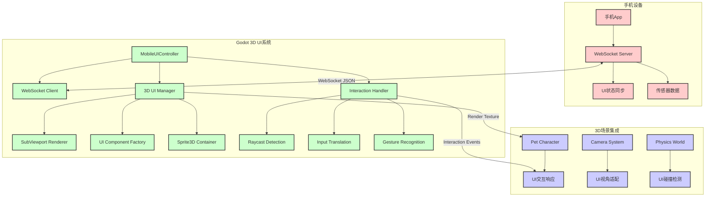
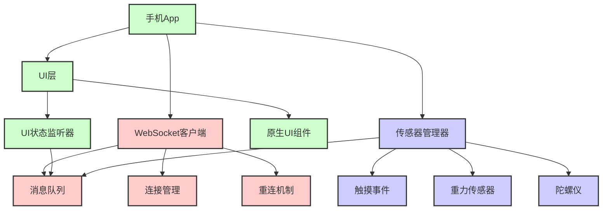

# Godot 3D 手机UI集成方案

> **文档版本**: v1.0
> **更新日期**: 2025-01
> **适用范围**: Godot 3D 萌宠客户端手机UI集成

## 目录

1. [概述](#概述)
2. [技术架构设计](#技术架构设计)
3. [核心组件实现](#核心组件实现)
4. [手机设备连接方案](#手机设备连接方案)
5. [交互系统实现](#交互系统实现)
6. [实现步骤](#实现步骤)
7. [示例代码](#示例代码)

---

## 概述

### 项目目标

在Godot 3D虚拟世界中集成手机设备的UI界面，实现：

- **3D空间UI显示**：将手机UI作为3D对象显示在虚拟世界中
- **实时交互**：支持点击、拖拽、多指操作等交互
- **设备同步**：与手机设备实时同步UI状态和数据
- **沉浸式体验**：无缝集成到3D场景中的UI交互体验

### 技术对比分析

#### Three.js 实现方式
```javascript
// Three.js 使用 CSS3DRenderer
import { CSS3DObject } from 'three/examples/jsm/renderers/CSS3DRenderer.js';

// 创建HTML元素
const container = document.createElement("div");
const iframe = document.createElement("iframe");
iframe.src = params.url;

// 转换为3D对象
const mesh = new CSS3DObject(container);
mesh.scale.set(0.03, 0.03, 0.03);
```

#### Godot 对应方案
```gdscript
# Godot 使用 SubViewport + Sprite3D
var viewport = SubViewport.new()
var control = Control.new()
viewport.add_child(control)

var sprite_3d = Sprite3D.new()
sprite_3d.texture = viewport.get_texture()
```

---

## 技术架构设计

### 整体架构图



### 核心技术栈

- **渲染引擎**: Godot 4.x SubViewport + Sprite3D
- **UI框架**: Godot Control Nodes + Custom Components
- **通信协议**: WebSocket (JSON-RPC 2.0)
- **交互检测**: Raycast3D + InputEventSystem
- **数据同步**: 双向状态同步 + 事件驱动

### 系统组件职责

| 组件 | 职责 | 核心技术 |
|------|------|---------|
| **MobileUIController** | 主控制器，协调各子系统 | GDScript |
| **WebSocketClient** | 与手机设备通信 | WebSocket |
| **UIRenderer3D** | 3D UI渲染管理 | SubViewport + Sprite3D |
| **UIComponentFactory** | UI组件创建工厂 | Control Nodes |
| **InteractionHandler** | 交互事件处理 | Raycast3D + Input |
| **StateSynchronizer** | 状态同步管理 | JSON + Events |

---

## 核心组件实现

### 1. MobileUIController (主控制器)

```gdscript
class_name MobileUIController
extends Node3D

# 核心属性
@export var websocket_url: String = "ws://localhost:8080"
@export var ui_scale: Vector3 = Vector3(0.1, 0.1, 0.1)
@export var interaction_distance: float = 5.0

# 子系统引用
var websocket_client: WebSocketClient
var ui_renderer: UIRenderer3D
var interaction_handler: InteractionHandler
var state_sync: StateSynchronizer

# UI面板集合
var ui_panels: Dictionary = {}

func _ready():
    _initialize_subsystems()
    _connect_signals()

func _initialize_subsystems():
    # 初始化WebSocket客户端
    websocket_client = WebSocketClient.new()
    add_child(websocket_client)

    # 初始化3D UI渲染器
    ui_renderer = UIRenderer3D.new()
    add_child(ui_renderer)

    # 初始化交互处理器
    interaction_handler = InteractionHandler.new()
    add_child(interaction_handler)

    # 初始化状态同步器
    state_sync = StateSynchronizer.new()
    add_child(state_sync)

# 创建手机UI面板
func create_mobile_ui_panel(panel_id: String, config: Dictionary):
    var panel = ui_renderer.create_panel(panel_id, config)
    ui_panels[panel_id] = panel
    return panel

# 处理手机UI更新
func on_mobile_ui_update(panel_id: String, updates: Dictionary):
    if ui_panels.has(panel_id):
        ui_renderer.update_panel(panel_id, updates)

# 处理交互事件
func on_interaction_event(panel_id: String, event_type: String, event_data: Dictionary):
    websocket_client.send_interaction(panel_id, event_type, event_data)
```

### 2. UIRenderer3D (3D UI渲染器)

```gdscript
class_name UIRenderer3D
extends Node3D

# SubViewport集合
var viewports: Dictionary = {}
var sprites: Dictionary = {}

# UI面板配置
var panel_configs: Dictionary = {}

func create_panel(panel_id: String, config: Dictionary) -> Sprite3D:
    # 创建SubViewport
    var viewport = SubViewport.new()
    viewport.size = config.get("size", Vector2(800, 600))
    viewport.transparent_bg = true
    add_child(viewport)

    # 创建UI根节点
    var ui_root = Control.new()
    ui_root.size = viewport.size
    viewport.add_child(ui_root)

    # 创建Sprite3D显示
    var sprite = Sprite3D.new()
    sprite.texture = viewport.get_texture()
    sprite.scale = config.get("scale", Vector3(0.1, 0.1, 0.1))
    sprite.position = config.get("position", Vector3.ZERO)
    add_child(sprite)

    # 存储引用
    viewports[panel_id] = viewport
    sprites[panel_id] = sprite
    panel_configs[panel_id] = config

    return sprite

func update_panel(panel_id: String, updates: Dictionary):
    if not viewports.has(panel_id):
        return

    var viewport = viewports[panel_id]
    var config = panel_configs[panel_id]

    # 更新面板属性
    if updates.has("position"):
        sprites[panel_id].position = updates.position
    if updates.has("scale"):
        sprites[panel_id].scale = updates.scale
    if updates.has("rotation"):
        sprites[panel_id].rotation = updates.rotation

    # 更新UI内容
    if updates.has("content"):
        _update_ui_content(panel_id, updates.content)

func _update_ui_content(panel_id: String, content: Dictionary):
    var viewport = viewports[panel_id]
    var ui_root = viewport.get_child(0)

    # 清空现有内容
    for child in ui_root.get_children():
        child.queue_free()

    # 根据content类型创建相应的UI组件
    match content.get("type", "form"):
        "form":
            _create_form_ui(ui_root, content)
        "button":
            _create_button_ui(ui_root, content)
        "text":
            _create_text_ui(ui_root, content)
        "list":
            _create_list_ui(ui_root, content)

func _create_form_ui(parent: Control, config: Dictionary):
    # 实现表单UI创建逻辑
    var form = VBoxContainer.new()
    form.size_flags_horizontal = Control.SIZE_EXPAND_FILL
    parent.add_child(form)

    # 添加表单字段
    for field in config.get("fields", []):
        var field_container = HBoxContainer.new()
        form.add_child(field_container)

        # 标签
        var label = Label.new()
        label.text = field.get("label", "")
        label.size_flags_horizontal = Control.SIZE_EXPAND_FILL
        field_container.add_child(label)

        # 输入框
        var input = LineEdit.new()
        input.text = field.get("value", "")
        input.size_flags_horizontal = Control.SIZE_EXPAND_FILL
        field_container.add_child(input)
```

### 3. InteractionHandler (交互处理器)

```gdscript
class_name InteractionHandler
extends Node

# 交互配置
@export var ray_length: float = 100.0
@export var interaction_layer: int = 1

# 相机引用
var camera: Camera3D
var mobile_ui_controller: MobileUIController

# 交互状态
var is_dragging: bool = false
var drag_start_position: Vector3
var current_panel: Sprite3D

func _ready():
    camera = get_viewport().get_camera_3d()

func _input(event):
    if event is InputEventMouseButton:
        _handle_mouse_button(event)
    elif event is InputEventMouseMotion:
        _handle_mouse_motion(event)

func _handle_mouse_button(event: InputEventMouseButton):
    if event.button_index == MOUSE_BUTTON_LEFT:
        if event.pressed:
            _handle_click_down(event.position)
        else:
            _handle_click_up(event.position)

func _handle_click_down(screen_pos: Vector2):
    var panel = _raycast_to_panel(screen_pos)
    if panel:
        current_panel = panel
        is_dragging = true
        drag_start_position = panel.position

        # 发送点击开始事件
        var local_pos = _screen_to_panel_local(screen_pos, panel)
        mobile_ui_controller.on_interaction_event(
            _get_panel_id(panel),
            "click_down",
            {"local_position": local_pos}
        )

func _handle_click_up(screen_pos: Vector2):
    if current_panel:
        var local_pos = _screen_to_panel_local(screen_pos, current_panel)

        if is_dragging:
            # 处理拖拽结束
            mobile_ui_controller.on_interaction_event(
                _get_panel_id(current_panel),
                "drag_end",
                {"local_position": local_pos}
            )
        else:
            # 处理点击
            mobile_ui_controller.on_interaction_event(
                _get_panel_id(current_panel),
                "click",
                {"local_position": local_pos}
            )

    is_dragging = false
    current_panel = null

func _handle_mouse_motion(event: InputEventMouseMotion):
    if is_dragging and current_panel:
        # 处理拖拽移动
        var local_pos = _screen_to_panel_local(event.position, current_panel)
        mobile_ui_controller.on_interaction_event(
            _get_panel_id(current_panel),
            "drag_move",
            {"local_position": local_pos}
        )

func _raycast_to_panel(screen_pos: Vector2) -> Sprite3D:
    var from = camera.project_ray_origin(screen_pos)
    var to = from + camera.project_ray_normal(screen_pos) * ray_length

    var space_state = get_viewport().world_3d.direct_space_state
    var query = PhysicsRayQueryParameters3D.create(from, to)
    query.collide_with_areas = true

    var result = space_state.intersect_ray(query)
    if result:
        var collider = result.collider
        if collider is Sprite3D and mobile_ui_controller.ui_panels.values().has(collider):
            return collider

    return null

func _screen_to_panel_local(screen_pos: Vector2, panel: Sprite3D) -> Vector2:
    # 将屏幕坐标转换为面板本地坐标
    var panel_size = panel.texture.get_size() if panel.texture else Vector2(800, 600)
    var panel_pos_3d = panel.position

    # 计算面板在屏幕上的投影
    var panel_screen_pos = camera.unproject_position(panel_pos_3d)

    # 计算本地坐标
    var local_pos = screen_pos - panel_screen_pos
    local_pos.x = clamp(local_pos.x / panel.scale.x, 0, panel_size.x)
    local_pos.y = clamp(local_pos.y / panel.scale.y, 0, panel_size.y)

    return local_pos

func _get_panel_id(panel: Sprite3D) -> String:
    for panel_id in mobile_ui_controller.ui_panels.keys():
        if mobile_ui_controller.ui_panels[panel_id] == panel:
            return panel_id
    return ""
```

---

## 手机设备连接方案

### WebSocket 通信协议

#### 连接建立
```json
// 客户端连接请求
{
    "type": "connect",
    "device_id": "android_device_001",
    "capabilities": {
        "touch": true,
        "gesture": true,
        "orientation": true
    }
}

// 服务端响应
{
    "type": "connected",
    "session_id": "session_123",
    "supported_features": ["ui_sync", "interaction", "sensor"]
}
```

#### UI状态同步
```json
// UI面板创建
{
    "type": "create_panel",
    "panel_id": "main_ui",
    "config": {
        "type": "form",
        "size": [800, 600],
        "position": [0, 0, 2],
        "scale": [0.1, 0.1, 0.1],
        "content": {
            "title": "用户设置",
            "fields": [
                {"type": "text", "label": "用户名", "value": "user123"},
                {"type": "select", "label": "主题", "options": ["浅色", "深色"]}
            ]
        }
    }
}

// UI状态更新
{
    "type": "update_panel",
    "panel_id": "main_ui",
    "updates": {
        "content": {
            "fields[0].value": "new_username"
        }
    }
}
```

#### 交互事件
```json
// 交互事件上报
{
    "type": "interaction",
    "panel_id": "main_ui",
    "event_type": "click",
    "event_data": {
        "local_position": [150, 200],
        "timestamp": 1640995200000,
        "modifiers": []
    }
}

// 手势事件
{
    "type": "gesture",
    "gesture_type": "pinch",
    "scale": 1.2,
    "center": [400, 300]
}
```

### 手机端实现

#### Android/iOS App 架构


---

## 交互系统实现

### 多指操作支持

```gdscript
class_name MultiTouchHandler
extends InteractionHandler

# 多指跟踪
var touch_points: Dictionary = {}
var gesture_recognizer: GestureRecognizer

func _input(event):
    super._input(event)

    if event is InputEventScreenTouch:
        _handle_touch(event)
    elif event is InputEventScreenDrag:
        _handle_drag(event)

func _handle_touch(event: InputEventScreenTouch):
    var touch_id = event.index

    if event.pressed:
        touch_points[touch_id] = {
            "position": event.position,
            "start_time": Time.get_ticks_msec(),
            "panel": _raycast_to_panel(event.position)
        }
    else:
        if touch_points.has(touch_id):
            var touch_data = touch_points[touch_id]
            var duration = Time.get_ticks_msec() - touch_data.start_time

            # 判断点击还是长按
            if duration < 500:  # 短按
                _handle_tap(touch_data)
            else:  # 长按
                _handle_long_press(touch_data)

            touch_points.erase(touch_id)

func _handle_drag(event: InputEventScreenDrag):
    var touch_id = event.index

    if touch_points.has(touch_id):
        var touch_data = touch_points[touch_id]
        var delta = event.relative

        # 检查是否为多指手势
        if touch_points.size() > 1:
            _handle_multi_touch_gesture()
        else:
            _handle_single_drag(touch_data, delta)

func _handle_multi_touch_gesture():
    var points = touch_points.values()
    if points.size() == 2:
        var p1 = points[0].position
        var p2 = points[1].position

        # 计算捏合手势
        var current_distance = p1.distance_to(p2)
        var center = (p1 + p2) / 2

        gesture_recognizer.recognize_pinch(current_distance, center)

class GestureRecognizer:
    var initial_distance: float = 0.0
    var last_distance: float = 0.0

    func recognize_pinch(current_distance: float, center: Vector2):
        if initial_distance == 0.0:
            initial_distance = current_distance
            last_distance = current_distance
            return

        var scale = current_distance / initial_distance
        var delta_scale = current_distance / last_distance

        # 发送捏合事件
        mobile_ui_controller.on_gesture_event("pinch", {
            "scale": scale,
            "delta_scale": delta_scale,
            "center": center
        })

        last_distance = current_distance
```

### 碰撞检测优化

```gdscript
class_name OptimizedInteractionHandler
extends InteractionHandler

# 空间分区
var spatial_grid: Dictionary = {}
var grid_size: float = 1.0

func _ready():
    super._ready()
    _initialize_spatial_grid()

func _initialize_spatial_grid():
    # 将UI面板按空间位置分区
    for panel_id in mobile_ui_controller.ui_panels.keys():
        var panel = mobile_ui_controller.ui_panels[panel_id]
        _add_to_spatial_grid(panel)

func _add_to_spatial_grid(panel: Sprite3D):
    var grid_key = _get_grid_key(panel.position)
    if not spatial_grid.has(grid_key):
        spatial_grid[grid_key] = []
    spatial_grid[grid_key].append(panel)

func _raycast_to_panel(screen_pos: Vector2) -> Sprite3D:
    # 先进行粗略的视锥剔除
    var candidates = _get_candidates_in_view()

    # 对候选面板进行精确射线检测
    var closest_panel: Sprite3D = null
    var closest_distance = INF

    for panel in candidates:
        var distance = _get_panel_distance(panel, screen_pos)
        if distance < closest_distance:
            closest_distance = distance
            closest_panel = panel

    return closest_panel

func _get_candidates_in_view() -> Array:
    # 获取相机视锥内的候选面板
    var candidates = []
    var camera_transform = camera.global_transform

    for grid_key in spatial_grid.keys():
        var grid_panels = spatial_grid[grid_key]
        for panel in grid_panels:
            if _is_panel_in_frustum(panel, camera):
                candidates.append(panel)

    return candidates

func _is_panel_in_frustum(panel: Sprite3D, camera: Camera3D) -> bool:
    # 简单的视锥剔除逻辑
    var panel_pos = panel.global_position
    var camera_pos = camera.global_position
    var camera_forward = -camera.global_transform.basis.z

    var to_panel = panel_pos - camera_pos
    var distance = to_panel.length()

    if distance > interaction_distance:
        return false

    var dot_product = camera_forward.dot(to_panel.normalized())
    var angle = rad_to_deg(acos(dot_product))

    return angle < camera.fov / 2.0
```

---

## 实现步骤

### 步骤1：环境准备

1. **创建项目结构**
```bash
godot-pet/
├── scripts/
│   ├── mobile_ui/
│   │   ├── mobile_ui_controller.gd
│   │   ├── ui_renderer_3d.gd
│   │   ├── interaction_handler.gd
│   │   ├── websocket_client_mobile.gd
│   │   └── ui_components/
│   │       ├── form_component.gd
│   │       ├── button_component.gd
│   │       └── text_component.gd
│   └── ...
└── scenes/
    ├── mobile_ui_demo.tscn
    └── ...
```

2. **安装依赖**
```gdscript
# 在project.godot中添加
[dependencies]
websocket = "res://addons/websocket/"
```

### 步骤2：核心组件开发

1. **实现MobileUIController**
2. **实现UIRenderer3D**
3. **实现InteractionHandler**
4. **实现WebSocket通信**

### 步骤3：UI组件开发

1. **基础组件**
   - Label3D（3D文本显示）
   - Button3D（3D按钮）
   - Input3D（3D输入框）
   - Panel3D（3D面板容器）

2. **复合组件**
   - Form3D（3D表单）
   - List3D（3D列表）
   - Menu3D（3D菜单）

### 步骤4：手机端开发

1. **Android App**
   - WebSocket客户端
   - UI状态监听
   - 传感器数据采集

2. **iOS App**
   - 对应的iOS实现

### 步骤5：集成测试

1. **功能测试**
   - UI显示测试
   - 交互测试
   - 通信测试

2. **性能测试**
   - 渲染性能
   - 交互响应时间
   - 内存使用

---

## 示例代码

### 基本使用示例

```gdscript
# 在主场景中设置
extends Node3D

@onready var mobile_ui_controller = $MobileUIController

func _ready():
    # 连接到手机设备
    mobile_ui_controller.connect_to_mobile("ws://192.168.1.100:8080")

    # 创建一个简单的表单面板
    var form_config = {
        "type": "form",
        "size": Vector2(400, 300),
        "position": Vector3(0, 1, 2),
        "scale": Vector3(0.05, 0.05, 0.05),
        "content": {
            "title": "用户设置",
            "fields": [
                {"type": "text", "label": "用户名", "value": "player1"},
                {"type": "select", "label": "难度", "options": ["简单", "普通", "困难"]}
            ]
        }
    }

    mobile_ui_controller.create_mobile_ui_panel("settings_form", form_config)

# 处理UI事件
func _on_mobile_ui_event(panel_id: String, event_type: String, event_data: Dictionary):
    match event_type:
        "form_submit":
            print("表单提交: ", event_data)
        "button_click":
            print("按钮点击: ", event_data)
```

### 高级交互示例

```gdscript
# 多指手势处理
func _on_gesture_event(gesture_type: String, gesture_data: Dictionary):
    match gesture_type:
        "pinch":
            # 处理捏合缩放
            var scale_factor = gesture_data.scale
            mobile_ui_controller.scale_ui_panel("current_panel", scale_factor)

        "rotate":
            # 处理旋转
            var rotation_angle = gesture_data.angle
            mobile_ui_controller.rotate_ui_panel("current_panel", rotation_angle)

        "swipe":
            # 处理滑动
            var direction = gesture_data.direction
            mobile_ui_controller.navigate_ui_panel("current_panel", direction)
```

### 自定义UI组件示例

```gdscript
# 创建自定义的游戏设置面板
class_name GameSettingsPanel
extends Control

@export var panel_title: String = "游戏设置"
@export var settings_data: Dictionary = {}

func _ready():
    _create_ui()

func _create_ui():
    # 创建标题
    var title_label = Label.new()
    title_label.text = panel_title
    title_label.horizontal_alignment = HORIZONTAL_ALIGNMENT_CENTER
    add_child(title_label)

    # 创建设置选项
    var settings_container = VBoxContainer.new()
    add_child(settings_container)

    for setting_key in settings_data.keys():
        var setting = settings_data[setting_key]

        var setting_container = HBoxContainer.new()
        settings_container.add_child(setting_container)

        # 设置标签
        var label = Label.new()
        label.text = setting.label
        setting_container.add_child(label)

        # 设置控件
        match setting.type:
            "slider":
                var slider = HSlider.new()
                slider.min_value = setting.min_value
                slider.max_value = setting.max_value
                slider.value = setting.value
                slider.connect("value_changed", Callable(self, "_on_setting_changed").bind(setting_key))
                setting_container.add_child(slider)

            "checkbox":
                var checkbox = CheckBox.new()
                checkbox.text = setting.label
                checkbox.button_pressed = setting.value
                checkbox.connect("toggled", Callable(self, "_on_setting_changed").bind(setting_key))
                setting_container.add_child(checkbox)

# 发送设置变更事件
func _on_setting_changed(value, setting_key: String):
    var event_data = {
        "setting_key": setting_key,
        "value": value
    }

    # 通过信号发送给MobileUIController
    emit_signal("setting_changed", event_data)
```

---

## 总结

通过本方案，我们可以在Godot 3D虚拟世界中完美集成手机设备的UI界面，实现：

1. **无缝的3D显示**：使用SubViewport + Sprite3D技术将2D UI渲染到3D空间
2. **丰富的交互体验**：支持点击、拖拽、多指操作等完整交互
3. **实时数据同步**：通过WebSocket实现设备间实时状态同步
4. **高性能架构**：采用空间分区和视锥剔除等优化技术
5. **可扩展设计**：模块化架构便于添加新的UI组件和功能

该方案不仅实现了类似Three.js编辑器的3D UI功能，还针对Godot引擎的特点进行了深度优化，是在Godot中实现手机UI集成的完整解决方案。