# Godot 客户端产品技术设计文档

> **文档版本**: v1.0  
> **更新日期**: 2025-01  
> **适用范围**: Godot 3D 萌宠客户端

## 目录

1. [概述](#概述)
2. [系统架构](#系统架构)
3. [BlendTree 动画系统](#blendtree-动画系统)
4. [WebSocket 通信系统](#websocket-通信系统)
5. [3D 系统](#3d-系统)
6. [物理系统](#物理系统)
7. [相机系统](#相机系统)
8. [UI 系统](#ui-系统)
9. [数据流与状态管理](#数据流与状态管理)
10. [关键流程时序图](#关键流程时序图)

---

## 概述

### 项目定位

Godot 客户端是 3D 萌宠系统的**表现层**，负责：

- **3D 渲染**：高质量的 3D 模型渲染和动画表现
- **物理交互**：基于 Godot 物理引擎的实时物理响应
- **用户输入**：键盘、鼠标交互的直接响应
- **网络通信**：与服务端（JS 行为树）的双向 WebSocket 通信

### 核心设计理念

1. **参数驱动动画**：使用 BlendTree 实现参数驱动的动画混合
2. **输入输出隔离**：传感器数据（Sensor）与执行器指令（Actuator）分离
3. **基础移动本地控制**：`IDLE`/`WALK`/`RUN` 完全由客户端控制
4. **特殊动作服务端决策**：`JUMP`/`WAVE`/`DANCE` 等由服务端决策下发
5. **马尔可夫决策响应**：每一帧根据当前状态响应，无历史依赖

### 技术栈

- **引擎**: Godot 4.x
- **脚本语言**: GDScript
- **动画系统**: AnimationTree + BlendTree
- **物理引擎**: Godot CharacterBody3D
- **通信协议**: WebSocket (JSON)
- **渲染**: 3D Forward Rendering

---

## 系统架构

### 整体架构图

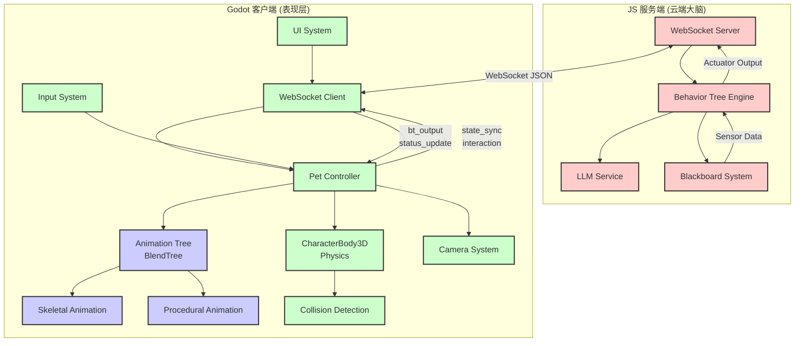

### 模块职责划分

| 模块 | 职责 | 核心技术 |
|------|------|---------|
| **PetController** | 核心控制器，协调各子系统 | GDScript |
| **AnimationTree** | 参数驱动的动画混合 | BlendTree |
| **WebSocketClient** | 网络通信管理 | WebSocket |
| **CharacterBody3D** | 物理运动与碰撞 | Physics Engine |
| **CameraSystem** | 第三人称相机控制 | SpringArm3D |
| **UISystem** | 用户界面与输入 | Control Nodes |

### 场景树结构

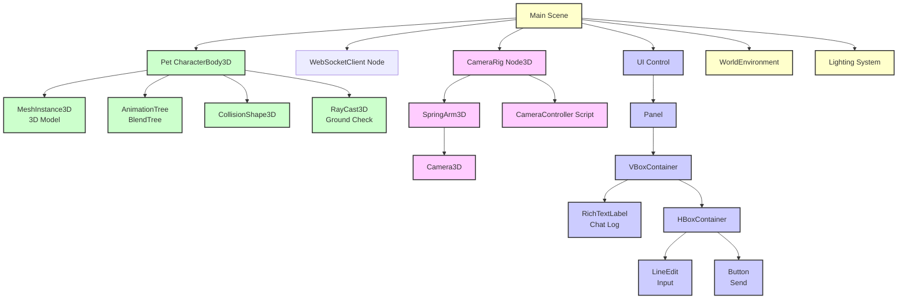

---

## BlendTree 动画系统

### 架构设计

当前系统使用 **BlendTree（混合树）** 而非 StateMachine（状态机），实现参数驱动的动画系统。

#### 为什么使用 BlendTree？

1. **参数驱动**：与服务端黑板系统的参数化思维完美匹配
2. **平滑混合**：参数连续变化带来自然的动画过渡
3. **多维混合**：避免状态爆炸，支持灵活扩展
4. **声明式状态**：参数持续生效，符合声明式通信协议

### BlendTree 结构图

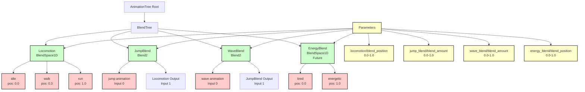

### 参数控制规范

#### 基础移动参数（Locomotion）

**参数路径**: `parameters/locomotion/blend_position`

**值范围**: `0.0` - `1.0`

**映射关系**:
- `0.0` → `idle` 动画
- `0.3` → `walk` 动画
- `1.0` → `run` 动画
- `0.0-1.0` 之间 → 自动混合

**代码实现**:
```gdscript
func _apply_blendtree_state(state: AnimState) -> void:
    match state:
        AnimState.IDLE:
            animation_tree.set("parameters/locomotion/blend_position", 0.0)
        AnimState.WALK:
            animation_tree.set("parameters/locomotion/blend_position", 0.3)
        AnimState.RUN:
            animation_tree.set("parameters/locomotion/blend_position", 1.0)
```

#### 离散动作参数（Overlay）

**参数路径**: `parameters/{action}_blend/blend_amount`

**值范围**: `0.0` - `1.0`

**含义**:
- `0.0` → 隐藏该动作，显示下层动作
- `1.0` → 显示该动作，覆盖下层动作

**支持的动作**:
- `jump` → `parameters/jump_blend/blend_amount`
- `wave` → `parameters/wave_blend/blend_amount`

**代码实现**:
```gdscript
func _switch_anim(action_name: String) -> void:
    match action_name:
        "jump":
            animation_tree.set("parameters/jump_blend/blend_amount", 1.0)
        "wave":
            animation_tree.set("parameters/wave_blend/blend_amount", 1.0)
            # 完成后需要清除
```

### 动画类型

#### 1. 骨骼动画（Skeletal Animation）

**来源**: 3D 模型文件（.glb/.fbx）

**动画列表**:
- `idle` - 待机动画
- `walk` - 走路动画
- `run` - 跑步动画
- `jump` - 跳跃动画
- `wave` - 挥手动画

**特点**: 预制的关键帧动画，由美术制作

#### 2. 程序化动画（Procedural Animation）

**实现方式**: 代码实时修改模型的 Transform

**支持的动作**:
- `SPIN` - 自转
- `BOUNCE` - 弹跳
- `FLY` - 悬浮飞行
- `ROLL` - 侧滚

**代码示例**:
```gdscript
func _process_procedural_animation(delta: float) -> void:
    match proc_anim_type:
        ProcAnimType.SPIN:
            rotation.y += spin_speed * delta
        ProcAnimType.BOUNCE:
            var bounce_offset = sin(proc_time * bounce_frequency) * bounce_amplitude
            position.y = base_y + bounce_offset
```

### BlendTree 优势

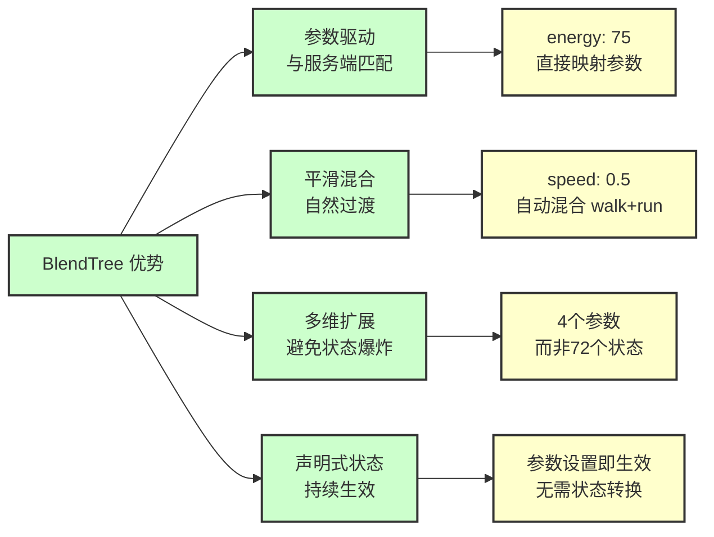

---

## WebSocket 通信系统

### 通信架构

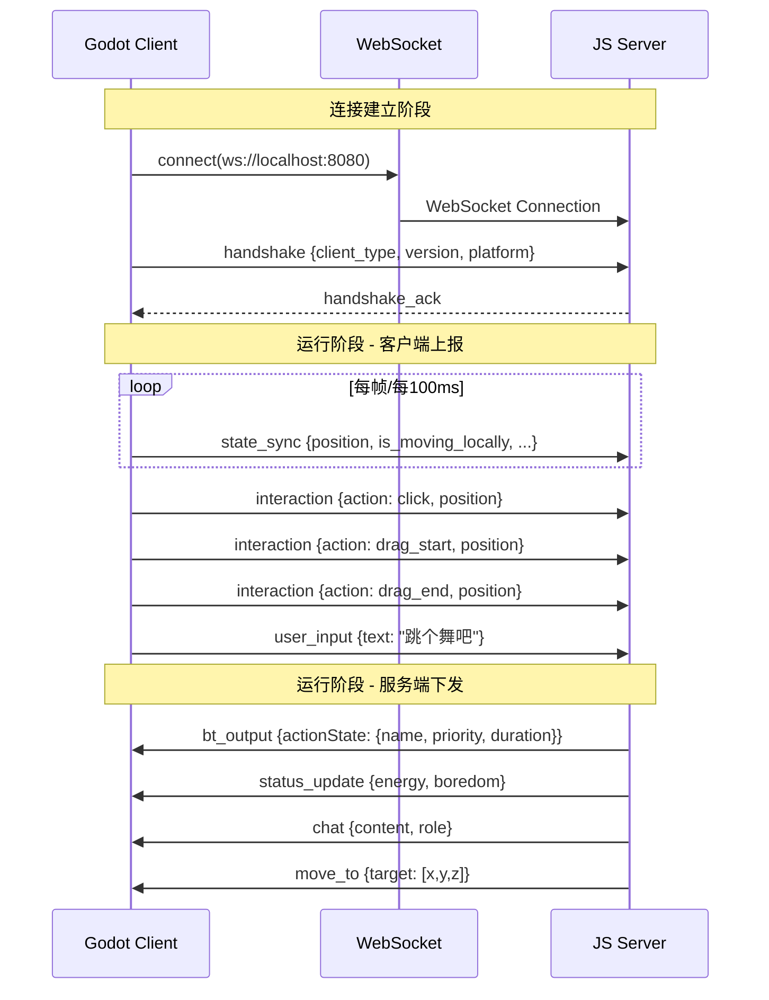

### 消息协议

#### 客户端 → 服务端

##### 1. 握手消息（handshake）

```json
{
  "type": "handshake",
  "timestamp": 1234567890,
  "data": {
    "client_type": "godot_robot",
    "platform": "Windows",
    "version": "1.0"
  }
}
```

##### 2. 状态同步（state_sync）

**发送频率**: 每帧或每 100ms（10Hz）

```json
{
  "type": "state_sync",
  "timestamp": 1234567890,
  "data": {
    "position": [0.0, -1.0, 0.0],
    "current_action": "walk",
    "is_dragging": false,
    "is_on_floor": true,
    "is_moving_locally": true,
    "is_jump_pressed": false,
    "velocity": [1.5, 0.0, 0.0]
  }
}
```

**字段说明**:

| 字段 | 类型 | 说明 |
|-----|------|------|
| `position` | Array[Float] | 3D 坐标 [x, y, z] |
| `is_moving_locally` | Boolean | **关键**: 是否正在本地控制移动（WASD） |
| `is_jump_pressed` | Boolean | 是否正在按跳跃键 |
| `is_dragging` | Boolean | 是否正在被拖拽 |
| `velocity` | Array[Float] | 速度向量 [x, y, z] |

##### 3. 交互事件（interaction）

```json
{
  "type": "interaction",
  "timestamp": 1234567890,
  "data": {
    "action": "click",
    "position": [0.0, -1.0, 0.0]
  }
}
```

**支持的动作**: `click`, `drag_start`, `drag_end`

##### 4. 用户输入（user_input）

```json
{
  "type": "user_input",
  "timestamp": 1234567890,
  "data": {
    "text": "跳个舞吧"
  }
}
```

#### 服务端 → 客户端

##### 1. 行为树输出（bt_output）

```json
{
  "type": "bt_output",
  "timestamp": 1234567890,
  "data": {
    "actionState": {
      "name": "JUMP",
      "priority": 50,
      "duration": 1000,
      "interruptible": true,
      "timestamp": 1234567890
    }
  }
}
```

**字段说明**:

| 字段 | 类型 | 说明 |
|-----|------|------|
| `actionState.name` | String | 动作名称（JUMP/WAVE/DANCE 等） |
| `actionState.priority` | Integer | 优先级（数值越大优先级越高） |
| `actionState.duration` | Integer | 持续时间（毫秒） |
| `actionState.interruptible` | Boolean | 是否可中断 |

**重要规则**: 基础移动动作（`IDLE`/`WALK`/`RUN`）不会通过 `bt_output` 下发

##### 2. 状态更新（status_update）

```json
{
  "type": "status_update",
  "timestamp": 1234567890,
  "data": {
    "energy": 75,
    "boredom": 25
  }
}
```

##### 3. 聊天消息（chat）

```json
{
  "type": "chat",
  "timestamp": 1234567890,
  "data": {
    "content": "好的，我来跳舞给你看！",
    "role": "assistant"
  }
}
```

### WebSocket 客户端实现

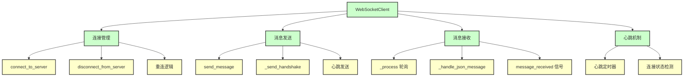

### 通信流程图

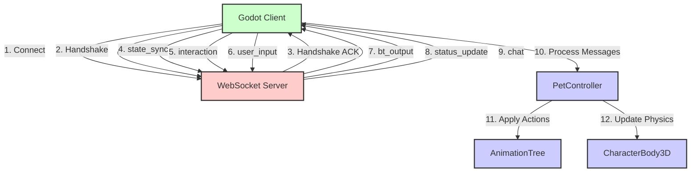

---

## 3D 系统

### 场景结构

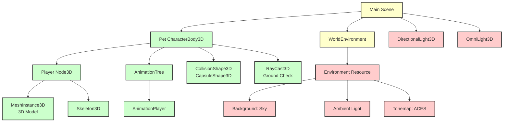

### 渲染管线

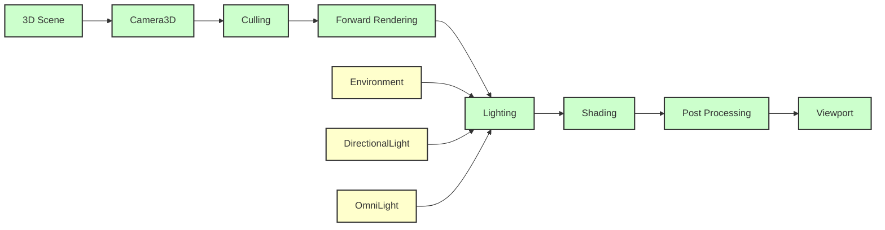

### 模型资源

**模型格式**: `.glb` / `.fbx`

**模型结构**:
- Mesh（网格）
- Skeleton（骨骼）
- Animations（动画）

**动画资源**:
- `idle` - 待机
- `walk` - 走路
- `run` - 跑步
- `jump` - 跳跃
- `wave` - 挥手

---

## 物理系统

### 物理架构

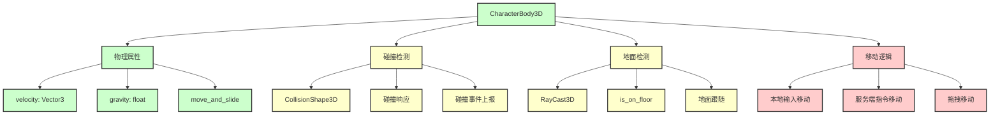

### 移动优先级

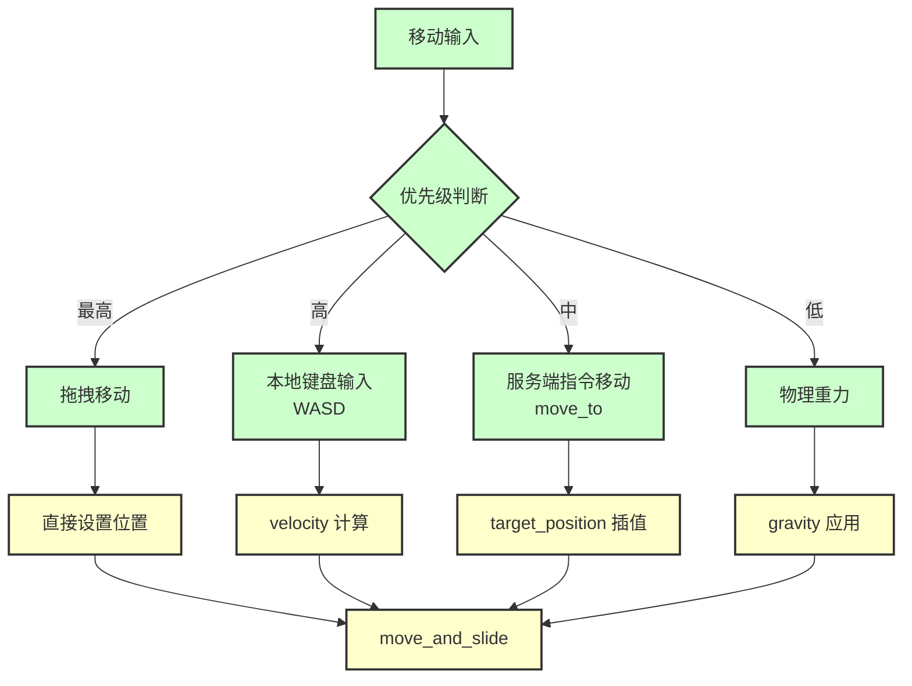

### 物理参数

| 参数 | 默认值 | 说明 |
|------|--------|------|
| `walk_speed` | 3.0 | 走路速度（m/s） |
| `run_speed` | 7.0 | 跑步速度（m/s） |
| `jump_velocity` | 6.5 | 跳跃初速度（m/s） |
| `rotation_speed` | 12.0 | 旋转速度（rad/s） |
| `gravity` | 9.8 | 重力加速度（m/s²） |

---

## 相机系统

### 相机架构

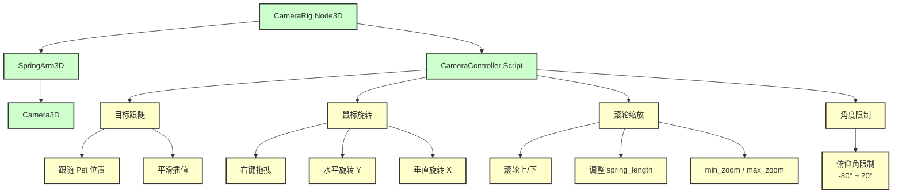

### 相机参数

| 参数 | 默认值 | 说明 |
|------|--------|------|
| `mouse_sensitivity` | 0.3 | 鼠标灵敏度 |
| `zoom_speed` | 0.5 | 缩放速度 |
| `min_zoom` | 2.0 | 最小距离（m） |
| `max_zoom` | 12.0 | 最大距离（m） |
| `follow_speed` | 5.0 | 跟随速度 |
| `spring_length` | 5.0 | 弹簧臂长度（m） |
| `pitch_min` | -80.0 | 最小俯仰角（度） |
| `pitch_max` | 20.0 | 最大俯仰角（度） |

### 相机控制流程

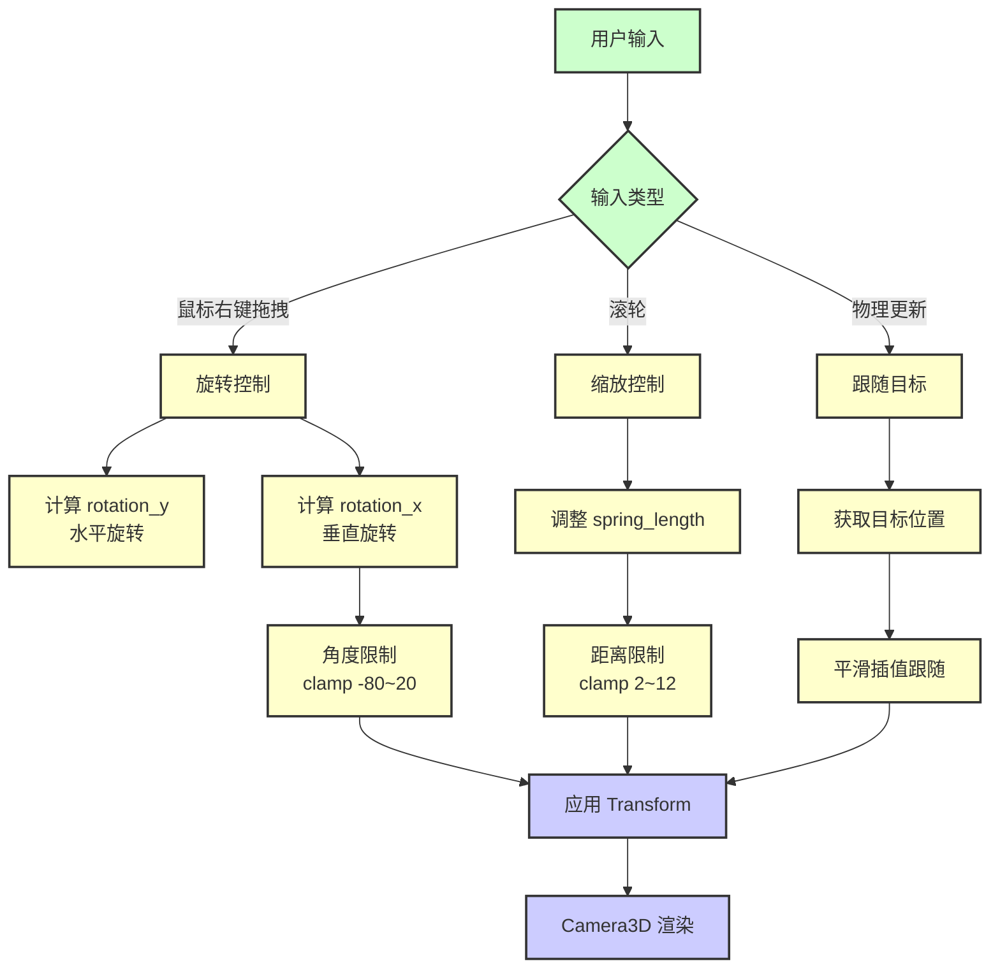

---

## UI 系统

### UI 结构

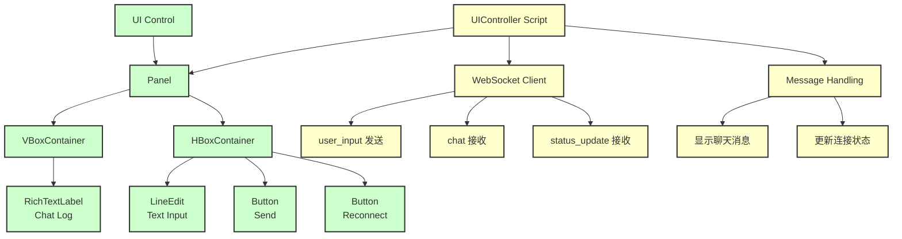

### UI 功能

1. **聊天日志显示**
   - 用户输入（蓝色）
   - 萌宠回复（绿色）
   - 系统消息（灰色/黄色）

2. **文本输入**
   - LineEdit 输入框
   - Enter 发送
   - 发送后自动清空焦点

3. **连接状态**
   - 显示连接状态
   - 重连按钮

---

## 数据流与状态管理

### 数据流向图

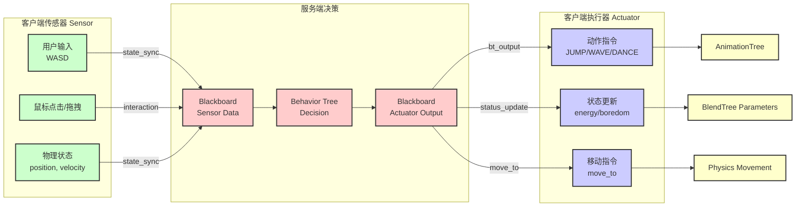

### 状态管理架构

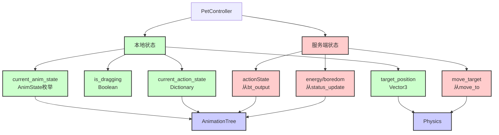

### 输入输出隔离

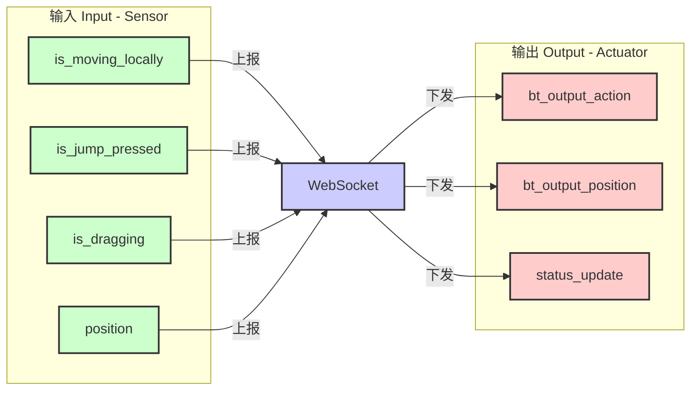

---

## 关键流程时序图

### 1. 用户键盘输入移动流程

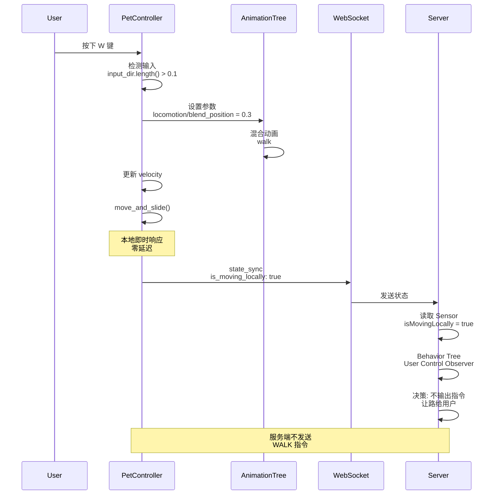

### 2. 服务端动作指令流程

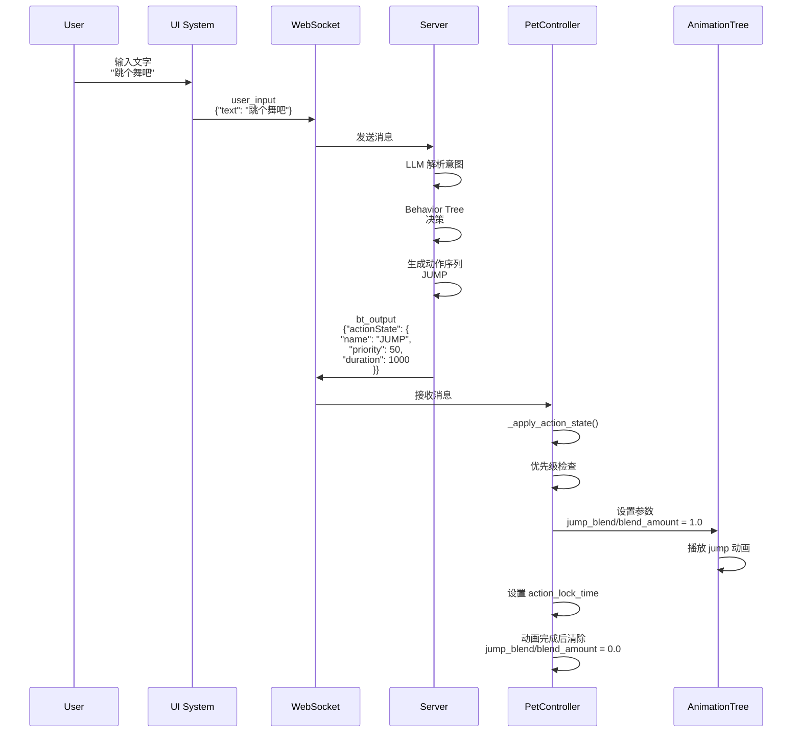

### 3. 鼠标拖拽交互流程

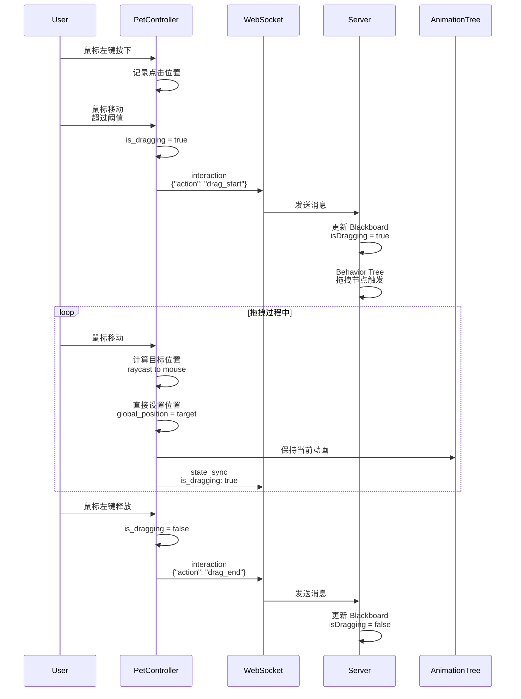

### 4. 状态更新流程

```mermaid
sequenceDiagram
    participant S as Server
    participant WS as WebSocket
    participant PC as PetController
    participant AT as AnimationTree
    
    S->>S: 每2秒更新<br/>energy, boredom
    S->>WS: status_update<br/>{"energy": 75, "boredom": 25}
    WS->>PC: 接收消息
    
    PC->>PC: _on_ws_message<br/>("status_update", data)
    PC->>PC: 归一化数值<br/>energy_normalized = 75/100.0
    PC->>AT: 设置参数<br/>energy_blend/blend_position = 0.75
    AT->>AT: 混合动画<br/>根据能量值调整
    
    Note over AT: 如果实现了能量维度<br/>会自动混合 tired/energetic
```

### 5. 完整交互循环

```mermaid
sequenceDiagram
    participant U as User
    participant PC as PetController
    participant AT as AnimationTree
    participant WS as WebSocket
    participant S as Server
    
    Note over U,S: 初始化阶段
    PC->>WS: connect()
    WS->>S: WebSocket Connection
    PC->>WS: handshake
    WS->>S: 握手消息
    
    Note over U,S: 运行循环
    loop 每帧
        U->>PC: 键盘/鼠标输入
        PC->>AT: 更新动画参数
        PC->>PC: 物理更新
        PC->>WS: state_sync<br/>每100ms
        WS->>S: 状态同步
        
        S->>S: Behavior Tree Tick<br/>每100ms
        alt 有动作指令
            S->>WS: bt_output
            WS->>PC: 动作指令
            PC->>AT: 应用动作
        else 有状态更新
            S->>WS: status_update
            WS->>PC: 状态更新
            PC->>AT: 更新参数
        end
    end
```

---

## 总结

### 核心特性

1. **参数驱动动画**：BlendTree 实现平滑自然的动画混合
2. **输入输出隔离**：传感器与执行器分离，避免冲突
3. **基础移动本地控制**：零延迟的用户体验
4. **特殊动作服务端决策**：AI 驱动的智能行为
5. **马尔可夫决策响应**：无历史依赖的即时响应

### 技术亮点

- **BlendTree 动画系统**：参数驱动，平滑混合，多维扩展
- **WebSocket 双向通信**：实时同步，事件驱动
- **物理引擎集成**：真实的物理交互体验
- **相机系统**：流畅的第三人称视角控制
- **模块化设计**：清晰的职责划分，易于维护

### 扩展方向

1. **动画维度扩展**：能量、情绪等维度的混合
2. **程序化动画**：更多代码驱动的动画效果
3. **特效系统**：粒子效果、音效等增强表现
4. **多人支持**：多客户端同步（未来规划）

---

**文档结束**