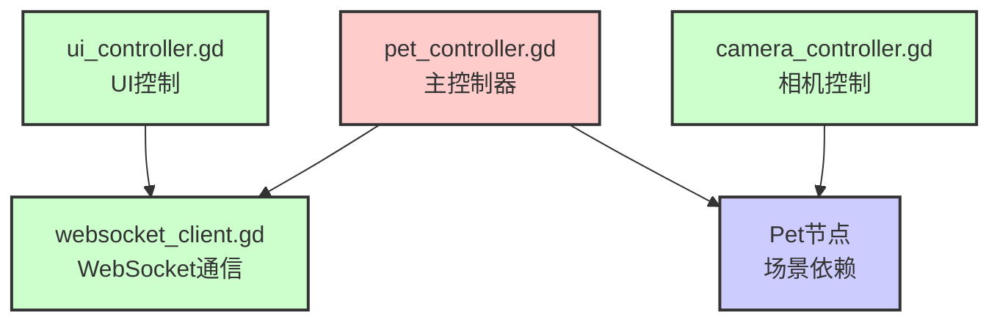
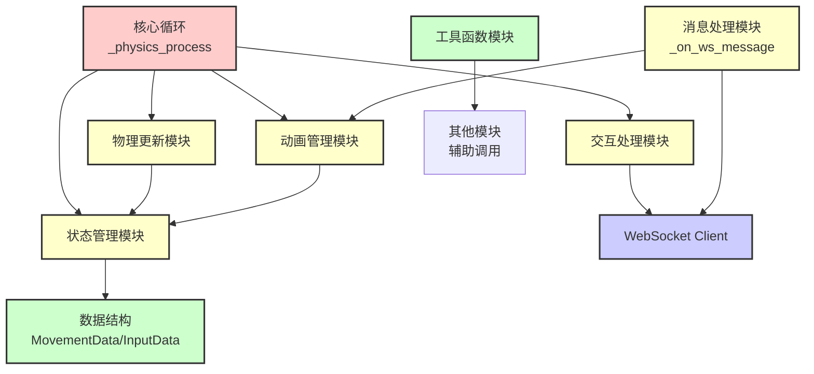
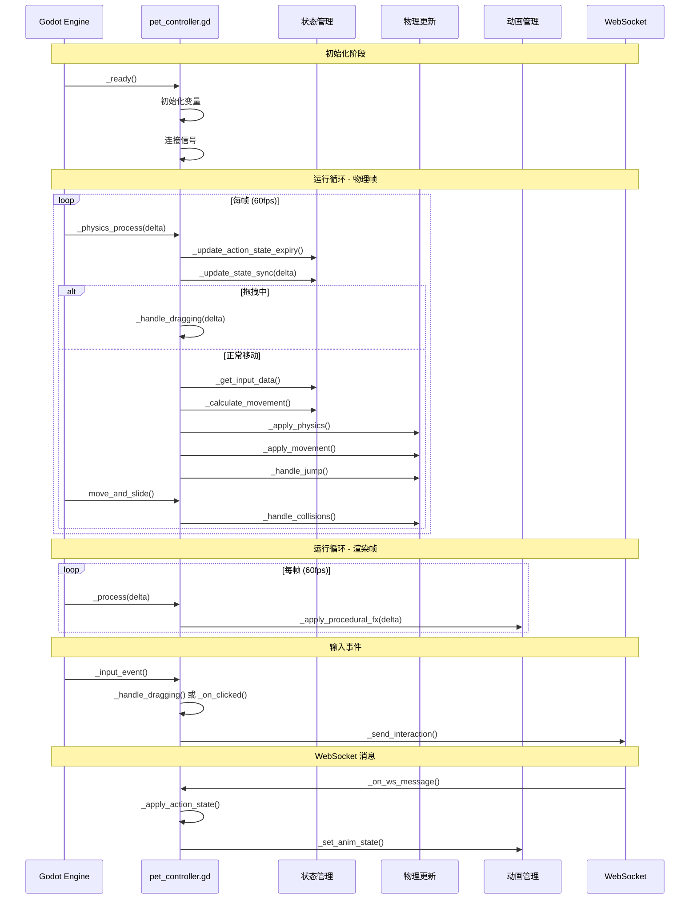
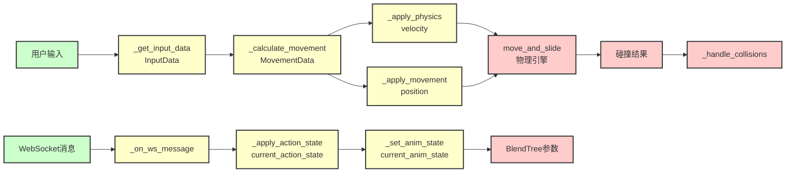
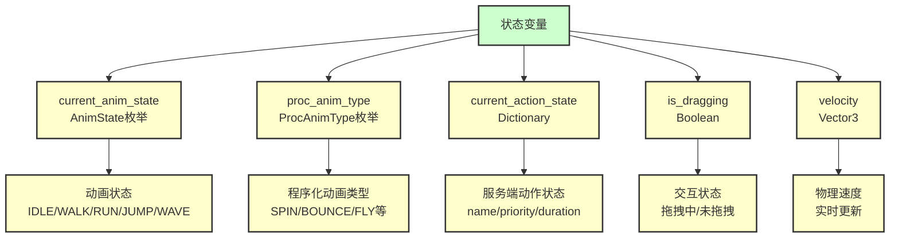
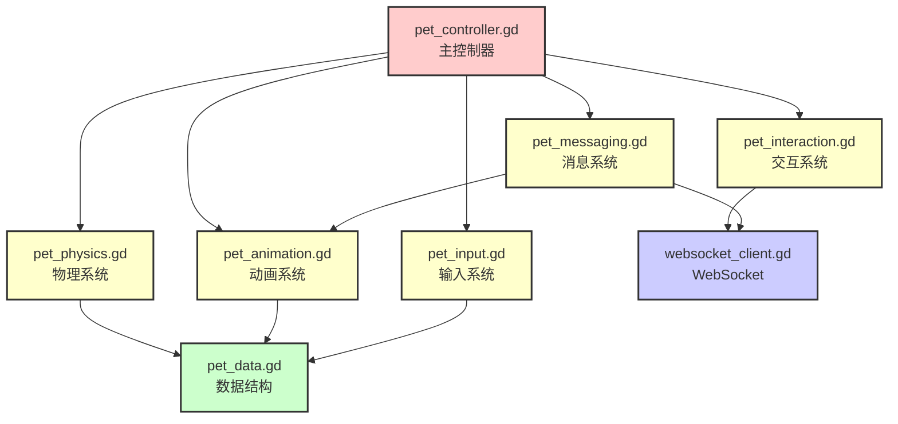
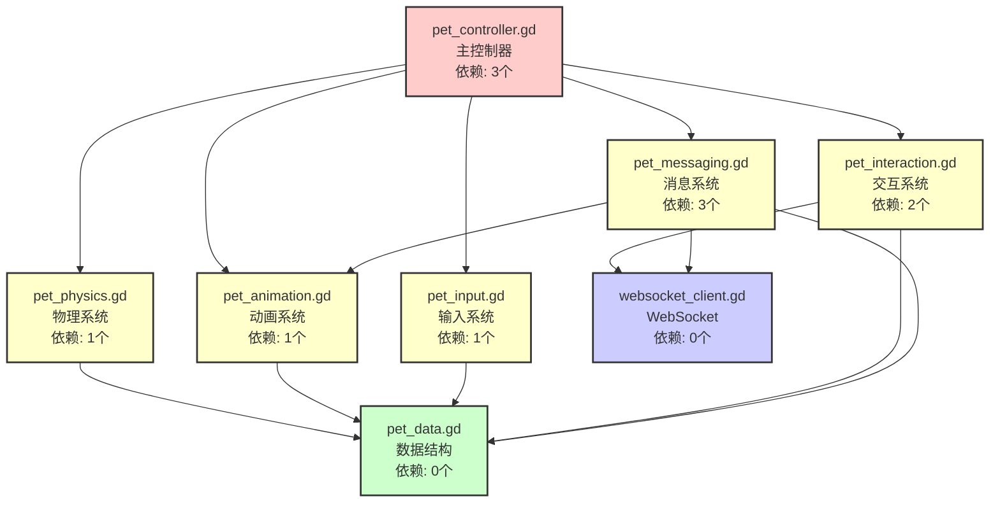

# Godot 客户端过程式代码架构文档

> **文档版本**: v1.0  
> **更新日期**: 2025-01  
> **适用范围**: Godot 客户端代码组织结构

## 目录

1. [概述](#概述)
2. [文件组织结构](#文件组织结构)
3. [pet_controller.gd 详细结构](#pet_controllergd-详细结构)
4. [模块功能划分](#模块功能划分)
5. [代码执行流程](#代码执行流程)
6. [数据流向](#数据流向)
7. [拆分方案分析](#拆分方案分析)

---

## 概述

当前 Godot 客户端使用**过程式代码**实现所有逻辑，主要代码集中在 `pet_controller.gd` 文件中。代码通过注释进行逻辑分组，但未拆分成多个独立文件。

### 架构特点

- **单文件集中**：主要逻辑在 `pet_controller.gd`（841 行）
- **注释分组**：通过 `##` 注释进行逻辑模块划分
- **功能分离**：WebSocket、UI、相机已拆分为独立文件
- **过程式实现**：使用函数和条件判断实现逻辑，无行为树

---

## 文件组织结构

### 当前文件结构

```
scripts/
├── pet_controller.gd        (841行) - 主要逻辑（过程式代码）
├── websocket_client.gd      (~103行) - WebSocket 通信（独立模块）
├── ui_controller.gd         (~104行) - UI 控制（独立模块）
├── camera_controller.gd     (~52行) - 相机控制（独立模块）
└── test_*.gd                - 测试文件
```

### 模块依赖关系



**依赖说明**：
- `pet_controller.gd` 依赖 `websocket_client.gd`（通过 `/root/Main/WebSocketClient` 节点路径）
- `ui_controller.gd` 依赖 `websocket_client.gd`
- `camera_controller.gd` 依赖场景中的 `Pet` 节点
- 各模块之间**无交叉依赖**，依赖关系清晰

---

## pet_controller.gd 详细结构

### 文件组织结构

```mermaid
graph TD
    A[pet_controller.gd<br/>841行] --> B[头部定义]
    A --> C[辅助数据结构]
    A --> D[核心更新循环]
    A --> E[状态管理模块]
    A --> F[物理更新模块]
    A --> G[动画管理模块]
    A --> H[交互处理模块]
    A --> I[消息处理模块]
    A --> J[工具函数模块]
    
    B --> B1[枚举定义<br/>AnimState, ProcAnimType]
    B --> B2[变量定义<br/>状态变量、配置参数]
    B --> B3[节点引用<br/>@onready]
    
    C --> C1[MovementData class<br/>移动数据]
    C --> C2[InputData class<br/>输入数据]
    
    D --> D1[_ready<br/>初始化]
    D --> D2[_physics_process<br/>物理更新循环]
    D --> D3[_process<br/>每帧更新]
    D --> D4[_input_event<br/>输入事件]
    
    E --> E1[_update_action_state_expiry<br/>动作状态过期检查]
    E --> E2[_update_state_sync<br/>状态同步更新]
    E --> E3[_get_input_data<br/>获取输入数据]
    E --> E4[_calculate_movement<br/>计算移动数据]
    
    F --> F1[_apply_physics<br/>应用物理]
    F --> F2[_apply_movement<br/>应用移动]
    F --> F3[_handle_jump<br/>处理跳跃]
    F --> F4[_handle_landing_state_fix<br/>落地状态修正]
    F --> F5[_handle_collisions<br/>处理碰撞]
    F --> F6[_handle_physics_push<br/>物理推力]
    
    G --> G1[_set_anim_state<br/>设置动画状态]
    G --> G2[_apply_blendtree_state<br/>应用BlendTree状态]
    G --> G3[_switch_anim<br/>切换动画]
    G --> G4[_apply_procedural_fx<br/>程序化动画]
    
    H --> H1[_handle_dragging<br/>处理拖拽]
    H --> H2[_on_clicked<br/>点击事件]
    H --> H3[_on_drag_finished<br/>拖拽结束]
    H --> H4[_send_interaction<br/>发送交互消息]
    
    I --> I1[_on_ws_message<br/>WebSocket消息处理]
    I --> I2[_apply_action_state<br/>应用动作状态]
    I --> I3[_send_state_sync<br/>发送状态同步]
    
    J --> J1[_log<br/>日志输出]
    J --> J2[_anim_state_to_string<br/>状态转换]
    J --> J3[_normalize_action_name<br/>动作名规范化]
    
    classDef file fill:#ffcccc,stroke:#333,stroke-width:2px
    classDef module fill:#ffffcc,stroke:#333,stroke-width:2px
    classDef function fill:#ccffcc,stroke:#333,stroke-width:2px
    
    class A file
    class B,C,D,E,F,G,H,I,J module
    class B1,B2,B3,C1,C2,D1,D2,D3,D4,E1,E2,E3,E4,F1,F2,F3,F4,F5,F6,G1,G2,G3,G4,H1,H2,H3,H4,I1,I2,I3,J1,J2,J3 function
```

### 代码分组详情

#### 1. 头部定义（行 1-76）

```gdscript
## 枚举定义
enum AnimState { IDLE, WALK, RUN, JUMP, WAVE }
enum ProcAnimType { NONE, WAVE, SPIN, BOUNCE, FLY, ROLL, SHAKE, FLIP, DANCE }

## 节点引用
@onready var animation_tree: AnimationTree = $AnimationTree
@onready var ws_client = get_node_or_null("/root/Main/WebSocketClient")
@onready var mesh_root = $Player

## 配置参数
@export var walk_speed: float = 3.0
@export var run_speed: float = 7.0
...

## 状态变量
var current_anim_state: AnimState = AnimState.IDLE
var proc_anim_type: ProcAnimType = ProcAnimType.NONE
var is_dragging: bool = false
var current_action_state: Dictionary = {}
...
```

#### 2. 辅助数据结构（行 331-359）

```gdscript
## 辅助数据结构
class MovementData:
    var direction: Vector3
    var speed: float
    var is_running: bool
    var target_anim_state: AnimState
    var tilt_target: float

class InputData:
    var direction: Vector2
    var is_running: bool
    var is_typing: bool
    var jump_pressed: bool
    var jump_just_pressed: bool
```

#### 3. 核心更新循环（行 77-196）

```gdscript
func _ready() -> void:
    # 初始化逻辑
    
func _physics_process(delta: float) -> void:
    # 1. 前置检查和更新
    _update_action_state_expiry()
    _update_state_sync(delta)
    
    # 2. 拖拽处理（最高优先级）
    if is_dragging:
        _handle_dragging(delta)
        return
    
    # 3. 输入和状态检测
    var input_data = _get_input_data()
    var movement_data = _calculate_movement(input_data, delta)
    
    # 4. 应用物理和移动
    _apply_physics(movement_data, delta)
    _apply_movement(movement_data, delta)
    _handle_jump(input_data)
    move_and_slide()
    
    # 5. 落地后状态修正
    _handle_landing_state_fix(input_data, movement_data)
    
    # 6. 碰撞和物理交互
    _handle_collisions()
    _handle_physics_push()

func _process(delta: float) -> void:
    # 程序化动画（叠加效果）
    _apply_procedural_fx(delta)
```

#### 4. 状态管理模块（行 360-436）

```gdscript
## 状态管理和更新方法
func _update_action_state_expiry() -> void  # 动作状态过期检查
func _update_state_sync(delta: float) -> void  # 状态同步更新
func _get_input_data() -> InputData  # 获取输入数据
func _calculate_movement(input_data: InputData, delta: float) -> MovementData  # 计算移动数据
```

#### 5. 物理更新模块（行 438-554）

```gdscript
func _apply_physics(movement_data: MovementData, delta: float) -> void  # 应用物理
func _apply_movement(movement_data: MovementData, delta: float) -> void  # 应用移动
func _handle_jump(input_data: InputData) -> void  # 处理跳跃
func _handle_landing_state_fix(input_data: InputData, movement_data: MovementData) -> void  # 落地状态修正
func _handle_collisions() -> void  # 处理碰撞
func _handle_physics_push() -> void  # 物理推力
```

#### 6. 动画管理模块（行 556-709）

```gdscript
## 动画状态管理（BlendTree 参数驱动版本）
func _set_anim_state(new_state: AnimState, force: bool = false) -> void
func _force_anim_state(new_state: AnimState) -> void
func _apply_blendtree_state(state: AnimState) -> void
func _switch_anim(anim_name: String) -> void
func _apply_procedural_fx(delta: float) -> void
func _set_procedural_anim(name: String) -> void
func _clear_procedural_anim_state() -> void
```

#### 7. 交互处理模块（行 198-220, 712-729）

```gdscript
func _handle_dragging(delta: float) -> void  # 处理拖拽
func _on_clicked() -> void  # 点击事件
func _on_drag_finished() -> void  # 拖拽结束
func _send_interaction(action: String, extra_data: Variant) -> void  # 发送交互消息
func _send_state_sync() -> void  # 发送状态同步
```

#### 8. 消息处理模块（行 745-841）

```gdscript
func _on_ws_message(type: String, data: Dictionary) -> void  # WebSocket消息处理
func _apply_action_state(action_state: Dictionary) -> void  # 应用动作状态
```

#### 9. 工具函数模块（行 618-674）

```gdscript
func _log(msg: String) -> void  # 日志输出
func _anim_state_to_string(state: AnimState) -> String  # 状态转换
func _string_to_anim_state(name: String) -> AnimState  # 字符串转状态
func _normalize_action_name(name: String) -> String  # 动作名规范化
func _is_procedural_anim(name: String) -> bool  # 判断是否为程序化动画
```

---

## 模块功能划分

### 功能模块矩阵

| 模块 | 行数范围 | 主要功能 | 依赖关系 |
|:-----|:--------|:--------|:--------|
| **头部定义** | 1-76 | 枚举、变量、节点引用 | 无 |
| **核心循环** | 77-196 | `_ready`, `_physics_process`, `_process`, `_input_event` | 调用所有模块 |
| **数据结构** | 331-359 | `MovementData`, `InputData` 类 | 无 |
| **状态管理** | 360-436 | 状态更新、输入获取、移动计算 | 依赖数据结构 |
| **物理更新** | 438-554 | 物理应用、移动、跳跃、碰撞 | 依赖状态管理 |
| **动画管理** | 556-709 | 动画状态设置、BlendTree 参数、程序化动画 | 依赖状态变量 |
| **交互处理** | 198-220, 712-729 | 拖拽、点击、消息发送 | 依赖 WebSocket |
| **消息处理** | 745-841 | WebSocket 消息处理、动作状态应用 | 依赖 WebSocket、动画管理 |
| **工具函数** | 618-674 | 日志、状态转换、工具方法 | 无依赖 |

### 模块依赖关系图



---

## 代码执行流程

### 主要执行流程



### 关键执行路径

#### 路径 1：用户输入移动

```
用户按下 W 键
  ↓
_input_event() 或 _physics_process()
  ↓
_get_input_data()
  ↓
_calculate_movement()
  ↓
_apply_physics() + _apply_movement()
  ↓
move_and_slide() (物理引擎)
  ↓
_set_anim_state(AnimState.WALK)
  ↓
_apply_blendtree_state()
  ↓
animation_tree.set("parameters/locomotion/blend_position", 0.5)
```

#### 路径 2：服务端动作指令

```
WebSocket 收到 bt_output 消息
  ↓
_on_ws_message("bt_output", data)
  ↓
_apply_action_state(action_state)
  ↓
优先级检查、中断判断
  ↓
_switch_anim(action_name)
  ↓
_set_anim_state() 或 _set_procedural_anim()
  ↓
BlendTree 参数设置 或 程序化动画应用
```

---

## 数据流向

### 内部数据流



### 状态变量流



---

## 拆分方案分析

### 当前架构（单文件集中）

**优点**：
- ✅ 相关逻辑集中，易于查找
- ✅ 无跨文件依赖，减少耦合
- ✅ 代码流程清晰，易于理解
- ✅ 适合单人开发或小团队

**缺点**：
- ❌ 文件较大（841 行），滚动查找耗时
- ❌ 多人协作容易产生 Git 冲突
- ❌ 代码增长后维护成本增加
- ❌ 功能模块边界不够清晰

### 拆分方案（多文件模块化）

**方案 A：按功能拆分**

```
scripts/
├── pet_controller.gd           (主控制器 - 协调)
├── pet_physics.gd              (物理更新)
├── pet_animation.gd            (动画管理)
├── pet_input.gd                (输入处理)
├── pet_interaction.gd          (交互处理)
├── pet_messaging.gd            (消息处理)
└── pet_data.gd                 (数据结构)
```

**方案 B：按层级拆分**

```
scripts/
├── controllers/
│   ├── pet_controller.gd
│   ├── camera_controller.gd
│   └── ui_controller.gd
├── systems/
│   ├── pet_physics.gd
│   ├── pet_animation.gd
│   └── pet_input.gd
└── networking/
    └── websocket_client.gd
```

### 拆分后的依赖关系



### 拆分后的依赖分析

**依赖层级**：
- **Level 1（无依赖）**：`pet_data.gd`（数据结构）
- **Level 2（依赖 Level 1）**：`pet_physics.gd`, `pet_animation.gd`, `pet_input.gd`
- **Level 3（依赖 Level 2）**：`pet_interaction.gd`, `pet_messaging.gd`
- **Level 4（依赖 Level 3）**：`pet_controller.gd`（主控制器）

**依赖特点**：
- ✅ 依赖关系**单向**，无循环依赖
- ✅ 依赖层级**清晰**，不超过 4 层
- ✅ 模块职责**明确**，每个文件专注单一功能
- ✅ 依赖数量**可控**，每个文件最多依赖 2-3 个模块

### 拆分后的好处

| 好处 | 说明 | 适用场景 |
|:-----|:-----|:--------|
| **代码组织** | 功能模块化，职责清晰 | 多人协作、大型项目 |
| **并行开发** | 不同模块可以并行开发 | 团队协作 |
| **易于测试** | 可以单独测试每个模块 | 单元测试 |
| **易于维护** | 修改某个模块不影响其他 | 功能迭代 |
| **代码复用** | 模块可以在其他项目复用 | 多项目开发 |

### 拆分后的风险

| 风险 | 说明 | 缓解措施 |
|:-----|:-----|:--------|
| **依赖管理** | 需要管理模块间依赖 | 设计清晰的依赖层级 |
| **接口设计** | 需要定义模块接口 | 使用信号或回调函数 |
| **查找代码** | 需要跨文件查找 | 使用 IDE 的搜索功能 |
| **理解成本** | 需要理解多个文件 | 编写清晰的文档 |

### 关于依赖过多的担忧

#### 实际情况分析

**1. 依赖数量对比**

| 架构方式 | 文件数 | 平均依赖数 | 最大依赖数 | 总依赖数 |
|:--------|:------|:----------|:----------|:--------|
| **当前（单文件）** | 1 个主文件 | 0（内部调用） | 0 | 0 |
| **拆分后** | 7 个文件 | 1.5 个/文件 | 3 个 | 约 10 个 |

**依赖数量分析**：
- ✅ 拆分后每个文件最多依赖 2-3 个模块
- ✅ 总依赖数约 10 个（7 个文件 × 平均 1.5 个依赖）
- ✅ 依赖关系是**单向**的，无循环依赖
- ✅ 依赖层级不超过 4 层（Level 1 → Level 4）

**2. 依赖类型分类**

```mermaid
graph TD
    A[依赖类型] --> B[数据依赖<br/>pet_data.gd]
    A --> C[功能依赖<br/>物理/动画/输入模块]
    A --> D[通信依赖<br/>websocket_client.gd]
    
    B --> B1[MovementData class]
    B --> B2[InputData class]
    B --> B3[低耦合<br/>仅数据结构]
    
    C --> C1[功能模块间调用]
    C --> C2[通过信号通信<br/>松耦合]
    
    D --> D1[外部模块]
    D --> D2[场景节点路径<br/>@onready]
    
    classDef type fill:#ffcccc,stroke:#333,stroke-width:2px
    classDef detail fill:#ffffcc,stroke:#333,stroke-width:2px
    classDef feature fill:#ccffcc,stroke:#333,stroke-width:2px
    
    class A,B,C,D type
    class B1,B2,C1,D1 detail
    class B3,C2,D2 feature
```

**3. 依赖复杂度对比**

| 复杂度指标 | 单文件架构 | 拆分后架构 | 结论 |
|:----------|:----------|:----------|:-----|
| **直接依赖** | 0 个（函数调用） | 1-3 个/文件 | 可控 |
| **间接依赖** | 0 个 | 最多 3 层 | 层级浅 |
| **循环依赖** | 无 | 无 | 无风险 |
| **依赖管理** | 无需管理 | 需要管理 | 需要规范 |

#### 依赖过多的风险评估

**风险 1：依赖数量过多**

**实际情况**：
- ❌ **不会**：每个文件最多依赖 2-3 个模块
- ✅ **可控**：总依赖数约 10 个（7 个文件）
- ✅ **合理**：平均每个文件 1.5 个依赖，属于正常范围

**对比参考**：
- 小型项目：平均 1-2 个依赖/文件 ✅
- 中型项目：平均 2-4 个依赖/文件 ✅
- 大型项目：平均 4-8 个依赖/文件 ⚠️
- **当前拆分方案**：平均 1.5 个依赖/文件 ✅ **属于低复杂度**

**风险 2：依赖层级过深**

**实际情况**：
- ✅ **层级浅**：最多 4 层（Level 1 → Level 4）
- ✅ **结构清晰**：单向依赖链，无分支依赖
- ✅ **易于理解**：依赖路径清晰

**依赖层级示例**：
```
Level 1: pet_data.gd（无依赖）
  ↓
Level 2: pet_physics.gd, pet_animation.gd（依赖 Level 1）
  ↓
Level 3: pet_interaction.gd, pet_messaging.gd（依赖 Level 2）
  ↓
Level 4: pet_controller.gd（依赖 Level 3）
```

**风险 3：循环依赖**

**实际情况**：
- ✅ **无循环依赖**：依赖关系是单向的
- ✅ **架构设计**：模块职责清晰，避免循环

**风险 4：依赖管理复杂**

**实际情况**：
- ⚠️ **需要管理**：拆分后需要管理模块间依赖
- ✅ **管理方式简单**：使用信号、数据结构、节点路径
- ✅ **工具支持**：Godot IDE 提供依赖分析

#### 依赖管理策略

**策略 1：使用信号通信（松耦合）**

```gdscript
# pet_physics.gd - 物理系统
extends Node

## 通过信号通信，避免直接依赖
signal movement_applied(movement_data: MovementData)
signal collision_detected(collision: Dictionary)

func apply_physics(movement_data: MovementData, delta: float) -> void:
    # 物理计算逻辑
    var result = _calculate_physics(movement_data, delta)
    movement_applied.emit(result)  # 通过信号通知，不直接调用

# pet_controller.gd - 主控制器
extends CharacterBody3D

@onready var physics_system = $PhysicsSystem

func _ready() -> void:
    # 通过信号连接，松耦合
    physics_system.movement_applied.connect(_on_movement_applied)

func _on_movement_applied(movement_data: MovementData) -> void:
    # 处理物理结果
    pass
```

**优点**：
- ✅ 模块间无直接依赖
- ✅ 可以动态连接/断开
- ✅ 易于测试（可以 mock 信号）

**策略 2：使用数据结构传递（数据依赖）**

```gdscript
# pet_data.gd - 数据结构
class MovementData:
    var direction: Vector3
    var speed: float
    # ...

# pet_physics.gd - 物理系统（依赖数据结构）
extends Node

func apply_physics(movement_data: MovementData, delta: float) -> void:
    # 使用数据结构，不依赖其他模块
    var velocity = movement_data.direction * movement_data.speed
    # ...
```

**优点**：
- ✅ 仅依赖数据结构，不依赖功能模块
- ✅ 数据结构稳定，不易变化
- ✅ 依赖关系清晰

**策略 3：使用场景节点路径（场景依赖）**

```gdscript
# pet_controller.gd - 主控制器
extends CharacterBody3D

@onready var physics_system = $PhysicsSystem
@onready var animation_system = $AnimationSystem
@onready var ws_client = get_node_or_null("/root/Main/WebSocketClient")
```

**优点**：
- ✅ 依赖关系在场景中可视化
- ✅ 易于在编辑器中调整
- ✅ 运行时动态获取，灵活性高

#### 实际依赖关系示例

**拆分后的依赖关系图**：



**依赖统计**：
- `pet_controller.gd`：依赖 3 个模块（physics, animation, input）
- `pet_physics.gd`：依赖 1 个模块（data）
- `pet_animation.gd`：依赖 1 个模块（data）
- `pet_input.gd`：依赖 1 个模块（data）
- `pet_interaction.gd`：依赖 2 个模块（websocket, data）
- `pet_messaging.gd`：依赖 3 个模块（websocket, animation, data）
- `pet_data.gd`：依赖 0 个模块
- `websocket_client.gd`：依赖 0 个模块（已存在）

**总计**：
- 文件数：8 个（包含已存在的 websocket_client.gd）
- 总依赖数：12 个
- 平均依赖：1.5 个/文件
- 最大依赖：3 个/文件
- 依赖层级：4 层

#### 结论：依赖不会过多

**数据支持**：
- ✅ 平均依赖数 1.5 个/文件（低复杂度）
- ✅ 最大依赖数 3 个/文件（可控范围）
- ✅ 依赖层级 4 层（层级浅）
- ✅ 无循环依赖（架构安全）

**对比标准**：
- 小型项目标准：1-2 个依赖/文件 ✅
- 当前拆分方案：1.5 个依赖/文件 ✅ **符合标准**

**建议**：
- ✅ **可以拆分**：依赖数量可控，不会过多
- ✅ **保持规范**：使用信号、数据结构、节点路径管理依赖
- ✅ **逐步拆分**：可以先拆分 1-2 个模块验证效果

### 建议

**当前阶段（841 行）**：
- ✅ **保持单文件**：代码量适中，逻辑清晰
- ✅ **使用注释分组**：保持当前的组织方式
- ✅ **关注代码质量**：保持代码清晰、注释完整

**未来拆分时机**：
- 文件超过 **1500 行**时考虑拆分
- 需要**多人协作**时考虑拆分
- 需要**模块复用**时考虑拆分
- 需要**单独测试**模块时考虑拆分

**拆分原则**（如果未来需要拆分）：
1. **按功能拆分**：每个文件专注单一功能
2. **保持单向依赖**：避免循环依赖
3. **使用信号通信**：保持模块间松耦合
4. **定义清晰接口**：使用数据结构传递数据
5. **保持主控制器**：`pet_controller.gd` 作为协调者

---

## 总结

### 当前架构特点

- **单文件集中**：主要逻辑在 `pet_controller.gd`（841 行）
- **注释分组**：通过 `##` 注释进行逻辑模块划分
- **功能分离**：WebSocket、UI、相机已拆分为独立文件
- **依赖清晰**：模块间无交叉依赖，依赖关系简单

### 拆分建议

- **当前阶段**：保持单文件架构，代码量适中
- **未来考虑**：根据项目规模和团队情况决定是否拆分
- **拆分原则**：按功能拆分，保持单向依赖，使用信号通信

### 依赖管理

- **拆分后依赖可控**：每个模块最多依赖 2-3 个模块
- **依赖层级清晰**：不超过 4 层，无循环依赖
- **依赖管理方式**：使用信号、回调、数据结构传递

---

**文档结束**