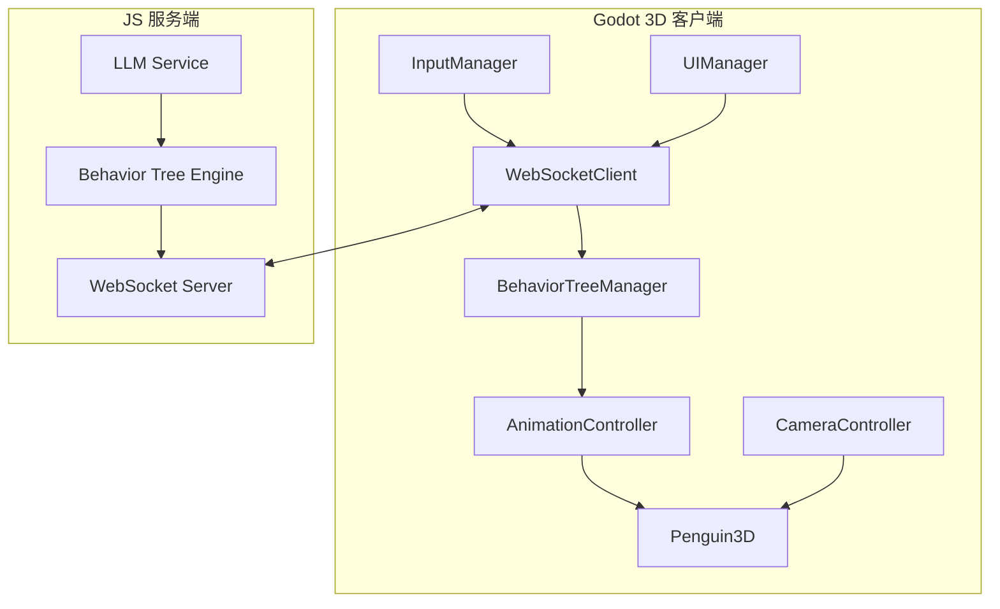
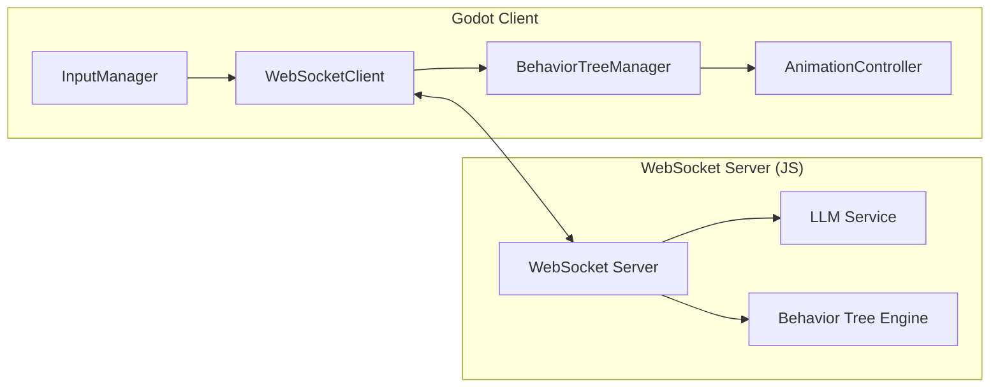

# Godot 3D 萌宠项目架构文档

## 项目概述

### 项目目标
创建一个基于Godot引擎的3D萌宠游戏，完全模仿现有JS前端萌宠的功能特性。通过WebSocket与现有的LLM+行为树服务端通信，实现统一的控制逻辑和AI驱动行为。

### 核心功能对等性
- ✅ 文字指令控制（LLM意图理解）
- ✅ 鼠标拖拽交互
- ✅ 多种动作和表情
- ✅ 状态管理系统（能量、无聊度）
- ✅ 行为树驱动AI
- ✅ 实时状态同步

## 架构设计

### 整体架构图



### 核心模块详细设计

#### 1. WebSocket通信模块 (WebSocketClient.gd)

**功能职责：**
- 建立与JS服务端的WebSocket连接
- 发送用户输入（文字指令、鼠标操作）
- 接收服务端指令（动作、表情、位置更新）
- 处理连接状态和重连逻辑

**核心方法：**
```gdscript
class_name WebSocketClient
extends Node

# 信号定义
signal connected()
signal disconnected()
signal message_received(message: Dictionary)
signal connection_error(error: String)

# 连接管理
var socket: WebSocketPeer
var is_connected: bool = false
var reconnect_timer: Timer

func connect_to_server(url: String) -> void
func disconnect_from_server() -> void
func send_message(message: Dictionary) -> void
func _process(delta: float) -> void  # 处理WebSocket状态更新
func _on_connection_timeout() -> void
```

**通信协议：**

**发送消息格式：**
```json
{
  "type": "user_input",
  "timestamp": 1234567890,
  "data": {
    "text": "跳舞"
  }
}
```

```json
{
  "type": "mouse_drag",
  "timestamp": 1234567890,
  "data": {
    "start_pos": [0, 0, 0],
    "end_pos": [1, 1, 1],
    "duration": 2.0
  }
}
```

**接收消息格式：**
```json
{
  "type": "bt_output",
  "timestamp": 1234567890,
  "data": {
    "action": "DANCE",
    "expression": "HAPPY",
    "position": [0, -1, 0],
    "energy": 95,
    "boredom": 10,
    "chat_messages": [
      {"role": "assistant", "content": "好的，我来跳舞给你看！"}
    ]
  }
}
```

#### 2. 行为树管理器 (BehaviorTreeManager.gd)

**功能职责：**
- 管理行为树状态同步
- 接收服务端行为树输出
- 本地状态管理和更新
- 协调各个行为树分支

**核心状态变量：**
```gdscript
class_name BehaviorTreeManager
extends Node

# 状态变量（与JS版本保持一致）
var energy: float = 100.0
var boredom: float = 0.0
var current_action: String = "IDLE"
var current_expression: String = "NEUTRAL"
var penguin_position: Vector3 = Vector3(0, -1, 0)

# 行为树分支引用
var main_bt: MainBT
var active_service_bt: ActiveServiceBT
var intent_bt: IntentBT
var emotion_bt: EmotionBT

# 待执行动作序列
var pending_actions: Array = []
var current_sequence_idx: int = 0
var sequence_start_time: float = 0.0
```

**行为树分支：**
- **主行为树 (MainBT)**: 处理核心动作逻辑（移动、睡觉、回归原点等）
- **主动服务树 (ActiveServiceBT)**: 管理生存状态（能量消耗、无聊度增加）
- **意图理解树 (IntentBT)**: 处理用户指令理解（由服务端驱动）
- **情感树 (EmotionBT)**: 管理表情状态

#### 3. 动画控制器 (AnimationController.gd)

**功能职责：**
- 管理3D模型动画播放
- 处理动作和表情的混合
- 实现平滑的动画过渡

**动画树结构：**
```
AnimationTree (penguin.anim_tree)
├── parameters/
│   ├── state/current (IDLE, WALK, RUN, etc.)
│   ├── expression/current (NEUTRAL, HAPPY, SAD, etc.)
│   ├── blend_amounts/
│   │   ├── speed (0.0-1.0 for walk/run blend)
│   │   └── emotion_intensity (0.0-1.0)
│   └── transitions/
│       ├── idle_to_walk
│       ├── walk_to_run
│       └── emotion_transitions
```

**动作动画映射：**
```gdscript
const ACTION_ANIMATIONS = {
    "IDLE": "idle",
    "WALK": "walk",
    "RUN": "run",
    "JUMP": "jump",
    "WAVE": "wave",
    "DANCE": "dance",
    "SPIN": "spin",
    "SHIVER": "shiver",
    "SLEEP": "sleep",
    "BOW": "bow",
    "NO": "no",
    "YES": "yes",
    "EAT": "eat",
    "SURPRISE": "surprise",
    "ANGRY": "angry",
    "SAD": "sad",
    "HAPPY": "happy",
    "LOOK_LEFT": "look_left",
    "LOOK_RIGHT": "look_right",
    "ROLL": "roll",
    "BACKFLIP": "backflip",
    "CLAP": "clap",
    "THINK": "think",
    "SIT": "sit",
    "FIGHT": "fight",
    "SWIM": "swim",
    "DAZZLE": "dazzle",
    "HIDE": "hide",
    "PEEK": "peek",
    "LOVE": "love",
    "FLY": "fly",
    "RUN_ACROSS": "run_across",
    "SLIDE": "slide"
}
```

**表情动画映射：**
```gdscript
const EXPRESSION_ANIMATIONS = {
    "NEUTRAL": "face_neutral",
    "HAPPY": "face_happy",
    "SAD": "face_sad",
    "ANGRY": "face_angry",
    "SURPRISED": "face_surprised",
    "EXCITED": "face_excited",
    "SLEEPY": "face_sleepy",
    "LOVING": "face_loving",
    "CONFUSED": "face_confused",
    "BLINK": "face_blink"
}
```

#### 4. 3D企鹅角色 (Penguin3D.gd)

**继承结构：**
```
CharacterBody3D (penguin_3d.gd)
├── CollisionShape3D (胶囊体碰撞器)
├── MeshInstance3D (企鹅模型)
├── AnimationTree (动画控制器)
├── AnimationPlayer (动画播放器)
├── AudioStreamPlayer3D (音效播放器)
└── RayCast3D (地面检测)
```

**核心功能：**
- 物理运动和碰撞检测
- 动画状态管理
- 交互响应（鼠标点击、拖拽）
- 音效播放
- 地面跟随

**物理属性：**
```gdscript
# 物理属性
const GRAVITY = 9.8
const JUMP_VELOCITY = 4.5
const MOVE_SPEED = 3.0
const ROTATION_SPEED = 5.0

# 碰撞检测
var ground_check: RayCast3D
var is_on_ground: bool = true
```

#### 5. 相机控制器 (CameraController.gd)

**功能特性：**
- 第三人称跟随相机
- 鼠标滚轮缩放
- 右键拖拽旋转视角
- 平滑的相机移动插值

**相机参数：**
```gdscript
class_name CameraController
extends Node3D

# 相机参数
const CAMERA_DISTANCE_MIN = 4.0
const CAMERA_DISTANCE_MAX = 12.0
const CAMERA_SENSITIVITY = 0.3
const CAMERA_SMOOTHING = 5.0

# 角度限制
const PITCH_MIN = -30.0
const PITCH_MAX = 60.0

# 相机组件
var camera: Camera3D
var target: Node3D  # 跟随目标（企鹅）
var current_distance: float = 8.0
var current_rotation: Vector2 = Vector2.ZERO
```

#### 6. 输入管理器 (InputManager.gd)

**支持的输入类型：**
- **鼠标输入：** 拖拽、点击、滚轮缩放
- **键盘输入：** WASD移动、空格跳跃
- **文字输入：** UI界面文字指令

**输入映射：**
```gdscript
# project.godot 中的输入映射配置
[InputMap]
move_forward = KEY_W
move_back = KEY_S
move_left = KEY_A
move_right = KEY_D
jump = KEY_SPACE
camera_zoom_in = MOUSE_WHEEL_UP
camera_zoom_out = MOUSE_WHEEL_DOWN
camera_rotate = MOUSE_BUTTON_RIGHT
penguin_drag = MOUSE_BUTTON_LEFT
penguin_click = MOUSE_BUTTON_LEFT
```

**拖拽状态管理：**
```gdscript
class_name InputManager
extends Node

# 拖拽状态
var is_dragging: bool = false
var drag_start_pos: Vector3
var drag_end_pos: Vector3
var drag_start_time: float

# 信号
signal drag_started(position: Vector3)
signal drag_ended(start_pos: Vector3, end_pos: Vector3, duration: float)
signal penguin_clicked(position: Vector3)
```

#### 7. UI管理器 (UIManager.gd)

**界面组件：**
- **状态栏：** 能量条、无聊度条、当前动作显示
- **聊天界面：** 消息历史、输入框
- **控制面板：** 连接状态、设置按钮
- **行为树可视化：** 可选的调试界面

**UI层级结构：**
```
CanvasLayer (ui_layer)
├── Control (main_ui)
│   ├── Panel (status_panel)
│   │   ├── ProgressBar (energy_bar)
│   │   ├── ProgressBar (boredom_bar)
│   │   └── Label (current_action_label)
│   ├── Panel (chat_panel)
│   │   ├── ScrollContainer (chat_scroll)
│   │   │   └── VBoxContainer (chat_container)
│   │   └── LineEdit (chat_input)
│   ├── Panel (control_panel)
│   │   ├── Button (connect_button)
│   │   ├── Label (connection_status)
│   │   └── Button (settings_button)
│   └── Panel (debug_panel) [可选]
│       └── Tree (bt_tree_visualizer)
```

## 技术实现方案

### Godot版本选择
- **Godot 4.2+**: 利用最新的GDScript改进和渲染特性
- **Forward+渲染器**: 更好的光照和阴影效果
- **Jolt物理引擎**: 更稳定的3D物理模拟

### 资源管理
- **3D模型：** 使用GLTF/GLB格式，支持动画
- **材质：** PBR材质，支持实时光照
- **音频：** WAV/MP3格式，支持3D空间音效
- **场景：** 基于GridMap的舞台场景

### 性能优化
- **LOD系统：** 距离相关的细节级别
- **遮挡剔除：** 减少不必要的渲染
- **对象池：** 复用临时对象
- **异步加载：** 资源按需加载

## 与JS版本的集成方案

### 通信架构



### 状态同步机制

**服务端驱动的状态同步：**
1. Godot客户端发送用户输入到服务端
2. 服务端通过LLM理解意图，更新行为树状态
3. 服务端计算新的动作序列和状态
4. 服务端通过WebSocket推送更新到Godot客户端
5. Godot客户端更新本地状态和动画

**关键状态变量同步：**
- `energy`: 能量值 (0-100)
- `boredom`: 无聊度 (0-100)
- `current_action`: 当前动作
- `current_expression`: 当前表情
- `penguin_position`: 企鹅位置
- `pending_actions`: 待执行动作序列

### 行为树执行模式

**与JS版本的区别：**
- **JS版本：** 客户端执行完整的行为树逻辑
- **Godot版本：** 服务端执行行为树逻辑，客户端只做状态同步

**优势：**
- 统一的行为逻辑
- 服务端可以同时服务多个客户端
- 更容易调试和维护
- 支持更复杂的AI逻辑

## 开发实现计划

### Phase 1: 核心框架 (2周)
- [ ] Godot项目结构搭建
- [ ] WebSocket通信模块实现
- [ ] 基础3D场景和角色加载
- [ ] 输入系统基础实现

### Phase 2: 动画和行为 (2周)
- [ ] 动画控制器和AnimationTree实现
- [ ] 行为树状态管理集成
- [ ] 动作和表情动画系统
- [ ] 状态同步机制完善

### Phase 3: 交互和UI (1周)
- [ ] 相机控制系统实现
- [ ] UI界面开发
- [ ] 鼠标交互优化
- [ ] 调试和可视化工具

### Phase 4: 优化和测试 (1周)
- [ ] 性能优化
- [ ] 跨平台测试
- [ ] 与JS版本集成测试
- [ ] 错误处理和文档完善

## 部署和分发

### 开发环境
- **Godot 4.2+**: 主开发环境
- **VS Code**: 脚本编辑和调试
- **Blender**: 3D模型和动画制作

### 构建配置
- **导出模板：** 为不同平台配置构建
- **资源优化：** 压缩纹理和音频
- **启动参数：** WebSocket服务器地址配置

### 分发方式
- **独立可执行文件：** Windows、macOS、Linux
- **游戏平台：** Steam、Itch.io等

## 总结

这个Godot 3D萌宠项目通过WebSocket通信与现有的JS版本实现完美集成，共享统一的服务端逻辑。Godot版本提供更加丰富和沉浸式的3D体验，同时保持与原有系统的完全兼容性。

关键技术挑战包括：
1. **状态同步：** 确保客户端和服务端状态的一致性
2. **动画系统：** 实现平滑的动作和表情过渡
3. **物理交互：** 3D环境中的拖拽和物理模拟
4. **性能优化：** 保证流畅的3D渲染和实时通信

项目充分利用Godot引擎的优势，在3D渲染、物理模拟和动画系统方面提供超越Web版本的体验。