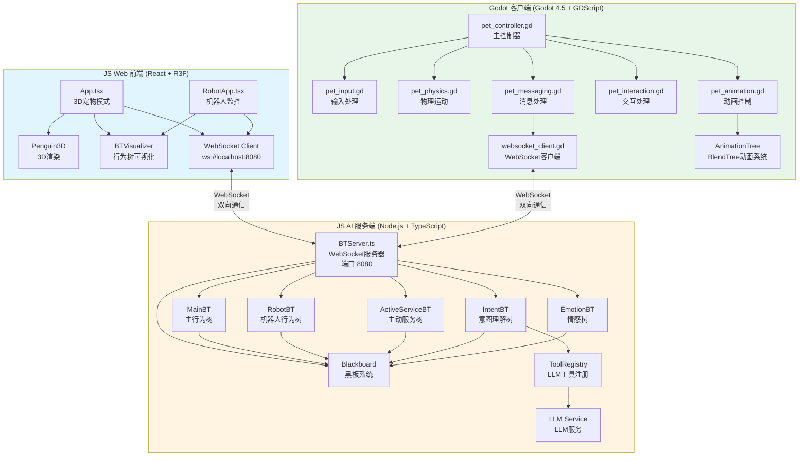
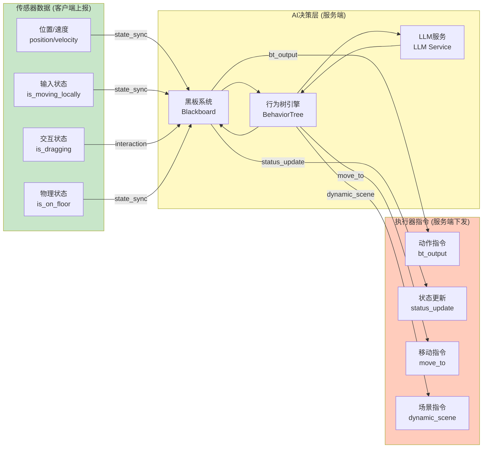
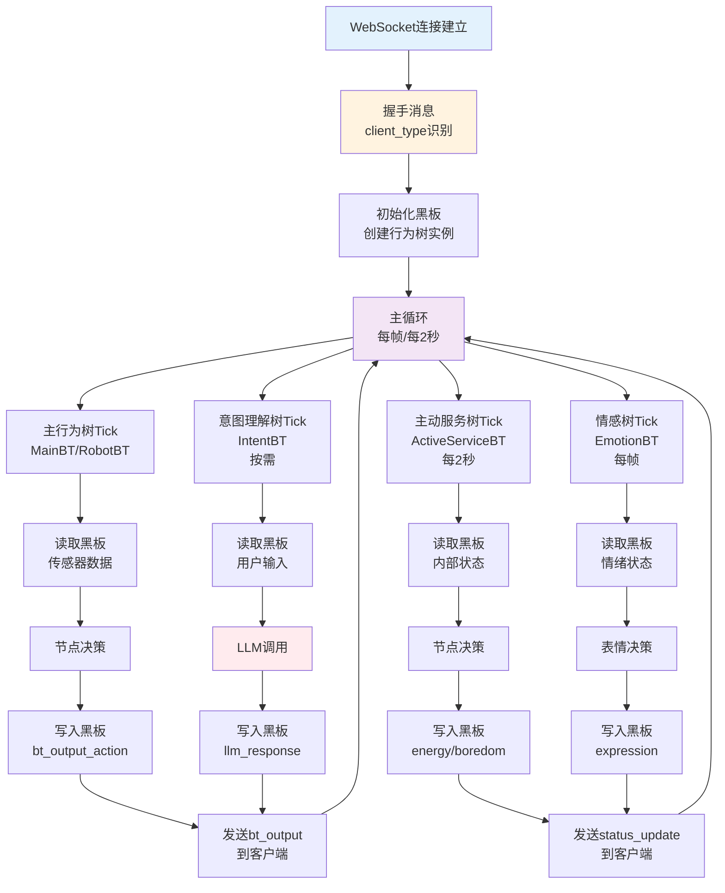
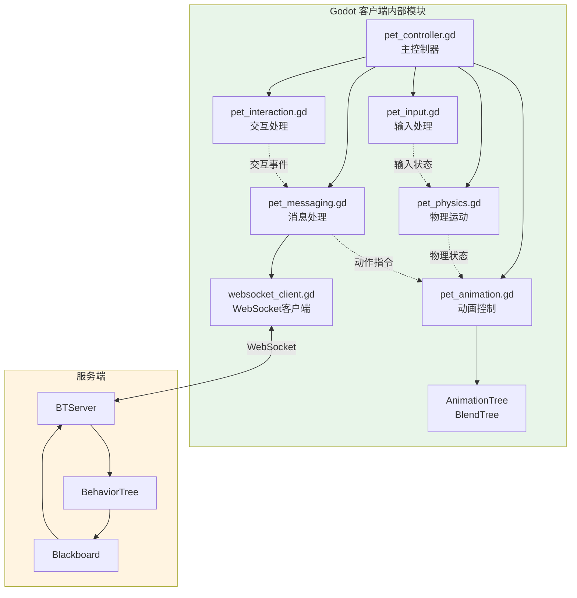
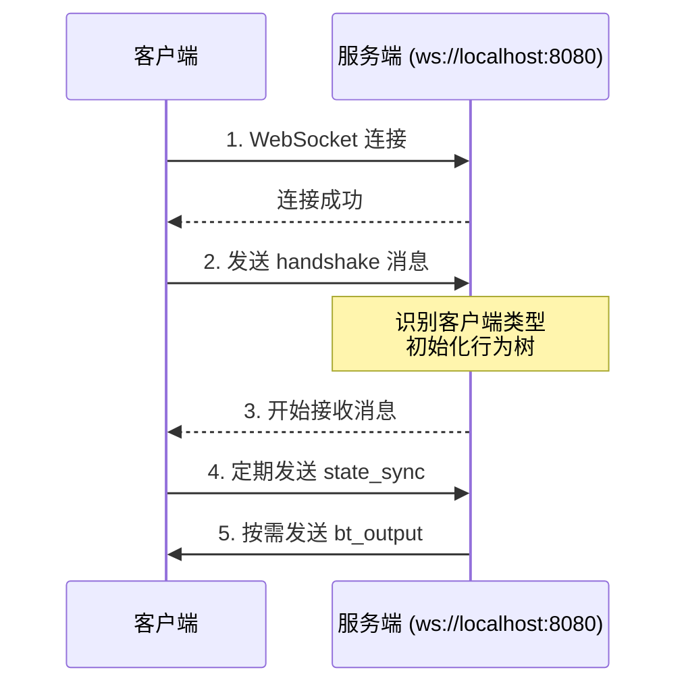

# Godot 客户端开发规范文档

> **文档版本**: v1.0  
> **更新日期**: 2025-01  
> **适用范围**: Godot 客户端开发团队

## 目录

1. [概述](#概述)
2. [系统架构](#系统架构)
3. [整体架构图](#整体架构图)
4. [WebSocket API 接口规范](#websocket-api-接口规范) ⭐ **客户端开发者必读**
5. [BlendTree 动画系统规范](#blendtree-动画系统规范)
6. [WebSocket 通信协议规范](#websocket-通信协议规范)
7. [变量存储与取值规范](#变量存储与取值规范)
8. [代码实现示例](#代码实现示例)
9. [测试与调试规范](#测试与调试规范)

---

## 概述

本项目采用 **"本地物理混合 + 服务端 AI 决策"** 的架构：

- **客户端（Godot）**：负责物理表现、动画混合、用户输入响应
- **服务端（JS）**：负责 AI 决策、行为树逻辑、动作指令下发
- **通信方式**：WebSocket（JSON 消息格式）
- **动画系统**：AnimationTree + BlendTree（参数驱动）

### 核心设计原则

1. **输入输出隔离**：客户端上报传感器数据（Sensor），服务端下发执行器指令（Actuator）
2. **基础移动本地控制**：`IDLE`/`WALK`/`RUN` 由客户端完全控制，不接收服务端指令
3. **特殊动作服务端决策**：`JUMP`/`WAVE`/`DANCE`/`BOUNCE`/`FLIP` 等由服务端决策下发
4. **参数驱动动画**：使用 BlendTree 参数控制动画混合，而非状态机切换

---

## 系统架构

### 1. 项目结构

本项目由三个独立的子系统组成，通过 WebSocket 进行通信：

#### 1.1 Godot 客户端 (`GAME/godot-pet/`)

**技术栈**：Godot 4.5 + GDScript

**目录结构**：
```
godot-pet/
├── scripts/              # 核心脚本模块
│   ├── pet_controller.gd      # 主控制器（协调各模块）
│   ├── pet_input.gd           # 输入处理模块
│   ├── pet_physics.gd         # 物理运动模块
│   ├── pet_animation.gd       # 动画控制模块（BlendTree）
│   ├── pet_interaction.gd     # 交互处理模块（拖拽、点击）
│   ├── pet_messaging.gd       # WebSocket 消息处理模块
│   ├── pet_data.gd            # 数据定义（枚举、常量）
│   ├── websocket_client.gd    # WebSocket 客户端
│   ├── asr_websocket_client.gd # ASR 语音识别客户端
│   ├── config_manager.gd      # 配置管理
│   ├── ui_controller.gd       # UI 控制
│   └── camera_controller.gd   # 相机控制
├── scenes/               # 场景文件
│   ├── main.tscn             # 主场景
│   ├── pet.tscn              # 宠物场景
│   └── settings.tscn         # 设置场景
├── assets/               # 资源文件
│   ├── models/               # 3D 模型
│   ├── textures/             # 纹理
│   └── environment/         # 环境资源
├── docs/                 # 文档
└── project.godot         # 项目配置
```

**代码组织原则**：
- **模块化设计**：每个功能模块独立脚本，通过信号通信
- **主控制器模式**：`pet_controller.gd` 作为协调者，管理各模块生命周期
- **职责分离**：物理、动画、交互、通信各司其职

#### 1.2 JS AI 服务端 (`AVATAR/q_llm_pet/services/bt/`)

**技术栈**：Node.js + TypeScript + WebSocket

**目录结构**：
```
q_llm_pet/
├── services/
│   ├── bt/                    # 行为树核心
│   │   ├── BTServer.ts            # WebSocket 服务器主类
│   │   ├── core/                  # 核心组件
│   │   │   ├── BehaviorTree.ts        # 行为树引擎
│   │   │   ├── Blackboard.ts          # 黑板系统
│   │   │   ├── BaseNode.ts            # 节点基类
│   │   │   ├── Action.ts              # 动作节点基类
│   │   │   ├── Condition.ts           # 条件节点基类
│   │   │   ├── Composite.ts           # 组合节点基类
│   │   │   └── Decorator.ts           # 装饰器节点基类
│   │   ├── actions/              # 动作节点
│   │   │   ├── UpdateInternalStatesAction.ts  # 更新内部状态
│   │   │   ├── SendBTOutputsAction.ts         # 发送行为树输出
│   │   │   ├── LLMCallAction.ts               # LLM 调用
│   │   │   └── ... (其他动作节点)
│   │   ├── conditions/          # 条件节点
│   │   ├── composites/          # 组合节点（Sequence, Parallel 等）
│   │   ├── decorators/           # 装饰器节点
│   │   ├── trees/                # 行为树定义
│   │   │   ├── MainBT.ts            # 主行为树
│   │   │   ├── RobotBT.ts           # 机器人行为树
│   │   │   ├── ActiveServiceBT.ts  # 主动服务树
│   │   │   ├── IntentBT.ts         # 意图理解树
│   │   │   └── EmotionBT.ts        # 情感树
│   │   ├── ToolRegistry.ts       # 工具注册表（LLM 函数调用）
│   │   └── scenes.json          # 场景配置
│   ├── llmService.ts            # LLM 服务接口
│   ├── geminiService.ts         # Gemini API 实现
│   ├── customLLMService.ts      # 自定义 LLM 实现
│   └── functionGemmaService.ts  # Function Gemma 实现
├── components/              # React 组件
├── App.tsx                 # Web 前端主应用
├── RobotApp.tsx            # 机器人监控应用
└── types.ts                # TypeScript 类型定义
```

**代码组织原则**：
- **行为树架构**：基于 B3 (Behavior Tree 3) 规范
- **黑板系统**：全局状态存储，节点间数据共享
- **多树协作**：主树、主动服务树、意图树、情感树并行运行
- **客户端类型识别**：通过握手消息区分 `godot_robot`、`web_monitor`、`penguin`

#### 1.3 JS Web 前端 (`AVATAR/q_llm_pet/`)

**技术栈**：React + TypeScript + React Three Fiber

**目录结构**：
```
q_llm_pet/
├── components/
│   ├── Penguin3D.tsx           # 3D 宠物渲染（React Three Fiber）
│   ├── Stage.tsx               # 3D 舞台场景
│   ├── BTVisualizer.tsx        # 行为树可视化组件
│   ├── BTFloatingMap.tsx       # 行为树浮动地图
│   ├── QuickCommandsPanel.tsx  # 快速命令面板
│   ├── SettingsModal.tsx       # 设置模态框
│   └── penguin/
│       ├── usePenguinAnimations.ts  # 动画 Hook
│       └── usePenguinExpressions.ts # 表情 Hook
├── App.tsx                     # 主应用（3D 宠物模式）
├── RobotApp.tsx               # 机器人监控应用
├── services/                   # 共享服务（见服务端部分）
└── types.ts                    # 类型定义
```

**代码组织原则**：
- **React Hooks**：状态管理和副作用处理
- **React Three Fiber**：3D 渲染和动画
- **行为树集成**：前端也运行行为树，用于可视化调试

### 2. 模块职责划分

#### 2.1 Godot 客户端模块

| 模块 | 职责 | 关键功能 |
|------|------|---------|
| `pet_controller.gd` | 主控制器 | 协调各模块，管理生命周期，处理信号连接 |
| `pet_input.gd` | 输入处理 | WASD 移动、跳跃键检测、输入状态计算 |
| `pet_physics.gd` | 物理运动 | 移动、跳跃、重力、碰撞检测 |
| `pet_animation.gd` | 动画控制 | BlendTree 参数设置、程序化动画、状态管理 |
| `pet_interaction.gd` | 交互处理 | 鼠标拖拽、点击检测、交互事件发送 |
| `pet_messaging.gd` | 消息处理 | WebSocket 消息解析、动作状态应用、状态同步 |
| `websocket_client.gd` | WebSocket 客户端 | 连接管理、心跳、消息收发、重连机制 |

#### 2.2 JS AI 服务端模块

| 模块 | 职责 | 关键功能 |
|------|------|---------|
| `BTServer.ts` | WebSocket 服务器 | 客户端连接管理、消息路由、行为树执行循环 |
| `BehaviorTree.ts` | 行为树引擎 | 节点执行、状态管理、Tick 机制 |
| `Blackboard.ts` | 黑板系统 | 键值存储、数据共享、状态同步 |
| `MainBT.ts` | 主行为树 | 核心决策逻辑、动作优先级管理 |
| `RobotBT.ts` | 机器人行为树 | 机器人专用决策逻辑 |
| `ActiveServiceBT.ts` | 主动服务树 | 低频主动服务（如能量衰减） |
| `IntentBT.ts` | 意图理解树 | 用户输入理解、LLM 调用 |
| `EmotionBT.ts` | 情感树 | 表情控制、情绪状态管理 |
| `ToolRegistry.ts` | 工具注册表 | LLM 函数调用工具注册和管理 |

#### 2.3 JS Web 前端模块

| 模块 | 职责 | 关键功能 |
|------|------|---------|
| `App.tsx` | 主应用 | 3D 宠物模式、行为树可视化、聊天界面 |
| `RobotApp.tsx` | 机器人监控 | Godot 机器人监控、状态显示、命令发送 |
| `Penguin3D.tsx` | 3D 渲染 | React Three Fiber 场景、动画播放 |
| `BTVisualizer.tsx` | 行为树可视化 | 实时行为树状态显示 |
| `BTFloatingMap.tsx` | 行为树地图 | 行为树结构可视化 |

### 3. 通信协议

#### 3.1 WebSocket 连接

- **服务端地址**：`ws://localhost:8080`
- **客户端类型识别**：通过 `handshake` 消息的 `client_type` 字段
  - `godot_robot`：Godot 客户端
  - `robot`：Web 监控客户端
  - `penguin`：Web 3D 宠物客户端（默认）

#### 3.2 消息流向

**客户端 → 服务端**：
- `handshake`：握手消息，标识客户端类型
- `state_sync`：状态同步（位置、速度、动作状态等）
- `interaction`：交互事件（点击、拖拽、跳跃）
- `user_input`：用户输入（文字指令）
- `config_update`：配置更新（LLM 设置）

**服务端 → 客户端**：
- `bt_output`：行为树输出（动作指令）
- `status_update`：状态更新（能量、无聊度等）
- `move_to`：移动指令
- `scene_trigger`：场景触发
- `dynamic_scene`：动态场景步骤

### 4. 数据流

#### 4.1 传感器数据流（客户端 → 服务端）

```
Godot 客户端
  ↓ 物理检测/输入检测
传感器数据（position, velocity, is_moving_locally, is_dragging...）
  ↓ state_sync 消息
WebSocket
  ↓
服务端 BTServer
  ↓ 更新黑板
Blackboard (penguinPosition, isMovingLocally, isDragging...)
  ↓ 行为树读取
行为树节点决策
```

#### 4.2 执行器数据流（服务端 → 客户端）

```
服务端行为树
  ↓ 决策完成
Blackboard (bt_output_action, bt_output_action_speed...)
  ↓ sendBTOutputsAction
WebSocket (bt_output 消息)
  ↓
Godot 客户端
  ↓ pet_messaging.gd 解析
动作状态应用
  ↓ pet_animation.gd
BlendTree 参数设置
  ↓
动画播放
```

---

## 整体架构图

### 三端交互架构

系统由三个独立的子系统组成，通过 WebSocket 进行实时通信：



### 数据流向图



### 行为树执行流程



### 客户端模块协作图



### 关键设计说明

1. **客户端类型识别**：
   - 服务端通过 `handshake` 消息的 `client_type` 字段识别客户端类型
   - `godot_robot`：使用 `RobotBT`，接收物理传感器数据
   - `robot`：Web 监控客户端，用于可视化调试
   - `penguin`：Web 3D 宠物，使用 `MainBT`

2. **行为树多树协作**：
   - **主树**（MainBT/RobotBT）：核心决策，高频执行（每帧）
   - **主动服务树**（ActiveServiceBT）：低频主动服务（每2秒）
   - **意图理解树**（IntentBT）：按需执行，处理用户输入
   - **情感树**（EmotionBT）：表情控制，高频执行（每帧）

3. **数据同步机制**：
   - **传感器数据**：客户端主动上报（`state_sync`，10-20Hz）
   - **执行器指令**：服务端按需下发（`bt_output`，状态变化时）
   - **状态更新**：服务端定期更新（`status_update`，状态变化时）

4. **动画系统**：
   - Godot 客户端使用 **BlendTree** 参数驱动动画
   - 服务端通过连续值参数控制动画混合
   - 基础移动（idle/walk/run）由客户端本地控制
   - 特殊动作（jump/wave/dance）由服务端决策下发

---

## BlendTree 动画系统规范

### 1. BlendTree 结构要求

#### 1.1 基础架构

BlendTree 必须使用 **AnimationNodeBlendTree** 作为根节点，**禁止使用 AnimationNodeStateMachine**。

**推荐的 BlendTree 结构**：

```
AnimationNodeBlendTree (root)
├─ Locomotion (BlendSpace1D)
│   ├─ idle (pos: 0.0)
│   ├─ walk (pos: 0.3)
│   └─ run (pos: 1.0)
├─ JumpBlend (Blend2)
│   ├─ 输入0: jump animation
│   └─ 输入1: locomotion output
└─ WaveBlend (Blend2)
    ├─ 输入0: wave animation
    └─ 输入1: jump_blend output
```

#### 1.2 节点命名规范

**必须遵循的命名规则**：

| 节点类型 | 参数路径格式 | 说明 |
|---------|------------|------|
| 连续动作混合 | `parameters/locomotion/blend_position` | Locomotion 混合参数（0.0-1.0） |
| 离散动作混合 | `parameters/{action}_blend/blend_amount` | 动作覆盖参数（0.0=隐藏, 1.0=显示） |
| 状态维度混合 | `parameters/{dimension}_blend/blend_position` | 状态维度参数（0.0-1.0） |

**示例**：
- `parameters/locomotion/blend_position` - 基础移动混合
- `parameters/jump_blend/blend_amount` - 跳跃覆盖混合
- `parameters/wave_blend/blend_amount` - 挥手覆盖混合
- `parameters/energy_blend/blend_position` - 能量维度混合（未来扩展）

### 2. 参数控制规范

#### 2.1 基础移动（Locomotion）

**参数路径**：`parameters/locomotion/blend_position`

**取值范围**：`0.0` - `1.0`

**值映射规则**：
- `0.0` → `idle` 动画
- `0.3` → `walk` 动画（可根据实际调整）
- `1.0` → `run` 动画

**代码示例**：
```gdscript
# 设置 idle
animation_tree.set("parameters/locomotion/blend_position", 0.0)

# 设置 walk
animation_tree.set("parameters/locomotion/blend_position", 0.3)

# 设置 run
animation_tree.set("parameters/locomotion/blend_position", 1.0)

# 连续值自动混合（如 0.5 会混合 walk 和 run）
animation_tree.set("parameters/locomotion/blend_position", 0.5)
```

**重要**：基础移动参数**只能由客户端本地控制**，不能接收服务端指令。

#### 2.2 离散动作（Overlay Actions）

**参数路径**：`parameters/{action}_blend/blend_amount`

**取值范围**：`0.0` - `1.0`

**值含义**：
- `0.0` → 隐藏该动作，显示下层动作
- `1.0` → 显示该动作，覆盖下层动作

**支持的动作**：
- `jump` → `parameters/jump_blend/blend_amount`
- `wave` → `parameters/wave_blend/blend_amount`
- `dance` → `parameters/dance_blend/blend_amount`（如已实现）
- `bounce` → `parameters/bounce_blend/blend_amount`（如已实现）

**代码示例**：
```gdscript
# 显示跳跃（覆盖基础移动）
animation_tree.set("parameters/jump_blend/blend_amount", 1.0)

# 隐藏跳跃（恢复基础移动）
animation_tree.set("parameters/jump_blend/blend_amount", 0.0)

# 显示挥手（覆盖当前状态）
animation_tree.set("parameters/wave_blend/blend_amount", 1.0)
```

**重要**：离散动作完成后**必须手动清除** `blend_amount`，恢复基础动作。

#### 2.3 状态维度混合（未来扩展）

**参数路径**：`parameters/{dimension}_blend/blend_position`

**支持维度**（如已实现）：
- `energy` → `parameters/energy_blend/blend_position` (0.0=tired, 1.0=energetic)
- `emotion` → `parameters/emotion_blend/blend_position` (0.0=sad, 0.5=neutral, 1.0=happy)
- `boredom` → `parameters/boredom_blend/blend_position` (0.0=bored, 1.0=interested)

**代码示例**：
```gdscript
# 设置能量值（归一化到 0-1）
var energy_normalized = energy_value / 100.0
animation_tree.set("parameters/energy_blend/blend_position", energy_normalized)

# 设置情绪值（归一化到 0-1）
var emotion_normalized = emotion_value / 100.0
animation_tree.set("parameters/emotion_blend/blend_position", emotion_normalized)
```

### 3. BlendTree 配置检查

#### 3.1 初始化检查

在 `_ready()` 中必须验证 BlendTree 配置：

```gdscript
func _ready() -> void:
    if not animation_tree:
        push_error("[Pet] AnimationTree is null!")
        return
    
    animation_tree.active = true
    
    # 检查关键参数是否存在
    var test_params = [
        "parameters/locomotion/blend_position",
        "parameters/jump_blend/blend_amount",
        "parameters/wave_blend/blend_amount"
    ]
    
    for param in test_params:
        var value = animation_tree.get(param)
        if value == null:
            push_error("[Pet] Parameter '%s' does not exist!" % param)
        else:
            print("[Pet] ✓ Parameter '%s' exists = %s" % [param, value])
```

#### 3.2 动画资源检查

**必须的动画资源**：
- `idle` - 待机动画
- `walk` - 走路动画
- `run` - 跑步动画
- `jump` - 跳跃动画
- `wave` - 挥手动画

**检查代码**：
```gdscript
func _ready() -> void:
    var anim_player = animation_tree.get_node_or_null(animation_tree.anim_player)
    if anim_player and anim_player is AnimationPlayer:
        var required_anims = ["idle", "walk", "run", "jump", "wave"]
        for anim_name in required_anims:
            if anim_name in anim_player.get_animation_list():
                print("[Pet] ✓ Animation '%s' found" % anim_name)
            else:
                push_error("[Pet] ✗ Animation '%s' NOT found!" % anim_name)
```

### 4. 禁止使用的功能

**严禁使用以下功能**：

1. ❌ **AnimationNodeStateMachine** - 禁止使用状态机
2. ❌ **AnimationNodeStateMachinePlayback** - 禁止使用 `playback.travel()`
3. ❌ **硬编码状态切换** - 禁止使用 `if-else` 判断后切换状态

**正确做法**：使用 `animation_tree.set()` 设置参数，让 BlendTree 自动混合。

---

## WebSocket API 接口规范

> **本文档面向客户端开发者**，详细说明如何实现客户端与服务端的 WebSocket 通信接口。

### 快速开始

#### 1. 连接流程



**实现步骤**：

1. **建立 WebSocket 连接**
   ```gdscript
   var socket = WebSocketPeer.new()
   var err = socket.connect_to_url("ws://localhost:8080")
   ```

2. **连接成功后立即发送握手消息**
   ```gdscript
   socket.send_text(JSON.stringify({
       "type": "handshake",
       "timestamp": Time.get_unix_time_from_system(),
       "data": {
           "client_type": "godot_robot",
           "platform": OS.get_name(),
           "version": "1.0"
       }
   }))
   ```

3. **开始接收和发送消息**
   - 定期发送 `state_sync`（10-20Hz）
   - 实时发送 `interaction`（事件触发时）
   - 接收并处理 `bt_output`、`status_update` 等消息

#### 2. 消息格式标准

所有消息遵循以下 JSON 格式：

```json
{
  "type": "消息类型",
  "timestamp": 1234567890,
  "data": {
    // 消息数据（根据类型不同而变化）
  }
}
```

**字段说明**：

| 字段 | 类型 | 必填 | 说明 |
|------|------|------|------|
| `type` | String | ✅ | 消息类型（见下方消息类型表） |
| `timestamp` | Number | ✅ | Unix 时间戳（秒或毫秒） |
| `data` | Object | ✅ | 消息数据对象 |

---

## WebSocket API 接口规范

> **本文档面向客户端开发者**，详细说明如何实现客户端与服务端的 WebSocket 通信接口。

### 目录

1. [快速开始](#快速开始)
2. [客户端必须实现的接口](#客户端必须实现的接口)
3. [客户端必须上传的数据](#客户端必须上传的数据)
4. [客户端必须响应的数据](#客户端必须响应的数据)
5. [完整对接流程](#完整对接流程)
6. [错误处理与重连机制](#错误处理与重连机制)
7. [消息类型参考](#消息类型参考)

---

### 快速开始

#### 1. 连接流程


**实现步骤**：

1. **建立 WebSocket 连接**
   ```gdscript
   var socket = WebSocketPeer.new()
   var err = socket.connect_to_url("ws://localhost:8080")
   ```

2. **连接成功后立即发送握手消息**
   ```gdscript
   socket.send_text(JSON.stringify({
       "type": "handshake",
       "timestamp": Time.get_unix_time_from_system(),
       "data": {
           "client_type": "godot_robot",
           "platform": OS.get_name(),
           "version": "1.0"
       }
   }))
   ```

3. **开始接收和发送消息**
   - 定期发送 `state_sync`（10-20Hz）
   - 实时发送 `interaction`（事件触发时）
   - 接收并处理 `bt_output`、`status_update` 等消息

#### 2. 消息格式标准

所有消息遵循以下 JSON 格式：

```json
{
  "type": "消息类型",
  "timestamp": 1234567890,
  "data": {
    // 消息数据（根据类型不同而变化）
  }
}
```

**字段说明**：

| 字段 | 类型 | 必填 | 说明 |
|------|------|------|------|
| `type` | String | ✅ | 消息类型（见下方消息类型表） |
| `timestamp` | Number | ✅ | Unix 时间戳（秒或毫秒） |
| `data` | Object | ✅ | 消息数据对象 |

---

### 客户端必须实现的接口

客户端需要实现以下功能模块：

#### 1. WebSocket 连接管理

**必须实现**：
- ✅ WebSocket 连接建立
- ✅ 连接断开检测
- ✅ 自动重连机制
- ✅ 心跳保活（可选，建议 30 秒）

**代码示例**：
```gdscript
extends Node

var socket := WebSocketPeer.new()
var is_connected: bool = false

func connect_to_server(url: String = "ws://localhost:8080") -> void:
    var err = socket.connect_to_url(url)
    if err != OK:
        push_error("连接失败: %d" % err)
        return
    set_process(true)

func _process(delta: float) -> void:
    socket.poll()
    var state = socket.get_ready_state()
    
    if state == WebSocketPeer.STATE_OPEN:
        if not is_connected:
            is_connected = true
            _send_handshake()
        _handle_messages()
    elif state == WebSocketPeer.STATE_CLOSED:
        if is_connected:
            is_connected = false
            _handle_disconnect()
```

#### 2. 消息发送接口

**必须实现**：
- ✅ `send_message(type: String, data: Dictionary)` - 发送消息
- ✅ `_send_handshake()` - 发送握手消息
- ✅ `_send_state_sync()` - 发送状态同步
- ✅ `_send_interaction(action: String, position: Vector3)` - 发送交互事件

**代码示例**：
```gdscript
func send_message(msg_type: String, data: Dictionary) -> void:
    if socket.get_ready_state() != WebSocketPeer.STATE_OPEN:
        return
    var message = {
        "type": msg_type,
        "timestamp": Time.get_unix_time_from_system(),
        "data": data
    }
    socket.send_text(JSON.stringify(message))
```

#### 3. 消息接收与处理接口

**必须实现**：
- ✅ `_handle_messages()` - 接收消息
- ✅ `_on_ws_message(type: String, data: Dictionary)` - 消息处理路由
- ✅ `_handle_bt_output(data: Dictionary)` - 处理行为树输出
- ✅ `_handle_status_update(data: Dictionary)` - 处理状态更新

**代码示例**：
```gdscript
func _handle_messages() -> void:
    while socket.get_available_packet_count() > 0:
        var packet = socket.get_packet()
        var json = JSON.new()
        var err = json.parse(packet.get_string_from_utf8())
        if err == OK:
            var message = json.get_data()
            if typeof(message) == TYPE_DICTIONARY:
                _on_ws_message(message.get("type", ""), message.get("data", {}))

func _on_ws_message(type: String, data: Dictionary) -> void:
    match type:
        "bt_output":
            _handle_bt_output(data)
        "status_update":
            _handle_status_update(data)
        "move_to":
            _handle_move_to(data)
        # ... 其他消息类型
```

---

### 客户端必须上传的数据

#### 1. 握手消息（handshake）- 连接时发送

**触发时机**：WebSocket 连接成功后立即发送

**消息格式**：
```json
{
  "type": "handshake",
  "timestamp": 1234567890,
  "data": {
    "client_type": "godot_robot",
    "platform": "Windows",
    "version": "1.0"
  }
}
```

**字段说明**：

| 字段 | 类型 | 必填 | 说明 |
|------|------|------|------|
| `client_type` | String | ✅ | 固定值 `"godot_robot"` |
| `platform` | String | ✅ | 平台名称（Windows/macOS/Linux） |
| `version` | String | ✅ | 客户端版本号 |

**实现代码**：
```gdscript
func _send_handshake() -> void:
    send_message("handshake", {
        "client_type": "godot_robot",
        "platform": OS.get_name(),
        "version": "1.0"
    })
```

#### 2. 状态同步（state_sync）- 定期发送

**触发时机**：每帧或每 100ms（建议 10-20Hz）

**消息格式**：
```json
{
  "type": "state_sync",
  "timestamp": 1234567890,
  "data": {
    "position": [0.0, -1.0, 0.0],
    "current_action": "walk",
    "is_dragging": false,
    "is_on_floor": true,
    "is_moving_locally": true,
    "is_jump_pressed": false,
    "velocity": [1.5, 0.0, 0.0],
    "is_executing_scene": false
  }
}
```

**字段说明**：

| 字段 | 类型 | 必填 | 说明 |
|------|------|------|------|
| `position` | Array[Float] | ✅ | 3D 坐标 `[x, y, z]` |
| `current_action` | String | ✅ | 当前动画状态（idle/walk/run/jump/wave） |
| `is_dragging` | Boolean | ✅ | 是否正在被拖拽 |
| `is_on_floor` | Boolean | ✅ | 是否在地面上 |
| `is_moving_locally` | Boolean | ✅ | **关键**：是否正在本地控制移动（WASD） |
| `is_jump_pressed` | Boolean | ✅ | 是否正在按跳跃键 |
| `velocity` | Array[Float] | ✅ | 速度向量 `[x, y, z]` |
| `is_executing_scene` | Boolean | 否 | 是否正在执行场景动作 |

**实现代码**：
```gdscript
func _send_state_sync() -> void:
    if not is_connected:
        return
    
    var input_dir = Input.get_vector("move_left", "move_right", "move_forward", "move_back")
    var focus_owner = get_viewport().gui_get_focus_owner()
    var is_typing = focus_owner is LineEdit
    var is_moving_locally = input_dir.length() > 0.1 and not is_typing
    var is_jump_pressed = Input.is_action_pressed("jump") and not is_typing
    
    send_message("state_sync", {
        "position": [global_position.x, global_position.y, global_position.z],
        "current_action": _anim_state_to_string(current_anim_state),
        "is_dragging": is_dragging,
        "is_on_floor": is_on_floor(),
        "is_moving_locally": is_moving_locally,
        "is_jump_pressed": is_jump_pressed,
        "velocity": [velocity.x, velocity.y, velocity.z],
        "is_executing_scene": is_executing_scene
    })
```

**重要提示**：
- `is_moving_locally` 必须准确反映本地控制状态，用于服务端 AI 让路决策
- 发送频率建议 10-20Hz，过高会增加网络负担

#### 3. 交互事件（interaction）- 事件触发时发送

**触发时机**：鼠标点击、拖拽开始/结束、碰撞发生时

**消息格式（点击）**：
```json
{
  "type": "interaction",
  "timestamp": 1234567890,
  "data": {
    "action": "click",
    "position": [0.0, -1.0, 0.0]
  }
}
```

**消息格式（拖拽开始）**：
```json
{
  "type": "interaction",
  "timestamp": 1234567890,
  "data": {
    "action": "drag_start",
    "position": [0.0, -1.0, 0.0]
  }
}
```

**消息格式（拖拽结束）**：
```json
{
  "type": "interaction",
  "timestamp": 1234567890,
  "data": {
    "action": "drag_end",
    "position": [0.0, -1.0, 0.0]
  }
}
```

**字段说明**：

| 字段 | 类型 | 必填 | 说明 |
|------|------|------|------|
| `action` | String | ✅ | 动作类型：`click` / `drag_start` / `drag_end` |
| `position` | Array[Float] | ✅ | 3D 坐标 `[x, y, z]` |

**实现代码**：
```gdscript
func _send_interaction(action: String, position: Vector3) -> void:
    send_message("interaction", {
        "action": action,
        "position": [position.x, position.y, position.z]
    })

# 使用示例
func _on_clicked() -> void:
    _send_interaction("click", global_position)

func _on_drag_started() -> void:
    _send_interaction("drag_start", global_position)

func _on_drag_ended() -> void:
    _send_interaction("drag_end", global_position)
```

#### 4. 用户输入（user_input）- 可选

**触发时机**：用户输入文字指令时（如聊天功能）

**消息格式**：
```json
{
  "type": "user_input",
  "timestamp": 1234567890,
  "data": {
    "text": "跳个舞吧"
  }
}
```

**字段说明**：

| 字段 | 类型 | 必填 | 说明 |
|------|------|------|------|
| `text` | String | ✅ | 用户输入的文本 |

---

### 客户端必须响应的数据

#### 1. 行为树输出（bt_output）- 必须处理

**接收时机**：服务端状态变化时（按需）

**消息格式**：
```json
{
  "type": "bt_output",
  "timestamp": 1234567890,
  "data": {
    "actionState": {
      "name": "JUMP",
      "priority": 50,
      "duration": 1000,
      "interruptible": true,
      "timestamp": 1234567890
    }
  }
}
```

**字段说明**：

| 字段 | 类型 | 必填 | 说明 |
|------|------|------|------|
| `actionState.name` | String | ✅ | 动作名称（JUMP/WAVE/DANCE/BOUNCE/FLIP 等） |
| `actionState.priority` | Integer | ✅ | 优先级（数值越大优先级越高） |
| `actionState.duration` | Integer | ✅ | 持续时间（毫秒） |
| `actionState.interruptible` | Boolean | ✅ | 是否可中断 |
| `actionState.timestamp` | Integer | ✅ | 时间戳（Unix 时间戳，毫秒） |

**处理逻辑**：

1. **优先级检查**：如果新动作优先级更高，或当前动作可中断，则应用新动作
2. **动作应用**：将动作名称转换为 BlendTree 参数设置
3. **持续时间管理**：动作执行 duration 毫秒后自动清除

**实现代码**：
```gdscript
func _handle_bt_output(data: Dictionary) -> void:
    if not data.has("actionState"):
        return
    
    var action_state = data["actionState"]
    var action_name = action_state.get("name", "").to_lower()
    var priority = action_state.get("priority", 0)
    var duration_ms = action_state.get("duration", 3000)
    var interruptible = action_state.get("interruptible", true)
    
    # 优先级检查
    var current_priority = current_action_state.get("priority", 0)
    var should_interrupt = priority > current_priority or interruptible
    
    if should_interrupt:
        # 应用动作
        _apply_action_state(action_state)
        
        # 设置持续时间
        if action_name != "idle" and action_name != "walk" and action_name != "run":
            action_lock_time = Time.get_unix_time_from_system() + (duration_ms / 1000.0)
```

**重要规则**：
- ❌ **基础移动动作（idle/walk/run）不会通过 bt_output 下发**，这些动作由客户端完全控制
- ✅ **只有特殊动作（jump/wave/dance/bounce/flip）会通过 bt_output 下发**
- ✅ 客户端收到动作指令后，需要检查优先级，决定是否中断当前动作

#### 2. 状态更新（status_update）- 必须处理

**接收时机**：服务端状态变化时（按需）

**消息格式**：
```json
{
  "type": "status_update",
  "timestamp": 1234567890,
  "data": {
    "energy": 75,
    "boredom": 25
  }
}
```

**字段说明**：

| 字段 | 类型 | 必填 | 说明 |
|------|------|------|------|
| `energy` | Integer | 否 | 能量值（0-100） |
| `boredom` | Integer | 否 | 无聊度（0-100） |

**处理逻辑**：

1. **归一化处理**：将 0-100 的值归一化到 0-1
2. **BlendTree 参数设置**：映射到对应的 BlendTree 参数

**实现代码**：
```gdscript
func _handle_status_update(data: Dictionary) -> void:
    if not animation_tree:
        return
    
    if data.has("energy"):
        var energy_normalized = data["energy"] / 100.0
        animation_tree.set("parameters/energy_blend/blend_position", energy_normalized)
    
    if data.has("boredom"):
        var boredom_normalized = data["boredom"] / 100.0
        animation_tree.set("parameters/boredom_blend/blend_position", boredom_normalized)
```

#### 3. 移动指令（move_to）- 可选处理

**接收时机**：服务端需要客户端移动到指定位置时

**消息格式**：
```json
{
  "type": "move_to",
  "timestamp": 1234567890,
  "data": {
    "target": [5.0, -1.0, 3.0]
  }
}
```

**字段说明**：

| 字段 | 类型 | 必填 | 说明 |
|------|------|------|------|
| `target` | Array[Float] | ✅ | 目标位置 `[x, y, z]` |

**处理逻辑**：

1. **设置目标位置**：保存目标位置到 `target_position`
2. **启用服务端移动**：设置 `is_server_moving = true`
3. **拖拽时忽略**：如果正在拖拽，不执行移动指令

**实现代码**：
```gdscript
func _handle_move_to(data: Dictionary) -> void:
    if data.has("target"):
        var t = data["target"]
        target_position = Vector3(t[0], t[1], t[2])
        is_server_moving = true
```

#### 4. 动态场景（dynamic_scene）- 可选处理

**接收时机**：服务端需要客户端执行场景动作序列时

**消息格式**：
```json
{
  "type": "dynamic_scene",
  "timestamp": 1234567890,
  "data": {
    "steps": [
      {"type": "fly", "target": [0, 5, 0], "duration": 2000},
      {"type": "land", "target": [0, -1, 0], "duration": 1000},
      {"type": "anim", "name": "DANCE", "duration": 3000}
    ]
  }
}
```

---

### 完整对接流程

#### 步骤 1：初始化 WebSocket 连接

```gdscript
extends CharacterBody3D

var socket := WebSocketPeer.new()
var is_connected: bool = false

func _ready() -> void:
    connect_to_server("ws://localhost:8080")

func connect_to_server(url: String) -> void:
    var err = socket.connect_to_url(url)
    if err != OK:
        push_error("连接失败: %d" % err)
        return
    set_process(true)
```

#### 步骤 2：实现消息发送和接收

```gdscript
func _process(delta: float) -> void:
    socket.poll()
    var state = socket.get_ready_state()
    
    if state == WebSocketPeer.STATE_OPEN:
        if not is_connected:
            is_connected = true
            _send_handshake()
        _handle_messages()
        _update_state_sync(delta)
    elif state == WebSocketPeer.STATE_CLOSED:
        if is_connected:
            is_connected = false
            _handle_disconnect()

func send_message(msg_type: String, data: Dictionary) -> void:
    if socket.get_ready_state() != WebSocketPeer.STATE_OPEN:
        return
    var message = {
        "type": msg_type,
        "timestamp": Time.get_unix_time_from_system(),
        "data": data
    }
    socket.send_text(JSON.stringify(message))

func _handle_messages() -> void:
    while socket.get_available_packet_count() > 0:
        var packet = socket.get_packet()
        var json = JSON.new()
        var err = json.parse(packet.get_string_from_utf8())
        if err == OK:
            var message = json.get_data()
            if typeof(message) == TYPE_DICTIONARY:
                _on_ws_message(message.get("type", ""), message.get("data", {}))
```

#### 步骤 3：实现消息处理路由

```gdscript
func _on_ws_message(type: String, data: Dictionary) -> void:
    match type:
        "bt_output":
            _handle_bt_output(data)
        "status_update":
            _handle_status_update(data)
        "move_to":
            _handle_move_to(data)
        "dynamic_scene":
            _handle_dynamic_scene(data)
```

#### 步骤 4：实现状态同步

```gdscript
var sync_timer: float = 0.0
var sync_interval: float = 0.1  # 10Hz

func _update_state_sync(delta: float) -> void:
    sync_timer += delta
    if sync_timer >= sync_interval:
        sync_timer = 0.0
        _send_state_sync()
```

#### 步骤 5：实现动作处理

```gdscript
var current_action_state: Dictionary = {}
var action_lock_time: float = 0.0

func _handle_bt_output(data: Dictionary) -> void:
    if not data.has("actionState"):
        return
    
    var action_state = data["actionState"]
    var action_name = action_state.get("name", "").to_lower()
    var priority = action_state.get("priority", 0)
    var duration_ms = action_state.get("duration", 3000)
    
    # 优先级检查
    var current_priority = current_action_state.get("priority", 0)
    var should_interrupt = priority > current_priority
    
    if should_interrupt:
        current_action_state = action_state
        action_lock_time = Time.get_unix_time_from_system() + (duration_ms / 1000.0)
        _apply_action(action_name)

func _apply_action(action_name: String) -> void:
    if not animation_tree:
        return
    
    match action_name:
        "jump":
            animation_tree.set("parameters/jump_blend/blend_amount", 1.0)
        "wave":
            animation_tree.set("parameters/wave_blend/blend_amount", 1.0)
        "dance":
            animation_tree.set("parameters/dance_blend/blend_amount", 1.0)
        # ... 其他动作
```

---

### 错误处理与重连机制

#### 1. 连接断开处理

```gdscript
var retry_intervals: Array = [1.0, 3.0, 5.0, 10.0, 30.0]
var retry_count: int = 0
var retry_timer: float = 0.0
var is_retrying: bool = false

func _handle_disconnect() -> void:
    print("连接断开，开始重连...")
    _start_retry_timer()

func _start_retry_timer() -> void:
    is_retrying = true
    var wait_time = retry_intervals[min(retry_count, retry_intervals.size() - 1)]
    print("将在 %.1f 秒后重连..." % wait_time)
    retry_timer = wait_time
    retry_count += 1

func _process(delta: float) -> void:
    if is_retrying:
        retry_timer -= delta
        if retry_timer <= 0:
            is_retrying = false
            connect_to_server("ws://localhost:8080")
        return
    
    # ... 正常处理逻辑
```

#### 2. 消息格式错误处理

```gdscript
func _handle_messages() -> void:
    while socket.get_available_packet_count() > 0:
        var packet = socket.get_packet()
        var json = JSON.new()
        var err = json.parse(packet.get_string_from_utf8())
        
        if err != OK:
            push_warning("消息解析失败: %d" % err)
            continue
        
        var message = json.get_data()
        if typeof(message) != TYPE_DICTIONARY:
            push_warning("消息格式错误: 不是字典类型")
            continue
        
        if not message.has("type"):
            push_warning("消息格式错误: 缺少 type 字段")
            continue
        
        _on_ws_message(message.get("type", ""), message.get("data", {}))
```

#### 3. 动作状态过期检查

```gdscript
func _physics_process(delta: float) -> void:
    # 检查动作是否过期
    if action_lock_time > 0.0:
        var current_time = Time.get_unix_time_from_system()
        if current_time >= action_lock_time:
            action_lock_time = 0.0
            current_action_state = {}
            # 清除动作，恢复基础状态
            _clear_action_overlay()
```

---

### 消息类型参考

#### 客户端 → 服务端消息

| 消息类型 | 必填 | 频率 | 说明 |
|---------|------|------|------|
| `handshake` | ✅ | 连接时 | 握手消息，标识客户端类型 |
| `state_sync` | ✅ | 10-20Hz | 状态同步，上报物理状态和输入状态 |
| `interaction` | ✅ | 事件触发 | 交互事件（点击、拖拽） |
| `user_input` | 否 | 按需 | 用户输入（文字指令） |

#### 服务端 → 客户端消息

| 消息类型 | 必填 | 频率 | 说明 |
|---------|------|------|------|
| `bt_output` | ✅ | 按需 | 行为树输出（动作指令） |
| `status_update` | ✅ | 按需 | 状态更新（能量、无聊度） |
| `move_to` | 否 | 按需 | 移动指令（目标位置） |
| `dynamic_scene` | 否 | 按需 | 动态场景步骤序列 |

---

## WebSocket 通信协议规范

### 1. 连接建立

#### 1.1 连接地址

**默认地址**：`ws://localhost:8080`

**生产环境**：根据实际部署调整。

#### 1.2 握手消息（客户端 → 服务端）

连接建立后，客户端必须立即发送握手消息：

```json
{
  "type": "handshake",
  "timestamp": 1234567890,
  "data": {
    "client_type": "godot_robot",
    "platform": "Windows",
    "version": "1.0"
  }
}
```

**字段说明**：

| 字段 | 类型 | 必填 | 说明 |
|-----|------|------|------|
| `client_type` | String | 是 | 固定值 `"godot_robot"` |
| `platform` | String | 是 | 平台名称（Windows/macOS/Linux） |
| `version` | String | 是 | 客户端版本号 |

### 2. 客户端 → 服务端消息

#### 2.1 状态同步（state_sync）

**消息类型**：`state_sync`

**发送频率**：每帧或每 100ms（建议 10Hz）

**消息格式**：
```json
{
  "type": "state_sync",
  "timestamp": 1234567890,
  "data": {
    "position": [0.0, -1.0, 0.0],
    "current_action": "walk",
    "is_dragging": false,
    "is_on_floor": true,
    "is_moving_locally": true,
    "is_jump_pressed": false,
    "velocity": [1.5, 0.0, 0.0]
  }
}
```

**字段说明**：

| 字段 | 类型 | 必填 | 说明 |
|-----|------|------|------|
| `position` | Array[Float] | 是 | 3D 坐标 `[x, y, z]` |
| `current_action` | String | 是 | 当前动画状态（idle/walk/run/jump/wave） |
| `is_dragging` | Boolean | 是 | 是否正在被拖拽 |
| `is_on_floor` | Boolean | 是 | 是否在地面上 |
| `is_moving_locally` | Boolean | 是 | **关键**：是否正在本地控制移动（WASD） |
| `is_jump_pressed` | Boolean | 是 | 是否正在按跳跃键 |
| `velocity` | Array[Float] | 是 | 速度向量 `[x, y, z]` |

**实现代码**：
```gdscript
func _send_state_sync() -> void:
    if not ws_client or not ws_client.is_connected:
        return
    
    var focus_owner = get_viewport().gui_get_focus_owner()
    var is_typing = focus_owner is LineEdit
    var input_dir = Input.get_vector("move_left", "move_right", "move_forward", "move_back")
    var is_moving_locally = input_dir.length() > 0.1 and not is_typing
    var is_jump_pressed = Input.is_action_pressed("jump") and not is_typing
    
    ws_client.send_message("state_sync", {
        "position": [global_position.x, global_position.y, global_position.z],
        "current_action": _anim_state_to_string(current_anim_state),
        "is_dragging": is_dragging,
        "is_on_floor": is_on_floor(),
        "is_moving_locally": is_moving_locally,
        "is_jump_pressed": is_jump_pressed,
        "velocity": [velocity.x, velocity.y, velocity.z]
    })
```

**重要**：`is_moving_locally` 必须准确反映本地控制状态，用于服务端 AI 让路决策。

#### 2.2 交互事件（interaction）

**消息类型**：`interaction`

**触发时机**：鼠标点击、拖拽开始/结束

**消息格式（点击）**：
```json
{
  "type": "interaction",
  "timestamp": 1234567890,
  "data": {
    "action": "click",
    "position": [0.0, -1.0, 0.0]
  }
}
```

**消息格式（拖拽开始）**：
```json
{
  "type": "interaction",
  "timestamp": 1234567890,
  "data": {
    "action": "drag_start",
    "position": [0.0, -1.0, 0.0]
  }
}
```

**消息格式（拖拽结束）**：
```json
{
  "type": "interaction",
  "timestamp": 1234567890,
  "data": {
    "action": "drag_end",
    "position": [0.0, -1.0, 0.0]
  }
}
```

**字段说明**：

| 字段 | 类型 | 必填 | 说明 |
|-----|------|------|------|
| `action` | String | 是 | 动作类型（click/drag_start/drag_end） |
| `position` | Array[Float] | 是 | 3D 坐标 `[x, y, z]` |

#### 2.3 用户输入（user_input，如需要）

**消息类型**：`user_input`

**触发时机**：用户输入文字指令（如聊天功能）

**消息格式**：
```json
{
  "type": "user_input",
  "timestamp": 1234567890,
  "data": {
    "text": "跳个舞吧"
  }
}
```

### 3. 服务端 → 客户端消息

#### 3.1 行为树输出（bt_output）

**消息类型**：`bt_output`

**接收频率**：按需（服务端状态变化时）

**消息格式（标准格式）**：
```json
{
  "type": "bt_output",
  "timestamp": 1234567890,
  "data": {
    "actionState": {
      "name": "JUMP",
      "priority": 50,
      "duration": 1000,
      "interruptible": true,
      "timestamp": 1234567890
    }
  }
}
```

**字段说明**：

| 字段 | 类型 | 必填 | 说明 |
|-----|------|------|------|
| `actionState.name` | String | 是 | 动作名称（JUMP/WAVE/DANCE/BOUNCE/FLIP 等） |
| `actionState.priority` | Integer | 是 | 优先级（数值越大优先级越高） |
| `actionState.duration` | Integer | 是 | 持续时间（毫秒） |
| `actionState.interruptible` | Boolean | 是 | 是否可中断 |
| `actionState.timestamp` | Integer | 是 | 时间戳（Unix 时间戳，毫秒） |

**处理代码**：
```gdscript
func _on_ws_message(type: String, data: Dictionary) -> void:
    match type:
        "bt_output":
            if data.has("actionState"):
                var action_state = data["actionState"]
                _apply_action_state(action_state)
            # 向后兼容：直接 action 字段
            elif data.has("action"):
                var action_name = data["action"].to_lower()
                _apply_action_state({
                    "name": action_name,
                    "priority": 50,
                    "duration": 3000,
                    "interruptible": true,
                    "timestamp": Time.get_unix_time_from_system()
                })
```

**重要规则**：

1. **基础移动动作（idle/walk/run）不会通过 bt_output 下发**，这些动作由客户端完全控制
2. **只有特殊动作（jump/wave/dance/bounce/flip）会通过 bt_output 下发**
3. 客户端收到动作指令后，需要检查优先级，决定是否中断当前动作

#### 3.2 状态更新（status_update）

**消息类型**：`status_update`

**接收频率**：按需（服务端状态变化时）

**消息格式**：
```json
{
  "type": "status_update",
  "timestamp": 1234567890,
  "data": {
    "energy": 75,
    "boredom": 25
  }
}
```

**字段说明**：

| 字段 | 类型 | 必填 | 说明 |
|-----|------|------|------|
| `energy` | Integer | 否 | 能量值（0-100） |
| `boredom` | Integer | 否 | 无聊度（0-100） |

**处理代码**：
```gdscript
func _on_ws_message(type: String, data: Dictionary) -> void:
    match type:
        "status_update":
            if animation_tree:
                if data.has("energy"):
                    var energy_normalized = data["energy"] / 100.0
                    animation_tree.set("parameters/energy_blend/blend_position", energy_normalized)
                if data.has("boredom"):
                    var boredom_normalized = data["boredom"] / 100.0
                    animation_tree.set("parameters/boredom_blend/blend_position", boredom_normalized)
```

#### 3.3 移动指令（move_to，如需要）

**消息类型**：`move_to`

**消息格式**：
```json
{
  "type": "move_to",
  "timestamp": 1234567890,
  "data": {
    "target": [5.0, -1.0, 3.0]
  }
}
```

**处理代码**：
```gdscript
func _on_ws_message(type: String, data: Dictionary) -> void:
    match type:
        "move_to":
            if data.has("target"):
                var t = data["target"]
                target_position = Vector3(t[0], t[1], t[2])
                is_server_moving = true
```

---

## 变量存储与取值规范

### 1. 传感器数据（Sensor）- 客户端上报

**定义**：反映客户端物理事实的变量，用于服务端 AI 决策。

**存储位置**：客户端本地变量，通过 `state_sync` 消息上报。

**必须上报的传感器数据**：

| 变量名 | 类型 | 存储位置 | 上报字段 | 说明 |
|--------|------|---------|---------|------|
| `is_moving_locally` | Boolean | 本地计算 | `state_sync.is_moving_locally` | 是否正在本地控制移动 |
| `is_jump_pressed` | Boolean | 本地检测 | `state_sync.is_jump_pressed` | 是否正在按跳跃键 |
| `is_dragging` | Boolean | 本地状态 | `state_sync.is_dragging` | 是否正在被拖拽 |
| `position` | Vector3 | `global_position` | `state_sync.position` | 3D 坐标 |
| `velocity` | Vector3 | `velocity` | `state_sync.velocity` | 速度向量 |
| `is_on_floor` | Boolean | 物理检测 | `state_sync.is_on_floor` | 是否在地面上 |
| `current_action` | String | `current_anim_state` | `state_sync.current_action` | 当前动画状态 |

**代码实现**：
```gdscript
# 本地变量存储
var is_dragging: bool = false
var current_anim_state: AnimState = AnimState.IDLE

# 计算传感器值
func _send_state_sync() -> void:
    var input_dir = Input.get_vector("move_left", "move_right", "move_forward", "move_back")
    var is_moving_locally = input_dir.length() > 0.1 and not is_typing
    var is_jump_pressed = Input.is_action_pressed("jump") and not is_typing
    
    # 上报到服务端
    ws_client.send_message("state_sync", {
        "is_moving_locally": is_moving_locally,
        "is_jump_pressed": is_jump_pressed,
        "is_dragging": is_dragging,
        "position": [global_position.x, global_position.y, global_position.z],
        "velocity": [velocity.x, velocity.y, velocity.z],
        "is_on_floor": is_on_floor(),
        "current_action": _anim_state_to_string(current_anim_state)
    })
```

**重要原则**：

1. **传感器数据只能由客户端修改**，服务端不能直接修改
2. **传感器数据用于状态同步**，不用于指令下发
3. **`is_moving_locally` 必须准确反映本地控制状态**

### 2. 执行器数据（Actuator）- 服务端下发

**定义**：反映服务端 AI 决策意图的变量，客户端接收后执行。

**存储位置**：从 `bt_output` 消息中接收，存储在本地变量。

**必须处理的执行器数据**：

| 变量名 | 类型 | 来源 | 存储位置 | 说明 |
|--------|------|------|---------|------|
| `actionState.name` | String | `bt_output.actionState.name` | `current_action_state.name` | 动作名称 |
| `actionState.priority` | Integer | `bt_output.actionState.priority` | `current_action_state.priority` | 优先级 |
| `actionState.duration` | Integer | `bt_output.actionState.duration` | `current_action_state.duration` | 持续时间 |
| `actionState.interruptible` | Boolean | `bt_output.actionState.interruptible` | `current_action_state.interruptible` | 是否可中断 |

**代码实现**：
```gdscript
# 本地变量存储
var current_action_state: Dictionary = {}  # {name, priority, duration, start_time, interruptible}
var action_lock_time: float = 0.0

# 接收执行器数据
func _apply_action_state(action_state: Dictionary) -> void:
    var action_name = action_state.get("name", "").to_lower()
    var priority = action_state.get("priority", 0)
    var duration_ms = action_state.get("duration", 3000)
    var interruptible = action_state.get("interruptible", true)
    var timestamp = action_state.get("timestamp", 0)
    
    # 优先级检查
    var current_priority = current_action_state.get("priority", 0)
    var should_interrupt = priority > current_priority or interruptible
    
    if should_interrupt:
        current_action_state = {
            "name": action_name,
            "priority": priority,
            "duration": duration_ms,
            "interruptible": interruptible,
            "start_time": Time.get_unix_time_from_system(),
            "timestamp": timestamp
        }
        
        # 核心规则：基础移动动作不锁定
        if action_name == "walk" or action_name == "run" or action_name == "idle":
            action_lock_time = 0.0
            current_action_state = {}  # 清空状态
        else:
            action_lock_time = Time.get_unix_time_from_system() + (duration_ms / 1000.0)
        
        # 应用动作
        _switch_anim(action_name)
```

**重要原则**：

1. **执行器数据只能由服务端下发**，客户端不能自行生成
2. **基础移动动作（idle/walk/run）不会通过 bt_output 下发**
3. **客户端收到动作指令后，需要检查优先级，决定是否中断当前动作**

### 3. 内部状态变量

**定义**：客户端内部使用的状态变量，不上报到服务端。

**常用内部状态变量**：

| 变量名 | 类型 | 说明 |
|--------|------|------|
| `current_anim_state` | AnimState | 当前动画状态枚举 |
| `target_position` | Vector3 | 目标位置（用于寻路） |
| `is_server_moving` | Boolean | 是否正在执行服务端移动指令 |
| `proc_anim_type` | ProcAnimType | 程序化动画类型 |

**代码实现**：
```gdscript
enum AnimState {
    IDLE,
    WALK,
    RUN,
    JUMP,
    WAVE
}

var current_anim_state: AnimState = AnimState.IDLE
var target_position: Vector3
var is_server_moving: bool = false
```

### 4. 变量命名规范

**必须遵循的命名规则**：

1. **传感器变量**：使用 `is_` 前缀（Boolean）或描述性名称（其他类型）
   - ✅ `is_moving_locally`
   - ✅ `is_jump_pressed`
   - ✅ `is_dragging`
   - ✅ `position`
   - ✅ `velocity`

2. **执行器变量**：使用 `action_` 前缀或描述性名称
   - ✅ `current_action_state`
   - ✅ `action_lock_time`
   - ✅ `action_queue`

3. **内部状态变量**：使用描述性名称
   - ✅ `current_anim_state`
   - ✅ `target_position`
   - ✅ `is_server_moving`

4. **BlendTree 参数**：使用标准路径格式
   - ✅ `parameters/locomotion/blend_position`
   - ✅ `parameters/jump_blend/blend_amount`

---

## 代码实现示例

### 1. 完整的消息处理函数

```gdscript
func _on_ws_message(type: String, data: Dictionary) -> void:
    match type:
        "bt_output":
            # 处理行为树输出（动作指令）
            if data.has("actionState"):
                var action_state = data["actionState"]
                _apply_action_state(action_state)
            elif data.has("action"):
                # 向后兼容
                var action_name = data["action"].to_lower()
                _apply_action_state({
                    "name": action_name,
                    "priority": 50,
                    "duration": 3000,
                    "interruptible": true,
                    "timestamp": Time.get_unix_time_from_system()
                })
        
        "status_update":
            # 处理状态更新（能量、情绪等）
            if animation_tree:
                if data.has("energy"):
                    var energy_normalized = data["energy"] / 100.0
                    animation_tree.set("parameters/energy_blend/blend_position", energy_normalized)
                if data.has("boredom"):
                    var boredom_normalized = data["boredom"] / 100.0
                    animation_tree.set("parameters/boredom_blend/blend_position", boredom_normalized)
        
        "move_to":
            # 处理移动指令
            if data.has("target"):
                var t = data["target"]
                target_position = Vector3(t[0], t[1], t[2])
                is_server_moving = true
```

### 2. 完整的动作状态应用函数

```gdscript
func _apply_action_state(action_state: Dictionary) -> void:
    var action_name = action_state.get("name", "").to_lower()
    var priority = action_state.get("priority", 0)
    var duration_ms = action_state.get("duration", 3000)
    var interruptible = action_state.get("interruptible", true)
    var timestamp = action_state.get("timestamp", 0)
    
    # 优先级检查
    var current_priority = current_action_state.get("priority", 0)
    var current_time = Time.get_unix_time_from_system()
    var should_interrupt = priority > current_priority or interruptible
    
    # 检查当前动作是否已完成
    if current_action_state.has("start_time"):
        var elapsed = current_time - current_action_state["start_time"]
        if elapsed >= (current_action_state["duration"] / 1000.0):
            should_interrupt = true
    
    if should_interrupt:
        current_action_state = {
            "name": action_name,
            "priority": priority,
            "duration": duration_ms,
            "interruptible": interruptible,
            "start_time": current_time,
            "timestamp": timestamp
        }
        
        # 核心规则：基础移动动作不锁定
        if action_name == "walk" or action_name == "run" or action_name == "idle":
            action_lock_time = 0.0
            current_action_state = {}
        else:
            action_lock_time = current_time + (duration_ms / 1000.0)
        
        # 使用 BlendTree 参数驱动
        if animation_tree and action_state.has("speed"):
            var speed_normalized = action_state.get("speed", 0.5)
            animation_tree.set("parameters/locomotion/blend_position", speed_normalized)
        
        # 切换动画
        _switch_anim(action_name)
```

### 3. 完整的 BlendTree 状态切换函数

```gdscript
func _apply_blendtree_state(state: AnimState) -> void:
    if not animation_tree:
        return
    
    if not animation_tree.active:
        animation_tree.active = true
    
    match state:
        AnimState.IDLE:
            animation_tree.set("parameters/locomotion/blend_position", 0.0)
            animation_tree.set("parameters/jump_blend/blend_amount", 0.0)
        
        AnimState.WALK:
            animation_tree.set("parameters/locomotion/blend_position", 0.3)
            animation_tree.set("parameters/jump_blend/blend_amount", 0.0)
        
        AnimState.RUN:
            animation_tree.set("parameters/locomotion/blend_position", 1.0)
            animation_tree.set("parameters/jump_blend/blend_amount", 0.0)
        
        AnimState.JUMP:
            animation_tree.set("parameters/jump_blend/blend_amount", 1.0)
        
        AnimState.WAVE:
            animation_tree.set("parameters/locomotion/blend_position", 0.0)
            animation_tree.set("parameters/jump_blend/blend_amount", 0.0)
            animation_tree.set("parameters/wave_blend/blend_amount", 1.0)
```

---

## 测试与调试规范

### 1. 必须测试的功能

#### 1.1 BlendTree 参数测试

- [ ] 验证所有 BlendTree 参数路径正确
- [ ] 验证基础移动混合（idle/walk/run）平滑过渡
- [ ] 验证离散动作覆盖（jump/wave）正确显示和清除
- [ ] 验证状态维度混合（energy/boredom）正确映射

#### 1.2 WebSocket 通信测试

- [ ] 验证握手消息正确发送
- [ ] 验证 `state_sync` 消息正确发送（频率和内容）
- [ ] 验证 `interaction` 消息正确发送（点击、拖拽）
- [ ] 验证 `bt_output` 消息正确接收和处理
- [ ] 验证 `status_update` 消息正确接收和处理

#### 1.3 动作处理测试

- [ ] 验证基础移动（WASD）零延迟响应
- [ ] 验证特殊动作（jump/wave）正确执行
- [ ] 验证优先级机制正确工作
- [ ] 验证动作中断机制正确工作
- [ ] 验证基础移动不受服务端指令影响

#### 1.4 边界情况测试

- [ ] 验证快速切换动作时的平滑性
- [ ] 验证网络断开重连后的状态恢复
- [ ] 验证服务端不响应时的客户端行为
- [ ] 验证同时收到多个动作指令时的处理

### 2. 调试输出规范

**必须输出的日志信息**：

```gdscript
func _log(msg: String) -> void:
    var time_dict = Time.get_time_dict_from_system()
    var unix_time = Time.get_unix_time_from_system()
    var msec = int((unix_time - floor(unix_time)) * 1000)
    print("[%02d:%02d:%02d.%03d] %s" % [time_dict.hour, time_dict.minute, time_dict.second, msec, msg])

# 关键操作必须输出日志
func _apply_action_state(action_state: Dictionary) -> void:
    _log("[Pet] Applied action state: %s (priority: %d, duration: %dms)" % [action_state.get("name"), action_state.get("priority"), action_state.get("duration")])

func _apply_blendtree_state(state: AnimState) -> void:
    _log("[Pet-Anim] Switch to %s" % _anim_state_to_string(state))
```

### 3. 错误处理规范

**必须处理的错误情况**：

1. **WebSocket 连接失败**
   ```gdscript
   if not ws_client.is_connected:
       push_error("[Pet] WebSocket not connected!")
       return
   ```

2. **AnimationTree 未初始化**
   ```gdscript
   if not animation_tree:
       push_error("[Pet] AnimationTree is null!")
       return
   ```

3. **BlendTree 参数不存在**
   ```gdscript
   var value = animation_tree.get("parameters/locomotion/blend_position")
   if value == null:
       push_error("[Pet] Parameter does not exist!")
       return
   ```

4. **消息格式错误**
   ```gdscript
   if not data.has("actionState"):
       push_warning("[Pet] Missing actionState in bt_output message")
       return
   ```

---

## 附录

### A. 动作名称映射表

| 服务端动作名 | 客户端动画名 | BlendTree 参数 |
|------------|------------|---------------|
| `IDLE` | `idle` | `parameters/locomotion/blend_position = 0.0` |
| `WALK` | `walk` | `parameters/locomotion/blend_position = 0.3` |
| `RUN` | `run` | `parameters/locomotion/blend_position = 1.0` |
| `JUMP` | `jump` | `parameters/jump_blend/blend_amount = 1.0` |
| `WAVE` | `wave` | `parameters/wave_blend/blend_amount = 1.0` |
| `DANCE` | `dance` | `parameters/dance_blend/blend_amount = 1.0` |
| `BOUNCE` | `bounce` | `parameters/bounce_blend/blend_amount = 1.0` |
| `FLIP` | `flip` | `parameters/flip_blend/blend_amount = 1.0` |

### B. 优先级规则

| 动作类型 | 优先级范围 | 说明 |
|---------|----------|------|
| 紧急干预（碰撞、拖拽） | 100+ | 最高优先级 |
| LLM 指令动作 | 50 | 中等优先级 |
| 默认动作（IDLE） | 10 | 最低优先级 |

### C. 关键代码检查清单

开发完成后，必须检查以下项目：

- [ ] BlendTree 使用 `AnimationNodeBlendTree`，未使用 `StateMachine`
- [ ] 所有 BlendTree 参数路径正确
- [ ] 基础移动（idle/walk/run）由客户端完全控制
- [ ] 特殊动作（jump/wave/dance）接收服务端指令
- [ ] `state_sync` 消息正确发送，`is_moving_locally` 准确
- [ ] `bt_output` 消息正确接收和处理
- [ ] 动作优先级机制正确实现
- [ ] 所有错误情况有日志输出
- [ ] 代码符合命名规范

---

**文档结束**

如有疑问，请联系项目负责人。