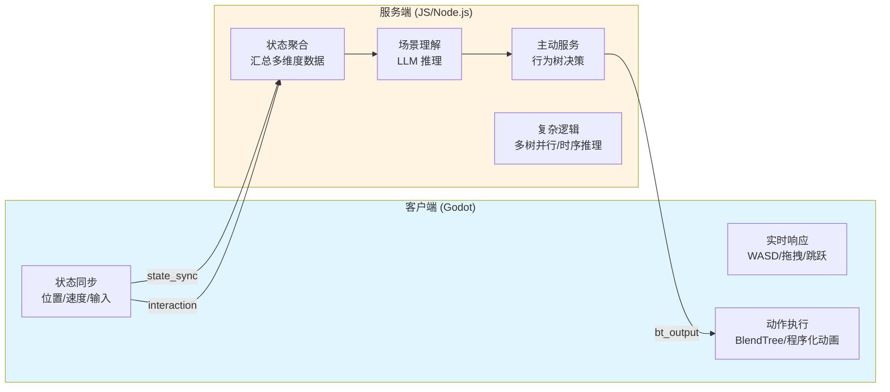
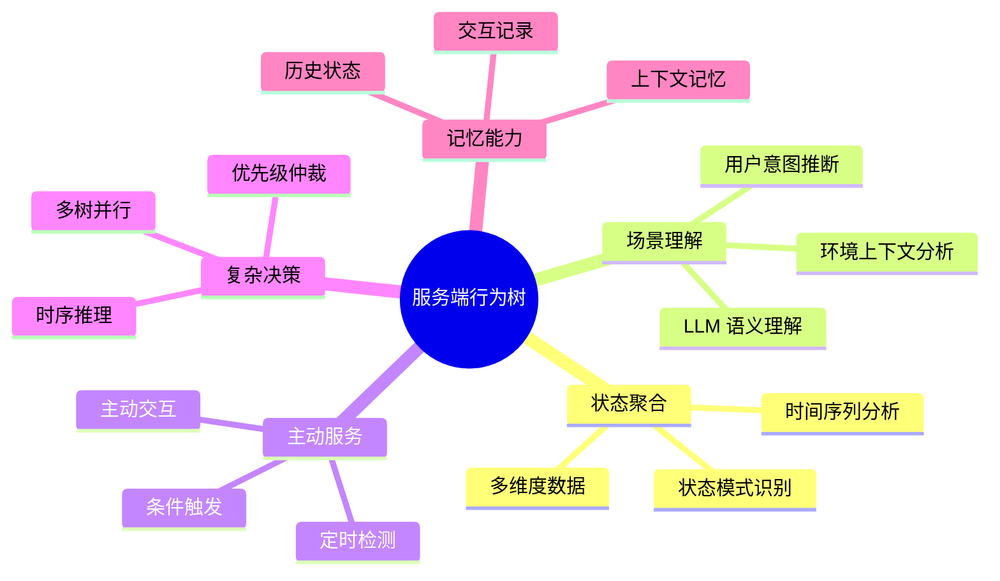
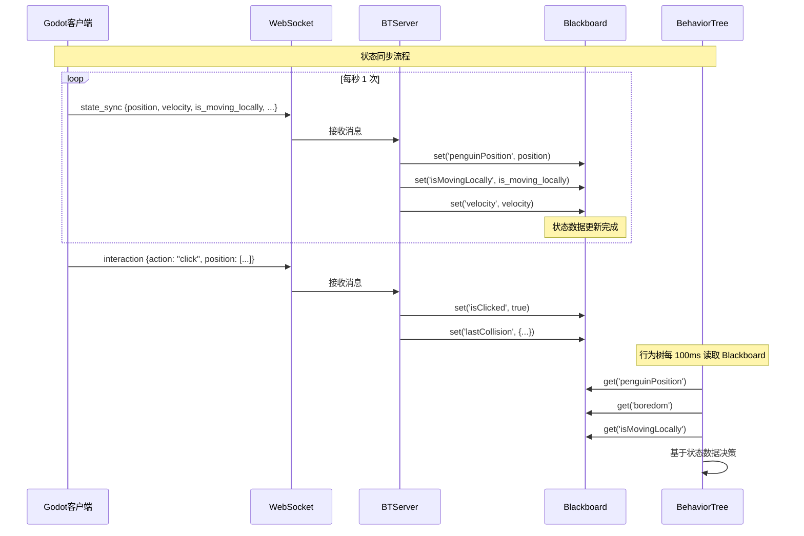
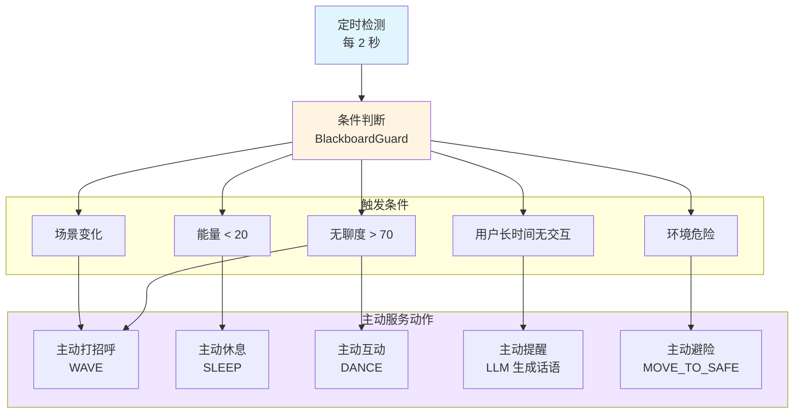
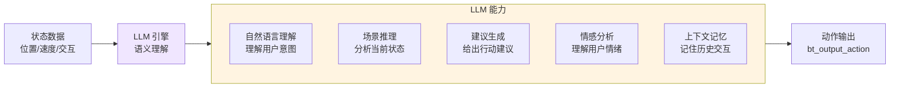
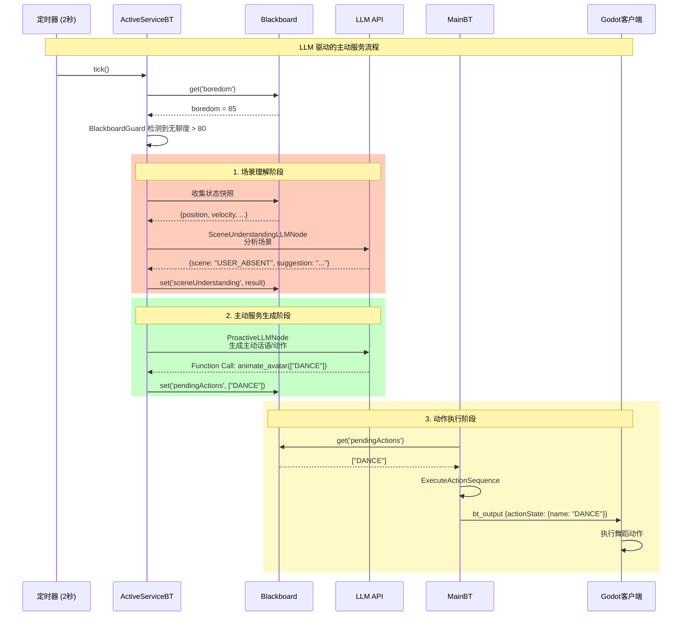

# 主动服务与场景理解指导文档

## 概述

本文档说明如何利用**服务端行为树**和**大语言模型 (LLM)** 实现**主动服务**和**场景理解**功能。通过客户端实时同步的状态数据，服务端可以进行更复杂的推理和决策，提供更智能的交互体验。

---

## 一、架构优势：为什么服务端能做更多？

### 1.1 服务端 vs 客户端的职责划分



**服务端的核心优势**：

| 维度 | 客户端 | 服务端 |
|:-----|:------|:-------|
| **响应速度** | ⚡ 零延迟（本地闭环） | 🐌 有网络延迟 |
| **计算能力** | 💻 受限于设备性能 | ☁️ 服务器级计算能力 |
| **AI 能力** | ❌ 无 LLM 支持 | ✅ 完整 LLM 集成 |
| **状态聚合** | 📊 单一客户端视角 | 🌐 全局视角（多客户端） |
| **复杂逻辑** | ⚠️ 简单状态机/BlendTree | ✅ 复杂行为树/多树并行 |
| **场景理解** | ❌ 无法理解语义 | ✅ LLM 语义理解 |
| **主动决策** | ❌ 被动响应 | ✅ 主动触发 |

### 1.2 服务端行为树的核心能力



---

## 二、客户端同步的状态数据

### 2.1 状态数据分类

客户端通过 `state_sync` 和 `interaction` 消息向服务端同步数据，这些数据存储在 **Blackboard** 中，供行为树使用。

#### 2.1.1 物理状态数据（传感器数据）

| 键名 | 类型 | 更新频率 | 说明 |
|:-----|:----|:--------|:-----|
| `penguinPosition` | `Array[3]` | 每秒 1 次 | 角色的 3D 坐标 `[x, y, z]` |
| `velocity` | `Array[3]` | 每秒 1 次 | 当前速度向量 `[vx, vy, vz]` |
| `isOnFloor` | `Boolean` | 每秒 1 次 | 是否在地面上 |
| `isMovingLocally` | `Boolean` | 实时（状态变化时） | 是否正在由 WASD 手动控制 |
| `isJumpPressed` | `Boolean` | 实时（状态变化时） | 是否按下跳跃键 |
| `isDragging` | `Boolean` | 按需（drag_start/drag_end） | 是否处于被拖拽状态 |
| `lastCollision` | `Object` | 碰撞时上报 | 碰撞信息（位置、法线、时间戳） |

#### 2.1.2 交互事件数据

| 键名 | 类型 | 更新频率 | 说明 |
|:-----|:----|:--------|:-----|
| `isClicked` | `Boolean` | 点击时（500ms 后自动清除） | 是否被点击 |
| `lastUserInput` | `String` | 用户输入时 | 用户输入的文本指令 |
| `hasNewInput` | `Boolean` | 用户输入时（true） | 是否有新的用户输入 |

#### 2.1.3 内部状态数据（服务端计算）

| 键名 | 类型 | 更新频率 | 说明 |
|:-----|:----|:--------|:-----|
| `energy` | `Number` | 每 2 秒 | 能量值（0-100） |
| `boredom` | `Number` | 每 2 秒 | 无聊度（0-100） |
| `lastStateTick` | `Number` | 每帧 | 上次状态更新的时间戳 |

### 2.2 数据同步流程



---

## 三、场景理解的实现方式

### 3.1 什么是场景理解？

**场景理解**是指服务端通过分析客户端同步的状态数据，理解当前的环境和用户意图，从而做出更智能的决策。

#### 场景理解的层次

```mermaid
graph TD
    Raw[原始状态数据<br/>position, velocity, ...]
    
    subgraph L1["第一层：状态聚合"]
        S1[物理状态<br/>位置/速度/输入]
        S2[时间序列<br/>运动轨迹/停留时间]
        S3[模式识别<br/>移动模式/交互频率]
    end
    
    subgraph L2["第二层：场景推理"]
        R1[环境理解<br/>用户是否在操作<br/>是否静止/移动]
        R2[意图推断<br/>用户想要什么<br/>当前状态如何]
        R3[上下文分析<br/>历史交互记录<br/>当前场景状态]
    end
    
    subgraph L3["第三层：LLM 语义理解"]
        LLM1[自然语言理解<br/>"用户可能在做什么"]
        LLM2[情感分析<br/>"用户可能的心情"]
        LLM3[建议生成<br/>"应该做什么来提升体验"]
    end
    
    Raw --> L1
    L1 --> L2
    L2 --> L3
    L3 --> Decision[决策输出<br/>动作序列/主动服务]
    
    style L1 fill:#e1f5ff
    style L2 fill:#fff4e1
    style L3 fill:#f0e6ff
```

### 3.2 场景理解的实现方式

#### 方式 1：基于规则的场景判断（当前实现）

**适用场景**：简单、确定性的场景判断

**实现示例**：
```typescript
// 场景判断节点示例
export class SceneUnderstandingNode extends Action {
  tick(tick: Tick): number {
    const blackboard = tick.blackboard;
    
    // 1. 获取状态数据
    const position = blackboard.get('penguinPosition');
    const isMovingLocally = blackboard.get('isMovingLocally');
    const lastInteractionTime = blackboard.get('lastInteractionTime') || 0;
    const timeSinceLastInteraction = Date.now() - lastInteractionTime;
    
    // 2. 场景判断
    let scene = 'IDLE';
    if (isMovingLocally) {
      scene = 'USER_CONTROLLING';
    } else if (timeSinceLastInteraction > 60000) {
      scene = 'USER_ABSENT';
    } else if (position[0] > 8 || position[0] < -8) {
      scene = 'NEAR_EDGE';
    }
    
    // 3. 写入场景状态
    blackboard.set('currentScene', scene);
    return SUCCESS;
  }
}
```

#### 方式 2：基于 LLM 的场景理解（推荐）

**适用场景**：复杂、需要语义理解的场景

**实现示例**：
```typescript
// LLM 场景理解节点
export class LLMSceneUnderstandingNode extends AsyncAction {
  async performAsync(tick: Tick): Promise<number> {
    const blackboard = tick.blackboard;
    
    // 1. 收集状态快照
    const stateSnapshot = {
      position: blackboard.get('penguinPosition'),
      velocity: blackboard.get('velocity'),
      isMovingLocally: blackboard.get('isMovingLocally'),
      isDragging: blackboard.get('isDragging'),
      lastInteractionTime: blackboard.get('lastInteractionTime'),
      energy: blackboard.get('energy'),
      boredom: blackboard.get('boredom'),
      timestamp: Date.now()
    };
    
    // 2. 构建 LLM Prompt
    const prompt = `
[ENVIRONMENT STATE]
Position: [${stateSnapshot.position.join(', ')}]
Velocity: [${stateSnapshot.velocity?.join(', ') || '0, 0, 0'}]
User Controlling: ${stateSnapshot.isMovingLocally ? 'Yes' : 'No'}
Being Dragged: ${stateSnapshot.isDragging ? 'Yes' : 'No'}
Time Since Last Interaction: ${(Date.now() - (stateSnapshot.lastInteractionTime || 0)) / 1000}s
Energy: ${stateSnapshot.energy}/100
Boredom: ${stateSnapshot.boredom}/100

[INSTRUCTION]
Analyze the current scene and user state. What is the user likely doing?
What should the character do to improve the user experience?

Return a JSON object with:
- scene: (IDLE | USER_CONTROLLING | USER_ABSENT | USER_INTERACTING | EDGE_DANGER)
- user_intent: (what the user might want)
- suggestion: (what the character should do)
- confidence: (0-1)
    `.trim();
    
    // 3. 调用 LLM
    const response = await sendMessageToLLM([], prompt, blackboard.get('llmSettings'));
    
    // 4. 解析结果并写入 Blackboard
    try {
      const result = JSON.parse(response);
      blackboard.set('sceneUnderstanding', result);
      blackboard.set('currentScene', result.scene);
      return SUCCESS;
    } catch (e) {
      console.error('Failed to parse LLM response', e);
      return FAILURE;
    }
  }
}
```

### 3.3 场景理解的应用场景

#### 场景 1：用户行为识别

**目标**：识别用户当前的行为模式

**实现思路**：
```typescript
// 通过分析位置变化模式识别用户行为
const analyzeUserBehavior = (positions: Array<[number, number, number]>, timeWindow: number) => {
  // 计算运动轨迹
  const distances = [];
  for (let i = 1; i < positions.length; i++) {
    const dist = Math.sqrt(
      Math.pow(positions[i][0] - positions[i-1][0], 2) +
      Math.pow(positions[i][2] - positions[i-1][2], 2)
    );
    distances.push(dist);
  }
  
  const avgSpeed = distances.reduce((a, b) => a + b, 0) / distances.length;
  const maxSpeed = Math.max(...distances);
  
  // 行为识别
  if (avgSpeed < 0.1) return 'STATIONARY';
  if (maxSpeed > 5) return 'FAST_MOVING';
  if (avgSpeed > 2) return 'MOVING';
  return 'SLOW_MOVING';
};
```

#### 场景 2：环境危险检测

**目标**：检测角色是否处于危险环境（如边缘、碰撞区域）

**实现思路**：
```typescript
// 边界检测节点
export class EdgeDetectionNode extends Action {
  tick(tick: Tick): number {
    const blackboard = tick.blackboard;
    const position = blackboard.get('penguinPosition');
    
    if (!position) return FAILURE;
    
    const [x, y, z] = position;
    const safeRadius = 8;
    
    // 检测是否接近边缘
    const distanceFromCenter = Math.sqrt(x * x + z * z);
    if (distanceFromCenter > safeRadius) {
      blackboard.set('isNearEdge', true);
      blackboard.set('edgeDistance', distanceFromCenter - safeRadius);
      return SUCCESS;
    }
    
    blackboard.set('isNearEdge', false);
    return FAILURE;
  }
}
```

#### 场景 3：用户情绪推断

**目标**：通过交互模式推断用户情绪

**实现思路**（结合 LLM）：
```typescript
// 用户情绪分析节点
export class UserEmotionAnalysisNode extends AsyncAction {
  async performAsync(tick: Tick): Promise<number> {
    const blackboard = tick.blackboard;
    
    // 收集交互数据
    const interactionHistory = blackboard.get('interactionHistory') || [];
    const recentInteractions = interactionHistory.slice(-10);
    
    const prompt = `
[INTERACTION HISTORY]
${recentInteractions.map((i: any) => 
  `${i.type} at ${new Date(i.timestamp).toLocaleTimeString()}: ${i.details}`
).join('\n')}

[INSTRUCTION]
Based on the interaction pattern, infer the user's current emotion:
- Are they playful? (frequent interactions, dragging, clicking)
- Are they focused? (few interactions, maybe working)
- Are they bored? (no interactions for a long time)
- Are they frustrated? (rapid clicking, aggressive movements)

Return JSON: {emotion: "PLAYFUL" | "FOCUSED" | "BORED" | "FRUSTRATED" | "NEUTRAL", confidence: 0-1}
    `.trim();
    
    const response = await sendMessageToLLM([], prompt, blackboard.get('llmSettings'));
    const result = JSON.parse(response);
    
    blackboard.set('userEmotion', result);
    return SUCCESS;
  }
}
```

---

## 四、主动服务的实现方式

### 4.1 什么是主动服务？

**主动服务**是指服务端行为树在没有用户直接指令的情况下，主动检测状态变化，并触发相应的服务行为。

#### 主动服务的触发机制



### 4.2 主动服务的实现架构

#### 架构 1：独立的主动服务树（当前实现）

**适用场景**：简单、低频的主动服务

**实现示例**：
```typescript
// ActiveServiceBT.ts
export function createActiveServiceBT(): BehaviorTree {
  const tree = new BehaviorTree();
  tree.title = 'Active Service Tree';
  
  tree.root = new BlackboardGuard({
    title: 'Feel Lonely?',
    key: 'boredom',
    value: 70,
    scope: 'global',
    child: new BlackboardGuard({
      title: 'Not Sleeping?',
      key: 'energy',
      value: (val: any) => val > 30,
      scope: 'global',
      child: new MemSequence({
        title: 'Physical Idle Variety',
        children: [
          new PushPendingAction({ action: 'WAVE', title: 'Queue Greet' }),
          new Wait({ milliseconds: 10000 }),
          new PushPendingAction({ action: 'DANCE', title: 'Queue Dance' }),
          new Wait({ milliseconds: 15000 })
        ]
      })
    })
  });
  
  return tree;
}
```

**执行频率**：每 2 秒执行一次（低频）

**优点**：
- ✅ 简单直接
- ✅ 资源占用低
- ✅ 易于理解和维护

**缺点**：
- ⚠️ 功能相对简单
- ⚠️ 无法进行复杂的场景理解

#### 架构 2：结合 LLM 的主动服务（推荐）

**适用场景**：需要语义理解和智能决策的主动服务

**实现示例**：
```typescript
// EnhancedActiveServiceBT.ts
export function createEnhancedActiveServiceBT(): BehaviorTree {
  const tree = new BehaviorTree();
  tree.title = 'Enhanced Active Service Tree';
  
  tree.root = new Priority({
    title: 'Active Service Priority',
    children: [
      // 1. 极度无聊时，使用 LLM 生成主动话语
      new BlackboardGuard({
        title: 'Very Bored?',
        key: 'boredom',
        value: 80,
        scope: 'global',
        child: new MemSequence({
          children: [
            new ProactiveLLMNode({ title: 'Generate Proactive Message' }),
            new FunctionExecNode({ title: 'Execute LLM Actions' }),
            new Wait({ milliseconds: 20000 })
          ]
        })
      }),
      
      // 2. 中度无聊时，执行预设动作序列
      new BlackboardGuard({
        title: 'Moderately Bored?',
        key: 'boredom',
        value: 70,
        scope: 'global',
        child: new MemSequence({
          children: [
            new PushPendingAction({ action: 'WAVE', title: 'Queue Greet' }),
            new Wait({ milliseconds: 10000 }),
            new PushPendingAction({ action: 'DANCE', title: 'Queue Dance' }),
            new Wait({ milliseconds: 15000 })
          ]
        })
      }),
      
      // 3. 场景理解驱动的主动服务
      new BlackboardGuard({
        title: 'Scene Understanding Active Service',
        key: 'currentScene',
        value: 'USER_ABSENT',
        scope: 'global',
        child: new MemSequence({
          children: [
            new LLMSceneUnderstandingNode({ title: 'Understand Scene' }),
            new ProactiveLLMNode({ title: 'Generate Contextual Response' }),
            new FunctionExecNode({ title: 'Execute Actions' })
          ]
        })
      })
    ]
  });
  
  return tree;
}
```

**执行频率**：每 2-5 秒执行一次（可配置）

**优点**：
- ✅ 智能决策
- ✅ 语义理解
- ✅ 上下文感知

**缺点**：
- ⚠️ 需要 LLM 调用，有延迟
- ⚠️ 成本较高

### 4.3 主动服务的典型场景

#### 场景 1：无聊度驱动的主动互动

**触发条件**：`boredom > 70` 且 `energy > 30`

**实现代码**：
```typescript
// 已经在 ActiveServiceBT 中实现
new BlackboardGuard({
  key: 'boredom',
  value: 70,
  child: new MemSequence({
    children: [
      new PushPendingAction({ action: 'WAVE' }),
      new Wait({ milliseconds: 10000 }),
      new PushPendingAction({ action: 'DANCE' })
    ]
  })
})
```

#### 场景 2：能量驱动的主动休息

**触发条件**：`energy < 20`

**实现代码**：
```typescript
// 已经在 RobotBT 中实现
new BlackboardGuard({
  key: 'energy',
  value: 20,
  child: new MemSequence({
    children: [
      new MoveToTargetAction({ targetPos: [4, 0.1, -3], speed: 0.1 }),
      new PlayAnimationAction({ action: 'SLEEP', duration: 10 }),
      new PlayAnimationAction({ action: 'SURPRISE', duration: 1 }),
      new MoveToTargetAction({ targetPos: [0, -1, 0], speed: 0.1 })
    ]
  })
})
```

#### 场景 3：用户长时间无交互时的主动提醒

**触发条件**：`lastInteractionTime > 60秒` 且 `boredom > 50`

**实现代码**：
```typescript
// 新增节点
export class LongIdleDetectionNode extends Action {
  tick(tick: Tick): number {
    const blackboard = tick.blackboard;
    const lastInteractionTime = blackboard.get('lastInteractionTime') || 0;
    const timeSinceLastInteraction = Date.now() - lastInteractionTime;
    const boredom = blackboard.get('boredom') || 0;
    
    if (timeSinceLastInteraction > 60000 && boredom > 50) {
      blackboard.set('isLongIdle', true);
      return SUCCESS;
    }
    
    blackboard.set('isLongIdle', false);
    return FAILURE;
  }
}

// 在行为树中使用
new BlackboardGuard({
  key: 'isLongIdle',
  value: true,
  child: new MemSequence({
    children: [
      new ProactiveLLMNode({ title: 'Generate Reminder' }),
      new FunctionExecNode({ title: 'Execute Actions' })
    ]
  })
})
```

#### 场景 4：环境危险时的主动避险

**触发条件**：`isNearEdge === true`

**实现代码**：
```typescript
// 在 RobotBT 中已有实现
new BlackboardGuard({
  key: (bb: any) => {
    const pos = bb.get('penguinPosition');
    return pos && (Math.abs(pos[0]) > 8 || Math.abs(pos[2]) > 8);
  },
  child: new MemSequence({
    children: [
      new PushPendingAction({ actions: ['SURPRISE'], emotion: 'LOVING' }),
      new MoveToTargetAction({ targetPos: [0, -1, 0], speed: 0.1 })
    ]
  })
})
```

---

## 五、结合 LLM 的高级功能

### 5.1 LLM 在场景理解和主动服务中的作用

#### LLM 的核心价值



### 5.2 LLM 节点类型

#### 节点 1：ProactiveLLMNode（主动 LLM 节点）

**用途**：基于内部状态主动调用 LLM，生成话语或动作

**实现代码**（已实现）：
```typescript
// ProactiveLLMNode.ts
export default class ProactiveLLMNode extends AsyncAction {
  async performAsync(tick: Tick): Promise<number> {
    const blackboard = tick.blackboard;
    const boredom = blackboard?.get('boredom') || 0;
    const energy = blackboard?.get('energy') || 100;
    
    const prompt = `
[INTERNAL STATE]
Boredom: ${boredom}/100
Energy: ${energy}/100

[INSTRUCTION]
You are feeling ${boredom > 70 ? 'lonely and bored' : 'active'}. 
Proactively say something cute to the user or perform an action.
    `.trim();
    
    const response = await sendMessageToLLM([], prompt, blackboard.get('llmSettings'));
    blackboard?.set('lastLLMResult', response);
    blackboard?.set('boredom', 0); // 重置无聊度
    
    return SUCCESS;
  }
}
```

#### 节点 2：LLMCallNode（LLM 调用节点）

**用途**：处理用户输入，调用 LLM 理解意图

**实现代码**（已实现）：
```typescript
// LLMCallNode.ts
export default class LLMCallNode extends AsyncAction {
  async performAsync(tick: Tick): Promise<number> {
    const blackboard = tick.blackboard;
    const userInput = blackboard?.get('lastUserInput');
    const chatHistory = blackboard?.get('chatHistory') || [];
    
    if (!userInput) return FAILURE;
    
    const response = await sendMessageToLLM(chatHistory, userInput, blackboard.get('llmSettings'));
    blackboard?.set('lastLLMResult', response);
    blackboard?.set('hasNewInput', false);
    
    return SUCCESS;
  }
}
```

#### 节点 3：SceneUnderstandingLLMNode（场景理解 LLM 节点）

**用途**：使用 LLM 进行场景理解（新增示例）

**实现代码**：
```typescript
// SceneUnderstandingLLMNode.ts
export default class SceneUnderstandingLLMNode extends AsyncAction {
  async performAsync(tick: Tick): Promise<number> {
    const blackboard = tick.blackboard;
    
    // 收集状态快照
    const snapshot = {
      position: blackboard.get('penguinPosition'),
      velocity: blackboard.get('velocity'),
      isMovingLocally: blackboard.get('isMovingLocally'),
      isDragging: blackboard.get('isDragging'),
      lastInteractionTime: blackboard.get('lastInteractionTime'),
      energy: blackboard.get('energy'),
      boredom: blackboard.get('boredom'),
      interactionHistory: blackboard.get('interactionHistory')?.slice(-5) || []
    };
    
    const prompt = `
[ENVIRONMENT STATE]
Position: [${snapshot.position?.join(', ') || '0, 0, 0'}]
User Controlling: ${snapshot.isMovingLocally ? 'Yes' : 'No'}
Time Since Last Interaction: ${(Date.now() - (snapshot.lastInteractionTime || 0)) / 1000}s
Energy: ${snapshot.energy}/100
Boredom: ${snapshot.boredom}/100

[INTERACTION HISTORY]
${snapshot.interactionHistory.map((i: any) => 
  `- ${i.type} at ${new Date(i.timestamp).toLocaleTimeString()}`
).join('\n')}

[INSTRUCTION]
Analyze the current scene:
1. What is the user likely doing?
2. What is the character's emotional state?
3. What should the character do to improve the experience?

Return JSON: {
  scene: "IDLE" | "USER_CONTROLLING" | "USER_ABSENT" | "USER_INTERACTING",
  user_intent: "string",
  character_emotion: "HAPPY" | "BORED" | "ENERGETIC" | "TIRED",
  suggestion: "string",
  recommended_action: "WAVE" | "DANCE" | "IDLE" | "SLEEP" | null
}
    `.trim();
    
    try {
      const response = await sendMessageToLLM([], prompt, blackboard.get('llmSettings'));
      const result = JSON.parse(response);
      
      blackboard.set('sceneUnderstanding', result);
      blackboard.set('currentScene', result.scene);
      blackboard.set('recommendedAction', result.recommended_action);
      
      return SUCCESS;
    } catch (e) {
      console.error('Scene understanding failed', e);
      return FAILURE;
    }
  }
}
```

### 5.3 LLM 驱动的主动服务流程



---

## 六、实现指导：从零开始构建主动服务

### 6.1 步骤 1：定义状态数据需求

**问题**：你需要哪些状态数据来触发主动服务？

**示例**：
```typescript
// 在 BTServer.ts 中处理 state_sync 时，收集需要的状态
case 'state_sync':
    // 基础状态
    client.blackboard.set('penguinPosition', data.data.position);
    client.blackboard.set('isMovingLocally', data.data.is_moving_locally || false);
    
    // 计算派生状态（用于主动服务）
    const lastInteractionTime = client.blackboard.get('lastInteractionTime') || Date.now();
    const timeSinceLastInteraction = Date.now() - lastInteractionTime;
    client.blackboard.set('timeSinceLastInteraction', timeSinceLastInteraction);
    
    // 更新交互历史（用于场景理解）
    const interactionHistory = client.blackboard.get('interactionHistory') || [];
    interactionHistory.push({
      type: 'state_sync',
      timestamp: Date.now(),
      data: data.data
    });
    // 只保留最近 50 条记录
    if (interactionHistory.length > 50) {
      interactionHistory.shift();
    }
    client.blackboard.set('interactionHistory', interactionHistory);
    break;
```

### 6.2 步骤 2：创建场景理解节点

**问题**：如何判断当前场景？

**实现示例**：
```typescript
// actions/SceneUnderstandingNode.ts
export default class SceneUnderstandingNode extends Action {
  tick(tick: Tick): number {
    const blackboard = tick.blackboard;
    
    // 1. 收集状态
    const isMovingLocally = blackboard.get('isMovingLocally');
    const isDragging = blackboard.get('isDragging');
    const timeSinceLastInteraction = blackboard.get('timeSinceLastInteraction') || 0;
    const position = blackboard.get('penguinPosition');
    
    // 2. 场景判断
    let scene = 'IDLE';
    if (isDragging) {
      scene = 'USER_DRAGGING';
    } else if (isMovingLocally) {
      scene = 'USER_CONTROLLING';
    } else if (timeSinceLastInteraction > 60000) {
      scene = 'USER_ABSENT';
    } else if (position && (Math.abs(position[0]) > 8 || Math.abs(position[2]) > 8)) {
      scene = 'NEAR_EDGE';
    }
    
    // 3. 写入场景状态
    blackboard.set('currentScene', scene);
    return SUCCESS;
  }
}
```

### 6.3 步骤 3：创建主动服务行为树

**问题**：如何组织主动服务的逻辑？

**实现示例**：
```typescript
// trees/ActiveServiceBT.ts
export function createActiveServiceBT(): BehaviorTree {
  const tree = new BehaviorTree();
  tree.title = 'Active Service Tree';
  
  tree.root = new Priority({
    title: 'Active Service Priority',
    children: [
      // 场景 1：用户长时间无交互
      new BlackboardGuard({
        title: 'User Absent?',
        key: 'currentScene',
        value: 'USER_ABSENT',
        scope: 'global',
        child: new MemSequence({
          children: [
            new ProactiveLLMNode({ title: 'Generate Reminder' }),
            new FunctionExecNode({ title: 'Execute Actions' }),
            new Wait({ milliseconds: 30000 })
          ]
        })
      }),
      
      // 场景 2：无聊度高
      new BlackboardGuard({
        title: 'Very Bored?',
        key: 'boredom',
        value: 80,
        scope: 'global',
        child: new MemSequence({
          children: [
            new PushPendingAction({ action: 'WAVE', title: 'Queue Greet' }),
            new Wait({ milliseconds: 2000 }),
            new PushPendingAction({ action: 'DANCE', title: 'Queue Dance' }),
            new Wait({ milliseconds: 20000 })
          ]
        })
      }),
      
      // 场景 3：接近边缘
      new BlackboardGuard({
        title: 'Near Edge?',
        key: 'currentScene',
        value: 'NEAR_EDGE',
        scope: 'global',
        child: new MemSequence({
          children: [
            new PushPendingAction({ actions: ['SURPRISE'], emotion: 'SURPRISED' }),
            new MoveToTargetAction({ targetPos: [0, -1, 0], speed: 0.1 }),
            new Wait({ milliseconds: 5000 })
          ]
        })
      })
    ]
  });
  
  return tree;
}
```

### 6.4 步骤 4：在主循环中注册行为树

**问题**：如何让主动服务树运行起来？

**实现示例**：
```typescript
// BTServer.ts
private startMainLoop() {
  // 主行为树：每 100ms 执行
  setInterval(() => {
    this.clients.forEach(client => {
      if (client.mainBT) {
        client.mainBT.tick(null, client.blackboard);
        this.sendBTOutputs(client.ws, client);
      }
    });
  }, 100);
  
  // 主动服务树：每 2 秒执行（低频）
  setInterval(() => {
    this.clients.forEach(client => {
      if (client.activeServiceBT) {
        client.activeServiceBT.tick(null, client.blackboard);
        // 主动服务树产生的动作会通过 pendingActions 传递给 MainBT
        this.sendBTOutputs(client.ws, client);
      }
    });
  }, 2000);
}
```

### 6.5 步骤 5：测试和调试

**问题**：如何测试主动服务是否正常工作？

**测试方法**：
1. **设置测试状态**：
   ```typescript
   // 在测试中手动设置状态
   blackboard.set('boredom', 85);
   blackboard.set('currentScene', 'USER_ABSENT');
   ```

2. **观察行为树执行**：
   - 查看控制台日志
   - 使用可视化工具（如 RobotApp）观察行为树状态

3. **验证输出**：
   - 检查 `bt_output_action` 是否正确设置
   - 检查客户端是否正确接收和执行

---

## 七、最佳实践和注意事项

### 7.1 性能优化

#### 1. LLM 调用频率控制

**问题**：LLM 调用成本高，如何控制频率？

**解决方案**：
```typescript
// 在 ProactiveLLMNode 中添加冷却时间
export default class ProactiveLLMNode extends AsyncAction {
  private lastCallTime: number = 0;
  private cooldown: number = 30000; // 30 秒冷却
  
  async performAsync(tick: Tick): Promise<number> {
    const now = Date.now();
    if (now - this.lastCallTime < this.cooldown) {
      return FAILURE; // 冷却中，不执行
    }
    
    // ... LLM 调用逻辑 ...
    
    this.lastCallTime = now;
    return SUCCESS;
  }
}
```

#### 2. 状态缓存和去重

**问题**：相同状态重复触发主动服务？

**解决方案**：
```typescript
// 在行为树节点中添加状态去重
export class BoredomTriggerNode extends Action {
  private lastBoredomValue: number = 0;
  
  tick(tick: Tick): number {
    const boredom = tick.blackboard.get('boredom');
    
    // 只在无聊度变化超过阈值时触发
    if (Math.abs(boredom - this.lastBoredomValue) < 10) {
      return FAILURE;
    }
    
    this.lastBoredomValue = boredom;
    return SUCCESS;
  }
}
```

### 7.2 用户体验优化

#### 1. 避免过于频繁的主动服务

**原则**：主动服务应该是**补充性的**，而不是**干扰性的**

**实现**：
- 设置合理的触发阈值（如无聊度 > 70 而不是 > 50）
- 使用冷却时间（如每次主动服务后等待 20 秒）
- 检查用户是否正在交互（如果 `isMovingLocally === true`，不触发）

#### 2. 渐进式响应

**原则**：根据状态严重程度，提供不同强度的响应

**实现**：
```typescript
// 渐进式响应示例
new Priority({
  children: [
    // 极度无聊（> 90）：使用 LLM 生成个性化话语
    new BlackboardGuard({
      key: 'boredom',
      value: 90,
      child: new ProactiveLLMNode()
    }),
    
    // 中度无聊（> 70）：执行预设动作
    new BlackboardGuard({
      key: 'boredom',
      value: 70,
      child: new PushPendingAction({ action: 'WAVE' })
    }),
    
    // 轻微无聊（> 50）：仅轻微动作
    new BlackboardGuard({
      key: 'boredom',
      value: 50,
      child: new PushPendingAction({ action: 'IDLE' })
    })
  ]
})
```

### 7.3 错误处理和降级

#### 1. LLM 调用失败处理

**问题**：LLM 调用失败时如何降级？

**解决方案**：
```typescript
// 在 ProactiveLLMNode 中添加降级逻辑
async performAsync(tick: Tick): Promise<number> {
  try {
    const response = await sendMessageToLLM([], prompt, settings);
    // ... 处理响应 ...
    return SUCCESS;
  } catch (error) {
    console.error('LLM call failed, using fallback', error);
    
    // 降级：使用预设动作
    const fallbackAction = this.getFallbackAction(tick);
    tick.blackboard.set('pendingActions', [fallbackAction]);
    return SUCCESS; // 仍然返回成功，使用降级方案
  }
}

private getFallbackAction(tick: Tick): string {
  const boredom = tick.blackboard.get('boredom');
  if (boredom > 80) return 'WAVE';
  if (boredom > 60) return 'DANCE';
  return 'IDLE';
}
```

#### 2. 状态数据缺失处理

**问题**：客户端状态数据缺失时如何处理？

**解决方案**：
```typescript
// 在场景理解节点中添加默认值
tick(tick: Tick): number {
  const position = blackboard.get('penguinPosition') || [0, -1, 0];
  const isMovingLocally = blackboard.get('isMovingLocally') || false;
  const boredom = blackboard.get('boredom') || 0;
  
  // 使用默认值继续执行，不因为数据缺失而失败
  // ...
}
```

---

## 八、总结

### 8.1 核心要点

1. **服务端优势**：
   - ✅ 可以访问 LLM，进行语义理解
   - ✅ 可以进行复杂的状态聚合和场景推理
   - ✅ 支持多树并行，实现复杂的决策逻辑

2. **状态数据是基础**：
   - 客户端通过 `state_sync` 和 `interaction` 同步状态
   - 服务端行为树通过 Blackboard 读取状态
   - 状态数据是场景理解和主动服务的基础

3. **场景理解层次**：
   - 第一层：状态聚合（物理状态、时间序列）
   - 第二层：场景推理（环境理解、意图推断）
   - 第三层：LLM 语义理解（自然语言理解、情感分析）

4. **主动服务实现**：
   - 使用独立的 `ActiveServiceBT`（低频执行）
   - 结合 `ProactiveLLMNode` 实现智能决策
   - 通过 `PushPendingAction` 将动作传递给 `MainBT`

### 8.2 下一步行动

1. **完善状态数据收集**：
   - 在 `BTServer.ts` 中增强 `state_sync` 处理
   - 添加交互历史记录
   - 计算派生状态（如 `timeSinceLastInteraction`）

2. **实现场景理解节点**：
   - 创建 `SceneUnderstandingNode`（基于规则）
   - 创建 `SceneUnderstandingLLMNode`（基于 LLM）
   - 在行为树中使用场景理解结果

3. **扩展主动服务树**：
   - 添加更多触发条件
   - 结合 LLM 实现智能决策
   - 实现渐进式响应

4. **测试和优化**：
   - 测试主动服务的触发频率
   - 优化 LLM 调用频率和成本
   - 收集用户反馈，调整阈值

---

## 附录：完整示例代码

### 示例 1：增强的 ActiveServiceBT

```typescript
// trees/EnhancedActiveServiceBT.ts
import BehaviorTree from '../core/BehaviorTree';
import Priority from '../composites/Priority';
import MemSequence from '../composites/MemSequence';
import BlackboardGuard from '../decorators/BlackboardGuard';
import PushPendingAction from '../actions/PushPendingAction';
import ProactiveLLMNode from '../actions/ProactiveLLMNode';
import FunctionExecNode from '../actions/FunctionExecNode';
import SceneUnderstandingLLMNode from '../actions/SceneUnderstandingLLMNode';
import Wait from '../actions/Wait';

export function createEnhancedActiveServiceBT(): BehaviorTree {
  const tree = new BehaviorTree();
  tree.title = 'Enhanced Active Service Tree';
  
  tree.root = new Priority({
    title: 'Active Service Priority',
    children: [
      // 1. 极度无聊 + LLM 场景理解
      new BlackboardGuard({
        title: 'Very Bored + Scene Understanding',
        key: 'boredom',
        value: 85,
        scope: 'global',
        child: new MemSequence({
          children: [
            new SceneUnderstandingLLMNode({ title: 'Understand Scene' }),
            new ProactiveLLMNode({ title: 'Generate Proactive Response' }),
            new FunctionExecNode({ title: 'Execute Actions' }),
            new Wait({ milliseconds: 30000 }) // 冷却时间
          ]
        })
      }),
      
      // 2. 中度无聊 + 预设动作
      new BlackboardGuard({
        title: 'Moderately Bored',
        key: 'boredom',
        value: 70,
        scope: 'global',
        child: new MemSequence({
          children: [
            new PushPendingAction({ action: 'WAVE', title: 'Queue Greet' }),
            new Wait({ milliseconds: 3000 }),
            new PushPendingAction({ action: 'DANCE', title: 'Queue Dance' }),
            new Wait({ milliseconds: 20000 })
          ]
        })
      }),
      
      // 3. 用户长时间无交互
      new BlackboardGuard({
        title: 'User Absent',
        key: 'timeSinceLastInteraction',
        value: (val: number) => val > 60000, // 60 秒
        scope: 'global',
        child: new MemSequence({
          children: [
            new ProactiveLLMNode({ title: 'Generate Reminder' }),
            new FunctionExecNode({ title: 'Execute Actions' }),
            new Wait({ milliseconds: 60000 }) // 1 分钟冷却
          ]
        })
      })
    ]
  });
  
  return tree;
}
```

### 示例 2：状态数据增强处理

```typescript
// BTServer.ts 中的 state_sync 处理
case 'state_sync':
    // 基础状态
    client.blackboard.set('penguinPosition', data.data.position);
    client.blackboard.set('isMovingLocally', data.data.is_moving_locally || false);
    client.blackboard.set('isOnFloor', data.data.is_on_floor || false);
    client.blackboard.set('isJumpPressed', data.data.is_jump_pressed || false);
    
    // 计算派生状态
    const lastInteractionTime = client.blackboard.get('lastInteractionTime') || Date.now();
    const timeSinceLastInteraction = Date.now() - lastInteractionTime;
    client.blackboard.set('timeSinceLastInteraction', timeSinceLastInteraction);
    
    // 更新交互历史
    const interactionHistory = client.blackboard.get('interactionHistory') || [];
    interactionHistory.push({
      type: 'state_sync',
      timestamp: Date.now(),
      data: {
        position: data.data.position,
        isMovingLocally: data.data.is_moving_locally
      }
    });
    // 只保留最近 50 条
    if (interactionHistory.length > 50) {
      interactionHistory.shift();
    }
    client.blackboard.set('interactionHistory', interactionHistory);
    
    // 更新最后交互时间（如果用户在操作）
    if (data.data.is_moving_locally || data.data.is_jump_pressed) {
      client.blackboard.set('lastInteractionTime', Date.now());
    }
    break;
```

---

**文档版本**：v1.0  
**最后更新**：2024年  
**维护者**：项目团队
