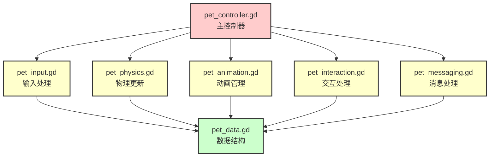

# 代码拆分说明

> **更新日期**: 2025-01  
> **说明**: 本文档说明 `pet_controller.gd` 的模块化拆分

## 拆分概述

原来的 `pet_controller.gd`（841 行）已拆分为多个功能模块，提高代码的可维护性和可扩展性。

## 拆分后的文件结构

```
scripts/
├── pet_controller.gd        (主控制器 - 协调各模块)
├── pet_data.gd              (数据结构 - 枚举和类定义)
├── pet_input.gd             (输入处理模块)
├── pet_physics.gd           (物理更新模块)
├── pet_animation.gd         (动画管理模块)
├── pet_interaction.gd       (交互处理模块)
└── pet_messaging.gd         (消息处理模块)
```

## 模块职责

### 1. pet_data.gd
**职责**: 数据结构定义
- `AnimState` 枚举（IDLE, WALK, RUN, JUMP, WAVE）
- `ProcAnimType` 枚举（NONE, WAVE, SPIN, BOUNCE, FLY, ROLL, SHAKE, FLIP, DANCE）
- `MovementData` 类（移动数据）
- `InputData` 类（输入数据）

**依赖**: 无

### 2. pet_input.gd
**职责**: 输入处理
- `get_input_data()` - 获取用户输入数据

**依赖**: `pet_data.gd` (InputData)

### 3. pet_physics.gd
**职责**: 物理计算和移动
- `calculate_movement()` - 计算移动数据
- `apply_physics()` - 应用物理
- `apply_movement()` - 应用移动
- `handle_jump()` - 处理跳跃
- `handle_collisions()` - 处理碰撞
- `handle_physics_push()` - 处理物理推力

**依赖**: `pet_data.gd` (MovementData, InputData)

**信号**:
- `movement_calculated(movement_data)`
- `jump_triggered(velocity_y)`
- `collision_detected(collision_data)`

### 4. pet_animation.gd
**职责**: 动画管理
- `set_anim_state()` - 设置动画状态
- `apply_blendtree_state()` - 应用 BlendTree 状态
- `switch_anim()` - 切换动画
- `set_procedural_anim()` - 设置程序化动画
- `apply_procedural_fx()` - 应用程序化动画效果

**依赖**: `pet_data.gd` (AnimState, ProcAnimType)

**信号**:
- `anim_state_changed(old_state, new_state)`
- `procedural_anim_changed(anim_type)`

### 5. pet_interaction.gd
**职责**: 交互处理
- `handle_input_event()` - 处理输入事件
- `handle_dragging()` - 处理拖拽
- `on_clicked()` - 点击处理
- `on_drag_finished()` - 拖拽结束处理

**依赖**: `pet_data.gd` (ProcAnimType)

**信号**:
- `interaction_sent(action, data)`
- `drag_started()`
- `drag_finished()`
- `clicked()`

### 6. pet_messaging.gd
**职责**: 消息处理
- `handle_ws_message()` - 处理 WebSocket 消息
- `apply_action_state()` - 应用动作状态
- `send_interaction()` - 发送交互消息
- `send_state_sync()` - 发送状态同步
- `update_action_state_expiry()` - 更新动作状态过期检查

**依赖**: `pet_data.gd` (间接)

**信号**:
- `action_state_applied(action_state)`
- `status_updated(status_data)`
- `move_to_received(target)`
- `position_set_received(pos)`

### 7. pet_controller.gd
**职责**: 主控制器（协调各模块）
- `_ready()` - 初始化各模块
- `_physics_process()` - 物理更新循环
- `_process()` - 每帧更新
- `_input_event()` - 输入事件处理
- 模块间的协调和数据传递

**依赖**: 所有其他模块

## 模块依赖关系



## 使用方式

### 方式 1：自动创建模块（推荐）

主控制器会在 `_ready()` 中自动创建所有模块：

```gdscript
# pet_controller.gd 会自动创建模块
# 无需手动在场景中添加
```

### 方式 2：场景中添加模块

也可以在场景中手动添加模块节点：

```
Pet (CharacterBody3D)
├── AnimationTree
├── Player (MeshInstance3D)
├── InputModule (Node) - 脚本: pet_input.gd
├── PhysicsModule (Node) - 脚本: pet_physics.gd
├── AnimationModule (Node) - 脚本: pet_animation.gd
├── InteractionModule (Node) - 脚本: pet_interaction.gd
└── MessagingModule (Node) - 脚本: pet_messaging.gd
```

## 数据流

### 输入 → 物理 → 动画

```
用户输入 (WASD)
  ↓
pet_input.get_input_data()
  ↓
pet_physics.calculate_movement()
  ↓
pet_physics.apply_physics() + apply_movement()
  ↓
move_and_slide() (物理引擎)
  ↓
pet_animation.set_anim_state()
  ↓
BlendTree 参数设置
```

### 服务端消息 → 动画

```
WebSocket 消息
  ↓
pet_messaging.handle_ws_message()
  ↓
pet_messaging.apply_action_state()
  ↓
pet_animation.switch_anim()
  ↓
BlendTree 参数 或 程序化动画
```

## 优势

1. **代码组织清晰**: 每个模块职责单一，易于理解
2. **易于维护**: 修改某个功能只需修改对应模块
3. **易于测试**: 可以单独测试每个模块
4. **易于扩展**: 添加新功能只需创建新模块或扩展现有模块
5. **并行开发**: 不同模块可以并行开发，减少冲突

## 注意事项

1. **模块初始化**: 模块会在 `_ready()` 中自动创建，无需手动添加
2. **状态同步**: 主控制器负责在各模块间同步状态变量
3. **信号连接**: 模块间通过信号通信，保持松耦合
4. **数据传递**: 使用数据结构（MovementData, InputData）传递数据

## 迁移指南

如果从旧版本迁移：

1. **无需修改场景**: 模块会自动创建
2. **无需修改其他脚本**: 接口保持不变
3. **功能完全兼容**: 所有功能正常工作

## 文件大小对比

| 文件 | 行数 | 说明 |
|:-----|:-----|:-----|
| **拆分前** | | |
| pet_controller.gd | 841 | 所有逻辑集中在一个文件 |
| **拆分后** | | |
| pet_controller.gd | ~350 | 主控制器（协调） |
| pet_data.gd | ~50 | 数据结构 |
| pet_input.gd | ~20 | 输入处理 |
| pet_physics.gd | ~150 | 物理更新 |
| pet_animation.gd | ~280 | 动画管理 |
| pet_interaction.gd | ~80 | 交互处理 |
| pet_messaging.gd | ~150 | 消息处理 |
| **总计** | ~1080 | 包含注释和空行 |

## 总结

代码拆分后，结构更清晰，维护更容易。每个模块职责明确，依赖关系简单，符合单一职责原则。

---

**文档结束**
