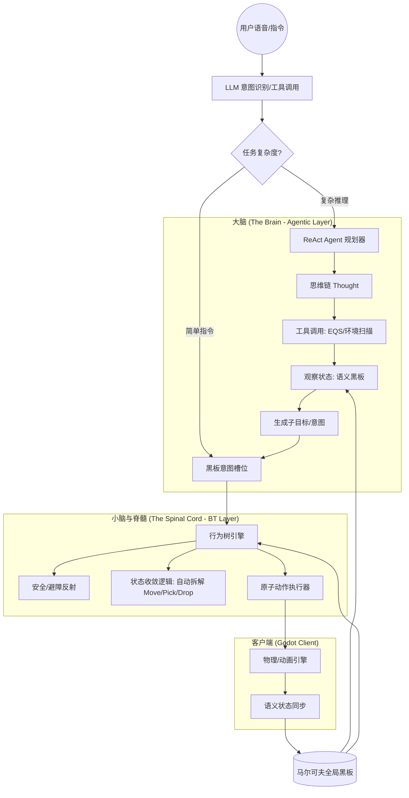

# 《具身智能代理化行为系统 (Agentic Behavior System) 架构白皮书》

## 1. 核心哲学：反射 (Reflex) vs 意识 (Consciousness)

本系统采用分层具身智能架构，模拟生物神经系统的二元性：

- **慢速环路 (意识层/大脑 - ReAct Agent)**：负责语义理解、长程规划与逻辑推理。它不直接操作物理执行器，而是通过修改“意图状态”来下达宏观指令。
- **快速环路 (反射层/小脑 - 行为树 BT)**：负责即时反馈、物理稳定与原子动作执行。它每一帧 (100ms) 都在 Tick，确保系统的马尔可夫即时性。

---

## 2. 系统架构图

---

## 3. 执行权边界：谁负责执行？

这是一个核心设计问题：**Agent 不直接控制执行，它只管理意图。**

- **Agent (策略规划者)**：
    - 调用工具（如 EQS）寻找目标。
    - 在黑板上更新 `current_intent`（例如：`{goal: "deliver", target: "bucket_01", to: "player"}`）。
    - 它的“Action”是修改数据状态，而不是发送运动指令。
- **BT (战术执行者)**：
    - 每一帧检查 `current_intent`。
    - 自动根据现状拆解动作：如果手里没东西，就触发“捡起”分支；如果离目标远，就触发“寻路”分支。
    - 这种**“趋向目标的本能收敛”**实现了动态自适应。

---

## 4. 动态拆解与自适应执行

系统不需要硬编码 `Move -> Pick -> Move -> Drop` 序列，而是通过**状态驱动的条件进入**：

1. **马尔可夫性**：每一帧 Tick 仅根据“意图 + 现状”决定动作。
2. **自愈能力**：如果在搬运过程中桶被用户抢走（现状改变），BT 会自动切回“寻找/索取”分支，而无需大脑重新规划。
3. **直觉与习惯**：BT 内部可以根据宠物风格（如“活泼”或“笨拙”）决定是用跳跃还是走路来实现位移，大脑无需关心细节。

---

## 5. 场景物体语义感知协议

要让大脑（Agent）能感知环境，需要建立语义化同步机制：

- **语义标签 (Semantic Tagging)**：场景物体挂载脚本，同步 UUID、类型（如 `water_bucket`）、标签（如 `grabbable`）和当前状态。
- **按需感知 (On-Demand Perception)**：
    - **主动**：Agent 调用 `EnvironmentScanTool`。
    - **被动**：客户端定期同步宠物半径内的语义物体快照。
- **语义黑板**：服务端维护一个 `active_objects` 字典，Agent 推理时作为 Context 输入。

---

## 6. 差距分析与路线图

### 当前状态评估
- **服务端 BT**：9.8/10 评分，基础架构稳健，但需重构为“意图驱动型”。
- **ReAct Agent**：已有初步实现，但需从 BT 节点中剥离，变成独立的异步服务。
- **原子指令**：已有移动和基础动作，缺失 `Pick/Put/Rotate` 等交互指令。

### 演进阶段
1. **阶段 1：肌肉补完**
    - 在 Godot 实现 PickUp/PutDown 动画及逻辑。
    - 统一定义原子交互动作集。
2. **阶段 2：感知觉醒**
    - 实现场景物体的语义标签与同步协议。
    - 让黑板支持 `nearby_entities` 结构。
3. **阶段 3：大脑解耦**
    - 将 ReAct Agent 独立化，建立“意图槽位 (Intention Slot)”机制。
    - 将 EQS 封装为 Agent 的函数调用工具。
4. **阶段 4：自适应进化**
    - 在 BT 层引入“执行风格”变量，实现同目标下的个性化动作表现。

---

## 7. 结论

本架构通过**“大脑管意图、小脑管收敛”**的设计，完美平衡了 AI 的逻辑推理能力与实时物理反应。基于马尔可夫性的黑板媒介确保了系统在处理复杂指令时的确定性、解耦性和极致的扩展性。
