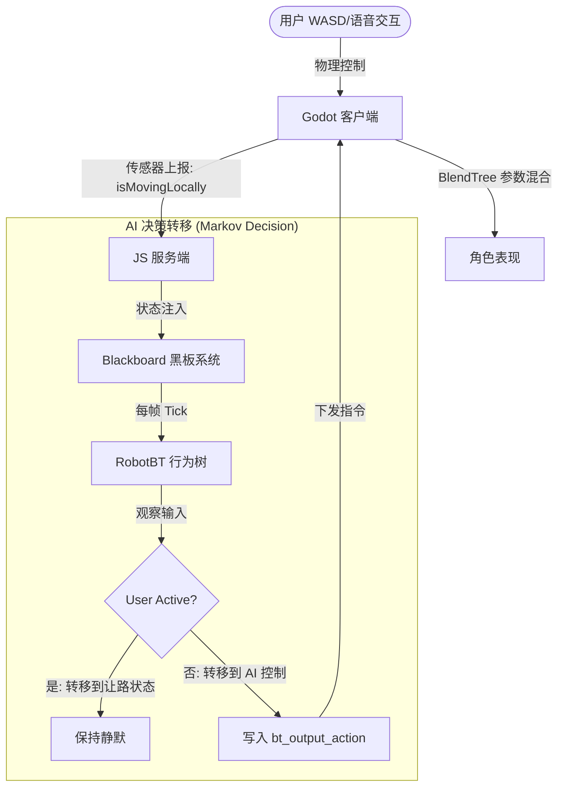

# 动作系统 (Action System) 完整文档 v1.0

## 概述

本系统实现了**状态声明式动作管理**，采用优先级仲裁机制，结合服务端行为树和客户端状态机，确保动作执行的正确性和流畅性。

## 系统架构 (马尔科夫决策版)



### 核心设计理念 (基于输入输出隔离)

1. **马尔科夫决策**：AI 每帧根据传感器（isMovingLocally, isJumpPressed）判定当前状态，并决定下一刻的意图。
2. **输入输出隔离**：客户端物理状态（Sensor）仅作为 AI 观测值；AI 仅在认为有必要干预时才通过 `bt_output_action` 写入意图（Actuator）。
3. **AI 让路机制**：通过优先级树中的 `User Control Observer` 分支，AI 在观测到用户操作时，显式地决策“不产生输出”，从而避免冲突。
4. **混合树即时响应**：客户端采用 `AnimationTree` (BlendTree)，参数变化即刻生效，实现零延迟手感。

---

## 一、服务端实现（JS/TypeScript）

### 1.1 行为树节点

#### ExecuteActionSequence（LLM指令序列执行）

**职责**：执行LLM返回的动作序列，每个动作按顺序执行

**优先级**：50（中等优先级，可被紧急事件中断）

**关键逻辑**：
```typescript
// 1. 检查动作锁定
const isLocked = blackboard.get('actionLock');
const lockPriority = blackboard.get('actionLockPriority');

// 2. 如果被高优先级锁定，等待
if (isLocked && lockPriority >= 50) {
  return RUNNING; // 等待解锁
}

// 3. 执行动作序列
for each action in pendingActions:
  // 设置锁定
  blackboard.set('actionLock', true);
  blackboard.set('actionLockToken', this.id);
  blackboard.set('actionLockPriority', 50);
  
  // 输出动作状态
  blackboard.set('bt_output_action', action);
  blackboard.set('bt_output_action_duration', duration);
  blackboard.set('bt_output_action_priority', 50);
  blackboard.set('bt_output_action_interruptible', true);
  
  // 等待动作完成
  wait(duration);
```

**动作序列来源**：
- LLM通过 `FunctionExecNode` 解析工具调用，提取动作数组
- 存储到 `blackboard.pendingActions`
- `ExecuteActionSequence` 按顺序消费

#### PlayAnimationAction（直接动作节点）

**职责**：直接播放某个动作（如IDLE、紧急反应等）

**优先级**：
- IDLE: 10（最低优先级）
- 其他动作: 30（中等优先级）
- 紧急动作: 在更高层节点处理（100+）

**关键逻辑**：
```typescript
// IDLE 特殊处理：不覆盖正在执行的动作
if (action === 'IDLE' && isLocked && lockPriority >= 10) {
  return FAILURE; // 不执行IDLE
}

// 高优先级动作可以中断低优先级
if (action !== 'IDLE' && priority > lockPriority) {
  blackboard.set('actionLock', true);
  blackboard.set('actionLockToken', this.id);
  blackboard.set('actionLockPriority', priority);
}
```

### 1.2 状态声明式协议

#### 动作状态消息格式

```typescript
interface ActionState {
  name: string;           // 动作名称，如 "FLY", "WAVE", "DANCE"
  duration: number;       // 持续时间（毫秒）
  priority: number;       // 优先级（数值越大越优先）
  interruptible: boolean; // 是否可被更高优先级中断
  timestamp: number;      // 服务端发送时间戳
}
```

#### 优先级层次

| 优先级 | 动作类型 | 说明 |
|:------:|:--------|:-----|
| 100+ | 紧急事件 | 拖拽交互、碰撞反应、边界检查 |
| 50 | LLM指令 | ExecuteActionSequence执行的动作 |
| 30 | 普通动作 | PlayAnimationAction（非IDLE） |
| 10 | IDLE | 默认闲置动作（最低优先级） |

#### BTServer发送逻辑

```typescript
// BTServer.ts - sendBTOutputs()
const actionState = {
  name: action,
  duration: actionDuration || 3000,
  priority: actionPriority || 50,
  interruptible: actionInterruptible !== false,
  timestamp: Date.now()
};

// 防止重复发送相同动作
const shouldSend = action !== client.lastSentAction || 
                   actionPriority > client.lastActionPriority;

if (shouldSend) {
  outputs.actionState = actionState;
  client.lastSentAction = action;
  client.lastActionPriority = actionPriority;
}
```

### 1.3 动作锁定机制

**锁定状态**（存储在blackboard）：
- `actionLock`: boolean - 是否被锁定
- `actionLockToken`: string - 锁定者的节点ID
- `actionLockPriority`: number - 当前锁定的优先级

**锁定规则**：
1. 高优先级动作可以获取锁定，中断低优先级动作
2. 动作完成后，自动释放锁定
3. IDLE动作不获取锁定，不中断任何动作

---

## 二、客户端实现（Godot/GDScript）

### 2.1 状态声明式动作管理

#### 状态变量

```gdscript
# pet_controller.gd

# 当前动作状态
var current_action_state: Dictionary = {}  # {name, priority, duration, start_time, interruptible}

# 动作队列（当前未使用，可扩展）
var action_queue: Array[Dictionary] = []

# 动作锁定到期时间（用于兼容性检查）
var action_lock_time: float = 0.0
```

#### 动作状态应用逻辑

```gdscript
func _apply_action_state(action_state: Dictionary) -> void:
  var action_name = action_state.get("name", "idle").to_lower()
  var priority = action_state.get("priority", 50)
  var duration_ms = action_state.get("duration", 3000)
  var interruptible = action_state.get("interruptible", true)
  
  # 检查当前动作状态
  var current_priority = current_action_state.get("priority", 0)
  var elapsed = (Time.get_unix_time_from_system() - 
                 current_action_state.get("start_time", 0.0)) * 1000.0
  var current_duration = current_action_state.get("duration", 0)
  
  # 判断是否应该中断
  var should_interrupt = false
  if current_action_state.is_empty():
    should_interrupt = true
  elif priority > current_priority:
    should_interrupt = true  # 高优先级中断
  elif interruptible and current_interruptible and priority >= current_priority:
    should_interrupt = true  # 都可中断，按优先级
  elif elapsed >= current_duration:
    should_interrupt = true  # 当前动作已完成
  
  if should_interrupt:
    # 更新动作状态
    current_action_state = {
      "name": action_name,
      "priority": priority,
      "duration": duration_ms,
      "interruptible": interruptible,
      "start_time": Time.get_unix_time_from_system(),
      "timestamp": timestamp
    }
    
    # 切换动画
    _switch_anim(action_name)
```

### 2.2 动画切换逻辑

```gdscript
func _switch_anim(anim_name: String) -> void:
  # 检查是否是程序化动画（不依赖骨骼动画）
  var proc_anims = ["wave", "spin", "bounce", "fly", "roll"]
  if anim_name in proc_anims:
    proc_anim_active = anim_name
    # 程序化动画时，保持基础姿态
    if playback: 
      playback.travel("idle")
    last_anim_state = anim_name
    return
  
  # 常规骨骼动画
  proc_anim_active = ""
  if playback and last_anim_state != anim_name:
    playback.travel(anim_name)
    last_anim_state = anim_name
```

### 2.3 动作状态过期检查

```gdscript
func _physics_process(delta: float) -> void:
  # 检查动作状态是否过期
  if not current_action_state.is_empty():
    var elapsed = (Time.get_unix_time_from_system() - 
                   current_action_state.get("start_time", 0.0)) * 1000.0
    var duration = current_action_state.get("duration", 3000)
    
    if elapsed >= duration:
      # 动作完成，清除状态（动画自然过渡）
      var action_name = current_action_state.get("name", "idle")
      
      # 程序化动画需要手动清除
      if action_name in ["fly", "spin", "bounce", "roll"]:
        proc_anim_active = ""
      
      current_action_state = {}
      action_lock_time = 0.0
```

### 2.4 动作类型分类

#### 骨骼动画（AnimationTree）

- `idle` - 待机
- `walk` - 行走
- `run` - 跑步
- `jump` - 跳跃

#### 程序化动画（Procedural）

- `wave` - 挥手（Z轴旋转摆动）
- `spin` - 旋转（Y轴持续旋转）
- `bounce` - 弹跳（Y轴位置上下）
- `fly` - 飞行（Y轴位置提升 + 轻微摆动）
- `roll` - 翻滚（Z轴持续旋转）

**程序化动画实现**：
```gdscript
func _apply_procedural_fx(delta: float) -> void:
  match proc_anim_active:
    "wave":
      mesh_root.rotation.z = sin(proc_time * 15.0) * 0.15
    "spin":
      proc_rot_y += delta * 20.0
      mesh_root.rotation.y = proc_rot_y
    "bounce":
      var target_pos_y = abs(sin(proc_time * 10.0)) * 0.5
      mesh_root.position.y = lerp(mesh_root.position.y, target_pos_y, 10.0 * delta)
    "fly":
      var target_pos_y = 1.0 + sin(proc_time * 3.0) * 0.2
      mesh_root.position.y = lerp(mesh_root.position.y, target_pos_y, 10.0 * delta)
    "roll":
      mesh_root.rotation.z += delta * 15.0
```

---

## 三、完整动作执行链路

### 3.1 LLM指令流程

```
用户输入 "跳个舞"
    ↓
IntentBT 触发
    ↓
LLMCallNode 调用 LLM API
    ↓
LLM 返回 Function Call: animate_avatar(["DANCE", "WAVE"])
    ↓
FunctionExecNode 解析工具调用
    ↓
blackboard.set('pendingActions', ['DANCE', 'WAVE'])
    ↓
MainBT/RobotBT 的 ExecuteActionSequence 节点执行
    ↓
【动作1: DANCE】
  - 设置锁定 (priority=50)
  - blackboard.set('bt_output_action', 'DANCE')
  - 等待 3秒
    ↓
【动作2: WAVE】
  - 设置锁定 (priority=50)
  - blackboard.set('bt_output_action', 'WAVE')
  - 等待 2秒
    ↓
序列完成，释放锁定
```

### 3.2 紧急事件流程（拖拽）

```
用户右键拖拽角色
    ↓
Godot 发送 interaction: drag_start
    ↓
BTServer 接收，设置 blackboard.set('isDragging', true)
    ↓
MainBT 的 BlackboardGuard 检测到 isDragging
    ↓
FollowPointerNode 输出位置
    ↓
BTServer 发送 move_to 消息
    ↓
Godot 客户端执行拖拽逻辑（最高优先级，直接中断所有动作）
```

### 3.3 碰撞反应流程

```
角色碰撞到障碍物
    ↓
Godot _physics_process 检测到碰撞
    ↓
发送 interaction: collision {collider_name, position, normal}
    ↓
BTServer 接收，设置 blackboard.set('lastCollision', {...})
    ↓
MainBT 的 BlackboardGuard 检测到 lastCollision (800ms内)
    ↓
PushPendingAction({actions: ['BOUNCE'], emotion: 'SURPRISED'})
    ↓
ExecuteActionSequence 执行 BOUNCE 动作
    ↓
角色播放弹跳动画
```

---

## 四、动作优先级冲突处理

### 4.1 场景示例

**场景1**：正在执行 FLY 动作（priority=50），用户右键拖拽
- 拖拽直接中断所有动作（客户端本地处理，不经过行为树）
- `isDragging=true` 时，`_physics_process` 直接return，跳过所有动作逻辑

**场景2**：正在执行 IDLE（priority=10），LLM指令来了（priority=50）
- `ExecuteActionSequence` 检查锁定，发现优先级更高
- 获取锁定，中断IDLE，执行LLM动作

**场景3**：正在执行 LLM动作（priority=50），IDLE节点尝试执行（priority=10）
- `PlayAnimationAction` 检查，发现当前优先级更高
- 返回 FAILURE，不执行IDLE

**场景4**：正在执行动作，碰撞发生
- 碰撞反应使用 `PushPendingAction` 推送到队列
- 等待当前动作完成后再执行碰撞反应

---

## 五、数据流向图

```
┌─────────────────────────────────────────────────────────────┐
│                     服务端 (JS/Node.js)                       │
├─────────────────────────────────────────────────────────────┤
│                                                               │
│  LLM API → FunctionExecNode → pendingActions (Array)         │
│                                                               │
│  ExecuteActionSequence                                       │
│    ↓                                                          │
│  actionLock, actionLockPriority, actionLockToken            │
│    ↓                                                          │
│  bt_output_action, bt_output_action_duration,               │
│  bt_output_action_priority, bt_output_action_interruptible   │
│    ↓                                                          │
│  BTServer.sendBTOutputs()                                    │
│    ↓                                                          │
│  WebSocket: bt_output {actionState: {...}}                  │
│                                                               │
└─────────────────────────────────────────────────────────────┘
                            ↓
                    WebSocket 协议
                            ↓
┌─────────────────────────────────────────────────────────────┐
│                   客户端 (Godot/GDScript)                     │
├─────────────────────────────────────────────────────────────┤
│                                                               │
│  WebSocketClient._handle_json_message()                      │
│    ↓                                                          │
│  pet_controller._on_ws_message("bt_output", data)           │
│    ↓                                                          │
│  _apply_action_state(action_state)                           │
│    ↓                                                          │
│  优先级检查 → 中断判断                                         │
│    ↓                                                          │
│  current_action_state = {...}                                │
│    ↓                                                          │
│  _switch_anim(action_name)                                   │
│    ↓                                                          │
│  AnimationTree.play() 或 程序化动画                           │
│                                                               │
└─────────────────────────────────────────────────────────────┘
```

---

## 六、关键设计决策

### 6.1 为什么使用状态声明式而非指令覆盖？

**问题**：指令覆盖模式下，每个tick都会发送最新动作，导致：
- FLY 动作刚执行，下一个tick就被IDLE覆盖
- 动作序列无法正确执行完

**解决方案**：状态声明式
- 服务端声明"期望状态"，包含持续时间
- 客户端负责维持状态直到过期
- 支持优先级仲裁，防止低优先级覆盖

### 6.2 为什么需要动作锁定？

**问题**：行为树每个tick都会执行，低优先级节点可能会覆盖正在执行的动作

**解决方案**：动作锁定机制
- 正在执行的动作获取锁定
- 低优先级节点检查锁定，如果优先级不够则不执行
- 动作完成后自动释放锁定

### 6.3 为什么客户端也要做优先级检查？

**双重保障**：
1. 服务端锁定机制：防止行为树内部冲突
2. 客户端优先级检查：防止网络延迟导致的旧消息覆盖新消息

---

## 七、扩展指南

### 7.1 添加新动作

1. **服务端**：在 `ACTION_DURATIONS` 中添加动作名称和持续时间
2. **客户端**：
   - 如果是骨骼动画：在 AnimationTree 中添加状态机节点
   - 如果是程序化动画：在 `_apply_procedural_fx` 中添加逻辑

### 7.2 调整优先级

修改以下位置的优先级常量：
- `ExecuteActionSequence.ACTION_PRIORITY = 50`
- `PlayAnimationAction` 的优先级判断（IDLE=10, 其他=30）
- 紧急事件的优先级应该在更高层节点处理（100+）

### 7.3 添加动作队列

当前动作队列未完全实现，可以扩展：
- 客户端接收到动作时，如果当前有动作在执行，加入队列
- 动作完成后，自动执行队列中的下一个动作

---

## 八、故障排查

### 问题1：动作被立即覆盖

**可能原因**：
- 动作优先级设置不正确
- 锁定机制未生效

**检查点**：
- 查看服务端日志，确认 `actionState` 是否正常发送
- 查看客户端 `current_action_state` 是否被正确设置
- 检查动作优先级是否正确

### 问题2：动作序列不完整

**可能原因**：
- `ExecuteActionSequence` 被中断
- `pendingActions` 被清空

**检查点**：
- 查看服务端行为树执行日志
- 确认 `actionLock` 是否被意外释放
- 检查是否有高优先级事件中断了序列

### 问题3：程序化动画不工作

**可能原因**：
- `proc_anim_active` 未正确设置
- `_apply_procedural_fx` 未被调用

**检查点**：
- 确认动画名称是否在 `proc_anims` 列表中
- 检查 `_process` 是否调用 `_apply_procedural_fx`

---

## 九、动作职责划分：本地闭环 vs 服务端执行

### 9.1 概述

当前行为树系统的主要职责已经从"执行和下发动作"转变为**"可视化和获取数据"**。大部分基础动作已经由 Godot 客户端本地闭环处理，服务端行为树主要负责：

1. **可视化**：在 RobotApp 中实时显示行为树执行状态
2. **数据收集**：通过 Blackboard 收集客户端状态（位置、输入、碰撞等）
3. **高级决策**：基于 LLM 的复杂动作序列和长期规划
4. **状态管理**：能量、无聊度等生存状态的计算和同步

### 9.2 动作分类详解

#### A. 本地闭环动作（Godot 自己处理，无需服务端干预）

| 动作类型 | 处理位置 | 优先级 | 说明 |
|---------|---------|--------|------|
| **WASD 移动** | `pet_controller.gd` | 本地最高 | 直接响应键盘输入，每帧更新速度 |
| **Shift 跑步** | `pet_controller.gd` | 本地最高 | 检测 Shift 键，切换移动速度 |
| **Space 跳跃** | `pet_controller.gd` | 本地最高 | 检测 Space 键，立即应用跳跃速度<br/>**注意**：会同步给服务端用于可视化 |
| **拖拽交互** | `pet_controller.gd` | 最高（中断所有） | 右键拖拽时，直接 return，跳过所有逻辑 |
| **重力处理** | `pet_controller.gd` | 物理引擎 | Godot 物理引擎自动处理 |
| **基础物理** | `pet_controller.gd` | 物理引擎 | 碰撞检测、地面检测、推力计算 |

**本地闭环的优势：**
- ✅ **零延迟**：用户输入立即响应，无需等待网络往返
- ✅ **流畅性**：60fps 的物理更新，平滑自然
- ✅ **可靠性**：即使网络断开，基础操作仍然可用

**同步机制：**
虽然这些动作是本地闭环的，但会定期（1秒）通过 `state_sync` 消息同步给服务端：
- `is_moving_locally`: WASD 移动状态
- `is_jump_pressed`: 空格键按下状态
- `position`: 当前位置
- `velocity`: 当前速度
- `is_on_floor`: 是否在地面

服务端接收后，会更新 Blackboard，并在行为树可视化中点亮相应节点（如 "Manual Control Active"、"Jump Input"）。

#### B. 服务端行为树执行的动作（需要下发指令）

| 动作类型 | 来源 | 优先级 | 说明 |
|---------|------|--------|------|
| **LLM 指令动作** | LLM Function Call | 50 | DANCE, WAVE, SPIN, FLY, ROLL 等<br/>通过 `ExecuteActionSequence` 执行 |
| **自动寻路移动** | 行为树节点 | 30 | `MoveToTargetAction` 计算目标位置<br/>下发 `move_to` 消息 |
| **碰撞反应动作** | 碰撞事件触发 | 50 | 检测到 `lastCollision` 后<br/>执行 BOUNCE 等反应动作 |
| **表情动作** | 行为树/LLM | 30 | HAPPY, SAD, SURPRISED 等<br/>（当前协议支持，但未完全实现） |
| **默认 IDLE** | 行为树默认节点 | 10 | 无其他动作时执行 |

**服务端执行的优势：**
- ✅ **统一权威**：所有客户端看到相同的行为
- ✅ **复杂逻辑**：可以执行多步骤动作序列
- ✅ **AI 决策**：结合 LLM 理解用户意图

**执行流程：**
```
服务端行为树计算 → blackboard.set('bt_output_action') → 
BTServer.sendBTOutputs() → WebSocket: bt_output {actionState} → 
Godot 客户端接收 → _apply_action_state() → 执行动画
```

#### C. 混合动作（需要本地和服务端配合）

| 动作类型 | 本地职责 | 服务端职责 | 说明 |
|---------|---------|-----------|------|
| **碰撞反应** | 检测碰撞事件 | 决策反应动作 | 本地检测后上报，服务端决定如何反应 |
| **拖拽反馈** | 执行拖拽移动 | 响应拖拽状态 | 本地立即响应，服务端可下发表情动作 |
| **跳跃同步** | 执行跳跃 | 可视化显示 | 本地执行，服务端用于行为树可视化 |

**混合模式的优势：**
- ✅ **实时响应 + 智能决策**：本地保证流畅，服务端提供智能反馈

### 9.3 当前行为树的主要职责

#### 主要职责（已弱化下发功能）

1. **可视化监控** ⭐⭐⭐⭐⭐
   - 在 RobotApp 中实时显示行为树执行状态
   - 高亮 RUNNING 节点，显示决策流程
   - 展示输入状态（WASD、Space、拖拽等）

2. **数据收集** ⭐⭐⭐⭐⭐
   - 收集客户端位置、速度、输入状态
   - 维护 Blackboard 全局状态
   - 记录碰撞、交互事件

3. **高级决策** ⭐⭐⭐⭐
   - LLM 指令解析和执行
   - 复杂动作序列编排
   - 长期规划（能量管理、情绪系统）

4. **动作下发** ⭐⭐⭐（已弱化）
   - 仅下发高级动作（DANCE、WAVE 等）
   - 不再控制基础移动（WASD、跳跃等）

### 9.4 后续规划：哪些可以内部闭环，哪些可以给服务端

#### 建议：继续本地闭环的动作

| 动作 | 理由 | 优先级 |
|-----|------|--------|
| **WASD 移动** | 需要 60fps 响应，网络延迟不可接受 | ✅ 保持本地 |
| **跳跃** | 需要精确的物理响应 | ✅ 保持本地 |
| **拖拽** | 需要跟随鼠标，零延迟 | ✅ 保持本地 |
| **基础物理** | 物理引擎必须本地运行 | ✅ 保持本地 |

#### 建议：可以移交给服务端的行为（可选）

| 动作 | 理由 | 实现难度 | 优先级 |
|-----|------|---------|--------|
| **自动寻路** | 可以服务端计算路径点，客户端插值 | 中等 | ⭐⭐ 可选 |
| **能量消耗计算** | 已由服务端管理，但可同步计算动作消耗 | 简单 | ⭐⭐⭐ 推荐 |
| **环境交互** | 服务端统一管理所有交互对象状态 | 中等 | ⭐⭐ 可选 |

#### 建议：必须由服务端处理的行为

| 动作 | 理由 | 优先级 |
|-----|------|--------|
| **LLM 指令动作** | 需要理解自然语言，复杂逻辑 | ✅ 必须服务端 |
| **动作序列编排** | 多步骤动作需要全局状态管理 | ✅ 必须服务端 |
| **情绪系统** | 需要长期状态跟踪和决策 | ✅ 必须服务端 |
| **能量管理** | 需要跨客户端统一状态 | ✅ 必须服务端 |

### 9.5 架构演进建议

#### 当前架构（v1.0）
```
┌─────────────────────────────────────────────────┐
│  Godot 客户端（本地闭环）                         │
│  - WASD 移动 ✓                                   │
│  - 跳跃 ✓                                        │
│  - 拖拽 ✓                                        │
│  - 基础物理 ✓                                    │
└─────────────────────────────────────────────────┘
              ↓ state_sync (1s)
┌─────────────────────────────────────────────────┐
│  JS 服务端（可视化 + 高级决策）                   │
│  - 行为树可视化 ✓                                │
│  - LLM 动作序列 ✓                                │
│  - 数据收集 ✓                                    │
└─────────────────────────────────────────────────┘
```

#### 未来架构（v2.0，可选）
```
┌─────────────────────────────────────────────────┐
│  Godot 客户端（表现层）                           │
│  - 所有动画播放                                   │
│  - 物理引擎                                       │
│  - 输入响应                                       │
└─────────────────────────────────────────────────┘
              ↑ 指令        ↓ 状态
┌─────────────────────────────────────────────────┐
│  JS 服务端（决策层）                              │
│  - 完整行为树决策                                 │
│  - 路径规划                                       │
│  - 能量/情绪系统                                  │
│  - 多客户端同步                                   │
└─────────────────────────────────────────────────┘
```

**关键区别：**
- v1.0：基础动作本地闭环，服务端负责可视化
- v2.0：服务端完全控制决策，客户端只负责表现

**选择建议：**
- 如果目标是**单机体验**：保持 v1.0，本地闭环更流畅
- 如果目标是**多客户端同步**：考虑 v2.0，服务端统一决策

### 9.6 总结

| 维度 | 当前状态 | 未来方向 |
|-----|---------|---------|
| **基础动作** | 本地闭环 ✅ | 保持本地闭环 |
| **高级动作** | 服务端下发 ✅ | 保持服务端控制 |
| **可视化** | 服务端行为树 ✅ | 增强可视化功能 |
| **数据收集** | 服务端 Blackboard ✅ | 扩展数据维度 |
| **下发功能** | 已弱化 ⚠️ | 仅高级动作 |

**核心原则：**
- **实时响应 → 本地闭环**（WASD、跳跃、拖拽）
- **复杂决策 → 服务端执行**（LLM 动作、序列编排）
- **可视化监控 → 服务端行为树**（当前主要职责）

---

## 附录：动作列表

### 骨骼动画
- `IDLE` - 待机（默认）
- `WALK` - 行走
- `RUN` - 跑步
- `JUMP` - 跳跃
- `DANCE` - 舞蹈
- `SLEEP` - 睡觉
- `THINK` - 思考
- `DAZZLE` - 闪亮

### 程序化动画
- `WAVE` - 挥手
- `SPIN` - 旋转
- `BOUNCE` - 弹跳
- `FLY` - 飞行
- `ROLL` - 翻滚

### 表情（当前未实现，协议已支持）
- `HAPPY` - 开心
- `SAD` - 悲伤
- `SURPRISED` - 惊讶
- `LOVING` - 喜爱
- `NEUTRAL` - 中性
