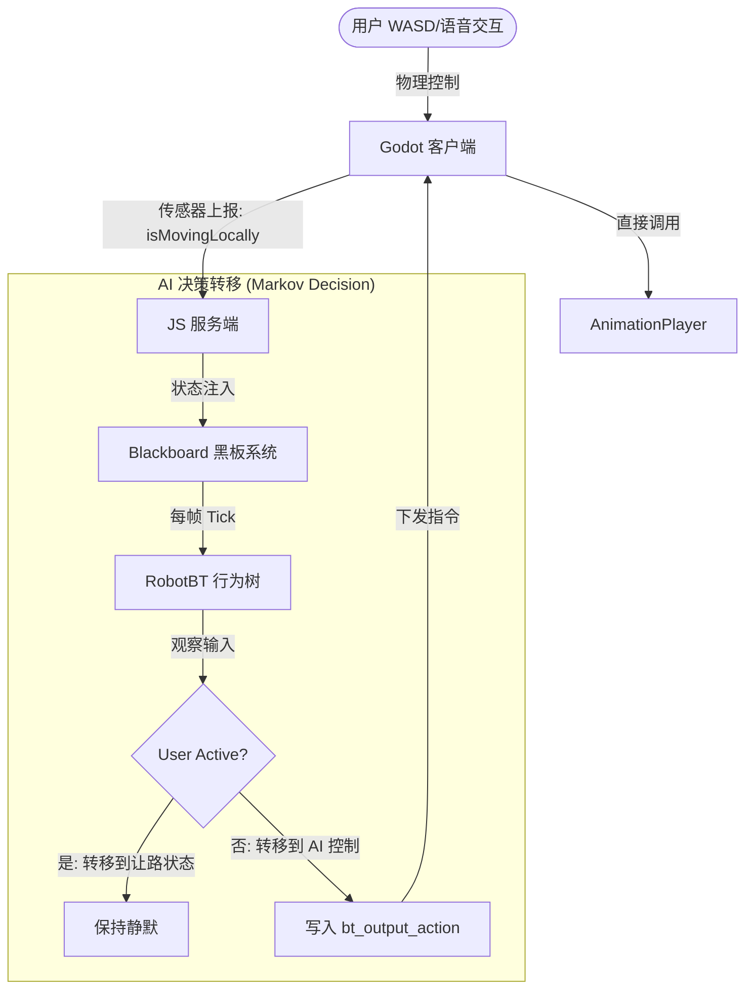
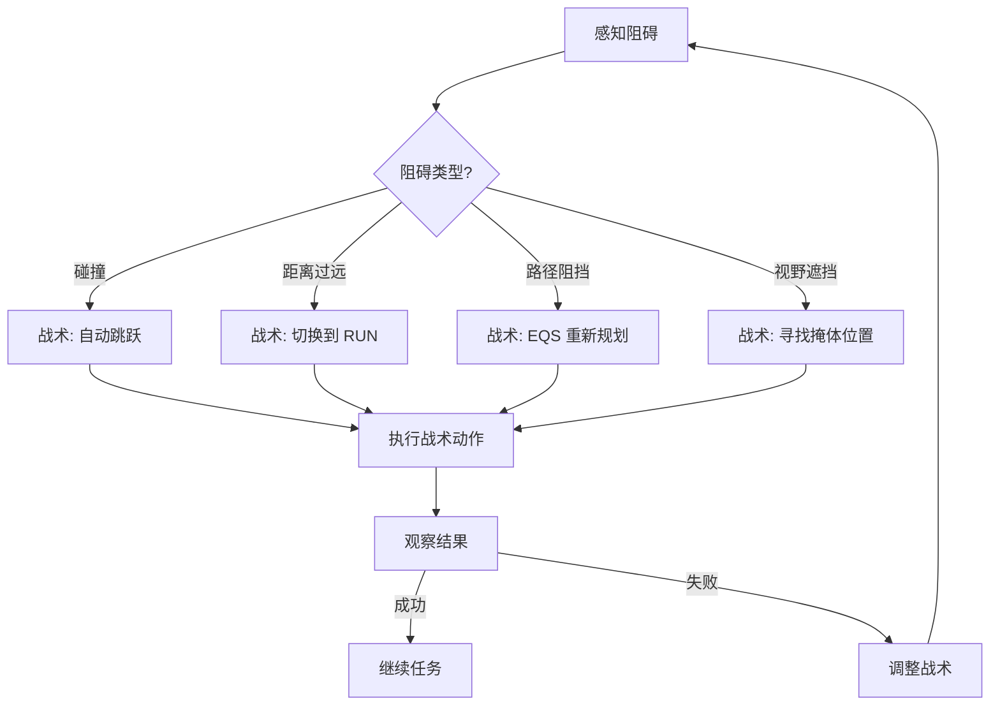

# 动作系统完整架构文档 v2.1

## 概述

本系统实现了**状态声明式动作管理**，采用优先级仲裁机制，结合服务端行为树和客户端状态机，确保动作执行的正确性和流畅性。系统基于"感知-阻碍-战术应对"的 ReAct Agent 简化模式，具备完整的战术决策和环境适应能力。

**核心决策**：摒弃复杂的动作工厂模式，直接使用 Godot 的 AnimationPlayer 和 AnimationTree 系统，通过简单的字符串映射实现动作切换。

## 核心架构设计

### 马尔科夫决策模型



### 感知-阻碍-战术应对模式

#### 1. 感知层 (Perception Layer)
```typescript
// 客户端传感器数据
interface SensorData {
  isMovingLocally: boolean;    // 用户是否在手动控制
  isJumpPressed: boolean;      // 跳跃按键状态
  isDragging: boolean;         // 拖拽状态
  penguinPosition: number[];   // 当前位置
  velocity: number[];          // 速度向量
  lastCollision: CollisionInfo; // 碰撞信息
}
```

#### 2. 阻碍识别 (Obstacle Detection)
```typescript
// 战术管理器识别阻碍类型
interface TacticalObstacle {
  type: 'collision' | 'distance' | 'visibility' | 'navigation';
  severity: number;           // 阻碍严重程度 0-1
  duration: number;           // 持续时间 ms
  requires_immediate_action: boolean;
}
```

#### 3. 战术应对 (Tactical Response)
战术系统主要通过 EQS (环境查询系统) 实现：

```typescript
// EQS 查询示例：寻找安全位置躲避
const safePositionQuery = {
  generator: { type: "Points_Circle", radius: 20 },
  tests: [
    { type: "Test_Distance", params: { mode: "DISTANCE_TO_ENEMIES" } },
    { type: "Test_Trace", params: { require_clear_path: false } },
    { type: "Test_Pathfinding", params: { require_path_exists: true } }
  ]
};
```

## 动作分类体系

### 一、工具系统 vs 动作系统

#### **🔧 工具（Tools）** - LLM 的函数接口
工具是 LLM 可以调用的函数接口，由 ToolRegistry.ts 定义：

| 工具名称 | 描述 | 对应节点 |
|---------|------|----------|
| `animate_avatar` | 执行动画动作序列 | PushPendingAction |
| `query_environment` | EQS 环境查询 | EQSQueryNode |
| `move_to` | 通用移动 | MoveToNode |
| `walk_to` | 走路移动 | MoveToNode |
| `run_to` | 跑步移动 | MoveToNode |
| `move_to_eqs_result` | 移动到查询结果 | MoveToNode |
| `wait` | 等待 | Wait |

#### **🎬 动作（Actions）** - 动画名称参数
动作是 `animate_avatar` 工具的参数，是具体的动画名称：

```typescript
// LLM 调用示例
{
  tool_calls: [{
    function: {
      name: "animate_avatar",
      arguments: {
        actions: ["DANCE", "WAVE", "IDLE"], // ← 这些是动作
        emotion: "HAPPY"
      }
    }
  }]
}
```

### 二、动作分类体系

#### 骨骼动画动作 (AnimationPlayer)
| 动作名称 | 类型 | 循环模式 | 描述 |
|---------|------|----------|------|
| `idle` | 循环 | LOOP_LINEAR | 待机状态 |
| `walk` | 循环 | LOOP_LINEAR | 行走动画 |
| `run` | 循环 | LOOP_LINEAR | 跑步动画 |
| `jump` | 一次性 | LOOP_NONE | 跳跃动画 |
| `dance` | 循环 | LOOP_LINEAR | 舞蹈表演 |
| `sleep` | 循环 | LOOP_LINEAR | 睡觉动画 |
| `think` | 循环 | LOOP_LINEAR | 思考动画 |
| `dazzle` | 循环 | LOOP_LINEAR | 闪亮效果 |

#### 程序化动画动作 (待废弃)
> **注意**：用户计划逐步用骨骼动画替换所有程序化动画

| 动作名称 | 状态 | 描述 |
|---------|------|------|
| `wave` | ⚠️ 待替换 | Z轴摆动挥手 |
| `spin` | ⚠️ 待替换 | Y轴持续旋转 |
| `bounce` | ⚠️ 待替换 | Y轴弹跳 |
| `fly` | ⚠️ 待替换 | 向上飞行悬浮 |
| `roll` | ⚠️ 待替换 | Z轴翻滚 |

#### 基础物理动作 (本地闭环)
| 动作类型 | 触发方式 | 优先级 | 描述 |
|---------|----------|--------|------|
| `WASD 移动` | 键盘输入 | 本地最高 | 直接物理控制 |
| `跳跃` | Space 键 | 本地最高 | 立即应用冲量 |
| `拖拽` | 鼠标拖拽 | 最高中断 | 跟随鼠标位置 |
| `重力` | 物理引擎 | 自动 | Godot 物理系统 |

## 战术系统架构

### 战术决策流程

战术决策主要通过 EQS 查询实现，行为树根据查询结果做出决策：



## 动作执行引擎

### 状态声明式协议

#### 动作状态消息格式
```typescript
interface ActionState {
  name: string;           // 动作名称
  duration: number;       // 持续时间(ms)
  priority: number;       // 优先级 10-100+
  interruptible: boolean; // 是否可中断
  timestamp: number;      // 发送时间戳
}
```

#### 优先级层次体系
```typescript
enum ActionPriority {
  IDLE = 10,              // 默认待机
  WALK_RUN = 20,          // 基础移动
  AUTONOMOUS_MOVE = 30,   // 自动导航
  PROGRAMMATIC = 50,      // LLM 指令动作
  COLLISION_REACT = 80,   // 碰撞反应
  EMERGENCY = 100         // 紧急事件
}
```

### 动作仲裁机制

#### 客户端优先级检查
```gdscript
func _apply_action_state(action_state: Dictionary) -> void:
    var priority = action_state.get("priority", 50)
    var current_priority = current_action_state.get("priority", 0)

    # 高优先级中断低优先级
    var should_interrupt = priority > current_priority

    # 同优先级检查中断标志
    if priority == current_priority:
        should_interrupt = interruptible and current_interruptible

    # 时间过期自动中断
    if elapsed >= current_duration:
        should_interrupt = true

    if should_interrupt:
        _execute_action(action_state)
```

#### 服务端锁定机制
```typescript
// 动作锁定状态
interface ActionLock {
  isLocked: boolean;
  lockToken: string;
  lockPriority: number;
}

// 锁定规则
const lockRules = {
  higherPriority: (newPri, currentPri) => newPri > currentPri,
  samePriorityInterruptible: (interruptible) => interruptible,
  autoRelease: (elapsed, duration) => elapsed >= duration
};
```

## 环境查询系统 (EQS) 集成

### EQS 战术应用

EQS 系统提供环境感知和战术决策能力：

#### 1. 位置查询战术
- **寻找掩体**：远离敌人且被遮挡的位置
- **攻击位置**：接近目标且有视野的位置
- **收集点**：可达的物品收集位置

#### 2. 路径规划战术
- **安全路径**：避开危险区域的路径
- **最短路径**：考虑地形和障碍物的最优路径
- **多阶段路径**：复杂场景下的分步移动

#### 3. 战术决策逻辑
EQSQueryNode 根据查询结果自动选择合适的移动模式：
- 距离 < 5m：使用 WALK
- 距离 ≥ 5m：使用 RUN
- 路径不存在：重新查询或放弃任务

### EQS 执行流程

```mermaid
graph TD
    A[LLM: "找个安全的地方"] --> B[EQSQueryNode]
    B --> C[生成查询配置]
    C --> D[发送到客户端]
    D --> E[Godot 执行3D计算]
    E --> F[返回最佳位置]
    F --> G[选择移动模式]
    G --> H[WALK 或 RUN]
    H --> I[移动到目标]
```

## 动作系统扩展设计

### **核心决策：简化设计，拒绝过度抽象**

基于用户反馈，**动作工厂模式已被弃用**。理由如下：

1. **过度设计**：增加了不必要的抽象层
2. **实际需求**：直接使用 AnimationPlayer 足够
3. **维护成本**：工厂模式增加了调试复杂度
4. **性能影响**：额外的函数调用开销

### 推荐的扩展方式

#### 1. 直接在 pet_controller.gd 中扩展
```gdscript
func _switch_anim(anim_name: String) -> void:
    anim_name = anim_name.to_lower()

    # 骨骼动画映射
    var skeletal_anims = {
        "idle": {"loop": true},
        "walk": {"loop": true},
        "run": {"loop": true},
        "jump": {"loop": false},
        "dance": {"loop": true},
        "sleep": {"loop": true},
        "think": {"loop": true},
        "dazzle": {"loop": true}
    }

    if skeletal_anims.has(anim_name):
        _play_skeletal_anim(anim_name, skeletal_anims[anim_name].loop)
    else:
        push_error("Unknown animation: " + anim_name)

func _play_skeletal_anim(anim_name: String, is_loop: bool) -> void:
    if animation_player and last_anim_state != anim_name:
        animation_player.play(anim_name)
        last_anim_state = anim_name

        # 设置循环模式
        var anim = animation_player.get_animation(anim_name)
        if anim:
            anim.loop_mode = Animation.LOOP_LINEAR if is_loop else Animation.LOOP_NONE
```

#### 2. 添加新动画的步骤
1. **在 AnimationPlayer 中创建动画**
2. **在 `_switch_anim` 中添加映射**
3. **设置正确的循环模式**
4. **在 ToolRegistry.ts 中添加动作名称**

#### 3. 工具系统扩展
在 ToolRegistry.ts 中添加新动作：
```typescript
// animate_avatar 工具的动作枚举
enum: [
  'IDLE', 'WALK', 'RUN', 'JUMP', 'DANCE', 'SLEEP',
  'THINK', 'DAZZLE', 'NEW_ANIMATION'  // ← 添加新动作
]
```

## 测试与调试

### 动作系统测试

#### 1. 基本动画切换测试
```gdscript
# 测试不同动作的切换
func test_animation_switching():
    # 测试骨骼动画
    _switch_anim("dance")  # 应该播放舞蹈动画
    await get_tree().create_timer(1.0).timeout
    _switch_anim("idle")   # 应该切换到待机动画
```

#### 2. LLM 工具调用测试
```typescript
// 测试 animate_avatar 工具
const testTools = ToolRegistry.getToolDefinitions();
const animateTool = testTools.find(t => t.function.name === 'animate_avatar');
expect(animateTool).toBeDefined();
```

### 常见问题排查

#### 问题1：动画不播放
- 检查 AnimationPlayer 中是否有对应动画
- 检查动画名称是否正确映射
- 检查 `_switch_anim` 方法中的字符串匹配

#### 问题2：LLM 不调用动作
- 检查 ToolRegistry.ts 中的动作枚举
- 检查 LLM 的系统提示是否包含动画工具
- 检查工具调用格式是否正确

#### 问题3：动作切换延迟
- 这是正常现象：LLM → 行为树 → WebSocket → Godot
- 总延迟约 100-200ms，取决于网络状况

## 测试与调试

### 动作系统测试
```typescript
describe('Action System', () => {
  test('priority arbitration works correctly', () => {
    const system = new ActionSystem();

    // 测试高优先级中断低优先级
    system.executeAction({ name: 'WALK', priority: 20 });
    system.executeAction({ name: 'DANCE', priority: 50 });

    expect(system.getCurrentAction()).toBe('DANCE');
  });

  test('tactical response to obstacles', () => {
    const tactics = new TacticsManager();

    // 测试碰撞战术
    const collisionSensors = { lastCollision: { duration: 1000 } };
    const decision = tactics.evaluate(collisionSensors);

    expect(decision.actions).toContain('JUMP');
  });
});
```

### EQS 战术测试
```typescript
describe('EQS Tactical Integration', () => {
  test('finds cover position tactically', async () => {
    const eqs = new ServerEQS();
    const result = await eqs.queryEnvironment({
      goal: '找个安全的地方躲起来',
      constraints: ['远离敌人', '有掩体']
    });

    expect(result.length).toBeGreaterThan(0);
    expect(result[0].score).toBeGreaterThan(0.7);
  });
});
```

## 总结

### 核心优势

1. **ReAct Agent 简化实现**: "感知-阻碍-战术应对"模式提供快速反应能力
2. **状态声明式架构**: 服务端决策，客户端执行，确保一致性和性能
3. **战术系统可扩展**: EQS + 行为树提供强大的环境适应能力
4. **性能优化**: 缓存、异步处理、优先级仲裁确保流畅体验
5. **LLM 深度集成**: 支持自然语言指令到复杂动作序列的转换
6. **简化设计**: 摒弃过度抽象，保持代码简洁直接

### 架构演进方向

#### 当前状态 ✅
- [x] 工具系统与动作系统分离
- [x] 骨骼动画替换程序化动画
- [x] 简化动作切换逻辑
- [x] 弃用动作工厂模式

#### 未来规划
- [ ] 扩展骨骼动画库
- [ ] 优化 AnimationPlayer 性能
- [ ] 增强 EQS 战术能力
- [ ] 支持动画状态机过渡

### 设计原则

#### **KISS 原则 (Keep It Simple, Stupid)**
- 拒绝过度抽象
- 保持代码可读性
- 直接解决问题

#### **实用主义**
- 现有系统够用就不改
- 性能优先于美观
- 简单方案优先尝试

---

**文档版本**: v2.1
**最后更新**: 2025年1月
**实现状态**: ✅ **简化优化并稳定运行**
**核心决策**: 弃用动作工厂，直接使用 AnimationPlayer