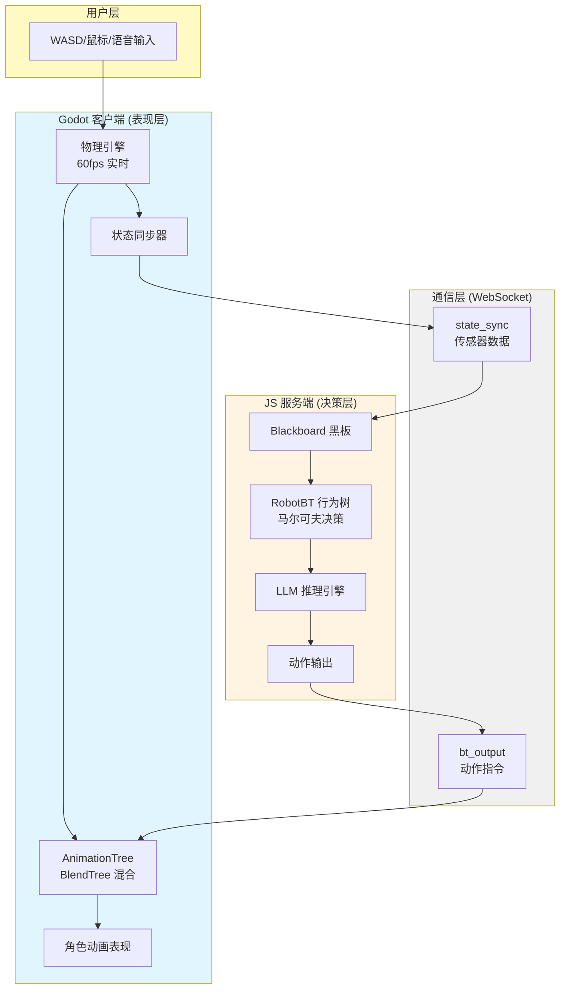
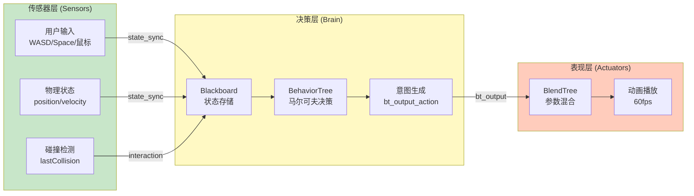
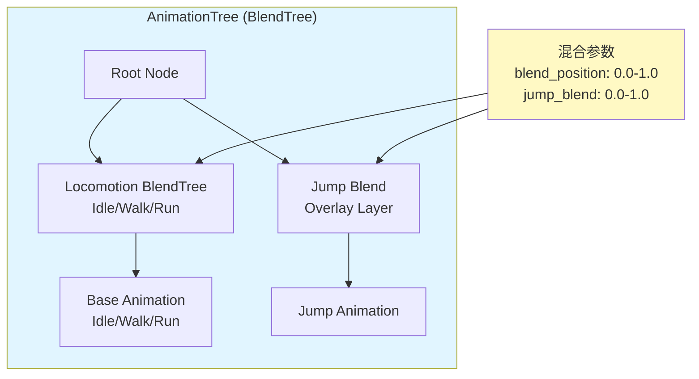
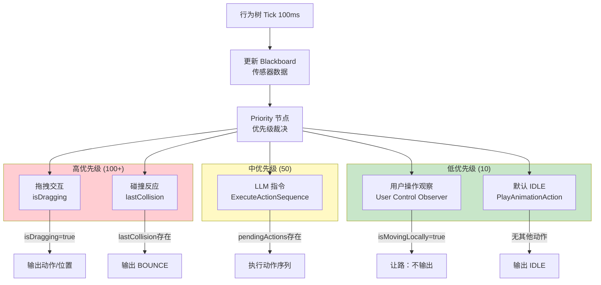
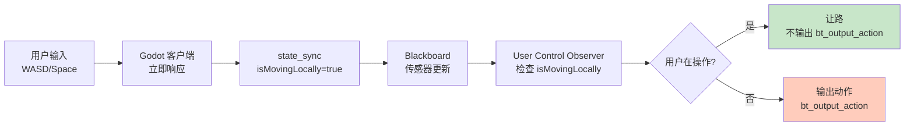
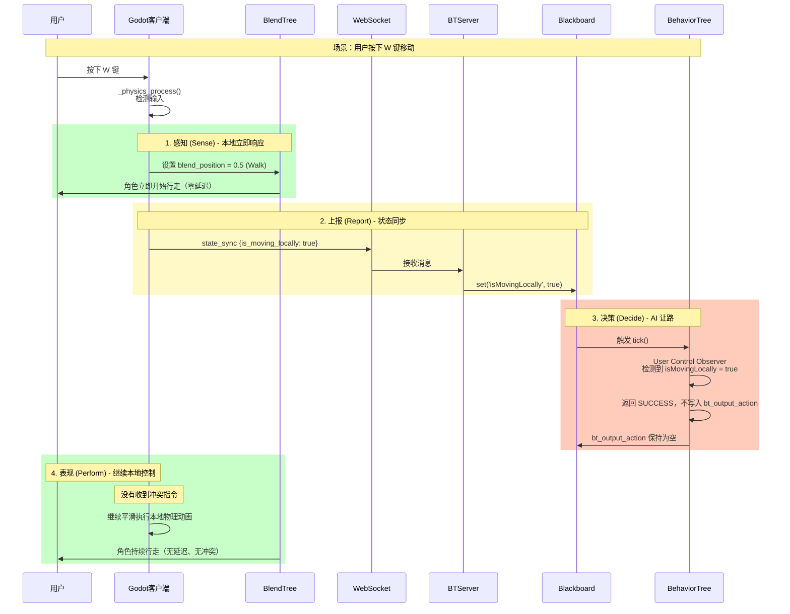
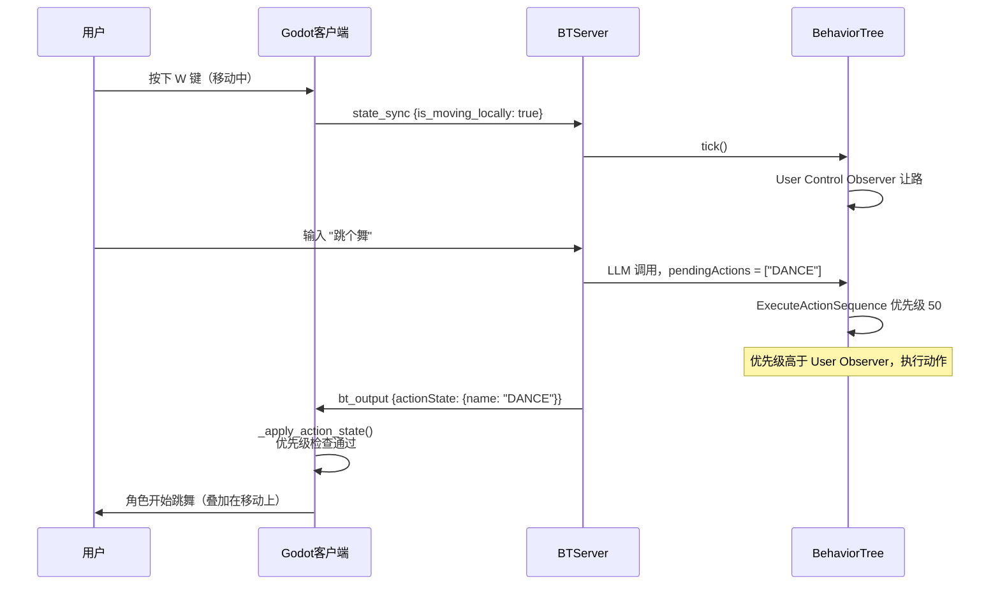
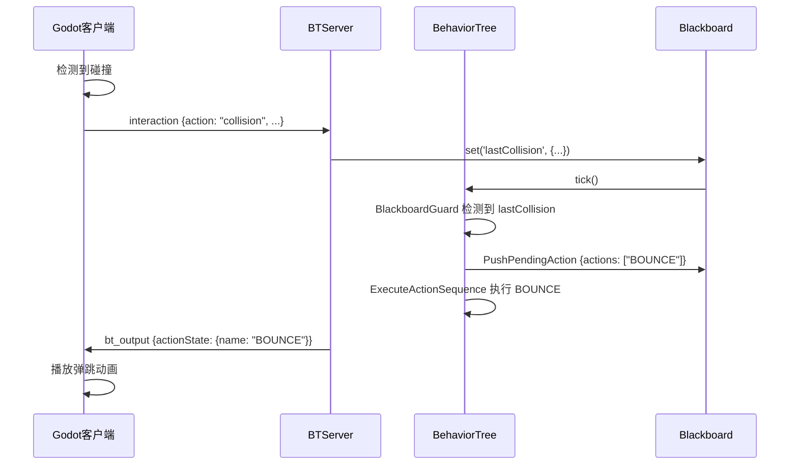
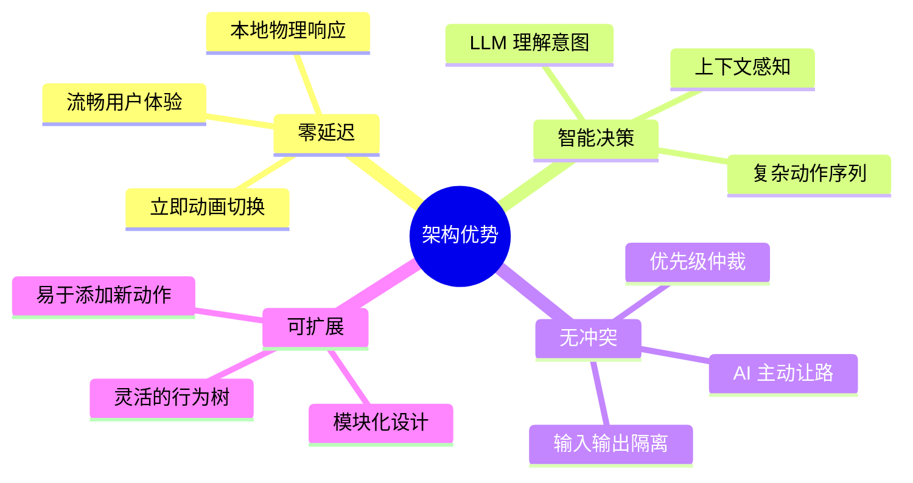

# 动作逻辑职责划分：本地物理混合 vs 服务端马尔可夫决策

## 概述

在本项目中，我们采用了 **"本地传感器上报 + 服务端 AI 决策（马尔可夫性）+ 本地参数化混合表现"** 的现代游戏架构。

### 架构全景图



## 1. 职责划分核心原则 (Markov Decision Process)

### 1.1 三层架构

| 层次 | 归属 | 核心技术 | 职责描述 (马尔可夫语义) |
| :--- | :--- | :--- | :--- |
| **表现层 (Actuators)** | Godot 客户端 | **BlendTree** (AnimationTree) | **状态响应器**：根据当前的混合参数（速度、动作权重）实时呈现姿态。 |
| **决策层 (Brain)** | JS 服务端 | **行为树** (Markov BT) | **状态转移器**：每帧观察传感器数据，决定下一刻的"意图（Actuator）"。 |
| **传感器层 (Sensors)** | Godot 客户端 | 物理引擎 + 输入检测 | **环境上报器**：将物理事实（我在动、我在跳）同步到黑板。 |

### 1.2 数据流向



### 1.3 关键特性

**马尔可夫性质 (Markov Property)**：
- 行为树的每一帧决策**仅依赖于黑板上当前的传感器数据**
- 不需要记住"上一秒我发了什么指令"
- 每一帧都根据当前环境重新计算意图

**输入输出隔离 (Input/Output Separation)**：
- 传感器数据 (Sensors)：`isMovingLocally`, `isJumpPressed` 等物理事实
- 执行器数据 (Actuators)：`bt_output_action` 等 AI 意图
- 两者完全解耦，避免冲突

---

## 2. 为什么本地使用"BlendTree"？

我们不再使用简单的"播放"逻辑，而是使用 **BlendTree (混合树)**：

### 2.1 BlendTree 的优势

1.  **参数化驱动**：通过设置 `blend_position` 等参数，动作不再是"硬切换"，而是"无缝滑入"。
2.  **多维混合**：支持在走路的同时进行跳跃（Overlay），或者叠加表情。
3.  **零延迟响应**：本地物理输入（WASD）直接修改混合参数，不经过服务器往返，手感最顺滑。

### 2.2 BlendTree 结构



### 2.3 参数映射

| 动作状态 | blend_position | jump_blend | 说明 |
|:--------|:--------------|:-----------|:-----|
| IDLE | 0.0 | 0.0 | 待机状态 |
| WALK | 0.5 | 0.0 | 行走状态 |
| RUN | 1.0 | 0.0 | 跑步状态 |
| JUMP | 当前值 | 1.0 | 跳跃覆盖层 |

### 2.4 使用示例

```gdscript
# Godot 客户端代码示例
func _apply_blendtree_state(state: AnimState) -> void:
    match state:
        AnimState.IDLE:
            animation_tree.set("parameters/locomotion/blend_position", 0.0)
            animation_tree.set("parameters/jump_blend/blend_amount", 0.0)
        AnimState.WALK:
            animation_tree.set("parameters/locomotion/blend_position", 0.5)
            animation_tree.set("parameters/jump_blend/blend_amount", 0.0)
        AnimState.RUN:
            animation_tree.set("parameters/locomotion/blend_position", 1.0)
            animation_tree.set("parameters/jump_blend/blend_amount", 0.0)
        AnimState.JUMP:
            animation_tree.set("parameters/jump_blend/blend_amount", 1.0)
```

---

## 3. 为什么服务端是"马尔可夫决策"行为树？

服务端的行为树遵循马尔可夫性质，决策仅依赖于当前黑板状态：

### 3.1 马尔可夫决策特性

1.  **输入输出隔离**：参考 `pointerPosition` 模式，我们将客户端同步来的物理状态（Sensor）与 AI 发出的指令（Actuator）完全解耦。
2.  **AI 让路决策 (User Observer)**：行为树中包含一个显式的优先级分支。当观察到用户在操作时，AI 决策为"保持静默"，主动让出控制权。
3.  **决策一致性**：无论是用户操作还是 LLM 指令，行为树都在每一帧根据全局优先级（碰撞 > 指令 > 用户 > 闲置）进行裁决。

### 3.2 行为树决策流程



### 3.3 User Control Observer 机制



### 3.4 代码实现示例

```typescript
// RobotBT.ts - User Control Observer
new BlackboardGuard({
  id: 'guard_user_control_observer',
  title: 'User Control Observer',
  key: (bb: any) => {
    const isMovingLocally = bb.get('isMovingLocally');
    const isDragging = bb.get('isDragging');
    const isJumpPressed = bb.get('isJumpPressed');
    // 如果用户正在本地交互，AI 做出决策：不输出任何指令，让出控制权
    return isMovingLocally || isDragging || isJumpPressed;
  },
  scope: 'global',
  // 这个子节点执行成功但不写入任何 bt_output_action
  child: new class extends Wait {
    tick(tick: any) { return SUCCESS; }
  }({ id: 'node_yield_control', milliseconds: 0 })
})
```

---

## 4. 关键交互流程：以"移动"为例 (输入输出分离模式)

### 4.1 完整流程图



### 4.2 详细步骤说明

1.  **感知 (Sense)**：用户按下 W 键，Godot 设置本地 `WALK` 动画（零延迟），并上报 `is_moving_locally: true` 给服务端。
2.  **决策 (Decide)**：服务端行为树读取黑板传感器。
    *   AI 观察到用户在动。
    *   AI 分支 `User Control Observer` 触发并返回成功。
    *   AI 决策：**不向 `bt_output_action` 写入指令**。
3.  **表现 (Perform)**：Godot 没收到任何冲突指令，继续平滑执行本地物理动画。

### 4.3 与其他场景对比

#### 场景 A：用户移动中，LLM 指令来了



#### 场景 B：碰撞反应



---

## 5. 职责对比表

| 维度 | 客户端 (BlendTree) | 服务端 (BehaviorTree) |
|:-----|:------------------|:---------------------|
| **层级** | 表现层 (Presentation) | 决策层 (Decision) |
| **职责** | 动画混合、参数过渡 | 意图生成、动作选择 |
| **频率** | 每帧 (60fps) | 每 100ms (10fps) |
| **输入** | 混合参数 (0.0-1.0) | 传感器数据 (Blackboard) |
| **输出** | 动画播放 | 动作意图 (bt_output_action) |
| **延迟** | 零延迟（本地） | 网络延迟（100ms） |
| **决策依据** | 混合参数值 | 马尔可夫决策（当前状态） |
| **冲突处理** | 优先级检查 | 优先级树结构 |

---

## 6. 总结：马尔可夫决策链

### 6.1 核心原则

*   **Godot 客户端**：物理实体的传感器阵列。
*   **JS 服务端**：纯粹的意图生成器（不做人工过滤，只做逻辑转移）。
*   **通信管道**：声明式同步意图。

这种架构确保了：**AI 拥有灵魂（能够根据感知做出复杂转移），用户拥有身体（操作无延迟）**。

### 6.2 架构优势


