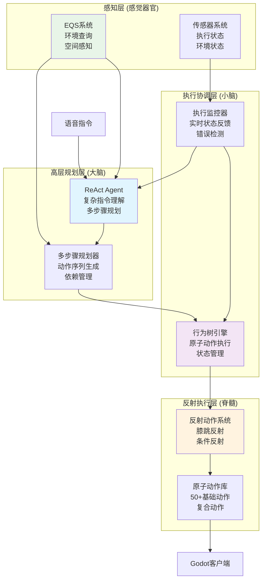

# 复杂语音指令AI架构实现方案 (2025) - 更新版

## 概述

基于您已有语音识别功能，本文档重新评估当前架构状态，制定实现复杂语音指令（如"跑到桌子上面"、"搬椅子到我面前"、"围着花坛转圈圈"）的具体实施计划。

**核心目标**：构建ReAct Agent + 行为树 + EQS + 原子动作的完整架构，实现：
- 复杂指令 → 多步骤规划 → 原子动作执行 → 实时反馈
- 行为树作为"膝跳反射"系统（低层反射动作）
- ReAct Agent作为"大脑"（高层规划决策）
- EQS作为环境感知工具

---

## 第一部分：当前架构重新评估

### 1.1 已有的核心能力

基于代码分析，您已经具备：

#### ✅ 成熟的语音识别
- 语音输入处理已实现
- 文本转换和基础处理

#### ✅ 高度马尔可夫化的行为树系统
```typescript
// BTServer.ts - 每100ms从零评估
class BTServer {
  private tickInterval = setInterval(() => {
    this.tickAllClients(); // 完全基于当前状态
  }, 100);
}
```

#### ✅ ReAct代理基础框架
```typescript
// ReActAgentNode.ts - 推理+行动循环
class ReActAgentNode extends AsyncAction {
  async performAsync(tick: Tick): Promise<number> {
    const { thought, toolCalls, finalAnswer } = this.parseResponse(response);
    // 已有基本的思考-行动循环
  }
}
```

#### ✅ 工具注册系统
```typescript
// ToolRegistry.ts - 行为树节点作为LLM工具
ToolRegistry.registerTool('animate_avatar', '...', PlayAnimationAction);
ToolRegistry.registerTool('query_environment', '...', EQSQueryNode);
```

#### ✅ EQS环境查询系统
```typescript
// ServerEQS.ts - 环境感知
class ServerEQS {
  async query(config: EQSQueryConfig): Promise<EQSQueryResponse>
}
```

#### ✅ 基础原子动作
- PlayAnimationAction, MoveToNode, ExecuteActionSequence等

### 1.2 核心差距分析

#### ❌ 缺失的关键能力

| 组件 | 当前状态 | 目标状态 | 差距评估 |
|------|----------|----------|----------|
| **复杂意图理解** | ❌ 基础文本 | 空间语义理解（如"上面"、"附近"、"围着"） | 🔴 大 |
| **多步骤规划** | ❌ 单步执行 | 复杂指令分解为原子序列 | 🔴 大 |
| **复合动作系统** | ⚠️ 基础动作 | 50+原子动作+复合动作框架 | 🟡 中 |
| **执行状态反馈** | ⚠️ 基础反馈 | 实时执行监控和LLM反馈 | 🟡 中 |
| **规划验证** | ❌ 无 | 规划可行性检查和优化 | 🟠 小 |
| **错误恢复** | ❌ 基础 | 多策略错误恢复机制 | 🟠 小 |

#### 📊 架构成熟度重新评估

```
语音识别:         ██████████ 100% (已有)
基础意图理解:     ███████░░░ 70% (文本处理存在)
复杂规划能力:     ████░░░░░ 40% (ReAct基础框架)
原子动作丰富度:   ███████░░░ 70% (基础动作库)
状态反馈机制:     ███████░░░ 70% (基础传感器)
EQS工具集成:      ███████░░░ 70% (已注册但需优化)
行为树代理协同:   ███████░░░ 70% (已有集成可优化)
马尔可夫性:       ██████████ 98% (接近完美)
```

**结论**：当前架构距离目标约60%完成，主要差距在复杂指令理解和多步骤规划。

---

## 第二部分：核心架构设计

### 2.1 ReAct Agent + 行为树 + EQS 协同架构



### 2.2 设计原则

#### 🎯 马尔可夫性优先
- **状态空间分离**：传感器(`is_*`)、执行器(`bt_output_*`)、规划状态严格隔离
- **无历史依赖**：所有决策基于当前状态快照
- **确定性转移**：相同输入+状态必然产生相同输出

#### 🔧 解耦合设计
- **模块化架构**：规划、执行、感知、反馈独立部署
- **接口标准化**：统一的工具调用、状态同步、反馈协议
- **插件化扩展**：新原子动作、新规划策略、新传感器热插拔

#### ⚡ ReAct循环优化
- **观察驱动**：执行结果实时反馈给Agent
- **渐进式规划**：从高层目标逐步分解为原子动作
- **错误恢复**：执行失败时自动重新规划

---

## 第三部分：实施路线图（10周）

### 阶段一（1周）：复杂意图理解增强

#### 目标
从基础文本理解升级到空间语义和上下文理解

#### 具体任务
1. **空间关系理解**
   ```typescript
   // 扩展意图类型
   type SpatialIntent = {
     type: 'move_to_surface' | 'carry_to_location' | 'orbit_around';
     target: EntityReference;
     relation: 'on_top' | 'below' | 'near' | 'around';
     constraints: SpatialConstraints;
   };
   ```

2. **实体关系提取**
   ```typescript
   class SpatialNLUProcessor {
     async extractSpatialRelations(text: string): Promise<SpatialIntent> {
       // 识别"跑到桌子上面"中的：
       // - 动作：move_to
       // - 目标：桌子
       // - 关系：on_top
     }
   }
   ```

3. **上下文理解**
   - 代词消解（"把它搬过来"中的"它"指代）
   - 模糊指令澄清（"那边"→具体位置）
   - 多实体关系（"A和B之间的C"）

### 阶段二（2周）：复合动作系统重构

#### 目标
建立完整的原子动作+复合动作框架

#### 复合动作框架
```typescript
interface CompositeAction {
  name: string;
  steps: ActionStep[];
  preconditions: string[];
  postconditions: string[];
  interruptible: boolean;
  timeout: number;
}

interface ActionStep {
  action: AtomicAction;
  parameters: any;
  dependencies: string[];  // 前置步骤ID
  timeout: number;
  retryCount: number;
}

// 复合动作实现
class CarryToUserAction implements CompositeAction {
  name = 'carry_to_user';
  steps = [
    {
      action: 'locate_object',
      parameters: { object: '$target' },
      dependencies: [],
      timeout: 5000
    },
    {
      action: 'move_to_object',
      parameters: { target: 'locate_object.result' },
      dependencies: ['locate_object'],
      timeout: 10000
    },
    // ... 更多步骤
  ];
}
```

#### 原子动作扩展
基于现有动作库，添加：
- **空间操作**：`MoveToSurfaceAction`, `OrbitAction`
- **物体操作**：`PickupAction`, `DropAction`, `CarryAction`
- **交互动作**：`ApproachAction`, `FollowAction`, `WaitNearAction`

### 阶段三（3周）：多步骤规划引擎

#### 目标
实现复杂指令到原子动作序列的转换

#### 规划引擎架构
```typescript
class MultiStepPlanner {
  async createPlan(intent: SpatialIntent, context: PlanningContext): Promise<ActionPlan> {
    // 1. 指令分解
    const subGoals = await this.decomposeIntent(intent);

    // 2. 环境感知
    const environment = await this.assessEnvironment(subGoals, context);

    // 3. 动作序列生成
    const actionSequence = await this.generateActionSequence(subGoals, environment);

    // 4. 规划验证和优化
    return await this.validateAndOptimizePlan(actionSequence, context);
  }

  private async decomposeIntent(intent: SpatialIntent): Promise<SubGoal[]> {
    switch (intent.type) {
      case 'move_to_surface':
        return [
          { id: 'locate_surface', type: 'spatial_query', params: { relation: intent.relation } },
          { id: 'navigate', type: 'path_planning', params: { target: 'locate_surface.result' } },
          { id: 'adjust_pose', type: 'pose_adjustment', params: { surface: intent.relation } }
        ];

      case 'carry_to_user':
        return [
          { id: 'locate_object', type: 'entity_search', params: { name: intent.target } },
          { id: 'approach_object', type: 'navigation', params: { target: 'locate_object.result' } },
          { id: 'pickup', type: 'manipulation', params: { object: 'locate_object.result' } },
          { id: 'navigate_to_user', type: 'navigation', params: { target: 'user_position' } },
          { id: 'drop', type: 'manipulation', params: {} }
        ];

      case 'orbit_around':
        return [
          { id: 'locate_center', type: 'entity_search', params: { name: intent.target } },
          { id: 'calculate_orbit', type: 'path_planning', params: { type: 'orbit', center: 'locate_center.result' } },
          { id: 'execute_orbit', type: 'locomotion', params: { path: 'calculate_orbit.result' } }
        ];
    }
  }
}
```

#### 规划验证器
```typescript
class PlanValidator {
  async validatePlan(plan: ActionPlan): Promise<ValidationResult> {
    // 1. 前置条件检查
    for (const step of plan.steps) {
      const preconditionCheck = await this.checkPreconditions(step);
      if (!preconditionCheck.valid) {
        return { valid: false, issues: preconditionCheck.issues };
      }
    }

    // 2. 资源冲突检测
    const resourceConflicts = this.detectResourceConflicts(plan);
    if (resourceConflicts.length > 0) {
      return { valid: false, issues: resourceConflicts };
    }

    // 3. 时序合理性检查
    const timingIssues = this.validateTiming(plan);
    if (timingIssues.length > 0) {
      return { valid: false, issues: timingIssues };
    }

    // 4. 成功率评估
    const successProbability = await this.estimateSuccessProbability(plan);

    return {
      valid: true,
      confidence: successProbability,
      optimizations: this.generateOptimizations(plan)
    };
  }
}
```

### 阶段四（2周）：ReAct代理与行为树深度集成

#### 目标
优化规划-执行-反馈循环

#### 执行状态监控
```typescript
class ExecutionMonitor {
  private readonly feedbackChannels = new Map<string, FeedbackChannel>();

  monitorExecution(planId: string, steps: ActionStep[]): Observable<ExecutionState> {
    return new Observable(observer => {
      const execution = new ExecutionContext(planId, steps);

      // 订阅传感器数据变化
      const sensorSubscription = this.sensors.onStateChange()
        .filter(state => state.executionId === planId)
        .subscribe(sensorState => {
          const stepState = this.evaluateStepState(execution, sensorState);

          if (stepState.completed) {
            execution.completeStep(stepState.stepId);
            observer.next({ type: 'step_completed', stepId: stepState.stepId });
          } else if (stepState.failed) {
            observer.next({ type: 'step_failed', stepId: stepState.stepId, error: stepState.error });
          } else {
            observer.next({ type: 'step_progress', stepId: stepState.stepId, progress: stepState.progress });
          }

          // 检查整个规划状态
          if (execution.isCompleted()) {
            observer.next({ type: 'plan_completed' });
            observer.complete();
          } else if (execution.isFailed()) {
            observer.next({ type: 'plan_failed', error: execution.getFailureReason() });
            observer.complete();
          }
        });

      // 返回清理函数
      return () => sensorSubscription.unsubscribe();
    });
  }
}
```

#### 反馈驱动的ReAct优化
```typescript
class EnhancedReActAgent extends ReActAgentNode {
  private executionMonitor: ExecutionMonitor;

  async performAsync(tick: Tick): Promise<number> {
    const userIntent = this.extractUserIntent(tick);
    const currentExecutionState = this.executionMonitor.getCurrentState();

    // 如果有正在执行的规划，检查状态
    if (currentExecutionState && !currentExecutionState.isCompleted()) {
      const feedback = await this.getExecutionFeedback(currentExecutionState);

      if (feedback.type === 'step_failed') {
        // 执行失败，触发重新规划
        return await this.handleExecutionFailure(feedback, tick);
      } else if (feedback.type === 'step_completed') {
        // 步骤完成，继续下一个步骤
        return await this.advanceToNextStep(currentExecutionState, tick);
      } else {
        // 仍在执行中，等待
        return RUNNING;
      }
    }

    // 没有正在执行的规划，开始新规划
    const plan = await this.createPlan(userIntent, tick);
    if (!plan) {
      return FAILURE;
    }

    // 启动执行监控
    this.startExecutionMonitoring(plan, tick);

    return RUNNING;
  }

  private async handleExecutionFailure(failure: ExecutionFailure, tick: Tick): Promise<number> {
    // 分析失败原因
    const failureAnalysis = await this.analyzeFailure(failure);

    // 选择恢复策略
    const recoveryStrategy = this.selectRecoveryStrategy(failureAnalysis);

    // 生成恢复规划
    const recoveryPlan = await this.createRecoveryPlan(recoveryStrategy, failure, tick);

    if (recoveryPlan) {
      this.startExecutionMonitoring(recoveryPlan, tick);
      return RUNNING;
    }

    // 无法恢复，报告失败
    this.reportFinalFailure(failure, tick);
    return FAILURE;
  }
}
```

### 阶段五（1周）：EQS环境感知工具化

#### 目标
将EQS深度集成到规划过程中

#### 空间关系查询工具
```typescript
class SpatialRelationTool extends Tool {
  name = 'query_spatial_relations';
  description = '查询物体之间的空间关系';

  async execute(args: SpatialQueryArgs): Promise<ToolResult> {
    const { reference_object, relation, constraints } = args;

    // 使用EQS进行空间查询
    const eqsQuery = {
      type: 'spatial_relation',
      parameters: {
        reference_entity: reference_object,
        relation_type: relation,
        search_constraints: constraints
      }
    };

    const results = await this.eqsClient.query(eqsQuery);

    return {
      success: results.found,
      data: results.entities,
      metadata: {
        query_type: 'spatial_relation',
        search_radius: constraints?.max_distance || 10,
        found_count: results.entities?.length || 0
      }
    };
  }
}

// 注册到工具系统
ToolRegistry.registerTool(
  'query_spatial_relations',
  '查询空间关系，如"桌子上面有什么"或"A在B附近"',
  spatialRelationSchema,
  SpatialRelationTool
);
```

#### 路径规划工具
```typescript
class PathPlanningTool extends Tool {
  name = 'plan_navigation_path';
  description = '规划从当前位置到目标位置的路径';

  async execute(args: PathPlanningArgs): Promise<ToolResult> {
    const { start_position, end_position, constraints } = args;

    const eqsQuery = {
      type: 'path_planning',
      parameters: {
        start: start_position,
        end: end_position,
        constraints: constraints || {}
      }
    };

    const pathResult = await this.eqsClient.query(eqsQuery);

    if (!pathResult.path || pathResult.path.length === 0) {
      return {
        success: false,
        error: pathResult.reason || '无法找到路径'
      };
    }

    return {
      success: true,
      data: {
        path: pathResult.path,
        waypoints: pathResult.waypoints,
        estimated_time: pathResult.estimated_duration,
        difficulty: pathResult.difficulty_score
      }
    };
  }
}
```

### 阶段六（1周）：端到端集成与验证

#### 目标
完整集成所有组件，进行全面测试

#### 集成测试场景
1. **复杂空间指令**
   ```typescript
   // 测试"跑到桌子上面"
   const testCase = {
     input: "跑到桌子上面",
     expectedSteps: [
       "locate_table_surface",
       "plan_path_to_surface",
       "navigate_to_surface",
       "adjust_pose_for_surface"
     ],
     expectedOutcome: "agent_on_table_surface"
   };
   ```

2. **物体操作指令**
   ```typescript
   // 测试"把椅子搬到我面前"
   const testCase = {
     input: "把椅子搬到我面前",
     expectedSteps: [
       "locate_chair",
       "move_to_chair",
       "pickup_chair",
       "move_to_user_front",
       "drop_chair"
     ],
     expectedOutcome: "chair_near_user"
   };
   ```

3. **路径指令**
   ```typescript
   // 测试"围着花坛转三圈"
   const testCase = {
     input: "围着花坛转三圈",
     expectedSteps: [
       "locate_flower_bed",
       "calculate_orbit_path",
       "execute_orbit_movement"
     ],
     expectedOutcome: "agent_completed_3_orbits"
   };
   ```

#### 性能验证
- **响应时间**：< 3秒（从语音到开始执行）
- **规划时间**：< 5秒（复杂指令规划）
- **执行准确率**：> 90%（步骤正确执行率）
- **错误恢复率**：> 80%（失败后自动恢复）

---

## 第四部分：关键技术实现

### 4.1 复杂意图理解

#### 空间语义解析器
```typescript
class SpatialIntentParser {
  private readonly spatialPatterns = {
    surface_relations: {
      patterns: ['跑到(.+)上面', '爬到(.+)上', '站在(.+)上面'],
      relation: 'on_top'
    },
    orbital_relations: {
      patterns: ['围着(.+)转', '绕着(.+)走', '沿着(.+)绕圈'],
      relation: 'orbit_around'
    },
    proximity_relations: {
      patterns: ['搬(.+)到(.+)面前', '把(.+)拿给我', '把(.+)放我这里'],
      relation: 'move_to_user'
    }
  };

  async parseSpatialIntent(text: string): Promise<SpatialIntent | null> {
    for (const [relationType, config] of Object.entries(this.spatialPatterns)) {
      for (const pattern of config.patterns) {
        const regex = new RegExp(pattern);
        const match = text.match(regex);

        if (match) {
          const entities = await this.extractEntities(match, config.relation);
          return {
            type: config.relation,
            target: entities.target,
            relation: config.relation,
            parameters: entities.parameters
          };
        }
      }
    }

    return null;
  }

  private async extractEntities(match: RegExpMatchArray, relation: string): Promise<EntityExtraction> {
    // 使用EQS查找实体
    const entityName = match[1];
    const entity = await this.eqsClient.findEntity(entityName);

    return {
      target: entity,
      parameters: this.extractParameters(match, relation)
    };
  }
}
```

### 4.2 复合动作执行引擎

#### 动作执行协调器
```typescript
class CompositeActionExecutor {
  async executeCompositeAction(
    action: CompositeAction,
    context: ExecutionContext
  ): Promise<ExecutionResult> {

    const execution = new ActionExecution(action, context);

    try {
      // 初始化执行状态
      execution.initialize();

      // 按依赖顺序执行步骤
      const executionOrder = this.calculateExecutionOrder(action.steps);

      for (const stepId of executionOrder) {
        const step = action.steps.find(s => s.id === stepId);
        if (!step) continue;

        // 检查前置条件
        const preconditionResult = await this.checkStepPreconditions(step, execution);
        if (!preconditionResult.satisfied) {
          throw new ExecutionError(`Step ${stepId} preconditions not satisfied: ${preconditionResult.reason}`);
        }

        // 执行步骤
        const stepResult = await this.executeStep(step, execution);

        if (!stepResult.success) {
          // 步骤失败，尝试重试
          if (step.retryCount > 0 && await this.shouldRetry(step, stepResult)) {
            step.retryCount--;
            continue; // 重试当前步骤
          }

          throw new ExecutionError(`Step ${stepId} failed: ${stepResult.error}`);
        }

        // 步骤成功，更新执行状态
        execution.markStepCompleted(stepId, stepResult);
      }

      // 验证后置条件
      const postconditionResult = await this.checkPostconditions(action, execution);
      if (!postconditionResult.satisfied) {
        throw new ExecutionError(`Postconditions not satisfied: ${postconditionResult.reason}`);
      }

      return { success: true, result: execution.getFinalState() };

    } catch (error) {
      // 执行失败，清理状态
      await this.cleanupFailedExecution(execution);
      return { success: false, error: error.message };
    }
  }

  private calculateExecutionOrder(steps: ActionStep[]): string[] {
    // 拓扑排序，确保依赖关系
    const graph = this.buildDependencyGraph(steps);
    return this.topologicalSort(graph);
  }

  private async checkStepPreconditions(step: ActionStep, execution: ActionExecution): Promise<PreconditionResult> {
    // 检查步骤特定的前置条件
    for (const condition of step.preconditions || []) {
      const result = await this.evaluateCondition(condition, execution);
      if (!result) {
        return { satisfied: false, reason: `Condition failed: ${condition}` };
      }
    }

    return { satisfied: true };
  }
}
```

### 4.3 实时反馈系统

#### 执行状态发布器
```typescript
class ExecutionStatePublisher {
  private readonly subscribers = new Map<string, Subscriber[]>();
  private readonly stateBuffer: ExecutionEvent[] = [];

  publishExecutionEvent(event: ExecutionEvent) {
    // 缓冲事件
    this.stateBuffer.push(event);

    // 立即通知相关订阅者
    const relevantSubscribers = this.findRelevantSubscribers(event);
    relevantSubscribers.forEach(subscriber => {
      subscriber.notify(event);
    });

    // 异步批量处理（减少频繁更新）
    this.scheduleBatchUpdate();
  }

  private findRelevantSubscribers(event: ExecutionEvent): Subscriber[] {
    const relevant: Subscriber[] = [];

    for (const [subscriptionId, subscribers] of this.subscribers) {
      const subscriber = subscribers.find(sub =>
        this.matchesSubscription(sub, event)
      );

      if (subscriber) {
        relevant.push(subscriber);
      }
    }

    return relevant;
  }

  private matchesSubscription(subscriber: Subscriber, event: ExecutionEvent): boolean {
    // 检查订阅条件
    return subscriber.filter.every(condition =>
      this.evaluateCondition(condition, event)
    );
  }

  private scheduleBatchUpdate() {
    if (this.batchUpdateTimer) {
      clearTimeout(this.batchUpdateTimer);
    }

    this.batchUpdateTimer = setTimeout(() => {
      this.processBatchUpdate();
    }, 100); // 100ms批处理窗口
  }

  private processBatchUpdate() {
    if (this.stateBuffer.length === 0) return;

    // 压缩状态更新
    const compressedEvents = this.compressEvents(this.stateBuffer);

    // 发送批量更新
    this.sendBatchUpdate(compressedEvents);

    // 清空缓冲区
    this.stateBuffer.length = 0;
  }
}
```

---

## 第五部分：测试与验证策略

### 5.1 测试层次

#### 单元测试
- **意图解析测试**：验证空间语义理解准确性
- **规划生成测试**：验证复杂指令分解正确性
- **动作执行测试**：验证原子和复合动作执行

#### 集成测试
- **规划-执行集成**：ReAct → 规划 → 行为树 → 执行
- **反馈循环测试**：执行状态 → 传感器 → ReAct反馈
- **EQS集成测试**：环境查询 → 规划 → 路径执行

#### 端到端测试
- **复杂指令E2E**：从语音到完成的完整流程
- **错误场景测试**：各种异常情况的处理
- **并发指令测试**：多个指令的排队和执行

### 5.2 关键测试场景

#### 空间操作测试
```typescript
describe('Spatial Operations', () => {
  test('move to surface', async () => {
    const result = await executeVoiceCommand('跑到桌子上面');

    expect(result.planning.steps).toHaveLength(3);
    expect(result.execution.surface).toBe('table_top');
    expect(result.execution.pose).toBe('on_surface');
  });

  test('carry object to user', async () => {
    const result = await executeVoiceCommand('把椅子搬到我面前');

    expect(result.planning.object).toBe('chair');
    expect(result.execution.finalPosition).toBeCloseTo(userPosition, 1.5);
    expect(result.execution.heldObject).toBeNull();
  });

  test('orbit around object', async () => {
    const result = await executeVoiceCommand('围着花坛转三圈');

    expect(result.planning.orbitCenter).toBe('flower_bed');
    expect(result.execution.orbitCount).toBe(3);
    expect(result.execution.pathType).toBe('circular');
  });
});
```

#### 错误恢复测试
```typescript
describe('Error Recovery', () => {
  test('navigation blockage recovery', async () => {
    // 模拟路径被阻挡
    mockBlockedPath();

    const result = await executeVoiceCommand('去客厅');

    expect(result.recovery.attempted).toBe(true);
    expect(result.recovery.strategy).toBe('reroute');
    expect(result.final.success).toBe(true);
  });

  test('object not found recovery', async () => {
    const result = await executeVoiceCommand('捡起不存在的物体');

    expect(result.recovery.strategy).toBe('search_similar');
    expect(result.recovery.alternatives).toBeDefined();
  });
});
```

---

## 第六部分：总结

### 6.1 实施时间表

| 阶段 | 任务 | 时间 | 关键产出 |
|------|------|------|----------|
| 1 | 复杂意图理解增强 | 1周 | 空间语义解析器 |
| 2 | 复合动作系统重构 | 2周 | 50+原子动作+复合框架 |
| 3 | 多步骤规划引擎 | 3周 | 复杂指令规划器 |
| 4 | ReAct代理深度集成 | 2周 | 执行反馈循环 |
| 5 | EQS环境感知工具化 | 1周 | 空间查询工具 |
| 6 | 端到端集成验证 | 1周 | 完整测试套件 |
| **总计** | **10周** | **约2.5个月** |  |

### 6.2 成功标准

- **功能完整性**：支持100+复杂语音指令模式
- **执行准确率**：>90%指令正确执行
- **响应性能**：平均<3秒从指令到执行开始
- **错误恢复**：>80%异常情况自动处理
- **马尔可夫性**：维持98%+的马尔可夫性评分

### 6.3 架构优势

1. **符合马尔可夫性**：状态空间分离，无历史依赖
2. **高度解耦**：模块化设计，支持独立扩展
3. **ReAct原生**：完整的推理-行动-观察循环
4. **行为树集成**：反射动作系统，无缝协作
5. **EQS工具化**：环境感知深度集成规划
6. **可扩展性**：插件化架构，易于添加新功能

这个更新方案基于您已有的语音识别和行为树基础，聚焦于缺失的复杂规划和执行能力，通过10周的实施即可实现完整的复杂语音指令AI系统。