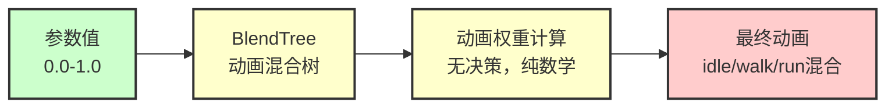
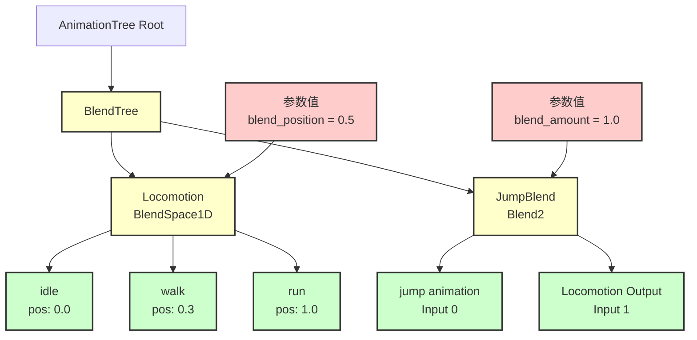
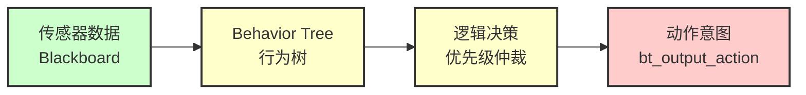
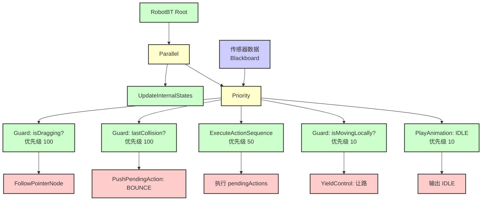
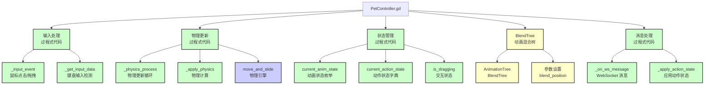
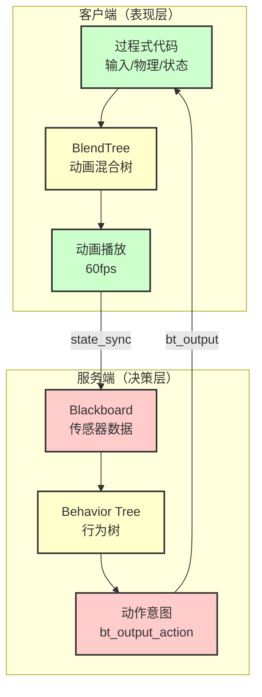
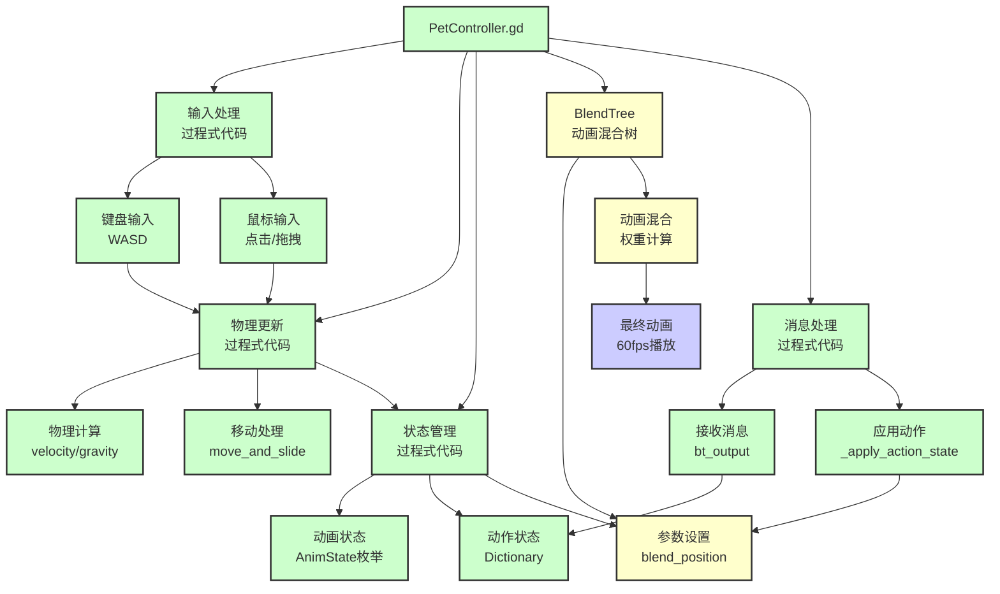
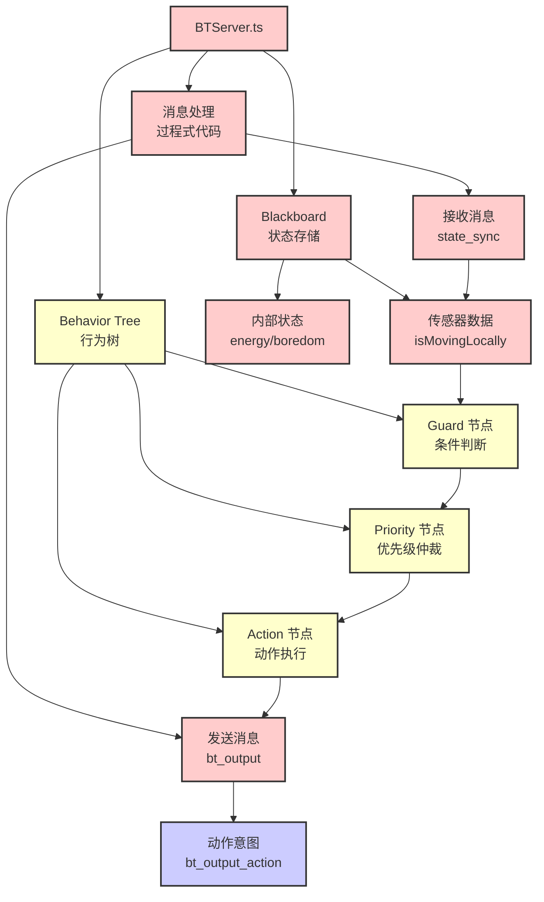
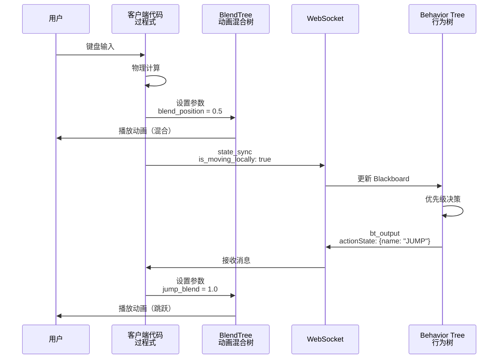

# 客户端与服务端"树"的区别

> **文档版本**: v1.0  
> **更新日期**: 2025-01  
> **目的**: 澄清客户端 BlendTree 与服务端 Behavior Tree 的本质区别

## 核心问题

很多人会混淆：
- **客户端**：BlendTree（动画混合树）
- **服务端**：Behavior Tree（行为树）

它们虽然都叫"树"，但**本质完全不同**。

---

## 快速对比

| 维度 | 客户端 BlendTree | 服务端 Behavior Tree |
|:-----|:----------------|:-------------------|
| **类型** | 动画混合树 | AI 决策树 |
| **用途** | 动画混合 | 逻辑决策 |
| **输入** | 参数值（0.0-1.0） | 传感器数据（Blackboard） |
| **输出** | 动画播放权重 | 动作意图（bt_output_action） |
| **决策** | 无决策（纯计算） | 有决策（优先级仲裁） |
| **树结构** | 动画节点树 | 逻辑节点树 |
| **执行频率** | 每帧（60fps） | 每 100ms（10fps） |

---

## 1. 客户端：BlendTree（动画混合树）

### 1.1 什么是 BlendTree？

**BlendTree** 是 Godot 的 **AnimationTree** 系统中的一种**动画混合树**。

它**不是**：
- ❌ 行为树（Behavior Tree）
- ❌ 决策树（Decision Tree）
- ❌ 状态机（State Machine）

它是：
- ✅ **动画混合树**：根据参数值混合多个动画

### 1.2 BlendTree 的作用



**功能**：
- 接收参数值（如 `blend_position = 0.5`）
- 根据参数值计算动画混合权重
- 输出混合后的动画播放

**示例**：
```gdscript
# 设置参数
animation_tree.set("parameters/locomotion/blend_position", 0.5)

# BlendTree 自动计算：
# - idle (pos: 0.0) 权重: 0%
# - walk (pos: 0.3) 权重: 60%
# - run (pos: 1.0) 权重: 40%

# 最终播放：60% walk + 40% run 的混合动画
```

### 1.3 BlendTree 结构示例



**说明**：
- BlendTree 只是**动画节点树**，用于组织动画资源
- 根据参数值**自动计算**混合权重
- **没有决策逻辑**，纯数学计算

---

## 2. 服务端：Behavior Tree（行为树）

### 2.1 什么是 Behavior Tree？

**Behavior Tree** 是一种 **AI 决策树**，用于逻辑决策。

它**是**：
- ✅ **决策树**：根据条件做出决策
- ✅ **逻辑树**：包含逻辑判断节点
- ✅ **优先级树**：通过优先级仲裁决策

### 2.2 Behavior Tree 的作用



**功能**：
- 读取传感器数据（如 `isMovingLocally = true`）
- 根据条件做出决策（优先级仲裁）
- 输出动作意图（如 `bt_output_action = "JUMP"`）

**示例**：
```typescript
// RobotBT.ts - 行为树决策流程
new Priority({
  children: [
    // 优先级 1：拖拽交互
    new BlackboardGuard({
      key: 'isDragging',
      value: true,
      child: new FollowPointerNode()
    }),
    // 优先级 2：LLM 指令
    new ExecuteActionSequence(),
    // 优先级 3：用户操作观察
    new BlackboardGuard({
      key: (bb) => bb.get('isMovingLocally'),
      child: new YieldControlNode() // 让路：不输出
    }),
    // 优先级 4：默认 IDLE
    new PlayAnimationAction({ action: 'IDLE' })
  ]
})
```

### 2.3 Behavior Tree 结构示例



**说明**：
- Behavior Tree 是**逻辑节点树**，用于组织决策逻辑
- 根据条件**做出决策**（优先级仲裁）
- **有决策逻辑**，不是纯计算

---

## 3. 客户端除了 BlendTree 还有什么？

### 3.1 客户端的逻辑架构

客户端**不仅仅是 BlendTree**，还有大量**过程式代码**：



### 3.2 客户端逻辑分类

| 逻辑类型 | 实现方式 | 示例 |
|:--------|:--------|:-----|
| **输入处理** | 过程式代码 | `_input_event()`, `_get_input_data()` |
| **物理更新** | 过程式代码 | `_physics_process()`, `_apply_physics()` |
| **状态管理** | 过程式代码 | `current_anim_state`, `current_action_state` |
| **动画混合** | BlendTree（树） | `AnimationTree` + `BlendTree` |
| **消息处理** | 过程式代码 | `_on_ws_message()`, `_apply_action_state()` |
| **程序化动画** | 过程式代码 | `_apply_procedural_fx()` |

### 3.3 客户端代码示例

**过程式代码示例**（不是树）：
```gdscript
# PetController.gd - 过程式代码

func _physics_process(delta: float) -> void:
    # 1. 拖拽处理（最高优先级）
    if is_dragging:
        _handle_dragging(delta)
        return
    
    # 2. 输入检测
    var input_data = _get_input_data()
    var movement_data = _calculate_movement(input_data, delta)
    
    # 3. 物理更新
    _apply_physics(movement_data, delta)
    _apply_movement(movement_data, delta)
    move_and_slide()
    
    # 4. 状态更新
    _update_anim_state(movement_data)

func _apply_blendtree_state(state: AnimState) -> void:
    # 设置 BlendTree 参数（调用树，不是树本身）
    match state:
        AnimState.WALK:
            animation_tree.set("parameters/locomotion/blend_position", 0.5)
        AnimState.RUN:
            animation_tree.set("parameters/locomotion/blend_position", 1.0)
```

**BlendTree 配置**（树结构）：
```
AnimationTree
└── BlendTree (树结构)
    ├── Locomotion (BlendSpace1D)
    │   ├── idle (pos: 0.0)
    │   ├── walk (pos: 0.3)
    │   └── run (pos: 1.0)
    └── JumpBlend (Blend2)
        ├── jump animation
        └── Locomotion Output
```

---

## 4. 功能差异对比

### 4.1 核心差异



### 4.2 详细对比表

| 维度 | 客户端 BlendTree | 服务端 Behavior Tree | 客户端其他代码 |
|:-----|:----------------|:-------------------|:-------------|
| **类型** | 动画混合树 | AI 决策树 | 过程式代码 |
| **用途** | 动画混合 | 逻辑决策 | 输入/物理/状态 |
| **输入** | 参数值（0.0-1.0） | 传感器数据 | 用户输入/网络消息 |
| **输出** | 动画播放权重 | 动作意图 | BlendTree 参数/物理更新 |
| **决策** | 无决策（纯计算） | 有决策（优先级仲裁） | 简单条件判断 |
| **树结构** | ✅ 是树（动画节点） | ✅ 是树（逻辑节点） | ❌ 不是树 |
| **执行频率** | 每帧（60fps） | 每 100ms（10fps） | 每帧（60fps） |
| **延迟** | 零延迟（本地） | 网络延迟（100ms） | 零延迟（本地） |

---

## 5. 完整架构图

### 5.1 客户端完整逻辑



### 5.2 服务端逻辑



---

## 6. 总结

### 6.1 关键要点

1. **BlendTree 不是行为树**
   - BlendTree 是**动画混合树**，用于动画混合
   - 它**没有决策逻辑**，只是根据参数值计算动画权重

2. **Behavior Tree 是决策树**
   - Behavior Tree 是**AI 决策树**，用于逻辑决策
   - 它有**决策逻辑**，通过优先级仲裁做出决策

3. **客户端有大量过程式代码**
   - 除了 BlendTree，客户端还有大量**过程式代码**
   - 这些代码处理输入、物理、状态等，**不是树结构**

### 6.2 架构对比

| 层 | 客户端 | 服务端 |
|:---|:------|:------|
| **树结构** | BlendTree（动画混合树） | Behavior Tree（AI 决策树） |
| **其他逻辑** | 过程式代码（输入/物理/状态） | 过程式代码（消息处理） |
| **职责** | 表现层（动画/物理） | 决策层（AI 决策） |

### 6.3 数据流



---

## 7. 常见误解

### ❌ 误解 1：BlendTree 是行为树

**错误理解**：
- "客户端用 BlendTree 做决策"
- "BlendTree 是行为树的一种"

**正确理解**：
- BlendTree 是**动画混合树**，不是行为树
- 它**不做决策**，只是根据参数值混合动画

### ❌ 误解 2：客户端只用树实现

**错误理解**：
- "客户端的逻辑都是用树实现的"
- "BlendTree 就是客户端的全部逻辑"

**正确理解**：
- 客户端有大量**过程式代码**
- BlendTree 只是用于**动画混合**，不是全部逻辑

### ❌ 误解 3：两种树功能相同

**错误理解**：
- "BlendTree 和 Behavior Tree 都是树，功能应该差不多"

**正确理解**：
- BlendTree：**动画混合**（纯计算）
- Behavior Tree：**逻辑决策**（有判断）
- 它们**功能完全不同**

---

**文档结束**

如有疑问，请参考：
- [BlendTree迁移文档.md](./BlendTree迁移文档.md) - BlendTree 详情
- [动作逻辑职责划分(本地状态机vs服务端行为树).md](./动作逻辑职责划分(本地状态机vs服务端行为树).md) - 职责划分