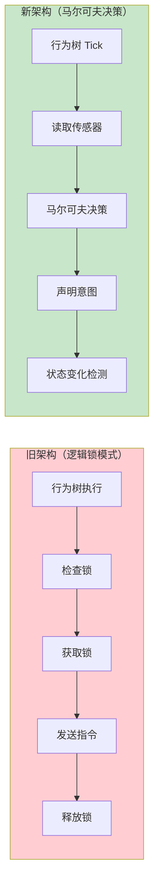
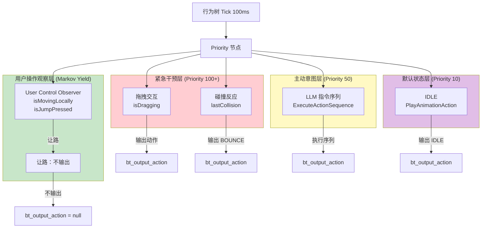
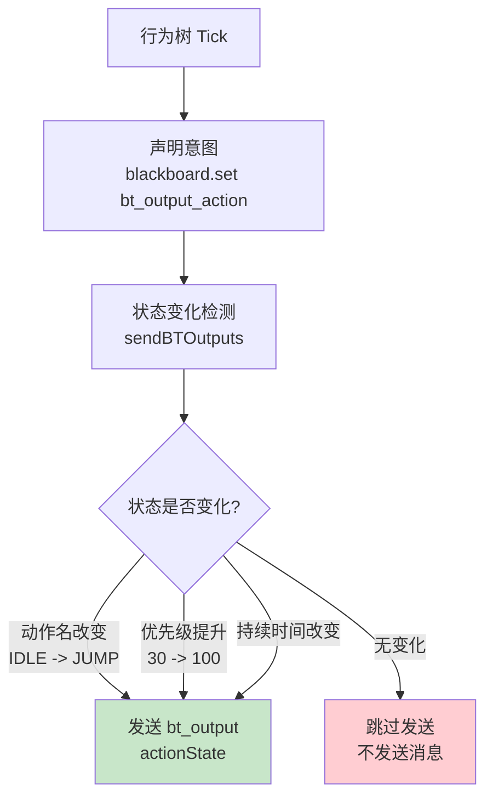
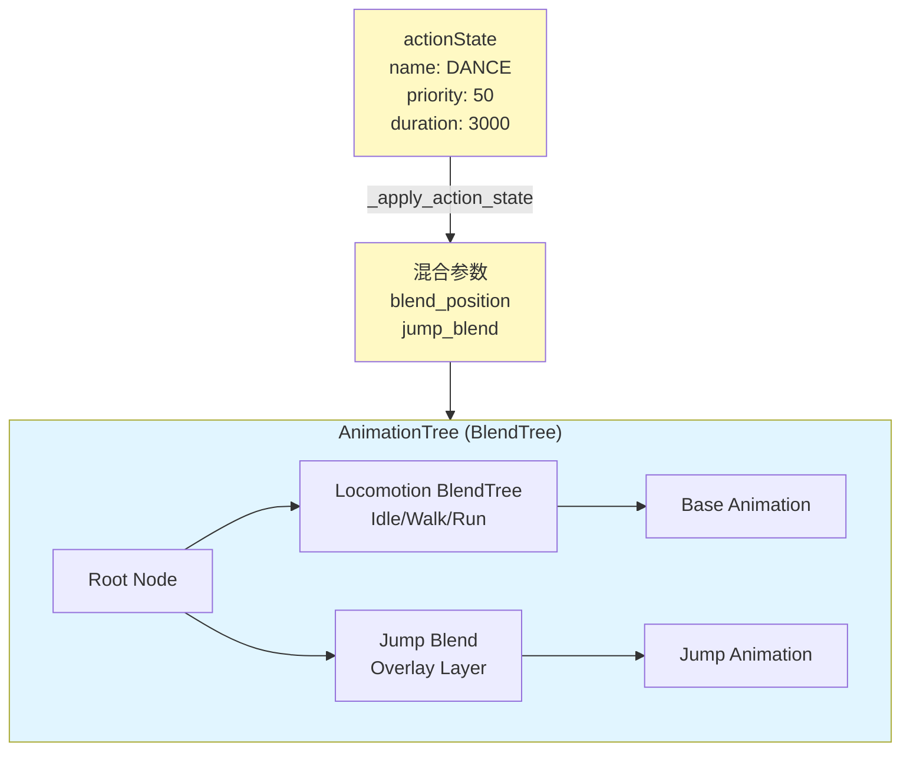
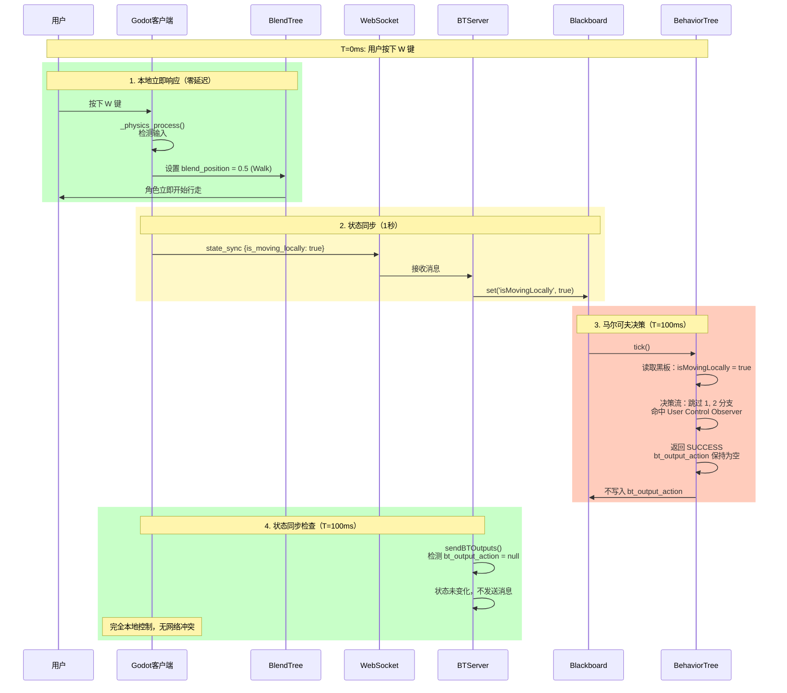
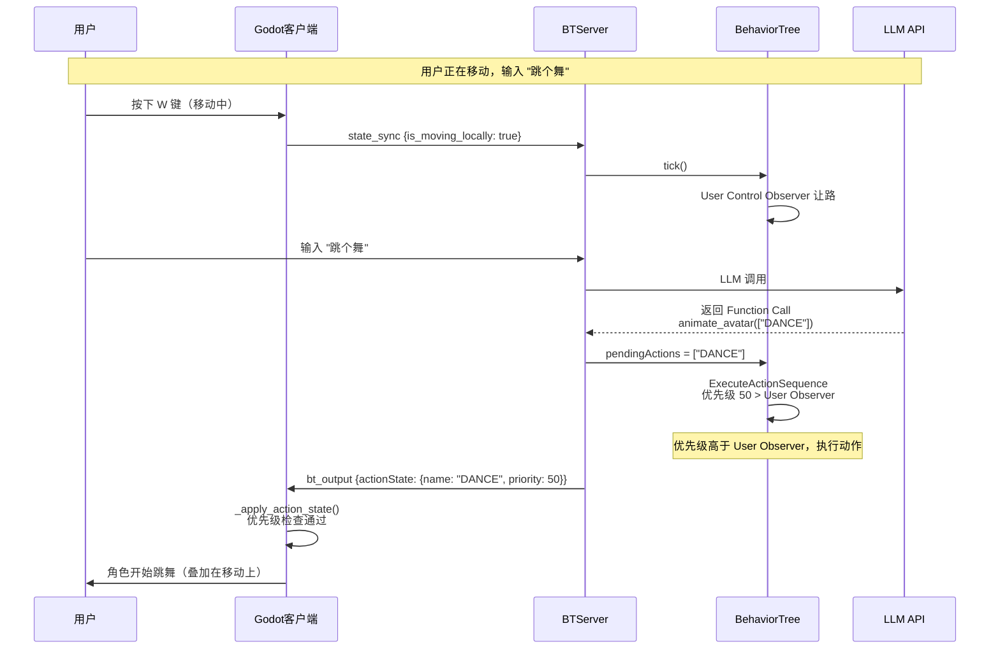
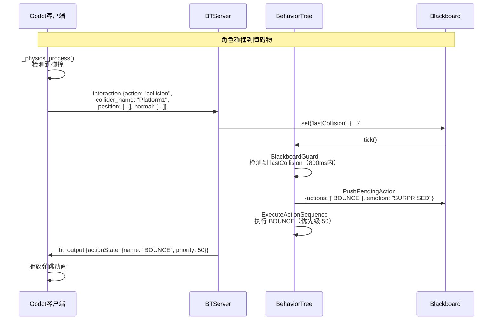
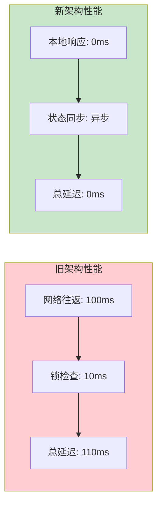
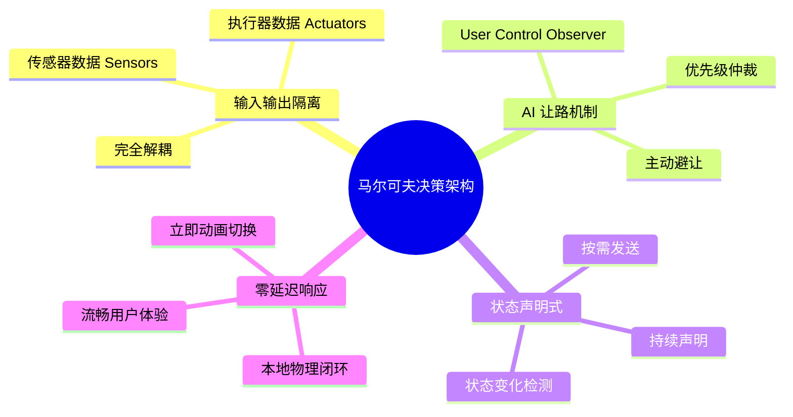

# 状态声明式通信架构改进方案 (马尔可夫决策版)

## 架构升级：从"逻辑锁"到"马尔可夫决策转移"

### 核心设计理念

1. **马尔可夫性质 (Markov Property)**：行为树的每一帧决策仅依赖于黑板上当前的传感器数据（Sensor）。AI 不再需要记住"上一秒我发了什么指令"，而是每一帧都根据当前环境（用户是否在动、是否有 LLM 指令、是否撞墙）重新计算意图。
2. **输入输出彻底隔离 (Input/Output Separation)**：
   - **传感器 (Sensors)**：`isMovingLocally`, `isJumpPressed` 等反映客户端物理事实的变量。
   - **执行器 (Actuator)**：`bt_output_action` 反映 AI 主动干预的意图。
3. **AI 让路机制 (User Control Observer)**：通过行为树的优先级分支，AI 在观测到用户正在操作时，显式做出"放弃输出"的决策，从而消除了指令冲突。

### 架构演进对比



**关键区别**：
- **旧架构**：需要维护锁定状态，容易产生死锁和冲突
- **新架构**：每帧独立决策，基于当前状态，无状态依赖

---

## 行为树决策优先级 (RobotBT.ts)

### 优先级层次

AI 每一帧按以下优先级进行马尔可夫决策：



### 优先级说明

1. **紧急干预层 (Priority 100+)**：拖拽、碰撞。AI 观察到传感器信号，立即接管肢体输出 `bt_output_action`。
2. **主动意图层 (Priority 50)**：执行来自 LLM 的动作序列。
3. **用户操作观察层 (Markov Yield)**：
   - **逻辑**：检查 `isMovingLocally` || `isJumpPressed`。
   - **决策**：如果为真，执行 `node_yield_control` 节点。该节点返回 SUCCESS 但不写入任何输出。
   - **结果**：优先级链条在这里终止，防止流向底层的 IDLE 节点。
4. **默认状态层 (Priority 10)**：只有上述都没有发生时，AI 才输出 `IDLE`。

---

## 通信协议改进：声明式同步

### 1. 持续声明，按需发送

行为树每一帧都在黑板上声明它当前的期望意图（或者声明让路）。`BTServer.ts` 负责检测这个"意图"是否发生了变化：

#### 状态变化检测



**状态变化条件**：
- **动作名改变** (IDLE -> JUMP)
- **优先级提升** (30 -> 100)
- **参数变化** (Duration 改变)

只有发生以上变化时，服务器才会向客户端发送一个 `actionState` 包。

#### 代码实现

```typescript
// BTServer.ts - sendBTOutputs()
let action = blackboard.get('bt_output_action');

if (action) {
  const actionState = {
    name: action,
    duration: actionDuration || 3000,
    priority: actionPriority || 50,
    interruptible: actionInterruptible !== false,
    timestamp: Date.now()
  };
  
  // 声明式通信：只在状态变化时发送
  const stateChanged = action !== client.lastSentAction || 
                     actionPriority > (client.lastActionPriority || 0) ||
                     actionDuration !== (client.lastSentActionDuration || 0);
  
  if (stateChanged) {
    outputs.actionState = actionState;
    client.lastSentAction = action;
    client.lastActionPriority = actionPriority;
  }
}
```

### 2. 客户端表现层 (BlendTree)

客户端不再是简单的"播放器"，而是根据服务端下发的 `actionState` 参数进行平滑混合。

#### BlendTree 结构



**混合层次**：
- **Locomotion 层**：处理基础的 Idle/Walk/Run。
- **Overlay 层**：通过 `jump_blend` 等节点将特殊动作叠加在基础层之上。

---

## 马尔可夫决策流程示例

### 场景 1：用户操控 WASD 过程中，AI 观察



**详细步骤**：

1. **T=0ms (Godot)**：检测到 W 按下，本地瞬间切换 Walk 混合参数，上报 `is_moving_locally: true`。
2. **T=100ms (Server BT)**：
   - 读取黑板：`isMovingLocally = true`。
   - 决策流：跳过 1, 2 分支 -> 命中 3 (User Control Observer)。
   - 决策结果：返回 SUCCESS，且 `bt_output_action` 保持为空。
3. **T=100ms (Server Sync)**：检测到 `bt_output_action` 没有任何新意图，**不发送任何消息**。
4. **结论**：完全本地控制，没有任何网络冲突。

### 场景 2：用户移动中，LLM 指令来了



### 场景 3：碰撞反应



---

## 优势总结

### 核心优势

1. **零冲突**：AI 主动感知并避让用户操作。
2. **无延迟**：本地控制无需等待服务端确认。
3. **逻辑一致性**：所有行为都通过一套优先级规则进行裁决，符合马尔可夫决策模型。

### 架构对比

| 维度 | 旧架构（逻辑锁） | 新架构（马尔可夫决策） |
|:-----|:----------------|:---------------------|
| **状态依赖** | 需要维护锁定状态 | 每帧独立决策，无状态依赖 |
| **冲突处理** | 锁机制，可能死锁 | AI 主动让路，优先级仲裁 |
| **延迟** | 网络往返 + 锁检查 | 零延迟（本地控制） |
| **复杂度** | 需要管理锁的生命周期 | 简单，每帧重新评估 |
| **可扩展性** | 锁机制难以扩展 | 易于添加新决策分支 |

### 性能对比



### 关键设计模式


