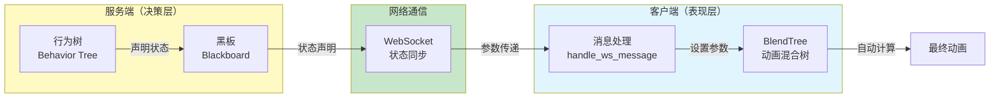

# 状态声明式通信架构改进方案 (马尔可夫决策版)

## 架构升级：从"逻辑锁"到"马尔可夫决策转移"

### 核心设计理念

1. **马尔可夫性质 (Markov Property)**：行为树的每一帧决策仅依赖于黑板上当前的传感器数据（Sensor）。AI 不再需要记住"上一秒我发了什么指令"，而是每一帧都根据当前环境（用户是否在动、是否有 LLM 指令、是否撞墙）重新计算意图。
2. **输入输出彻底隔离 (Input/Output Separation)**：
   - **传感器 (Sensors)**：`isMovingLocally`, `isJumpPressed` 等反映客户端物理事实的变量。
   - **执行器 (Actuator)**：`bt_output_action` 反映 AI 主动干预的意图。
3. **AI 让路机制 (User Control Observer)**：通过行为树的优先级分支，AI 在观测到用户正在操作时，显式做出"放弃输出"的决策，从而消除了指令冲突。

### 架构演进对比


**关键区别**：
- **旧架构**：需要维护锁定状态，容易产生死锁和冲突
- **新架构**：每帧独立决策，基于当前状态，无状态依赖

---

## 行为树决策优先级 (RobotBT.ts)

### 优先级层次

AI 每一帧按以下优先级进行马尔可夫决策：


### 优先级说明

1. **紧急干预层 (Priority 100+)**：拖拽、碰撞。AI 观察到传感器信号，立即接管肢体输出 `bt_output_action`。
2. **主动意图层 (Priority 50)**：执行来自 LLM 的动作序列。
3. **用户操作观察层 (Markov Yield)**：
   - **逻辑**：检查 `isMovingLocally` || `isJumpPressed`。
   - **决策**：如果为真，执行 `node_yield_control` 节点。该节点返回 SUCCESS 但不写入任何输出。
   - **结果**：优先级链条在这里终止，防止流向底层的 IDLE 节点。
4. **默认状态层 (Priority 10)**：只有上述都没有发生时，AI 才输出 `IDLE`。

---

## 通信协议改进：声明式同步

### 1. 持续声明，按需发送

行为树每一帧都在黑板上声明它当前的期望意图（或者声明让路）。`BTServer.ts` 负责检测这个"意图"是否发生了变化：

#### 状态变化检测


**状态变化条件**：
- **动作名改变** (IDLE -> JUMP)
- **优先级提升** (30 -> 100)
- **参数变化** (Duration 改变)

只有发生以上变化时，服务器才会向客户端发送一个 `actionState` 包。

#### 代码实现

```typescript
// BTServer.ts - sendBTOutputs()
let action = blackboard.get('bt_output_action');

if (action) {
  const actionState = {
    name: action,
    duration: actionDuration || 3000,
    priority: actionPriority || 50,
    interruptible: actionInterruptible !== false,
    timestamp: Date.now()
  };
  
  // 声明式通信：只在状态变化时发送
  const stateChanged = action !== client.lastSentAction || 
                     actionPriority > (client.lastActionPriority || 0) ||
                     actionDuration !== (client.lastSentActionDuration || 0);
  
  if (stateChanged) {
    outputs.actionState = actionState;
    client.lastSentAction = action;
    client.lastActionPriority = actionPriority;
  }
}
```

### 2. 客户端表现层 (BlendTree)

客户端不再是简单的"播放器"，而是根据服务端下发的 `actionState` 参数进行平滑混合。

#### BlendTree 结构


**混合层次**：
- **Locomotion 层**：处理基础的 Idle/Walk/Run。
- **Overlay 层**：通过 `jump_blend` 等节点将特殊动作叠加在基础层之上。

---

## 服务端适配：黑板系统与 BlendTree 的天作之合

### 核心理念

服务端适配的核心思想是：**服务端不需要发送"播放动画A"的指令，只需要在黑板上声明"当前状态=行走，速度=0.6"**，客户端的 BlendTree 会自动计算出最符合这个状态的姿态。

这与黑板系统的设计理念完美契合：

1. **声明式通信**：服务端在黑板上声明状态值，而不是发送指令
2. **参数驱动**：客户端 BlendTree 通过参数值自动计算动画混合
3. **解耦设计**：服务端关注"是什么状态"，客户端关注"如何表现"

### 数据流架构



### 详细示例

#### 示例 1：基础移动状态声明

**场景**：AI 决定让角色以中等速度行走

**旧方式（指令式）**：
```typescript
// ❌ 旧方式：发送具体的动画指令
server.send({
  type: "play_animation",
  animation: "walk_medium"
});
```

**新方式（声明式）**：
```typescript
// ✅ 新方式：在黑板上声明状态
// BTServer.ts - 行为树节点执行
blackboard.set('bt_output_action', 'WALK');
blackboard.set('bt_output_action_speed', 0.6);  // 0.0 = idle, 1.0 = run
```

**服务端发送**（仅在状态变化时）：
```json
{
  "type": "bt_output",
  "data": {
    "actionState": {
      "name": "WALK",
      "speed": 0.6,
      "priority": 50,
      "duration": 0  // 0 表示持续状态，直到改变
    }
  }
}
```

**客户端处理**：
```gdscript
# pet_messaging.gd
func apply_action_state(action_state: Dictionary, animation_tree: AnimationTree) -> void:
    var action_name = action_state.get("name", "idle").to_lower()
    var speed = action_state.get("speed", 0.0)  # 获取速度参数
    
    # 直接设置 BlendTree 参数，BlendTree 自动计算混合
    animation_tree.set("parameters/locomotion/blend_position", speed)
    
    # BlendTree 内部逻辑（自动执行）：
    # - speed = 0.0 → idle 动画
    # - speed = 0.3 → walk 动画
    # - speed = 0.6 → walk 动画（更快的速度）
    # - speed = 1.0 → run 动画
```

**BlendTree 自动计算**：
- BlendTree 接收到 `speed = 0.6`
- 查找 Locomotion BlendSpace 中距离 0.6 最近的动画节点
- 自动混合 walk 动画（可能在 0.5-0.7 范围内）
- 无需服务端知道具体的动画名称

#### 示例 2：状态持续生效

**场景**：服务端连续多帧保持相同的行走状态

**服务端行为**：
```typescript
// 第 1 帧：状态改变，发送消息
blackboard.set('bt_output_action', 'WALK');
blackboard.set('bt_output_action_speed', 0.6);
// → 发送 bt_output 消息

// 第 2-10 帧：状态未改变，不发送消息
blackboard.set('bt_output_action', 'WALK');  // 相同值
blackboard.set('bt_output_action_speed', 0.6);  // 相同值
// → 不发送消息（状态变化检测跳过）

// 第 11 帧：状态改变，发送消息
blackboard.set('bt_output_action_speed', 0.8);  // 速度改变
// → 发送 bt_output 消息（仅包含变化的部分）
```

**客户端表现**：
```gdscript
# 第 1 帧：接收消息，设置参数
animation_tree.set("parameters/locomotion/blend_position", 0.6)
# BlendTree 立即切换到 walk 动画

# 第 2-10 帧：未接收新消息
# BlendTree 参数保持 0.6，动画持续播放 walk
# 无需重复设置，参数持续生效（声明式特性）

# 第 11 帧：接收新消息，更新参数
animation_tree.set("parameters/locomotion/blend_position", 0.8)
# BlendTree 平滑过渡到更快的 walk 动画
```

**关键优势**：
- ✅ **网络效率**：状态未改变时不发送消息，减少网络流量
- ✅ **性能优化**：客户端无需每帧更新参数，只在变化时更新
- ✅ **自然过渡**：参数变化时 BlendTree 自动平滑过渡

#### 示例 3：多维状态组合

**场景**：AI 决定让角色在行走的同时执行挥手动作

**服务端状态声明**：
```typescript
// 行为树节点 1：设置基础移动
blackboard.set('bt_output_action', 'WALK');
blackboard.set('bt_output_action_speed', 0.5);

// 行为树节点 2：设置叠加动作（更高优先级）
blackboard.set('bt_output_action', 'WAVE');
blackboard.set('bt_output_action_priority', 70);  // 优先级高于 WALK
blackboard.set('bt_output_action_duration', 2000);
```

**服务端发送**（最终状态）：
```json
{
  "type": "bt_output",
  "data": {
    "actionState": {
      "name": "WAVE",
      "speed": 0.5,  // 基础移动参数（保留）
      "priority": 70,
      "duration": 2000
    }
  }
}
```

**客户端 BlendTree 结构**：
```
AnimationTree (Root)
├─ Locomotion (BlendSpace1D)
│   ├─ idle (pos: 0.0)
│   ├─ walk (pos: 0.5)
│   └─ run (pos: 1.0)
└─ Overlay Layer
    ├─ wave_blend (Blend)
    │   └─ wave_animation
    └─ jump_blend (Blend)
        └─ jump_animation
```

**客户端处理**：
```gdscript
func apply_action_state(action_state: Dictionary, animation_tree: AnimationTree) -> void:
    var action_name = action_state.get("name", "idle").to_lower()
    var speed = action_state.get("speed", 0.0)
    
    # 1. 设置基础移动层（Locomotion）
    animation_tree.set("parameters/locomotion/blend_position", speed)
    # → BlendTree 自动计算：speed = 0.5 → walk 动画
    
    # 2. 设置叠加层（Overlay）
    if action_name == "wave":
        animation_tree.set("parameters/wave_blend/blend_amount", 1.0)
        # → BlendTree 自动叠加：walk + wave 同时播放
    elif action_name == "jump":
        animation_tree.set("parameters/jump_blend/blend_amount", 1.0)
    
    # BlendTree 自动混合结果：
    # - Locomotion 层：walk 动画（下半身）
    # - Overlay 层：wave 动画（上半身）
    # - 最终表现：角色边走路边挥手
```

**BlendTree 自动混合**：
- Locomotion 层持续播放 walk 动画（由 `speed = 0.5` 驱动）
- Overlay 层叠加 wave 动画（由 `wave_blend = 1.0` 驱动）
- 两层自动混合，无需服务端知道具体的混合逻辑

### 与指令式通信的对比

| 维度 | 指令式通信（旧方式） | 声明式通信（新方式） |
|:-----|:-------------------|:-------------------|
| **服务端发送** | "播放 walk_medium 动画" | "状态 = 行走，速度 = 0.6" |
| **客户端处理** | 查找动画 → 播放动画 | 设置参数 → BlendTree 自动计算 |
| **动画切换** | 硬切换，需要过渡配置 | 平滑过渡，参数驱动 |
| **状态组合** | 需要为每种组合创建动画 | 自动混合多层状态 |
| **扩展性** | 新增状态需要新动画 | 新增状态只需调整参数 |
| **网络效率** | 可能每帧发送 | 只在状态变化时发送 |

### 核心优势总结

1. **解耦决策与表现**
   - 服务端：专注于"是什么状态"（决策逻辑）
   - 客户端：专注于"如何表现"（动画表现）
   - 两者通过参数值通信，而非具体的动画名称

2. **自动动画计算**
   - BlendTree 根据参数值自动选择最合适的动画
   - 无需服务端了解客户端的动画资源
   - 支持平滑的中间状态（如 speed = 0.45）

3. **状态持续生效**
   - 参数设置后持续生效，直到改变
   - 符合声明式语义："声明状态"而非"执行指令"
   - 减少网络通信和客户端处理开销

4. **易于扩展**
   - 新增状态维度只需添加参数（如 `emotion`, `health`）
   - 无需修改服务端决策逻辑
   - BlendTree 可以轻松处理多维状态组合

---

## 马尔可夫决策流程示例

### 场景 1：用户操控 WASD 过程中，AI 观察


**详细步骤**：

1. **T=0ms (Godot)**：检测到 W 按下，本地瞬间切换 Walk 混合参数，上报 `is_moving_locally: true`。
2. **T=100ms (Server BT)**：
   - 读取黑板：`isMovingLocally = true`。
   - 决策流：跳过 1, 2 分支 -> 命中 3 (User Control Observer)。
   - 决策结果：返回 SUCCESS，且 `bt_output_action` 保持为空。
3. **T=100ms (Server Sync)**：检测到 `bt_output_action` 没有任何新意图，**不发送任何消息**。
4. **结论**：完全本地控制，没有任何网络冲突。

### 场景 2：用户移动中，LLM 指令来了


### 场景 3：碰撞反应


---

## 优势总结

### 核心优势

1. **零冲突**：AI 主动感知并避让用户操作。
2. **无延迟**：本地控制无需等待服务端确认。
3. **逻辑一致性**：所有行为都通过一套优先级规则进行裁决，符合马尔可夫决策模型。

### 架构对比

| 维度 | 旧架构（逻辑锁） | 新架构（马尔可夫决策） |
|:-----|:----------------|:---------------------|
| **状态依赖** | 需要维护锁定状态 | 每帧独立决策，无状态依赖 |
| **冲突处理** | 锁机制，可能死锁 | AI 主动让路，优先级仲裁 |
| **延迟** | 网络往返 + 锁检查 | 零延迟（本地控制） |
| **复杂度** | 需要管理锁的生命周期 | 简单，每帧重新评估 |
| **可扩展性** | 锁机制难以扩展 | 易于添加新决策分支 |

### 性能对比


### 关键设计模式


