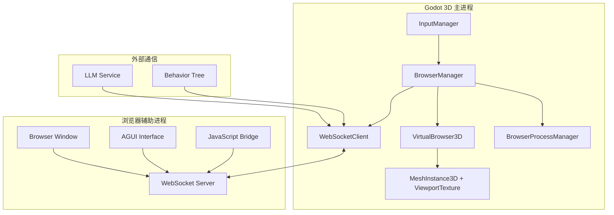

# Godot虚拟浏览器系统设计方案

## 项目概述

基于Three.js编辑器的虚拟浏览器实现经验，为Godot 3D萌宠项目设计一个虚拟浏览器系统。该系统允许在Godot中嵌入和控制浏览器界面，实现AGUI（Advanced GUI）功能。

## 核心需求分析

### 功能目标
- ✅ 在Godot 3D场景中显示浏览器界面
- ✅ 支持浏览器界面操作响应
- ✅ 实现浏览器与Godot的双向通信
- ✅ 支持多种浏览器显示模式（3D窗口、2D覆盖层等）

### 技术挑战
1. **跨进程通信**：Godot与浏览器进程间的实时通信
2. **界面同步**：浏览器界面状态与Godot 3D场景的同步
3. **性能优化**：避免浏览器渲染影响3D性能
4. **兼容性**：支持不同平台的浏览器集成

## 系统架构设计

### 整体架构图



### 核心模块设计

#### 1. 浏览器进程管理器 (BrowserProcessManager.gd)

**功能职责：**
- 启动和管理浏览器进程
- 处理进程间通信
- 监控浏览器状态和健康检查

**核心实现：**
```gdscript
class_name BrowserProcessManager
extends Node

# 浏览器配置
@export var browser_path: String = "chromium"
@export var browser_args: Array = ["--app=http://localhost:3000", "--disable-web-security"]
@export var browser_port: int = 3000

# 进程管理
var browser_process: int = -1
var server_thread: Thread
var is_running: bool = false

# 信号
signal browser_started()
signal browser_stopped()
signal browser_error(error: String)

func start_browser() -> void:
    # 启动浏览器进程
    var args = browser_args.duplicate()
    args.push_front("--remote-debugging-port=" + str(browser_port))

    var output = []
    browser_process = OS.execute(browser_path, args, output, false)

    if browser_process > 0:
        browser_started.emit()
        is_running = true
        _start_health_check()
    else:
        browser_error.emit("Failed to start browser process")

func stop_browser() -> void:
    if browser_process > 0:
        OS.kill(browser_process)
        browser_process = -1
        is_running = false
        browser_stopped.emit()
```

#### 2. 虚拟浏览器3D组件 (VirtualBrowser3D.gd)

**功能职责：**
- 在3D场景中创建浏览器显示窗口
- 处理浏览器纹理的渲染和更新
- 支持窗口的3D变换（位置、旋转、缩放）

**核心实现：**
```gdscript
class_name VirtualBrowser3D
extends MeshInstance3D

# 浏览器显示配置
@export var browser_width: int = 1920
@export var browser_height: int = 1080
@export var pixel_density: float = 1.0

# 3D显示属性
@export var window_depth: float = 0.1
@export var scale_factor: float = 0.01

# 材质和纹理
var browser_material: StandardMaterial3D
var browser_texture: ViewportTexture
var viewport: SubViewport

func _ready() -> void:
    _setup_browser_display()

func _setup_browser_display() -> void:
    # 创建视口用于渲染浏览器内容
    viewport = SubViewport.new()
    viewport.size = Vector2i(browser_width, browser_height)
    viewport.render_target_update_mode = SubViewport.UPDATE_ALWAYS
    add_child(viewport)

    # 创建浏览器材质
    browser_material = StandardMaterial3D.new()
    browser_texture = ViewportTexture.new()
    browser_texture.viewport_path = viewport.get_path()
    browser_material.albedo_texture = browser_texture

    # 设置网格和材质
    var plane_mesh = PlaneMesh.new()
    plane_mesh.size = Vector2(browser_width * scale_factor, browser_height * scale_factor)
    mesh = plane_mesh
    material_override = browser_material

func update_browser_texture(image_data: PackedByteArray) -> void:
    # 从浏览器进程接收图像数据并更新纹理
    var image = Image.new()
    image.load_png_from_buffer(image_data)
    var texture = ImageTexture.create_from_image(image)
    browser_material.albedo_texture = texture
```

#### 3. 浏览器管理器 (BrowserManager.gd)

**功能职责：**
- 协调各个浏览器组件
- 处理用户输入和界面交互
- 管理浏览器状态和模式切换

**核心实现：**
```gdscript
class_name BrowserManager
extends Node

# 组件引用
@onready var process_manager: BrowserProcessManager
@onready var virtual_browser: VirtualBrowser3D
@onready var websocket_client: WebSocketClient

# 浏览器状态
enum BrowserMode {HIDDEN, WINDOW_3D, OVERLAY_2D, FULLSCREEN}
var current_mode: BrowserMode = BrowserMode.WINDOW_3D

# 界面交互
var is_interacting: bool = false
var interaction_start_pos: Vector2
var interaction_camera: Camera3D

func _ready() -> void:
    _initialize_components()
    _connect_signals()

func _initialize_components() -> void:
    # 初始化各个管理器
    process_manager = BrowserProcessManager.new()
    add_child(process_manager)

    virtual_browser = VirtualBrowser3D.new()
    add_child(virtual_browser)

    # 使用现有的WebSocketClient，但需要扩展协议
    websocket_client = get_node("../WebSocketClient")

func _connect_signals() -> void:
    process_manager.browser_started.connect(_on_browser_started)
    websocket_client.message_received.connect(_on_websocket_message)

func _on_browser_started() -> void:
    print("Browser started successfully")
    virtual_browser.show()
    _send_browser_ready()

func _on_websocket_message(type: String, data: Dictionary) -> void:
    match type:
        "browser_event":
            _handle_browser_event(data)
        "browser_screenshot":
            _handle_browser_screenshot(data)

func _handle_browser_event(event_data: Dictionary) -> void:
    # 处理浏览器界面事件
    var event_type = event_data.get("type", "")
    match event_type:
        "click":
            _handle_click_event(event_data)
        "input":
            _handle_input_event(event_data)
        "navigation":
            _handle_navigation_event(event_data)
```

#### 4. WebSocket通信协议扩展

**浏览器事件消息格式：**
```json
{
  "type": "browser_event",
  "timestamp": 1234567890,
  "data": {
    "event_type": "click",
    "element_id": "button_1",
    "position": [100, 200],
    "element_data": {
      "tag": "button",
      "text": "提交",
      "attributes": {}
    }
  }
}
```

**Godot控制消息格式：**
```json
{
  "type": "browser_control",
  "timestamp": 1234567890,
  "data": {
    "action": "navigate",
    "url": "http://localhost:3000/agui"
  }
}
```

## 实现方案对比

### 方案一：进程分离架构（推荐）
**优点：**
- Godot专注于3D渲染性能
- 浏览器可以使用完整的Web技术栈
- 更好的隔离性和稳定性

**缺点：**
- 需要处理跨进程通信
- 相对复杂的部署配置

### 方案二：Godot内嵌WebView
**优点：**
- 简化的架构和部署
- 更紧密的集成

**缺点：**
- Godot WebView功能有限
- 可能影响3D渲染性能
- 浏览器功能受限

### 方案三：纹理流式传输
**优点：**
- 完全在Godot内控制
- 灵活的3D显示方式

**缺点：**
- 需要实现浏览器截图流
- 交互响应延迟较大
- 性能开销较大

## 技术实现路线

### Phase 1: 基础框架 (1周)
- [ ] BrowserProcessManager实现
- [ ] 基础WebSocket协议扩展
- [ ] 浏览器进程启动和监控

### Phase 2: 3D显示系统 (1周)
- [ ] VirtualBrowser3D组件开发
- [ ] 浏览器纹理渲染和更新
- [ ] 3D窗口变换控制

### Phase 3: 交互系统 (1周)
- [ ] 界面事件捕获和转发
- [ ] Godot输入映射到浏览器
- [ ] 交互反馈和状态同步

### Phase 4: AGUI集成 (1周)
- [ ] AGUI界面设计和实现
- [ ] 与现有萌宠系统的集成
- [ ] 高级交互功能（拖拽、缩放等）

### Phase 5: 优化和测试 (1周)
- [ ] 性能优化
- [ ] 跨平台兼容性测试
- [ ] 错误处理和异常恢复

## 与现有系统的集成

### 修改点
1. **WebSocketClient.gd**: 扩展通信协议支持浏览器事件
2. **InputManager.gd**: 添加浏览器交互输入处理
3. **UIManager.gd**: 集成虚拟浏览器显示模式
4. **主场景**: 添加BrowserManager节点

### 配置要求
- **浏览器路径**: 需要配置系统浏览器路径
- **端口配置**: WebSocket和HTTP服务器端口
- **安全设置**: 本地开发环境的安全策略调整

## 性能优化策略

### 渲染优化
- **选择性更新**: 只在浏览器内容变化时更新纹理
- **分辨率控制**: 根据距离调整浏览器显示分辨率
- **LOD系统**: 远距离时降低更新频率

### 通信优化
- **事件过滤**: 只转发必要的浏览器事件
- **批量更新**: 合并多个小的状态更新
- **压缩传输**: 对截图数据进行压缩

### 内存管理
- **纹理池**: 复用浏览器纹理资源
- **垃圾回收**: 及时清理不用的浏览器实例
- **进程监控**: 防止浏览器进程内存泄漏

## 总结

这个虚拟浏览器系统通过进程分离架构实现了Godot与浏览器的深度集成，为3D萌宠项目提供了强大的AGUI能力。系统设计充分考虑了性能、兼容性和可维护性，为后续的功能扩展奠定了坚实的基础。

关键技术创新点：
1. **混合渲染架构**: 结合Godot 3D渲染和浏览器2D界面
2. **实时通信协议**: 双向WebSocket通信确保界面同步
3. **3D界面交互**: 支持在3D空间中自然地操作浏览器界面
4. **跨平台兼容**: 支持多种部署和运行环境