针对你的几个核心疑问，我从技术细节和架构设计两个维度来为你解答：

### 1. 关于动画：基础动画是骨骼动画吗？

是的，它们是标准的骨骼动画（Skeletal Animation）。* 你在 Godot 中使用的 player.glb 模型包含了骨骼（Skeleton）和预制的动画序列（AnimationPlayer）。

* Idle、Walk、Run、Jump、Wave 这些动作是美术在建模软件里刷好权重、摆好关键帧后导出的。
* 我在代码里实现的 SPIN、BOUNCE、FLY 则是程序化动画（Procedural Animation），它们不依赖骨骼预设，而是通过代码实时修改模型的 Rotation 和 Position。

### 2. JS 服务端的行为树（trees/.ts）放哪？ 结论：依然放在 JS 服务端，作为“逻辑大脑”。 不要放进 Godot：虽然 Godot 也有行为树插件（比如 Beehave），但我们目前的架构是 “云端大脑”。

* 原因：

1. 扩展性：JS 服务端可以非常方便地调用 LLM（Kimi/Gemini）、访问数据库、处理复杂的业务逻辑。
2. 统一性：如果你以后想做一个网页版、一个 Godot 版，甚至一个手机版，所有的“性格”和“行为决策”都在 JS 服务端，你只需要换个“表现壳子”就行。
3. 算力分配：复杂的行为决策交给 Node.js，Godot 只专注渲染和物理，互不干扰。

### 3. Godot 本地用状态机还是行为树？

强烈建议：Godot 本地用【状态机】，JS 服务端用【行为树】。

虽然行为树看起来更“先进”，但在 Godot 客户端这一层，状态机（State Machine） 反而更有优势：

| 特性     | 本地状态机 (AnimationTree)               | 服务端行为树 (BehaviorTree.js)                     |
| -------- | ---------------------------------------- | -------------------------------------------------- |
| 擅长领域 | 动画过渡、物理同步、即时反馈             | 逻辑决策、意图理解、长时记忆                       |
| 开发难度 | Godot 原生支持，拖拽连线即可             | 纯代码控制，逻辑极其灵活                           |
| 表现力   | 完美处理“走路”到“停下”的平滑淡入淡出 | 擅长处理“肚子饿了”→“找食物”→“吃”的复杂流程 |
| 确定性   | 状态明确（要么在跳，要么在跑）           | 行为多样（可能有多种决策路径）                     |

总结你的担忧：* Godot 实现复杂行为树确实比 JS 麻烦（需要额外插件或大量 GDScript 代码）。

* 当前的完美配合：
* Godot 状态机：是个“优秀的执行者”，它负责把动作做得漂亮、过渡得丝滑。
* JS 行为树：是个“聪明的决策者”，它负责告诉执行者“现在该跳舞了”或者“现在该去角落睡觉了”。

### 4. 关于黑板系统与数据同步

你的思考非常正确！

虽然位置是由 Godot 实时控制的，但 JS 服务端必须通过黑板系统获得这个位置。* 位置同步的意义：JS 的行为树里可以写一个 BlackboardGuard。如果黑板上的 penguinPosition 显示机器人在悬崖边上，行为树就会拒绝 LLM 提出的“向前冲”指令，并下发一个“受惊”的动作。

* 物理引擎信息：我们不需要同步完整的物理网格，只需要同步“事件”。
* 比如：Godot 检测到碰撞，发一个消息给 JS。
* JS 的黑板记录下 lastCollision: "Wall"。
* 行为树感知到撞墙了，输出动作 CRY。

### 5. 为人形机器人生成动作

我已经为你的人形机器人增加了几个程序化动作（在 pet_controller.gd 中），你可以通过 JS 服务端发送以下指令来测试：* SPIN（自转）

* BOUNCE（弹跳）
* FLY（悬浮飞行）
* ROLL（侧滚）

现在，你的架构已经非常清晰了：1. 用户输入 -> 发给 JS。

1. JS 意图树 -> 调用 LLM。
2. JS 行为树 -> 结合黑板里的 Godot 位置/状态信息，做出决策。
3. JS 输出指令 -> 发回 Godot。
4. Godot 状态机 -> 播放对应的骨骼动画或程序化动作。

你对这个“双层”架构（本地状态机+服务端行为树）还有什么疑虑吗？如果没有，我们可以尝试写一个更复杂的行为树逻辑，比如：“如果能量低且被玩家拖拽，就表现出极度疲劳和挣扎”。

## 6. 架构图示：云端大脑与本地身体的协作

为了更直观地理解两者的协作，我们使用 Mermaid 图表展示当前系统的决策与表现流：

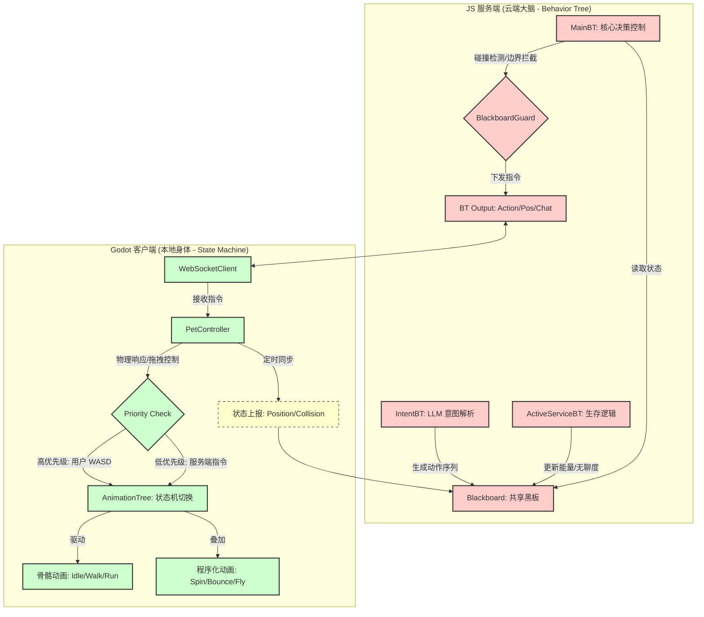

### 协作细节说明：

1.  **黑板感知 (Blackboard Sensing)**：JS 端的 `BlackboardGuard` 已经实现了函数式判定。例如，当 Godot 上报碰撞事件后，`MainBT` 会立即检测到 `lastCollision` 的时间戳，从而中断普通移动，强制执行 `SHOCKED` 动作。
2.  **边界拦截 (Boundary Blocking)**：黑板实时记录机器人的 3D 坐标。如果 `BlackboardGuard` 发现位置超出安全区（例如 `abs(x) > 8`），它会主动下发回归原点的指令，这就像是大脑的"自我保护本能"。
3.  **双层执行**：Godot 的 `AnimationTree` 状态机保证了动画的丝滑过渡（如 Crossfade），而 JS 行为树则负责把多个动作串联成有意义的行为序列。

## 7. 详细架构图：完整的服务端行为树与客户端状态机结构

下面是一个包含所有细节的完整架构图，展示了服务端行为树的每个节点和客户端状态机的每个状态：

### 7.1 JS 服务端行为树系统架构图

```mermaid
graph TB
    subgraph "Blackboard 共享黑板"
        BB1[energy: 能量值<br/>0-100]
        BB2[boredom: 无聊度<br/>0-100]
        BB3[penguinPosition: 位置 xyz<br/>从客户端同步]
        BB4[lastCollision: 碰撞信息<br/>collider_name position normal timestamp]
        BB5[isDragging: 拖拽状态<br/>从客户端同步]
        BB6[hasNewInput: 新输入标记<br/>用户输入触发]
        BB7[chatHistory: 对话历史<br/>与用户的对话记录]
        BB8[llmSettings: LLM配置<br/>provider, apiKey, modelName]
        BB9[pendingActions: 待执行动作队列<br/>IntentBT写入, MainBT读取]
        BB10[pendingEmotion: 待执行表情<br/>IntentBT写入, EmotionBT读取]
    end
    
    subgraph "MainBT 主行为树 60fps"
        M1[Parallel 并行节点]
        M2[UpdateInternalStatesAction<br/>每帧更新能量无聊度]
        M3[Priority 优先级节点]
        M4[BlackboardGuard: isDragging?]
        M5[FollowPointerNode 跟随鼠标]
        M6[BlackboardGuard: Has Collision?]
        M7[MemSequence: 碰撞反应]
        M8[PushPendingAction BOUNCE]
        M9[Wait 清理碰撞标记]
        M10[BlackboardGuard: Near Edge?]
        M11[MemSequence: 边界回归]
        M12[PushPendingAction SURPRISE]
        M13[MoveToTargetAction 回到安全区]
        M14[ExecuteActionSequence<br/>执行待执行动作队列]
        M15[BlackboardGuard: Energy low?]
        M16[MemSequence: 睡眠流程]
        M17[MoveToTargetAction 走向家]
        M18[PlayAnimationAction SLEEP]
        M19[PlayAnimationAction SURPRISE 醒来]
        M20[MoveToTargetAction 回中心]
        M21[ReturnToOriginAction 回归原点]
        M22[BlackboardGuard: Is Clicked?]
        M23[MemSequence: 点击交互]
        M24[PlayAnimationAction WAVE]
        M25[PlayAnimationAction IDLE]
        M26[PlayAnimationAction IDLE 默认闲置]
        
        M1 --> M2
        M1 --> M3
        M3 --> M4
        M3 --> M6
        M3 --> M10
        M3 --> M14
        M3 --> M15
        M3 --> M21
        M3 --> M22
        M3 --> M26
        M4 --> M5
        M6 --> M7
        M7 --> M8
        M7 --> M9
        M10 --> M11
        M11 --> M12
        M11 --> M13
        M15 --> M16
        M16 --> M17
        M16 --> M18
        M16 --> M19
        M16 --> M20
        M22 --> M23
        M23 --> M24
        M23 --> M25
    end
    
    subgraph "ActiveServiceBT 主动服务树 2s/次"
        A1[BlackboardGuard: boredom high?]
        A2[BlackboardGuard: energy enough?]
        A3[MemSequence: 自主行为序列]
        A4[PushPendingAction WAVE]
        A5[Wait 10s]
        A6[PushPendingAction THINK]
        A7[Wait 8s]
        A8[PushPendingAction LOOK_LEFT]
        A9[PushPendingAction LOOK_RIGHT]
        A10[Wait 15s]
        
        A1 --> A2
        A2 --> A3
        A3 --> A4
        A3 --> A5
        A3 --> A6
        A3 --> A7
        A3 --> A8
        A3 --> A9
        A3 --> A10
    end
    
    subgraph "IntentBT 意图理解树 按需执行"
        I1[BlackboardGuard: hasNewInput?]
        I2[MemSequence: LLM流程]
        I3[LLMCallNode 调用LLM<br/>Kimi/Gemini]
        I4[FunctionExecNode 执行结果<br/>转换为动作序列]
        
        I1 --> I2
        I2 --> I3
        I2 --> I4
    end
    
    subgraph "EmotionBT 情绪树 10fps"
        E1[Priority 优先级节点]
        E2[PlayExpressionAction<br/>执行LLM表情指令]
        E3[UpdateEmotionAction<br/>自动情绪更新]
        
        E1 --> E2
        E1 --> E3
    end
    
    subgraph "BT Output 行为树输出"
        O1[actionState: 动作状态<br/>name priority duration interruptible]
        O2[move_to: 移动指令<br/>target xyz坐标]
        O3[set_position: 位置同步<br/>pos xyz坐标]
        O4[chat: 对话消息<br/>文本回复]
    end
    
    subgraph "WebSocket Server 端口 8080"
        WS1[WebSocket Server<br/>双向通信]
    end
    
    BB1 --> M2
    BB2 --> M2
    BB3 --> M10
    BB4 --> M6
    BB5 --> M4
    BB6 --> I1
    BB7 --> I3
    BB8 --> I3
    BB9 --> M14
    BB10 --> E2
    
    M2 --> BB1
    M2 --> BB2
    M5 --> O2
    M5 --> O3
    M8 --> BB9
    M12 --> BB9
    M13 --> O2
    M17 --> O2
    M18 --> O1
    M19 --> O1
    M20 --> O2
    M21 --> O2
    M24 --> O1
    M25 --> O1
    M26 --> O1
    M14 --> O1
    
    A4 --> BB9
    A6 --> BB9
    A8 --> BB9
    A9 --> BB9
    
    I4 --> BB9
    I4 --> BB10
    I4 --> O4
    
    E2 --> O1
    
    O1 --> WS1
    O2 --> WS1
    O3 --> WS1
    O4 --> WS1
    
    
    classDef brain fill:#ffcccc,stroke:#333,stroke-width:2px
    classDef blackboard fill:#ffffcc,stroke:#333,stroke-width:2px
    classDef output fill:#ccffcc,stroke:#333,stroke-width:2px
    classDef sync fill:#cccccc,stroke:#333,stroke-width:2px,stroke-dasharray: 5 5
    
    class M1,M2,M3,M4,M5,M6,M7,M8,M9,M10,M11,M12,M13,M14,M15,M16,M17,M18,M19,M20,M21,M22,M23,M24,M25,M26,A1,A2,A3,A4,A5,A6,A7,A8,A9,A10,I1,I2,I3,I4,E1,E2,E3 brain
    class BB1,BB2,BB3,BB4,BB5,BB6,BB7,BB8,BB9,BB10 blackboard
    class O1,O2,O3,O4 output
    class WS1 sync
```

### 7.2 Godot 客户端状态机系统架构图

```mermaid
graph TB
    subgraph "WebSocket Client"
        WS2[WebSocket Client<br/>连接服务端]
    end
    
    subgraph "PetController 控制器"
        PC1[消息接收处理<br/>_on_ws_message]
        PC2[优先级判断逻辑<br/>拖拽优先于WASD优先于服务端指令]
        PC3[动作状态管理<br/>current_action_state<br/>name priority duration start_time]
        PC4[动作队列<br/>action_queue<br/>存储待执行序列]
        PC5[拖拽处理<br/>_handle_dragging<br/>跟随鼠标位置]
        PC6[碰撞检测上报<br/>_send_interaction collision]
        PC7[状态同步上报<br/>_send_state_sync<br/>1秒/次]
    end
    
    subgraph "AnimationTree 状态机"
        AT1[State Machine<br/>状态机根节点]
        AT2[Idle 闲置状态]
        AT3[Walk 走路状态]
        AT4[Run 跑步状态]
        AT5[Jump 跳跃状态]
        AT6[Wave 挥手状态]
        AT7[Transition 状态过渡<br/>Crossfade 平滑淡入淡出]
    end
    
    subgraph "骨骼动画 Skeletal Animation"
        SK1[Idle 骨骼动画<br/>player.glb 导出]
        SK2[Walk 骨骼动画<br/>player.glb 导出]
        SK3[Run 骨骼动画<br/>player.glb 导出]
        SK4[Jump 骨骼动画<br/>player.glb 导出]
        SK5[Wave 骨骼动画<br/>player.glb 导出]
    end
    
    subgraph "程序化动画 Procedural Animation"
        PR1[Spin 自转<br/>rotation.y持续累加<br/>delta * 20]
        PR2[Bounce 弹跳<br/>position.y正弦波动<br/>abs sin * 0.5]
        PR3[Fly 悬浮飞行<br/>position.y正弦悬浮<br/>1.0 + sin * 0.2]
        PR4[Roll 侧滚<br/>rotation.z持续累加<br/>delta * 15]
        PR5[呼吸感 Idle呼吸<br/>position.y = sin * 0.05<br/>仅在Idle时]
    end
    
    subgraph "物理引擎 Physics Engine"
        PH1[CharacterBody3D<br/>角色物理体]
        PH2[重力处理<br/>地面检测和重力应用]
        PH3[速度计算<br/>根据输入和服务端指令]
        PH4[碰撞检测<br/>get_slide_collision]
        PH5[移动同步<br/>move_and_slide]
    end
    
    subgraph "用户输入 User Input"
        UI1[WASD 移动<br/>Input.get_vector]
        UI2[Shift 跑步<br/>Input.is_key_pressed]
        UI3[Space 跳跃<br/>Input.is_action_just_pressed]
        UI4[鼠标点击<br/>_input_event]
        UI5[鼠标拖拽<br/>_input_event]
    end
    
    WS2 --> PC1
    PC1 --> PC2
    PC2 --> PC3
    PC3 --> PC4
    PC2 --> PC5
    
    PC3 --> AT1
    PC2 --> AT1
    UI1 --> PC2
    UI2 --> PC2
    UI3 --> PC2
    UI4 --> PC1
    UI5 --> PC5
    
    AT1 --> AT2
    AT1 --> AT3
    AT1 --> AT4
    AT1 --> AT5
    AT1 --> AT6
    AT7 --> AT2
    AT7 --> AT3
    AT7 --> AT4
    AT7 --> AT5
    AT7 --> AT6
    
    AT2 --> SK1
    AT3 --> SK2
    AT4 --> SK3
    AT5 --> SK4
    AT6 --> SK5
    
    PC3 --> PR1
    PC3 --> PR2
    PC3 --> PR3
    PC3 --> PR4
    AT2 --> PR5
    
    PC1 --> PH1
    PC2 --> PH1
    PC5 --> PH1
    UI1 --> PH1
    UI2 --> PH1
    UI3 --> PH1
    
    PH1 --> PH2
    PH1 --> PH3
    PH1 --> PH4
    PH1 --> PH5
    
    PH4 --> PC6
    PH5 --> PC7
    PC6 --> WS2
    PC7 --> WS2
    
    classDef body fill:#ccffcc,stroke:#333,stroke-width:2px
    classDef animation fill:#ccccff,stroke:#333,stroke-width:2px
    classDef procedural fill:#ffccff,stroke:#333,stroke-width:2px
    classDef physics fill:#ccffff,stroke:#333,stroke-width:2px
    classDef input fill:#ffcc99,stroke:#333,stroke-width:2px
    classDef sync fill:#cccccc,stroke:#333,stroke-width:2px,stroke-dasharray: 5 5
    
    class PC1,PC2,PC3,PC4,PC5,PC6,PC7 body
    class AT1,AT2,AT3,AT4,AT5,AT6,AT7,SK1,SK2,SK3,SK4,SK5 animation
    class PR1,PR2,PR3,PR4,PR5 procedural
    class PH1,PH2,PH3,PH4,PH5 physics
    class UI1,UI2,UI3,UI4,UI5 input
    class WS2 sync
```

#### 7.1.1 Blackboard 共享黑板详细结构

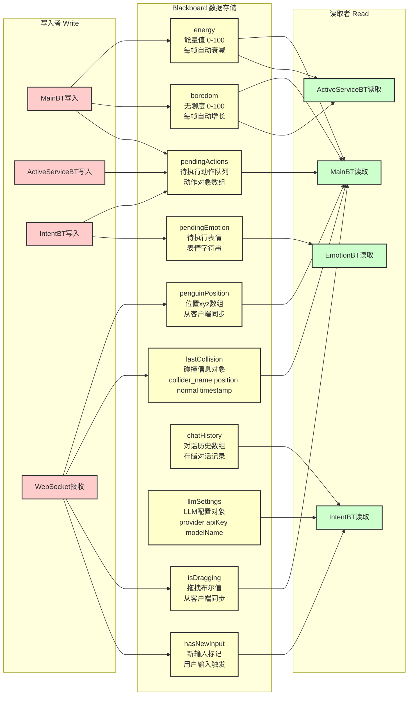

#### 7.1.2 MainBT 主行为树详细结构

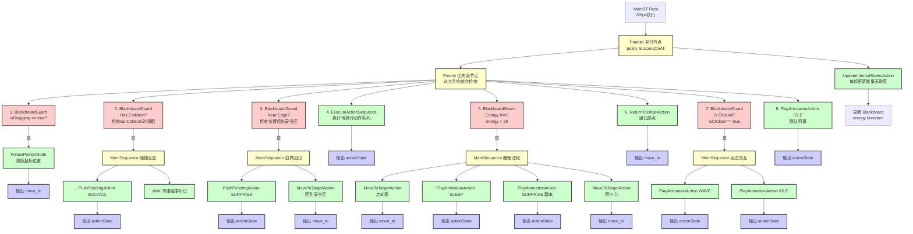

#### 7.1.3 ActiveServiceBT 主动服务树详细结构

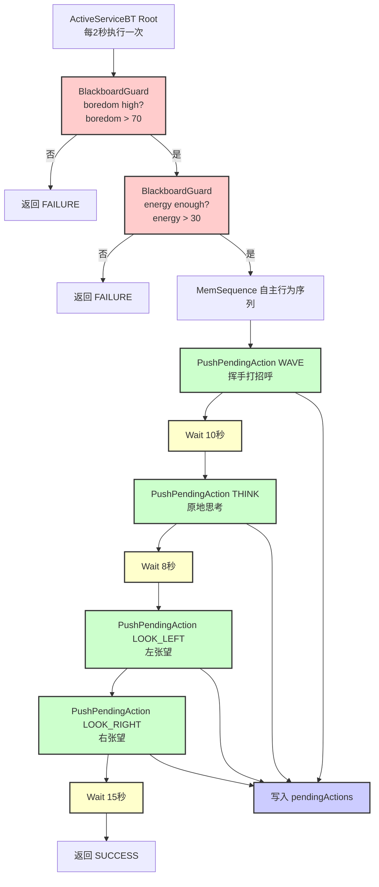

#### 7.1.4 IntentBT 意图理解树详细结构

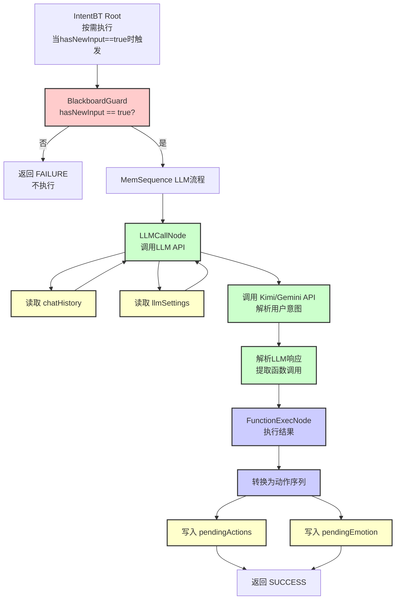

#### 7.1.5 EmotionBT 情绪树详细结构

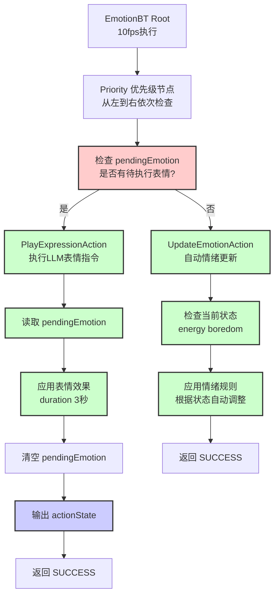

#### 7.1.6 BT Output 行为树输出详细结构

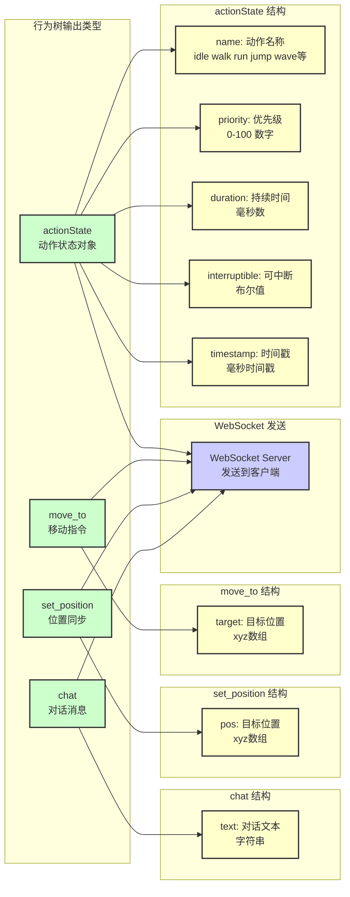

#### 7.2.1 PetController 控制器详细结构

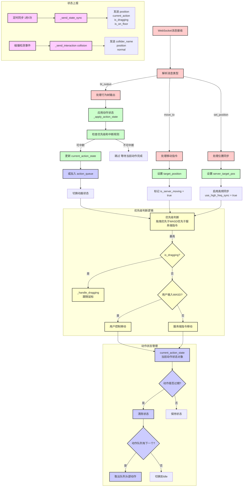

#### 7.2.2 AnimationTree 状态机详细结构

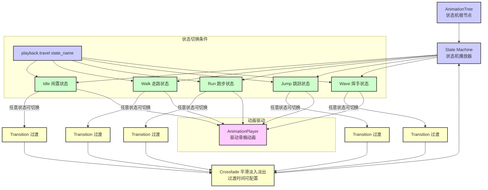

#### 7.2.3 骨骼动画系统详细结构

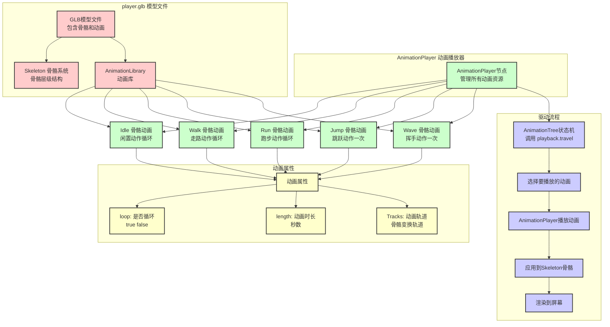

#### 7.2.4 程序化动画系统详细结构

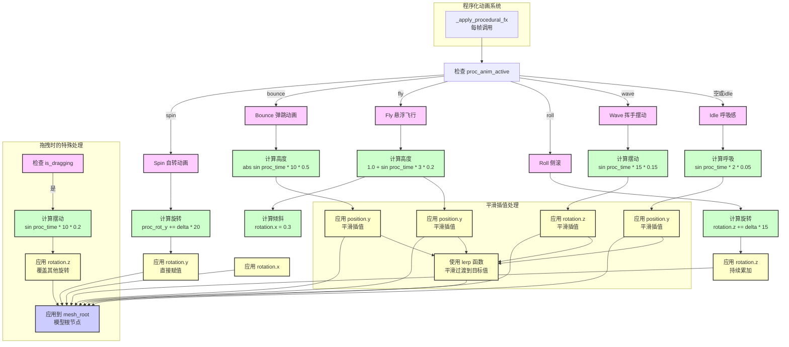

#### 7.2.5 物理引擎系统详细结构

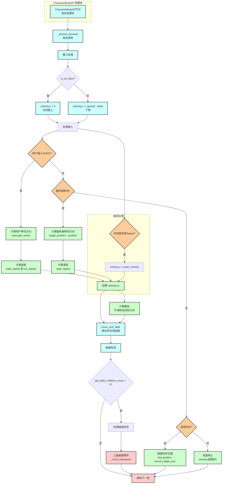

#### 7.2.6 用户输入系统详细结构

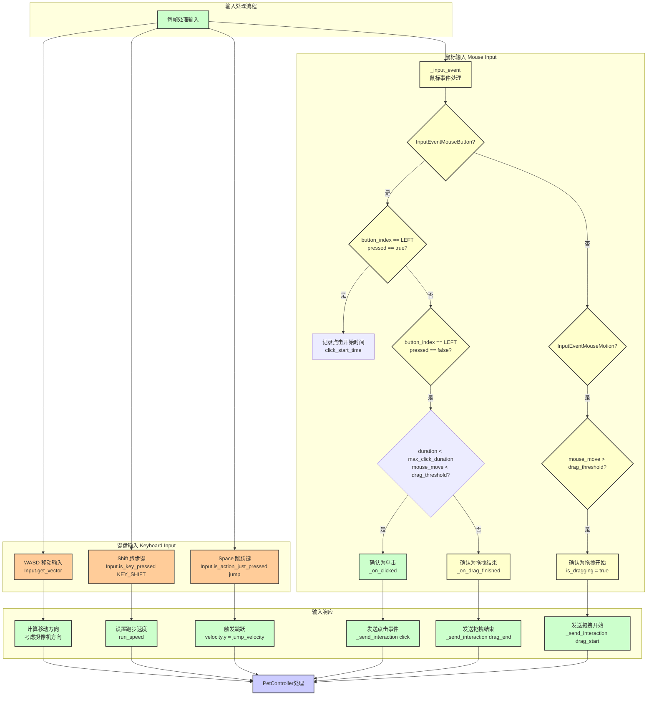

### 详细架构说明：

#### 7.1 服务端行为树系统结构

**MainBT（主行为树，60fps执行）**：
- **Parallel节点**：并行执行状态更新和优先级决策
  - **UpdateInternalStatesAction**：每帧更新能量（energy）和无聊度（boredom）
  - **Priority节点**：按优先级从高到低检查以下条件：
    1. **拖拽中断**：`isDragging = true` → `FollowPointerNode` 跟随鼠标
    2. **碰撞处理**：检测到碰撞 → `PushPendingAction(BOUNCE)` + 清理碰撞标记
    3. **边界检查**：位置超出安全区 → `PushPendingAction(SURPRISE)` + `MoveToTargetAction` 回归
    4. **执行动作序列**：`ExecuteActionSequence` 执行待执行队列中的动作
    5. **睡眠逻辑**：能量 < 20 → 走向家 → `SLEEP` → 醒来 → 回中心
    6. **自动归位**：`ReturnToOriginAction` 回归舞台中心
    7. **点击交互**：`isClicked = true` → `WAVE` → `IDLE`
    8. **默认闲置**：`PlayAnimationAction(IDLE)`

**ActiveServiceBT（主动服务树，每2秒执行）**：
- 当无聊度 > 70 且能量 > 30 时，执行自主行为序列：
  - `WAVE` → 等待10秒 → `THINK` → 等待8秒 → `LOOK_LEFT` → `LOOK_RIGHT` → 等待15秒

**IntentBT（意图理解树，按需执行）**：
- 当 `hasNewInput = true` 时触发：
  - `LLMCallNode`：调用 LLM（Kimi/Gemini）解析用户意图
  - `FunctionExecNode`：将 LLM 返回的函数调用转换为动作序列，写入 `pendingActions`

**EmotionBT（情绪树，10fps执行）**：
- **Priority节点**：优先执行 LLM 表情指令，否则自动更新情绪

#### 7.2 黑板系统（Blackboard）数据

- **energy**：能量值（0-100）
- **boredom**：无聊度（0-100）
- **penguinPosition**：当前位置 [x, y, z]
- **lastCollision**：最后碰撞信息 {collider_name, position, normal, timestamp}
- **isDragging**：是否正在拖拽
- **hasNewInput**：是否有新输入需要处理
- **chatHistory**：对话历史记录
- **llmSettings**：LLM 配置（provider, apiKey, baseUrl, modelName）
- **pendingActions**：待执行动作队列
- **pendingEmotion**：待执行表情

#### 7.3 客户端状态机系统结构

**PetController（控制器）**：
- **消息接收处理**：接收 `bt_output`、`move_to`、`set_position` 消息
- **优先级判断**：拖拽 > WASD > 服务端指令
- **动作状态管理**：`current_action_state` 包含 {name, priority, duration, start_time, interruptible}
- **动作队列**：`action_queue` 存储待执行的动作序列
- **拖拽处理**：`_handle_dragging` 跟随鼠标位置，播放 Jump 动画
- **碰撞检测上报**：检测到碰撞时发送 `collision` 消息
- **状态同步上报**：每秒发送位置、当前动作、拖拽状态

**AnimationTree（状态机）**：
- **状态节点**：Idle、Walk、Run、Jump、Wave
- **过渡节点**：使用 Crossfade 实现平滑过渡

**骨骼动画（Skeletal Animation）**：
- 从 `.glb` 模型导出的预制动画序列
- 通过 AnimationPlayer 驱动骨骼系统

**程序化动画（Procedural Animation）**：
- **Spin**：`rotation.y += delta * 20`（持续累加旋转）
- **Bounce**：`position.y = abs(sin(time * 10)) * 0.5`（弹跳效果）
- **Fly**：`position.y = 1.0 + sin(time * 3) * 0.2`（悬浮飞行）
- **Roll**：`rotation.z += delta * 15`（侧滚）
- **呼吸感**：Idle 时 `position.y = sin(time * 2) * 0.05`

**物理引擎（Physics Engine）**：
- **CharacterBody3D**：角色物理体
- **重力处理**：地面检测和应用重力
- **速度计算**：根据输入和服务端指令计算速度
- **碰撞检测**：检测与环境的碰撞
- **移动同步**：`move_and_slide` 处理移动和碰撞

#### 7.4 数据流向

1. **服务端 → 客户端**：
   - `actionState` → `PetController._apply_action_state` → `AnimationTree` 或程序化动画
   - `move_to` → `target_position` → 物理引擎移动
   - `set_position` → `server_target_pos` → 高频插值同步

2. **客户端 → 服务端**：
   - `state_sync`（每秒）→ 更新 `penguinPosition`、`isDragging`
   - `collision`（事件触发）→ 更新 `lastCollision`
   - `click`（用户点击）→ 触发点击交互
   - `drag_start/end`（用户拖拽）→ 更新 `isDragging`

3. **行为树 → 黑板 → 行为树**：
   - `MainBT` 读取 `isDragging`、`lastCollision`、`penguinPosition`
   - `ActiveServiceBT` 读取 `boredom`、`energy`
   - `IntentBT` 读取 `hasNewInput`、`chatHistory`
   - 所有行为树写入 `pendingActions`、`pendingEmotion`
