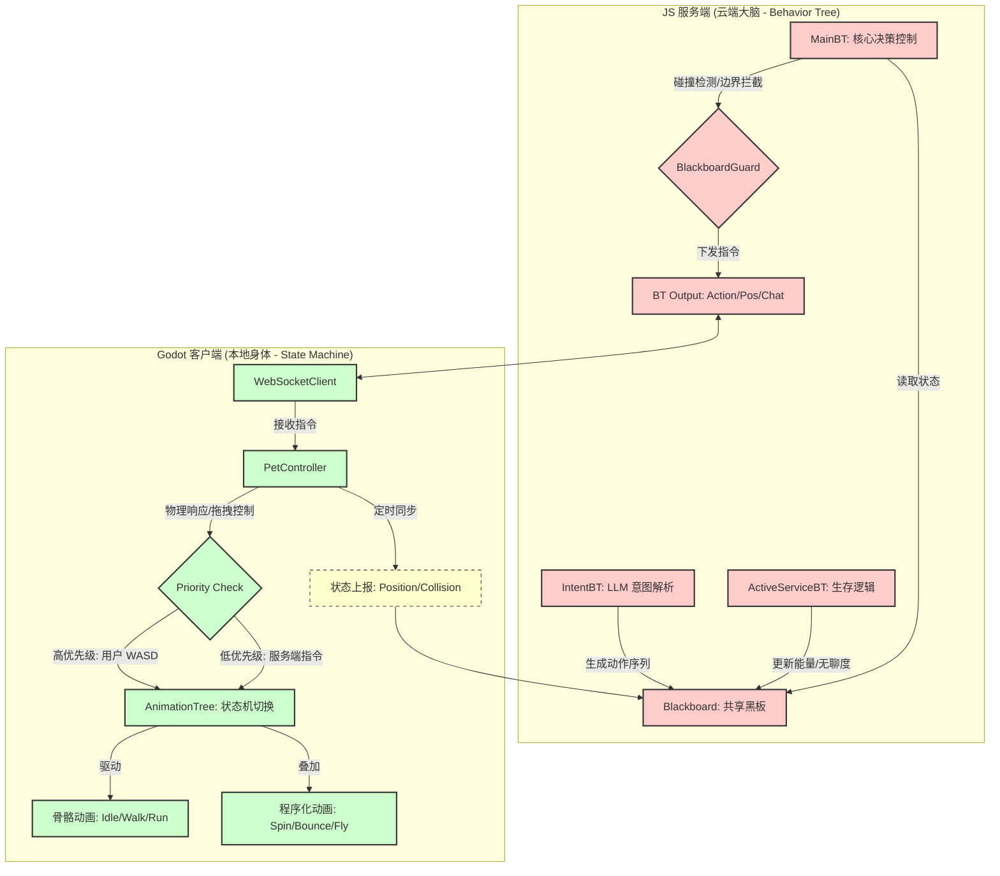

针对你的几个核心疑问，我从技术细节和架构设计两个维度来为你解答：

### 1. 关于动画：基础动画是骨骼动画吗？

是的，它们是标准的骨骼动画（Skeletal Animation）。* 你在 Godot 中使用的 player.glb 模型包含了骨骼（Skeleton）和预制的动画序列（AnimationPlayer）。

* Idle、Walk、Run、Jump、Wave 这些动作是美术在建模软件里刷好权重、摆好关键帧后导出的。
* 我在代码里实现的 SPIN、BOUNCE、FLY 则是程序化动画（Procedural Animation），它们不依赖骨骼预设，而是通过代码实时修改模型的 Rotation 和 Position。

### 2. JS 服务端的行为树（trees/.ts）放哪？ 结论：依然放在 JS 服务端，作为“逻辑大脑”。 不要放进 Godot：虽然 Godot 也有行为树插件（比如 Beehave），但我们目前的架构是 “云端大脑”。

* 原因：

1. 扩展性：JS 服务端可以非常方便地调用 LLM（Kimi/Gemini）、访问数据库、处理复杂的业务逻辑。
2. 统一性：如果你以后想做一个网页版、一个 Godot 版，甚至一个手机版，所有的“性格”和“行为决策”都在 JS 服务端，你只需要换个“表现壳子”就行。
3. 算力分配：复杂的行为决策交给 Node.js，Godot 只专注渲染和物理，互不干扰。

### 3. Godot 本地用状态机还是行为树？

强烈建议：Godot 本地用【状态机】，JS 服务端用【行为树】。

虽然行为树看起来更“先进”，但在 Godot 客户端这一层，状态机（State Machine） 反而更有优势：

| 特性     | 本地状态机 (AnimationTree)               | 服务端行为树 (BehaviorTree.js)                     |
| -------- | ---------------------------------------- | -------------------------------------------------- |
| 擅长领域 | 动画过渡、物理同步、即时反馈             | 逻辑决策、意图理解、长时记忆                       |
| 开发难度 | Godot 原生支持，拖拽连线即可             | 纯代码控制，逻辑极其灵活                           |
| 表现力   | 完美处理“走路”到“停下”的平滑淡入淡出 | 擅长处理“肚子饿了”→“找食物”→“吃”的复杂流程 |
| 确定性   | 状态明确（要么在跳，要么在跑）           | 行为多样（可能有多种决策路径）                     |

总结你的担忧：* Godot 实现复杂行为树确实比 JS 麻烦（需要额外插件或大量 GDScript 代码）。

* 当前的完美配合：
* Godot 状态机：是个“优秀的执行者”，它负责把动作做得漂亮、过渡得丝滑。
* JS 行为树：是个“聪明的决策者”，它负责告诉执行者“现在该跳舞了”或者“现在该去角落睡觉了”。

### 4. 关于黑板系统与数据同步

你的思考非常正确！

虽然位置是由 Godot 实时控制的，但 JS 服务端必须通过黑板系统获得这个位置。* 位置同步的意义：JS 的行为树里可以写一个 BlackboardGuard。如果黑板上的 penguinPosition 显示机器人在悬崖边上，行为树就会拒绝 LLM 提出的“向前冲”指令，并下发一个“受惊”的动作。

* 物理引擎信息：我们不需要同步完整的物理网格，只需要同步“事件”。
* 比如：Godot 检测到碰撞，发一个消息给 JS。
* JS 的黑板记录下 lastCollision: "Wall"。
* 行为树感知到撞墙了，输出动作 CRY。

### 5. 为人形机器人生成动作

我已经为你的人形机器人增加了几个程序化动作（在 pet_controller.gd 中），你可以通过 JS 服务端发送以下指令来测试：* SPIN（自转）

* BOUNCE（弹跳）
* FLY（悬浮飞行）
* ROLL（侧滚）

现在，你的架构已经非常清晰了：1. 用户输入 -> 发给 JS。

1. JS 意图树 -> 调用 LLM。
2. JS 行为树 -> 结合黑板里的 Godot 位置/状态信息，做出决策。
3. JS 输出指令 -> 发回 Godot。
4. Godot 状态机 -> 播放对应的骨骼动画或程序化动作。

你对这个“双层”架构（本地状态机+服务端行为树）还有什么疑虑吗？如果没有，我们可以尝试写一个更复杂的行为树逻辑，比如：“如果能量低且被玩家拖拽，就表现出极度疲劳和挣扎”。

## 6. 架构图示：云端大脑与本地身体的协作

为了更直观地理解两者的协作，我们使用 Mermaid 图表展示当前系统的决策与表现流：

### 协作细节说明：

1.  **黑板感知 (Blackboard Sensing)**：JS 端的 `BlackboardGuard` 已经实现了函数式判定。例如，当 Godot 上报碰撞事件后，`MainBT` 会立即检测到 `lastCollision` 的时间戳，从而中断普通移动，强制执行 `SHOCKED` 动作。
2.  **边界拦截 (Boundary Blocking)**：黑板实时记录机器人的 3D 坐标。如果 `BlackboardGuard` 发现位置超出安全区（例如 `abs(x) > 8`），它会主动下发回归原点的指令，这就像是大脑的“自我保护本能”。
3.  **双层执行**：Godot 的 `AnimationTree` 状态机保证了动画的丝滑过渡（如 Crossfade），而 JS 行为树则负责把多个动作串联成有意义的行为序列。
