> **⚠️ 重要说明**：本文档为历史文档，描述的是早期的架构设计考虑。
> 
> **当前架构状态**（2025-01）：
> - ✅ **已迁移到 BlendTree**：Godot 客户端当前使用 **AnimationTree + BlendTree** 实现参数驱动的动画系统
> - ❌ **不再使用状态机**：已从 StateMachine 完全迁移到 BlendTree
> 
> **当前架构的详细文档**：
> - 📄 [Godot客户端产品技术设计文档.md](./Godot客户端产品技术设计文档.md) - 完整的技术设计文档
> - 📄 [BlendTree迁移文档.md](./BlendTree迁移文档.md) - BlendTree 迁移详情
> - 📄 [动作逻辑职责划分(本地状态机vs服务端行为树).md](./动作逻辑职责划分(本地状态机vs服务端行为树).md) - 职责划分（注意：标题中的"状态机"是历史命名）
> 
> **建议**：如需要了解当前架构，请参考上述文档。本文档保留作为历史参考。

---

针对你的几个核心疑问，我从技术细节和架构设计两个维度来为你解答：

### 1. 关于动画：基础动画是骨骼动画吗？

是的，它们是标准的骨骼动画（Skeletal Animation）。* 你在 Godot 中使用的 player.glb 模型包含了骨骼（Skeleton）和预制的动画序列（AnimationPlayer）。

* Idle、Walk、Run、Jump、Wave 这些动作是美术在建模软件里刷好权重、摆好关键帧后导出的。
* 我在代码里实现的 SPIN、BOUNCE、FLY 则是程序化动画（Procedural Animation），它们不依赖骨骼预设，而是通过代码实时修改模型的 Rotation 和 Position。

### 2. JS 服务端的行为树（trees/.ts）放哪？ 结论：依然放在 JS 服务端，作为“逻辑大脑”。 不要放进 Godot：虽然 Godot 也有行为树插件（比如 Beehave），但我们目前的架构是 “云端大脑”。

* 原因：

1. 扩展性：JS 服务端可以非常方便地调用 LLM（Kimi/Gemini）、访问数据库、处理复杂的业务逻辑。
2. 统一性：如果你以后想做一个网页版、一个 Godot 版，甚至一个手机版，所有的“性格”和“行为决策”都在 JS 服务端，你只需要换个“表现壳子”就行。
3. 算力分配：复杂的行为决策交给 Node.js，Godot 只专注渲染和物理，互不干扰。

### 3. Godot 本地用状态机还是行为树？

**强烈建议：Godot 本地用【BlendTree】，JS 服务端用【行为树】。**

由于我们采用了**马尔科夫性 (Markov Property)** 的设计理念，决策权完全留在 AI 手中，现在的权责划分如下：

| 特性 | 本地 BlendTree (Godot) | 服务端行为树 (BehaviorTree.js) |
| :--- | :--- | :--- |
| **马尔科夫性** | **表现层转换**：根据当前参数（输入）驱动到目标姿态。 | **决策层转移**：根据当前黑板状态（Sensor）转移到下一个意图（Actuator）。 |
| **职责** | 动画混合、物理即时响应。 | 意图理解、主动干预、逻辑锁定。 |
| **隔离模式** | **物理输入优先**：键盘输入立即覆盖表现。 | **输入输出隔离**：感知状态（Sensor）与 下达指令（Actuator）分离。 |

#### 马尔科夫性在项目中的体现：
1.  **输入即传感器**：Godot 本地物理状态（isMovingLocally, isJumpPressed）作为黑板的 `Sensor` 输入给 AI。
2.  **AI 无记忆状态转移**：行为树每一帧根据这些传感器输入，重新评估优先级，并决定当前的意图（Actuator）。
3.  **不干预决策**：当 AI 检测到用户正在操作时，它会主动决策进入“静默状态”，从而让出控制权，而不是被动地被拦截。

### 4. 关于黑板系统与数据同步 (案例一：输入输出双变量模式)

我们采用了类似 `pointerPosition` (输入) 与 `bt_output_position` (输出) 的双变量隔离模式：
*   **Sensor Key (输入)**：`isMovingLocally` (客户端物理情况)。
*   **Actuator Key (输出)**：`bt_output_action` (AI 主动干预意图)。

这种模式确保了：当你自己控制 WASD 时，AI 观察到了你的行为，它会决策“保持静默”，因此不会产生回声指令，彻底消除了网络冲突带来的延迟。

### 5. 为人形机器人生成动作

我已经为你的人形机器人增加了几个程序化动作（在 pet_controller.gd 中），你可以通过 JS 服务端发送以下指令来测试：* SPIN（自转）

* BOUNCE（弹跳）
* FLY（悬浮飞行）
* ROLL（侧滚）

现在，你的架构已经非常清晰了：1. 用户输入 -> 发给 JS。

1. JS 意图树 -> 调用 LLM。
2. JS 行为树 -> 结合黑板里的 Godot 位置/状态信息，做出决策。
3. JS 输出指令 -> 发回 Godot。
4. Godot 状态机 -> 播放对应的骨骼动画或程序化动作。

你对这个“双层”架构（本地状态机+服务端行为树）还有什么疑虑吗？如果没有，我们可以尝试写一个更复杂的行为树逻辑，比如：“如果能量低且被玩家拖拽，就表现出极度疲劳和挣扎”。

## 6. 架构图示：云端大脑与本地身体的协作

为了更直观地理解两者的协作，我们使用 Mermaid 图表展示当前系统的决策与表现流：

```mermaid
graph TD
    subgraph "JS 服务端 (云端大脑 - Behavior Tree)"
        A[IntentBT: LLM 意图解析] -->|生成动作序列| B[Blackboard: 共享黑板]
        C[ActiveServiceBT: 生存逻辑] -->|更新能量/无聊度| B
        D[MainBT: 核心决策控制] -->|读取状态| B
        D -->|碰撞检测/边界拦截| E{BlackboardGuard}
        E -->|下发指令| F[BT Output: Action/Pos/Chat]
    end

    subgraph "Godot 客户端 (本地身体 - BlendTree)"
        G[WebSocketClient] -->|接收指令| H[PetController]
        H -->|物理响应/拖拽控制| I{Markov Decision}
        I -->|高优先级: 用户物理交互| J[AnimationTree: 参数即时驱动]
        I -->|低优先级: AI 意图指令| J
        J -->|驱动| K[骨骼动画: Idle/Walk/Run]
        J -->|叠加| L[程序化动画: Spin/Bounce/Fly]
        H -->|传感器上报| M[Sensor Sync: isMovingLocally/Pos]
    end

    F <--> G
    M --> B

    classDef brain fill:#ffcccc,stroke:#333,stroke-width:2px;
    classDef body fill:#ccffcc,stroke:#333,stroke-width:2px;
    classDef sync fill:#ffffcc,stroke:#333,stroke-dasharray: 5 5;

    class A,B,C,D,E,F brain;
    class G,H,I,J,K,L body;
    class M sync;
```

### 协作细节说明：

1.  **马尔科夫感知 (Markovian Sensing)**：JS 端的行为树不再保留“历史命令”，而是每一帧观察黑板上的 `Sensor` 数据（如 `isMovingLocally`）。
2.  **输入输出隔离**：我们通过双变量模式（感知变量 vs 指令变量）解决了网络回声问题。用户自己 WASD 时，AI 观察并决策“不发出干扰指令”。
3.  **双层执行**：Godot 的 `AnimationTree` (BlendTree) 保证了参数到动作的即时转换，而 JS 行为树则负责高层逻辑转移。

## 7. 详细架构图：完整的服务端行为树与客户端状态机结构

下面是一个包含所有细节的完整架构图，展示了服务端行为树的每个节点和客户端状态机的每个状态：

### 7.1 JS 服务端行为树系统架构图

```mermaid
graph TB
    subgraph "Blackboard 共享黑板"
        BB1[energy: 能量值<br/>0-100]
        BB2[boredom: 无聊度<br/>0-100]
        BB3[penguinPosition: 位置 xyz<br/>从客户端同步]
        BB4[lastCollision: 碰撞信息<br/>collider_name position normal timestamp]
        BB5[isDragging: 拖拽状态<br/>从客户端同步]
        BB6[hasNewInput: 新输入标记<br/>用户输入触发]
        BB7[chatHistory: 对话历史<br/>与用户的对话记录]
        BB8[llmSettings: LLM配置<br/>provider, apiKey, modelName]
        BB9[pendingActions: 待执行动作队列<br/>IntentBT写入, MainBT读取]
        BB10[pendingEmotion: 待执行表情<br/>IntentBT写入, EmotionBT读取]
    end
    
    subgraph "MainBT 主行为树 60fps"
        M1[Parallel 并行节点]
        M2[UpdateInternalStatesAction<br/>每帧更新能量无聊度]
        M3[Priority 优先级节点]
        M4[BlackboardGuard: isDragging?]
        M5[FollowPointerNode 跟随鼠标]
        M6[BlackboardGuard: Has Collision?]
        M7[MemSequence: 碰撞反应]
        M8[PushPendingAction BOUNCE]
        M9[Wait 清理碰撞标记]
        M10[BlackboardGuard: Near Edge?]
        M11[MemSequence: 边界回归]
        M12[PushPendingAction SURPRISE]
        M13[MoveToTargetAction 回到安全区]
        M14[ExecuteActionSequence<br/>执行待执行动作队列]
        M15[BlackboardGuard: Energy low?]
        M16[MemSequence: 睡眠流程]
        M17[MoveToTargetAction 走向家]
        M18[PlayAnimationAction SLEEP]
        M19[PlayAnimationAction SURPRISE 醒来]
        M20[MoveToTargetAction 回中心]
        M21[ReturnToOriginAction 回归原点]
        M22[BlackboardGuard: Is Clicked?]
        M23[MemSequence: 点击交互]
        M24[PlayAnimationAction WAVE]
        M25[PlayAnimationAction IDLE]
        M26[PlayAnimationAction IDLE 默认闲置]
        
        M1 --> M2
        M1 --> M3
        M3 --> M4
        M3 --> M6
        M3 --> M10
        M3 --> M14
        M3 --> M15
        M3 --> M21
        M3 --> M22
        M3 --> M26
        M4 --> M5
        M6 --> M7
        M7 --> M8
        M7 --> M9
        M10 --> M11
        M11 --> M12
        M11 --> M13
        M15 --> M16
        M16 --> M17
        M16 --> M18
        M16 --> M19
        M16 --> M20
        M22 --> M23
        M23 --> M24
        M23 --> M25
    end
    
    subgraph "ActiveServiceBT 主动服务树 2s/次"
        A1[BlackboardGuard: boredom high?]
        A2[BlackboardGuard: energy enough?]
        A3[MemSequence: 自主行为序列]
        A4[PushPendingAction WAVE]
        A5[Wait 10s]
        A6[PushPendingAction THINK]
        A7[Wait 8s]
        A8[PushPendingAction LOOK_LEFT]
        A9[PushPendingAction LOOK_RIGHT]
        A10[Wait 15s]
        
        A1 --> A2
        A2 --> A3
        A3 --> A4
        A3 --> A5
        A3 --> A6
        A3 --> A7
        A3 --> A8
        A3 --> A9
        A3 --> A10
    end
    
    subgraph "IntentBT 意图理解树 按需执行"
        I1[BlackboardGuard: hasNewInput?]
        I2[MemSequence: LLM流程]
        I3[LLMCallNode 调用LLM<br/>Kimi/Gemini]
        I4[FunctionExecNode 执行结果<br/>转换为动作序列]
        
        I1 --> I2
        I2 --> I3
        I2 --> I4
    end
    
    subgraph "EmotionBT 情绪树 10fps"
        E1[Priority 优先级节点]
        E2[PlayExpressionAction<br/>执行LLM表情指令]
        E3[UpdateEmotionAction<br/>自动情绪更新]
        
        E1 --> E2
        E1 --> E3
    end
    
    subgraph "BT Output 行为树输出"
        O1[actionState: 动作状态<br/>name priority duration interruptible]
        O2[move_to: 移动指令<br/>target xyz坐标]
        O3[set_position: 位置同步<br/>pos xyz坐标]
        O4[chat: 对话消息<br/>文本回复]
    end
    
    subgraph "WebSocket Server 端口 8080"
        WS1[WebSocket Server<br/>双向通信]
    end
    
    BB1 --> M2
    BB2 --> M2
    BB3 --> M10
    BB4 --> M6
    BB5 --> M4
    BB6 --> I1
    BB7 --> I3
    BB8 --> I3
    BB9 --> M14
    BB10 --> E2
    
    M2 --> BB1
    M2 --> BB2
    M5 --> O2
    M5 --> O3
    M8 --> BB9
    M12 --> BB9
    M13 --> O2
    M17 --> O2
    M18 --> O1
    M19 --> O1
    M20 --> O2
    M21 --> O2
    M24 --> O1
    M25 --> O1
    M26 --> O1
    M14 --> O1
    
    A4 --> BB9
    A6 --> BB9
    A8 --> BB9
    A9 --> BB9
    
    I4 --> BB9
    I4 --> BB10
    I4 --> O4
    
    E2 --> O1
    
    O1 --> WS1
    O2 --> WS1
    O3 --> WS1
    O4 --> WS1
    
    
    classDef brain fill:#ffcccc,stroke:#333,stroke-width:2px
    classDef blackboard fill:#ffffcc,stroke:#333,stroke-width:2px
    classDef output fill:#ccffcc,stroke:#333,stroke-width:2px
    classDef sync fill:#cccccc,stroke:#333,stroke-width:2px,stroke-dasharray: 5 5
    
    class M1,M2,M3,M4,M5,M6,M7,M8,M9,M10,M11,M12,M13,M14,M15,M16,M17,M18,M19,M20,M21,M22,M23,M24,M25,M26,A1,A2,A3,A4,A5,A6,A7,A8,A9,A10,I1,I2,I3,I4,E1,E2,E3 brain
    class BB1,BB2,BB3,BB4,BB5,BB6,BB7,BB8,BB9,BB10 blackboard
    class O1,O2,O3,O4 output
    class WS1 sync
```

### 7.2 Godot 客户端状态机系统架构图

```mermaid
graph TB
    subgraph "WebSocket Client"
        WS2[WebSocket Client<br/>连接服务端]
    end
    
    subgraph "PetController 控制器"
        PC1[消息接收处理<br/>_on_ws_message]
        PC2[优先级判断逻辑<br/>拖拽优先于WASD优先于服务端指令]
        PC3[动作状态管理<br/>current_action_state<br/>name priority duration start_time]
        PC4[动作队列<br/>action_queue<br/>存储待执行序列]
        PC5[拖拽处理<br/>_handle_dragging<br/>跟随鼠标位置]
        PC6[碰撞检测上报<br/>_send_interaction collision]
        PC7[状态同步上报<br/>_send_state_sync<br/>1秒/次]
    end
    
    subgraph "AnimationTree 状态机"
        AT1[State Machine<br/>状态机根节点]
        AT2[Idle 闲置状态]
        AT3[Walk 走路状态]
        AT4[Run 跑步状态]
        AT5[Jump 跳跃状态]
        AT6[Wave 挥手状态]
        AT7[Transition 状态过渡<br/>Crossfade 平滑淡入淡出]
    end
    
    subgraph "骨骼动画 Skeletal Animation"
        SK1[Idle 骨骼动画<br/>player.glb 导出]
        SK2[Walk 骨骼动画<br/>player.glb 导出]
        SK3[Run 骨骼动画<br/>player.glb 导出]
        SK4[Jump 骨骼动画<br/>player.glb 导出]
        SK5[Wave 骨骼动画<br/>player.glb 导出]
    end
    
    subgraph "程序化动画 Procedural Animation"
        PR1[Spin 自转<br/>rotation.y持续累加<br/>delta * 20]
        PR2[Bounce 弹跳<br/>position.y正弦波动<br/>abs sin * 0.5]
        PR3[Fly 悬浮飞行<br/>position.y正弦悬浮<br/>1.0 + sin * 0.2]
        PR4[Roll 侧滚<br/>rotation.z持续累加<br/>delta * 15]
        PR5[呼吸感 Idle呼吸<br/>position.y = sin * 0.05<br/>仅在Idle时]
    end
    
    subgraph "物理引擎 Physics Engine"
        PH1[CharacterBody3D<br/>角色物理体]
        PH2[重力处理<br/>地面检测和重力应用]
        PH3[速度计算<br/>根据输入和服务端指令]
        PH4[碰撞检测<br/>get_slide_collision]
        PH5[移动同步<br/>move_and_slide]
    end
    
    subgraph "用户输入 User Input"
        UI1[WASD 移动<br/>Input.get_vector]
        UI2[Shift 跑步<br/>Input.is_key_pressed]
        UI3[Space 跳跃<br/>Input.is_action_just_pressed]
        UI4[鼠标点击<br/>_input_event]
        UI5[鼠标拖拽<br/>_input_event]
    end
    
    WS2 --> PC1
    PC1 --> PC2
    PC2 --> PC3
    PC3 --> PC4
    PC2 --> PC5
    
    PC3 --> AT1
    PC2 --> AT1
    UI1 --> PC2
    UI2 --> PC2
    UI3 --> PC2
    UI4 --> PC1
    UI5 --> PC5
    
    AT1 --> AT2
    AT1 --> AT3
    AT1 --> AT4
    AT1 --> AT5
    AT1 --> AT6
    AT7 --> AT2
    AT7 --> AT3
    AT7 --> AT4
    AT7 --> AT5
    AT7 --> AT6
    
    AT2 --> SK1
    AT3 --> SK2
    AT4 --> SK3
    AT5 --> SK4
    AT6 --> SK5
    
    PC3 --> PR1
    PC3 --> PR2
    PC3 --> PR3
    PC3 --> PR4
    AT2 --> PR5
    
    PC1 --> PH1
    PC2 --> PH1
    PC5 --> PH1
    UI1 --> PH1
    UI2 --> PH1
    UI3 --> PH1
    
    PH1 --> PH2
    PH1 --> PH3
    PH1 --> PH4
    PH1 --> PH5
    
    PH4 --> PC6
    PH5 --> PC7
    PC6 --> WS2
    PC7 --> WS2
    
    classDef body fill:#ccffcc,stroke:#333,stroke-width:2px
    classDef animation fill:#ccccff,stroke:#333,stroke-width:2px
    classDef procedural fill:#ffccff,stroke:#333,stroke-width:2px
    classDef physics fill:#ccffff,stroke:#333,stroke-width:2px
    classDef input fill:#ffcc99,stroke:#333,stroke-width:2px
    classDef sync fill:#cccccc,stroke:#333,stroke-width:2px,stroke-dasharray: 5 5
    
    class PC1,PC2,PC3,PC4,PC5,PC6,PC7 body
    class AT1,AT2,AT3,AT4,AT5,AT6,AT7,SK1,SK2,SK3,SK4,SK5 animation
    class PR1,PR2,PR3,PR4,PR5 procedural
    class PH1,PH2,PH3,PH4,PH5 physics
    class UI1,UI2,UI3,UI4,UI5 input
    class WS2 sync
```

#### 7.1.1 Blackboard 共享黑板详细结构

```mermaid
graph LR
    subgraph "Blackboard 数据存储"
        BB1[energy<br/>能量值 0-100<br/>每帧自动衰减]
        BB2[boredom<br/>无聊度 0-100<br/>每帧自动增长]
        BB3[penguinPosition<br/>位置xyz数组<br/>从客户端同步]
        BB4[lastCollision<br/>碰撞信息对象<br/>collider_name position normal timestamp]
        BB5[isDragging<br/>拖拽布尔值<br/>从客户端同步]
        BB6[hasNewInput<br/>新输入标记<br/>用户输入触发]
        BB7[chatHistory<br/>对话历史数组<br/>存储对话记录]
        BB8[llmSettings<br/>LLM配置对象<br/>provider apiKey modelName]
        BB9[pendingActions<br/>待执行动作队列<br/>动作对象数组]
        BB10[pendingEmotion<br/>待执行表情<br/>表情字符串]
    end
    
    subgraph "读取者 Read"
        R1[MainBT读取]
        R2[ActiveServiceBT读取]
        R3[IntentBT读取]
        R4[EmotionBT读取]
    end
    
    subgraph "写入者 Write"
        W1[MainBT写入]
        W2[ActiveServiceBT写入]
        W3[IntentBT写入]
        W4[WebSocket接收]
    end
    
    W1 --> BB1
    W1 --> BB2
    W1 --> BB9
    W2 --> BB9
    W3 --> BB9
    W3 --> BB10
    W4 --> BB3
    W4 --> BB4
    W4 --> BB5
    W4 --> BB6
    
    BB1 --> R1
    BB2 --> R1
    BB2 --> R2
    BB1 --> R2
    BB3 --> R1
    BB4 --> R1
    BB5 --> R1
    BB6 --> R3
    BB7 --> R3
    BB8 --> R3
    BB9 --> R1
    BB10 --> R4
    
    classDef read fill:#ccffcc,stroke:#333,stroke-width:2px
    classDef write fill:#ffcccc,stroke:#333,stroke-width:2px
    classDef data fill:#ffffcc,stroke:#333,stroke-width:2px
    
    class R1,R2,R3,R4 read
    class W1,W2,W3,W4 write
    class BB1,BB2,BB3,BB4,BB5,BB6,BB7,BB8,BB9,BB10 data
```

#### 7.1.2 MainBT 主行为树详细结构

```mermaid
graph TD
    Root[MainBT Root<br/>60fps执行]
    Root --> Parallel[Parallel 并行节点<br/>policy SuccessOnAll]
    
    Parallel --> Update[UpdateInternalStatesAction<br/>每帧更新能量无聊度]
    Parallel --> Priority[Priority 优先级节点<br/>从左到右依次检查]
    
    Priority --> G1[1. BlackboardGuard<br/>isDragging == true?]
    G1 -->|是| Drag[FollowPointerNode<br/>跟随鼠标位置]
    Drag --> Out1[输出 move_to]
    
    Priority --> G2[2. BlackboardGuard<br/>Has Collision?<br/>检查lastCollision时间戳]
    G2 -->|是| Seq1[MemSequence 碰撞反应]
    Seq1 --> Push1[PushPendingAction BOUNCE]
    Seq1 --> Wait1[Wait 清理碰撞标记]
    Push1 --> Out2[输出 actionState]
    
    Priority --> G3[3. BlackboardGuard<br/>Near Edge?<br/>检查位置超出安全区]
    G3 -->|是| Seq2[MemSequence 边界回归]
    Seq2 --> Push2[PushPendingAction SURPRISE]
    Seq2 --> Move1[MoveToTargetAction<br/>回到安全区]
    Push2 --> Out3[输出 actionState]
    Move1 --> Out4[输出 move_to]
    
    Priority --> Exec[4. ExecuteActionSequence<br/>执行待执行动作队列]
    Exec --> Out5[输出 actionState]
    
    Priority --> G4[5. BlackboardGuard<br/>Energy low?<br/>energy < 20]
    G4 -->|是| Seq3[MemSequence 睡眠流程]
    Seq3 --> Move2[MoveToTargetAction<br/>走向家]
    Seq3 --> Play1[PlayAnimationAction SLEEP]
    Seq3 --> Play2[PlayAnimationAction SURPRISE 醒来]
    Seq3 --> Move3[MoveToTargetAction<br/>回中心]
    Move2 --> Out6[输出 move_to]
    Play1 --> Out7[输出 actionState]
    Play2 --> Out8[输出 actionState]
    Move3 --> Out9[输出 move_to]
    
    Priority --> Return[6. ReturnToOriginAction<br/>回归原点]
    Return --> Out10[输出 move_to]
    
    Priority --> G5[7. BlackboardGuard<br/>Is Clicked?<br/>isClicked == true]
    G5 -->|是| Seq4[MemSequence 点击交互]
    Seq4 --> Play3[PlayAnimationAction WAVE]
    Seq4 --> Play4[PlayAnimationAction IDLE]
    Play3 --> Out11[输出 actionState]
    Play4 --> Out12[输出 actionState]
    
    Priority --> Idle[8. PlayAnimationAction IDLE<br/>默认闲置]
    Idle --> Out13[输出 actionState]
    
    Update --> BB[更新 Blackboard<br/>energy boredom]
    
    classDef guard fill:#ffcccc,stroke:#333,stroke-width:2px
    classDef action fill:#ccffcc,stroke:#333,stroke-width:2px
    classDef output fill:#ccccff,stroke:#333,stroke-width:2px
    classDef composite fill:#ffffcc,stroke:#333,stroke-width:2px
    
    class G1,G2,G3,G4,G5 guard
    class Update,Drag,Push1,Push2,Move1,Move2,Move3,Play1,Play2,Play3,Play4,Return,Exec,Idle,Wait1 action
    class Out1,Out2,Out3,Out4,Out5,Out6,Out7,Out8,Out9,Out10,Out11,Out12,Out13 output
    class Parallel,Priority,Seq1,Seq2,Seq3,Seq4 composite
```

#### 7.1.3 ActiveServiceBT 主动服务树详细结构

```mermaid
graph TD
    Root[ActiveServiceBT Root<br/>每2秒执行一次]
    Root --> G1[BlackboardGuard<br/>boredom high?<br/>boredom > 70]
    G1 -->|否| End1[返回 FAILURE]
    G1 -->|是| G2[BlackboardGuard<br/>energy enough?<br/>energy > 30]
    G2 -->|否| End2[返回 FAILURE]
    G2 -->|是| Seq[MemSequence 自主行为序列]
    
    Seq --> A1[PushPendingAction WAVE<br/>挥手打招呼]
    A1 --> Wait1[Wait 10秒]
    Wait1 --> A2[PushPendingAction THINK<br/>原地思考]
    A2 --> Wait2[Wait 8秒]
    Wait2 --> A3[PushPendingAction LOOK_LEFT<br/>左张望]
    A3 --> A4[PushPendingAction LOOK_RIGHT<br/>右张望]
    A4 --> Wait3[Wait 15秒]
    Wait3 --> Success[返回 SUCCESS]
    
    A1 --> BB[写入 pendingActions]
    A2 --> BB
    A3 --> BB
    A4 --> BB
    
    classDef guard fill:#ffcccc,stroke:#333,stroke-width:2px
    classDef action fill:#ccffcc,stroke:#333,stroke-width:2px
    classDef wait fill:#ffffcc,stroke:#333,stroke-width:2px
    classDef blackboard fill:#ccccff,stroke:#333,stroke-width:2px
    
    class G1,G2 guard
    class A1,A2,A3,A4 action
    class Wait1,Wait2,Wait3 wait
    class BB blackboard
```

#### 7.1.4 IntentBT 意图理解树详细结构

```mermaid
graph TD
    Root[IntentBT Root<br/>按需执行<br/>当hasNewInput==true时触发]
    Root --> G1[BlackboardGuard<br/>hasNewInput == true?]
    G1 -->|否| End[返回 FAILURE<br/>不执行]
    G1 -->|是| Seq[MemSequence LLM流程]
    
    Seq --> LLM[LLMCallNode<br/>调用LLM API]
    LLM --> Read1[读取 chatHistory]
    LLM --> Read2[读取 llmSettings]
    Read1 --> LLM
    Read2 --> LLM
    LLM --> Call[调用 Kimi/Gemini API<br/>解析用户意图]
    Call --> Parse[解析LLM响应<br/>提取函数调用]
    
    Parse --> Exec[FunctionExecNode<br/>执行结果]
    Exec --> Convert[转换为动作序列]
    Convert --> Write1[写入 pendingActions]
    Convert --> Write2[写入 pendingEmotion]
    Write1 --> Success[返回 SUCCESS]
    Write2 --> Success
    
    classDef guard fill:#ffcccc,stroke:#333,stroke-width:2px
    classDef llm fill:#ccffcc,stroke:#333,stroke-width:2px
    classDef action fill:#ccccff,stroke:#333,stroke-width:2px
    classDef blackboard fill:#ffffcc,stroke:#333,stroke-width:2px
    
    class G1 guard
    class LLM,Call,Parse llm
    class Exec,Convert action
    class Read1,Read2,Write1,Write2 blackboard
```

#### 7.1.5 EmotionBT 情绪树详细结构

```mermaid
graph TD
    Root[EmotionBT Root<br/>10fps执行]
    Root --> Priority[Priority 优先级节点<br/>从左到右依次检查]
    
    Priority --> G1[检查 pendingEmotion<br/>是否有待执行表情?]
    G1 -->|是| Play[PlayExpressionAction<br/>执行LLM表情指令]
    Play --> Read[读取 pendingEmotion]
    Read --> Apply[应用表情效果<br/>duration 3秒]
    Apply --> Clear[清空 pendingEmotion]
    Clear --> Out[输出 actionState]
    Out --> Success1[返回 SUCCESS]
    
    G1 -->|否| Update[UpdateEmotionAction<br/>自动情绪更新]
    Update --> Check[检查当前状态<br/>energy boredom]
    Check --> Rule[应用情绪规则<br/>根据状态自动调整]
    Rule --> Success2[返回 SUCCESS]
    
    classDef guard fill:#ffcccc,stroke:#333,stroke-width:2px
    classDef action fill:#ccffcc,stroke:#333,stroke-width:2px
    classDef output fill:#ccccff,stroke:#333,stroke-width:2px
    
    class G1 guard
    class Play,Read,Apply,Update,Check,Rule action
    class Out output
```

#### 7.1.6 BT Output 行为树输出详细结构

```mermaid
graph LR
    subgraph "行为树输出类型"
        O1[actionState<br/>动作状态对象]
        O2[move_to<br/>移动指令]
        O3[set_position<br/>位置同步]
        O4[chat<br/>对话消息]
    end
    
    subgraph "actionState 结构"
        AS1[name: 动作名称<br/>idle walk run jump wave等]
        AS2[priority: 优先级<br/>0-100 数字]
        AS3[duration: 持续时间<br/>毫秒数]
        AS4[interruptible: 可中断<br/>布尔值]
        AS5[timestamp: 时间戳<br/>毫秒时间戳]
        O1 --> AS1
        O1 --> AS2
        O1 --> AS3
        O1 --> AS4
        O1 --> AS5
    end
    
    subgraph "move_to 结构"
        MT1[target: 目标位置<br/>xyz数组]
        O2 --> MT1
    end
    
    subgraph "set_position 结构"
        SP1[pos: 目标位置<br/>xyz数组]
        O3 --> SP1
    end
    
    subgraph "chat 结构"
        CH1[text: 对话文本<br/>字符串]
        O4 --> CH1
    end
    
    subgraph "WebSocket 发送"
        WS[WebSocket Server<br/>发送到客户端]
        O1 --> WS
        O2 --> WS
        O3 --> WS
        O4 --> WS
    end
    
    classDef output fill:#ccffcc,stroke:#333,stroke-width:2px
    classDef structure fill:#ffffcc,stroke:#333,stroke-width:2px
    classDef ws fill:#ccccff,stroke:#333,stroke-width:2px
    
    class O1,O2,O3,O4 output
    class AS1,AS2,AS3,AS4,AS5,MT1,SP1,CH1 structure
    class WS ws
```

#### 7.2.1 PetController 控制器详细结构

```mermaid
graph TD
    Start[WebSocket消息接收]
    Start --> Parse[解析消息类型]
    
    Parse -->|bt_output| BT[处理行为树输出]
    Parse -->|move_to| Move[处理移动指令]
    Parse -->|set_position| Pos[处理位置同步]
    
    BT --> State[应用动作状态<br/>_apply_action_state]
    State --> Check[检查优先级和中断规则]
    Check -->|可中断| Update[更新 current_action_state]
    Check -->|不可中断| Skip[跳过 等待当前动作完成]
    Update --> Queue[或加入 action_queue]
    Queue --> Switch[切换动画状态]
    
    Move --> SetTarget[设置 target_position]
    SetTarget --> Flag[标记 is_server_moving = true]
    
    Pos --> SetPos[设置 server_target_pos]
    SetPos --> HighFreq[启用高频同步<br/>use_high_freq_sync = true]
    
    subgraph "优先级判断逻辑"
        Priority[优先级判断<br/>拖拽优先于WASD优先于服务端指令]
        Priority -->|最高| DragCheck{is_dragging?}
        DragCheck -->|是| DragHandle[_handle_dragging<br/>跟随鼠标]
        DragCheck -->|否| InputCheck{用户输入WASD?}
        InputCheck -->|是| UserMove[用户控制移动]
        InputCheck -->|否| ServerMove[服务端指令移动]
    end
    
    subgraph "动作状态管理"
        Current[current_action_state<br/>当前动作状态对象]
        Current --> Expire{动作是否过期?}
        Expire -->|是| Clear[清除状态]
        Expire -->|否| Keep[保持状态]
        Clear --> Next{动作队列有下一个?}
        Next -->|是| Pop[取出队列头部动作]
        Next -->|否| Idle[切换到Idle]
    end
    
    subgraph "状态上报"
        Sync[定时同步 1秒/次]
        Sync --> Send[_send_state_sync]
        Send --> Data[发送 position<br/>current_action<br/>is_dragging<br/>is_on_floor]
        
        Collision[碰撞检测事件]
        Collision --> CollSend[_send_interaction collision]
        CollSend --> CollData[发送 collider_name<br/>position<br/>normal]
    end
    
    Switch --> Priority
    Flag --> Priority
    HighFreq --> Priority
    UserMove --> Current
    ServerMove --> Current
    
    classDef input fill:#ffcccc,stroke:#333,stroke-width:2px
    classDef process fill:#ccffcc,stroke:#333,stroke-width:2px
    classDef priority fill:#ffffcc,stroke:#333,stroke-width:2px
    classDef state fill:#ccccff,stroke:#333,stroke-width:2px
    classDef output fill:#ffccff,stroke:#333,stroke-width:2px
    
    class Start,Parse,BT,Move,Pos input
    class State,Check,Update,SetTarget,SetPos process
    class Priority,DragCheck,InputCheck,DragHandle,UserMove,ServerMove priority
    class Current,Expire,Clear,Next,Pop,Queue state
    class Sync,Send,Collision,CollSend output
```

#### 7.2.2 AnimationTree 状态机详细结构

```mermaid
graph TD
    Root[AnimationTree<br/>状态机根节点]
    Root --> SM[State Machine<br/>状态机播放器]
    
    SM --> Idle[Idle 闲置状态]
    SM --> Walk[Walk 走路状态]
    SM --> Run[Run 跑步状态]
    SM --> Jump[Jump 跳跃状态]
    SM --> Wave[Wave 挥手状态]
    
    Idle -->|任意状态可切换| T1[Transition 过渡]
    Walk -->|任意状态可切换| T2[Transition 过渡]
    Run -->|任意状态可切换| T3[Transition 过渡]
    Jump -->|任意状态可切换| T4[Transition 过渡]
    Wave -->|任意状态可切换| T5[Transition 过渡]
    
    T1 --> Crossfade[Crossfade 平滑淡入淡出<br/>过渡时间可配置]
    T2 --> Crossfade
    T3 --> Crossfade
    T4 --> Crossfade
    T5 --> Crossfade
    
    Crossfade --> SM
    
    subgraph "状态切换条件"
        Cond1[playback.travel state_name]
        Cond1 --> Idle
        Cond1 --> Walk
        Cond1 --> Run
        Cond1 --> Jump
        Cond1 --> Wave
    end
    
    subgraph "动画驱动"
        Drive[AnimationPlayer<br/>驱动骨骼动画]
        Idle --> Drive
        Walk --> Drive
        Run --> Drive
        Jump --> Drive
        Wave --> Drive
    end
    
    classDef state fill:#ccffcc,stroke:#333,stroke-width:2px
    classDef transition fill:#ffffcc,stroke:#333,stroke-width:2px
    classDef control fill:#ccccff,stroke:#333,stroke-width:2px
    classDef animation fill:#ffccff,stroke:#333,stroke-width:2px
    
    class Idle,Walk,Run,Jump,Wave state
    class T1,T2,T3,T4,T5,Crossfade transition
    class Root,SM,Cond1 control
    class Drive animation
```

#### 7.2.3 骨骼动画系统详细结构

```mermaid
graph TD
    subgraph "AnimationPlayer 动画播放器"
        AP[AnimationPlayer节点<br/>管理所有动画资源]
    end
    
    subgraph "player.glb 模型文件"
        Model[GLB模型文件<br/>包含骨骼和动画]
        Model --> Skeleton[Skeleton 骨骼系统<br/>骨骼层级结构]
        Model --> Anims[AnimationLibrary<br/>动画库]
    end
    
    Anims --> IdleAnim[Idle 骨骼动画<br/>闲置动作循环]
    Anims --> WalkAnim[Walk 骨骼动画<br/>走路动作循环]
    Anims --> RunAnim[Run 骨骼动画<br/>跑步动作循环]
    Anims --> JumpAnim[Jump 骨骼动画<br/>跳跃动作一次]
    Anims --> WaveAnim[Wave 骨骼动画<br/>挥手动作一次]
    
    AP --> IdleAnim
    AP --> WalkAnim
    AP --> RunAnim
    AP --> JumpAnim
    AP --> WaveAnim
    
    subgraph "动画属性"
        Props[动画属性]
        Props --> Loop[loop: 是否循环<br/>true false]
        Props --> Length[length: 动画时长<br/>秒数]
        Props --> Tracks[Tracks: 动画轨道<br/>骨骼变换轨道]
    end
    
    IdleAnim --> Props
    WalkAnim --> Props
    RunAnim --> Props
    JumpAnim --> Props
    WaveAnim --> Props
    
    subgraph "驱动流程"
        Drive[AnimationTree状态机<br/>调用 playback.travel]
        Drive --> Select[选择要播放的动画]
        Select --> Play[AnimationPlayer播放动画]
        Play --> Apply[应用到Skeleton骨骼]
        Apply --> Render[渲染到屏幕]
    end
    
    AP --> Drive
    
    classDef model fill:#ffcccc,stroke:#333,stroke-width:2px
    classDef animation fill:#ccffcc,stroke:#333,stroke-width:2px
    classDef property fill:#ffffcc,stroke:#333,stroke-width:2px
    classDef process fill:#ccccff,stroke:#333,stroke-width:2px
    
    class Model,Skeleton,Anims model
    class IdleAnim,WalkAnim,RunAnim,JumpAnim,WaveAnim,AP animation
    class Props,Loop,Length,Tracks property
    class Drive,Select,Play,Apply,Render process
```

#### 7.2.4 程序化动画系统详细结构

```mermaid
graph TD
    subgraph "程序化动画系统"
        Root[_apply_procedural_fx<br/>每帧调用]
    end
    
    Root --> Check[检查 proc_anim_active]
    
    Check -->|spin| Spin[Spin 自转动画]
    Check -->|bounce| Bounce[Bounce 弹跳动画]
    Check -->|fly| Fly[Fly 悬浮飞行]
    Check -->|roll| Roll[Roll 侧滚]
    Check -->|wave| Wave[Wave 挥手摆动]
    Check -->|空或idle| Idle[Idle 呼吸感]
    
    Spin --> Calc1[计算旋转<br/>proc_rot_y += delta * 20]
    Calc1 --> Apply1[应用 rotation.y<br/>直接赋值]
    
    Bounce --> Calc2[计算高度<br/>abs sin proc_time * 10 * 0.5]
    Calc2 --> Apply2[应用 position.y<br/>平滑插值]
    
    Fly --> Calc3[计算高度<br/>1.0 + sin proc_time * 3 * 0.2]
    Calc3 --> Calc3a[计算倾斜<br/>rotation.x = 0.3]
    Calc3 --> Apply3[应用 position.y<br/>平滑插值]
    
    Roll --> Calc4[计算旋转<br/>rotation.z += delta * 15]
    Calc4 --> Apply4[应用 rotation.z<br/>持续累加]
    
    Wave --> Calc5[计算摆动<br/>sin proc_time * 15 * 0.15]
    Calc5 --> Apply5[应用 rotation.z<br/>平滑插值]
    
    Idle --> Calc6[计算呼吸<br/>sin proc_time * 2 * 0.05]
    Calc6 --> Apply6[应用 position.y<br/>平滑插值]
    
    Apply1 --> Mesh[应用到 mesh_root<br/>模型根节点]
    Apply2 --> Mesh
    Apply3 --> Mesh
    Apply3a[应用 rotation.x] --> Mesh
    Apply4 --> Mesh
    Apply5 --> Mesh
    Apply6 --> Mesh
    
    subgraph "拖拽时的特殊处理"
        Drag[检查 is_dragging]
        Drag -->|是| DragCalc[计算摆动<br/>sin proc_time * 10 * 0.2]
        DragCalc --> DragApply[应用 rotation.z<br/>覆盖其他旋转]
        DragApply --> Mesh
    end
    
    subgraph "平滑插值处理"
        Lerp[使用 lerp 函数<br/>平滑过渡到目标值]
        Apply2 --> Lerp
        Apply3 --> Lerp
        Apply5 --> Lerp
        Apply6 --> Lerp
        Lerp --> Mesh
    end
    
    classDef animation fill:#ffccff,stroke:#333,stroke-width:2px
    classDef calc fill:#ccffcc,stroke:#333,stroke-width:2px
    classDef apply fill:#ffffcc,stroke:#333,stroke-width:2px
    classDef mesh fill:#ccccff,stroke:#333,stroke-width:2px
    
    class Spin,Bounce,Fly,Roll,Wave,Idle,Drag animation
    class Calc1,Calc2,Calc3,Calc3a,Calc4,Calc5,Calc6,DragCalc calc
    class Apply1,Apply2,Apply3,Apply3a,Apply4,Apply5,Apply6,DragApply,Lerp apply
    class Mesh mesh
```

#### 7.2.5 物理引擎系统详细结构

```mermaid
graph TD
    subgraph "CharacterBody3D 物理体"
        Body[CharacterBody3D节点<br/>角色物理体]
    end
    
    Body --> Physics[_physics_process<br/>每帧调用]
    
    Physics --> Gravity[重力处理]
    Gravity --> CheckFloor{is_on_floor?}
    CheckFloor -->|是| Ground[velocity.y = 0<br/>在地面上]
    CheckFloor -->|否| Fall[velocity.y -= gravity * delta<br/>下落]
    
    Ground --> Input[处理输入]
    Fall --> Input
    
    Input --> UserInput{用户输入WASD?}
    UserInput -->|是| CalcUser[计算用户移动方向<br/>Input.get_vector]
    UserInput -->|否| ServerInput{服务端移动?}
    
    ServerInput -->|是| CalcServer[计算服务端移动方向<br/>target_position - position]
    ServerInput -->|否| HighFreq{高频同步?}
    
    HighFreq -->|是| Interp[插值同步位置<br/>lerp position server_target_pos]
    HighFreq -->|否| Decel[减速停止<br/>velocity减速到0]
    
    CalcUser --> Speed1[计算速度<br/>walk_speed 或 run_speed]
    CalcServer --> Speed2[计算速度<br/>walk_speed]
    Speed1 --> Velocity[设置 velocity.xz]
    Speed2 --> Velocity
    Velocity --> Rotation[计算朝向<br/>平滑转向目标方向]
    
    subgraph "跳跃处理"
        JumpCheck{在地面且按Space?}
        JumpCheck -->|是| Jump[velocity.y = jump_velocity]
        Jump --> Velocity
    end
    
    Input --> JumpCheck
    
    Velocity --> Move[move_and_slide<br/>移动并检测碰撞]
    Rotation --> Move
    
    Move --> Collision[碰撞检测]
    Collision --> Count{get_slide_collision_count > 0?}
    Count -->|是| Process[处理碰撞信息]
    Count -->|否| Continue[继续下一帧]
    
    Process --> Report[上报碰撞事件<br/>_send_interaction]
    Report --> Continue
    
    Interp --> Continue
    Decel --> Continue
    
    classDef physics fill:#ccffff,stroke:#333,stroke-width:2px
    classDef input fill:#ffcc99,stroke:#333,stroke-width:2px
    classDef calc fill:#ccffcc,stroke:#333,stroke-width:2px
    classDef output fill:#ffcccc,stroke:#333,stroke-width:2px
    
    class Body,Physics,Gravity,Ground,Fall,Move,Collision physics
    class UserInput,ServerInput,HighFreq,JumpCheck input
    class CalcUser,CalcServer,Speed1,Speed2,Velocity,Rotation,Interp,Decel calc
    class Report,Continue output
```

#### 7.2.6 用户输入系统详细结构

```mermaid
graph TD
    subgraph "键盘输入 Keyboard Input"
        WASD[WASD 移动输入<br/>Input.get_vector]
        Shift[Shift 跑步键<br/>Input.is_key_pressed KEY_SHIFT]
        Space[Space 跳跃键<br/>Input.is_action_just_pressed jump]
    end
    
    subgraph "鼠标输入 Mouse Input"
        Mouse[_input_event<br/>鼠标事件处理]
        Mouse --> ClickCheck{InputEventMouseButton?}
        ClickCheck -->|是| Press{button_index == LEFT<br/>pressed == true?}
        Press -->|是| StartClick[记录点击开始时间<br/>click_start_time]
        Press -->|否| Release{button_index == LEFT<br/>pressed == false?}
        Release -->|是| CheckDuration{duration < max_click_duration<br/>mouse_move < drag_threshold?}
        CheckDuration -->|是| Click[确认为单击<br/>_on_clicked]
        CheckDuration -->|否| DragEnd[确认为拖拽结束<br/>_on_drag_finished]
        
        ClickCheck -->|否| Motion{InputEventMouseMotion?}
        Motion -->|是| CheckMove{mouse_move > drag_threshold?}
        CheckMove -->|是| DragStart[确认为拖拽开始<br/>is_dragging = true]
    end
    
    subgraph "输入处理流程"
        Process[每帧处理输入]
        Process --> WASD
        Process --> Shift
        Process --> Space
        Process --> Mouse
    end
    
    subgraph "输入响应"
        WASD --> Calc[计算移动方向<br/>考虑摄像机方向]
        Shift --> Speed[设置跑步速度<br/>run_speed]
        Space --> Jump[触发跳跃<br/>velocity.y = jump_velocity]
        Click --> ClickEvent[发送点击事件<br/>_send_interaction click]
        DragStart --> DragEvent[发送拖拽开始<br/>_send_interaction drag_start]
        DragEnd --> DragEvent2[发送拖拽结束<br/>_send_interaction drag_end]
    end
    
    Calc --> Controller[PetController处理]
    Speed --> Controller
    Jump --> Controller
    ClickEvent --> Controller
    DragEvent --> Controller
    DragEvent2 --> Controller
    
    classDef keyboard fill:#ffcc99,stroke:#333,stroke-width:2px
    classDef mouse fill:#ffffcc,stroke:#333,stroke-width:2px
    classDef process fill:#ccffcc,stroke:#333,stroke-width:2px
    classDef output fill:#ccccff,stroke:#333,stroke-width:2px
    
    class WASD,Shift,Space keyboard
    class Mouse,ClickCheck,Press,Release,Motion,CheckMove,DragStart,DragEnd mouse
    class Process,Calc,Speed,Jump,Click,ClickEvent,DragEvent,DragEvent2 process
    class Controller output
```

### 详细架构说明：

#### 7.1 服务端行为树系统结构

**MainBT（主行为树，60fps执行）**：
- **Parallel节点**：并行执行状态更新和优先级决策
  - **UpdateInternalStatesAction**：每帧更新能量（energy）和无聊度（boredom）
  - **Priority节点**：按优先级从高到低检查以下条件：
    1. **拖拽中断**：`isDragging = true` → `FollowPointerNode` 跟随鼠标
    2. **碰撞处理**：检测到碰撞 → `PushPendingAction(BOUNCE)` + 清理碰撞标记
    3. **边界检查**：位置超出安全区 → `PushPendingAction(SURPRISE)` + `MoveToTargetAction` 回归
    4. **执行动作序列**：`ExecuteActionSequence` 执行待执行队列中的动作
    5. **睡眠逻辑**：能量 < 20 → 走向家 → `SLEEP` → 醒来 → 回中心
    6. **自动归位**：`ReturnToOriginAction` 回归舞台中心
    7. **点击交互**：`isClicked = true` → `WAVE` → `IDLE`
    8. **默认闲置**：`PlayAnimationAction(IDLE)`

**ActiveServiceBT（主动服务树，每2秒执行）**：
- 当无聊度 > 70 且能量 > 30 时，执行自主行为序列：
  - `WAVE` → 等待10秒 → `THINK` → 等待8秒 → `LOOK_LEFT` → `LOOK_RIGHT` → 等待15秒

**IntentBT（意图理解树，按需执行）**：
- 当 `hasNewInput = true` 时触发：
  - `LLMCallNode`：调用 LLM（Kimi/Gemini）解析用户意图
  - `FunctionExecNode`：将 LLM 返回的函数调用转换为动作序列，写入 `pendingActions`

**EmotionBT（情绪树，10fps执行）**：
- **Priority节点**：优先执行 LLM 表情指令，否则自动更新情绪

#### 7.2 黑板系统（Blackboard）数据

- **energy**：能量值（0-100）
- **boredom**：无聊度（0-100）
- **penguinPosition**：当前位置 [x, y, z]
- **lastCollision**：最后碰撞信息 {collider_name, position, normal, timestamp}
- **isDragging**：是否正在拖拽
- **hasNewInput**：是否有新输入需要处理
- **chatHistory**：对话历史记录
- **llmSettings**：LLM 配置（provider, apiKey, baseUrl, modelName）
- **pendingActions**：待执行动作队列
- **pendingEmotion**：待执行表情

#### 7.3 客户端状态机系统结构

**PetController（控制器）**：
- **消息接收处理**：接收 `bt_output`、`move_to`、`set_position` 消息
- **优先级判断**：拖拽 > WASD > 服务端指令
- **动作状态管理**：`current_action_state` 包含 {name, priority, duration, start_time, interruptible}
- **动作队列**：`action_queue` 存储待执行的动作序列
- **拖拽处理**：`_handle_dragging` 跟随鼠标位置，播放 Jump 动画
- **碰撞检测上报**：检测到碰撞时发送 `collision` 消息
- **状态同步上报**：每秒发送位置、当前动作、拖拽状态

**AnimationTree（状态机）**：
- **状态节点**：Idle、Walk、Run、Jump、Wave
- **过渡节点**：使用 Crossfade 实现平滑过渡

**骨骼动画（Skeletal Animation）**：
- 从 `.glb` 模型导出的预制动画序列
- 通过 AnimationPlayer 驱动骨骼系统

**程序化动画（Procedural Animation）**：
- **Spin**：`rotation.y += delta * 20`（持续累加旋转）
- **Bounce**：`position.y = abs(sin(time * 10)) * 0.5`（弹跳效果）
- **Fly**：`position.y = 1.0 + sin(time * 3) * 0.2`（悬浮飞行）
- **Roll**：`rotation.z += delta * 15`（侧滚）
- **呼吸感**：Idle 时 `position.y = sin(time * 2) * 0.05`

**物理引擎（Physics Engine）**：
- **CharacterBody3D**：角色物理体
- **重力处理**：地面检测和应用重力
- **速度计算**：根据输入和服务端指令计算速度
- **碰撞检测**：检测与环境的碰撞
- **移动同步**：`move_and_slide` 处理移动和碰撞

#### 7.4 数据流向

1. **服务端 → 客户端**：
   - `actionState` → `PetController._apply_action_state` → `AnimationTree` 或程序化动画
   - `move_to` → `target_position` → 物理引擎移动
   - `set_position` → `server_target_pos` → 高频插值同步

2. **客户端 → 服务端**：
   - `state_sync`（每秒）→ 更新 `penguinPosition`、`isDragging`
   - `collision`（事件触发）→ 更新 `lastCollision`
   - `click`（用户点击）→ 触发点击交互
   - `drag_start/end`（用户拖拽）→ 更新 `isDragging`

3. **行为树 → 黑板 → 行为树**：
   - `MainBT` 读取 `isDragging`、`lastCollision`、`penguinPosition`
   - `ActiveServiceBT` 读取 `boredom`、`energy`
   - `IntentBT` 读取 `hasNewInput`、`chatHistory`
   - 所有行为树写入 `pendingActions`、`pendingEmotion`
