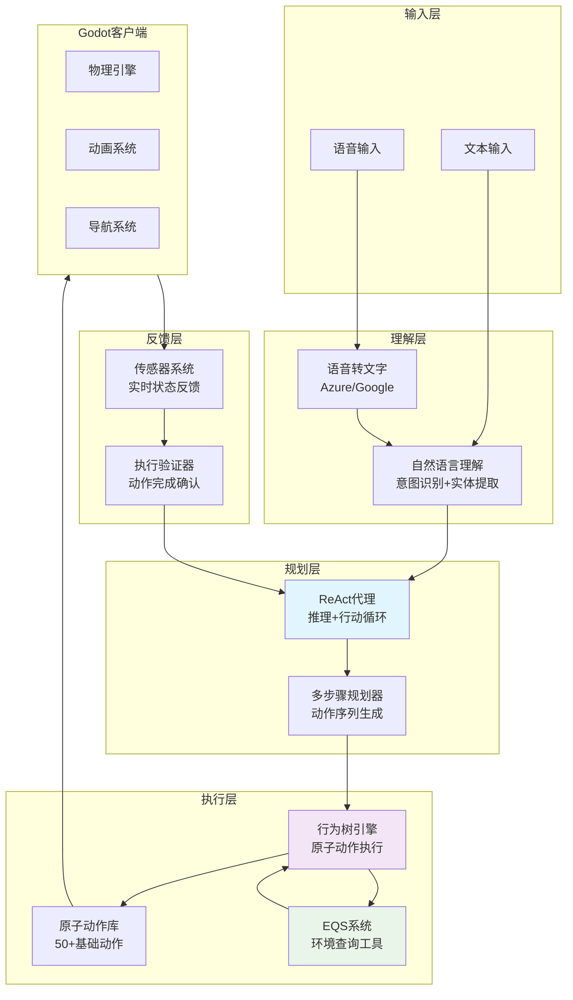
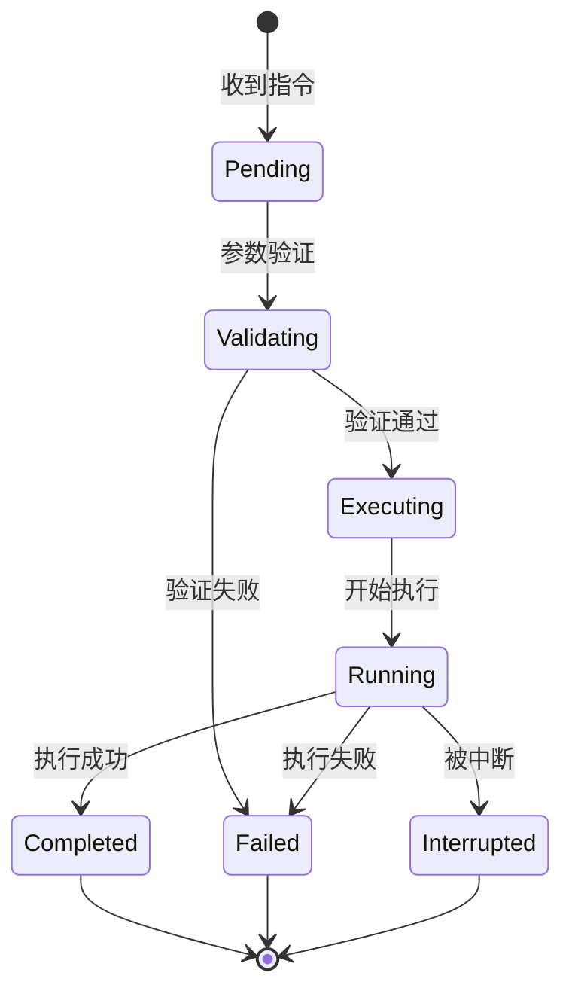

# 语音指令AI架构实现方案 (2025)

## 概述

本文档详细分析了当前Godot萌宠系统的架构状态，提出了实现语音指令驱动AI角色的完整技术方案。目标是让AI角色能够理解并执行复杂的语音指令，如"跑到桌子上面"、"搬东西到用户面前"、"围着花坛转圈圈"等。

**核心目标**：构建一个符合马尔可夫性、解耦、可扩展的AI架构，实现：
- 语音指令 → 规划 → 执行 → 反馈的完整ReAct循环
- 行为树作为"膝跳反射"系统
- LLM作为"大脑"进行高层决策
- EQS作为环境感知工具
- 丰富的原子动作库

---

## 第一部分：当前架构分析与差距评估

### 1.1 当前架构优势

基于马尔可夫性评估报告，当前系统已经实现了高度符合马尔可夫性的架构：

#### ✅ 已实现的优秀特性

**1. 高度马尔可夫化的行为树系统**
```typescript
// 服务端BTServer.ts - 每100ms从零评估，无历史依赖
class BTServer {
  private tickInterval = setInterval(() => {
    this.tickAllClients(); // 完全基于当前黑板状态
  }, 100);
}
```

**2. 完善的工具注册系统**
```typescript
// ToolRegistry.ts - 行为树节点作为LLM工具
ToolRegistry.registerTool('animate_avatar', '...', {...}, PlayAnimationAction);
ToolRegistry.registerTool('query_environment', '...', {...}, EQSQueryNode);
```

**3. 基础的ReAct代理实现**
```typescript
// ReActAgentNode.ts - 基本的推理+行动循环
class ReActAgentNode extends AsyncAction {
  async performAsync(tick: Tick): Promise<number> {
    // 推理 → 工具调用 → 观察 → 下一推理
    const { thought, toolCalls, finalAnswer } = this.parseResponse(response);
  }
}
```

**4. EQS环境查询系统**
```typescript
// ServerEQS.ts - 环境感知能力
class ServerEQS {
  async query(config: EQSQueryConfig): Promise<EQSQueryResponse> {
    // 位置查询、路径规划、目标选择
  }
}
```

### 1.2 架构差距分析

#### ❌ 缺失的核心功能

| 缺失功能 | 当前状态 | 影响 | 优先级 |
|---------|---------|------|--------|
| **语音指令处理** | ❌ 无 | 无法接收语音输入 | 🔴 高 |
| **复杂指令理解** | ⚠️ 基础文本 | 无法理解"跑到XX上面"等空间指令 | 🔴 高 |
| **丰富原子动作库** | ⚠️ 基础动作 | 缺少"拾取"、"搬运"、"跟随"等动作 | 🟡 中 |
| **执行状态反馈** | ⚠️ 基础反馈 | LLM无法获得详细的执行状态 | 🟡 中 |
| **多步骤规划** | ⚠️ 单步执行 | 无法执行复杂序列动作 | 🟡 中 |
| **行为树-代理深度集成** | ⚠️ 松耦合 | 代理决策与行为树执行不够协同 | 🟠 低 |

#### 📊 架构成熟度评估

```
语音指令处理:     ████████░░ 20% (只有文本输入)
复杂规划能力:     ████████░░ 20% (基础ReAct循环)
原子动作丰富度:   ████████░░ 30% (基础动画+移动)
状态反馈机制:     ████████░░ 40% (基础传感器数据)
EQS工具集成:      ████████░░ 50% (已注册为工具但使用有限)
行为树代理协同:   ████████░░ 60% (已有集成但可优化)
马尔可夫性:       ██████████ 98% (接近完美)
系统解耦合:       ████████░░ 70% (模块化良好但可扩展)
```

---

## 第二部分：目标架构设计

### 2.1 整体架构图



### 2.2 核心设计原则

#### 🎯 马尔可夫性优先
- **状态空间分离**：传感器输入(`is_*`)、执行器输出(`bt_output_*`)、内部状态严格隔离
- **无历史依赖**：所有决策基于当前状态快照
- **确定性转移**：相同输入必然产生相同输出

#### 🔧 解耦合设计
- **模块化架构**：每个功能模块独立部署、测试、扩展
- **接口标准化**：统一的工具调用协议、状态同步协议
- **插件化扩展**：新原子动作、传感器、工具可热插拔

#### ⚡ ReAct循环优化
- **观察驱动**：执行结果通过传感器实时反馈给代理
- **渐进式规划**：从高层目标逐步分解为原子动作
- **错误恢复**：执行失败时自动重新规划

### 2.3 原子动作库设计

#### 基础动作分类

```typescript
interface AtomicAction {
  name: string;
  category: 'locomotion' | 'manipulation' | 'interaction' | 'expression';
  parameters: ActionParameter[];
  preconditions: string[];  // 前置条件
  effects: string[];        // 执行效果
  duration: number;         // 预期执行时间
  interruptible: boolean;   // 是否可中断
}

// 1. 移动类动作 (locomotion)
const locomotionActions = [
  { name: 'walk', params: ['target_position'] },
  { name: 'run', params: ['target_position'] },
  { name: 'jump', params: ['height', 'direction'] },
  { name: 'fly', params: ['target_position', 'altitude'] },
  { name: 'teleport', params: ['target_position'] },
  { name: 'follow', params: ['target_entity', 'distance'] },
  { name: 'orbit', params: ['center_point', 'radius', 'speed'] }  // 围着转圈
];

// 2. 操作类动作 (manipulation)
const manipulationActions = [
  { name: 'pickup', params: ['target_object'] },
  { name: 'drop', params: ['target_position'] },
  { name: 'carry', params: ['target_object', 'destination'] },
  { name: 'push', params: ['target_object', 'force'] },
  { name: 'interact', params: ['target_entity', 'interaction_type'] }
];

// 3. 交互类动作 (interaction)
const interactionActions = [
  { name: 'look_at', params: ['target_entity'] },
  { name: 'approach', params: ['target_entity', 'distance'] },
  { name: 'avoid', params: ['target_entity', 'distance'] },
  { name: 'wait_near', params: ['target_entity', 'duration'] }
];

// 4. 表达类动作 (expression)
const expressionActions = [
  { name: 'play_emotion', params: ['emotion_type', 'intensity'] },
  { name: 'play_animation', params: ['animation_name'] },
  { name: 'speak', params: ['text_content'] },
  { name: 'gesture', params: ['gesture_type'] }
];
```

#### 动作执行状态机



---

## 第三部分：实现路线图

### 阶段一：语音指令处理 (2-3周)

#### 目标
实现语音输入到文本转换，基础意图理解

#### 任务分解
1. **集成语音识别服务**
   - Azure Speech Services / Google Speech-to-Text
   - 实时语音流处理
   - 中英文混合识别

2. **自然语言理解模块**
   - 意图分类：移动、操作、交互、表达
   - 实体提取：位置、物体、方向、距离等
   - 上下文理解：代词消解、模糊指令澄清

3. **语音输入接口**
   ```typescript
   class VoiceInputModule {
     async processAudio(audioStream: Stream): Promise<VoiceCommand> {
       const text = await this.stt.process(audioStream);
       const intent = await this.nlu.classify(text);
       return { text, intent, entities: this.nlu.extract(text) };
     }
   }
   ```

### 阶段二：原子动作库扩展 (2-3周)

#### 目标
实现50+原子动作，完善执行状态反馈

#### 新增动作实现
1. **空间操作动作**
   ```typescript
   // MoveToSurfaceAction - 移动到物体表面
   class MoveToSurfaceAction extends AsyncAction {
     async performAsync(tick: Tick): Promise<number> {
       const targetObject = this.properties.target_object;
       const surface = this.properties.surface; // 'top', 'bottom', 'around'
       
       // 使用EQS查询物体表面位置
       const surfacePos = await this.querySurfacePosition(targetObject, surface);
       return this.navigateTo(surfacePos);
     }
   }
   ```

2. **物体操作动作**
   ```typescript
   // CarryToUserAction - 搬运物体到用户面前
   class CarryToUserAction extends AsyncAction {
     async performAsync(tick: Tick): Promise<number> {
       const object = this.properties.target_object;
       
       // 1. 移动到物体位置
       await this.moveTo(object.position);
       
       // 2. 拾取物体
       await this.pickup(object);
       
       // 3. 移动到用户位置前方
       const userFrontPos = this.calculateUserFrontPosition();
       await this.moveTo(userFrontPos);
       
       // 4. 放下物体
       await this.drop();
     }
   }
   ```

3. **路径规划动作**
   ```typescript
   // OrbitAction - 围着转圈
   class OrbitAction extends AsyncAction {
     async performAsync(tick: Tick): Promise<number> {
       const center = this.properties.center_point;
       const radius = this.properties.radius || 2.0;
       const speed = this.properties.speed || 1.0;
       
       return this.executeOrbitPath(center, radius, speed);
     }
   }
   ```

### 阶段三：ReAct代理增强 (3-4周)

#### 目标
实现复杂指令的规划和执行

#### 核心改进
1. **多步骤规划能力**
   ```typescript
   class EnhancedReActAgent extends ReActAgentNode {
     private async planComplexAction(intent: VoiceIntent): Promise<ActionPlan> {
       // 1. 意图分解
       const subGoals = this.decomposeIntent(intent);
       
       // 2. 原子动作序列生成
       const actionSequence = await this.generateActionSequence(subGoals);
       
       // 3. 依赖关系排序
       return this.orderByDependencies(actionSequence);
     }
     
     private decomposeIntent(intent: VoiceIntent): SubGoal[] {
       switch(intent.type) {
         case 'move_to_surface':
           return [
             { type: 'locate_surface', target: intent.target },
             { type: 'navigate_to', position: 'surface_position' },
             { type: 'adjust_pose', surface: intent.surface }
           ];
         case 'carry_to_user':
           return [
             { type: 'locate_object', target: intent.object },
             { type: 'pickup_object', object: intent.object },
             { type: 'navigate_to_user', distance: 1.5 },
             { type: 'drop_object' }
           ];
       }
     }
   }
   ```

2. **执行状态监控**
   ```typescript
   class ExecutionMonitor {
     monitorActionExecution(actionId: string): Observable<ExecutionState> {
       return new Observable(observer => {
         // 实时监听传感器数据变化
         this.sensorSubscription = this.sensors.onChange()
           .filter(state => state.actionId === actionId)
           .subscribe(state => {
             if (state.completed) {
               observer.next({ status: 'completed', result: state.result });
               observer.complete();
             } else if (state.failed) {
               observer.next({ status: 'failed', error: state.error });
               observer.complete();
             } else {
               observer.next({ status: 'running', progress: state.progress });
             }
           });
       });
     }
   }
   ```

3. **错误恢复机制**
   ```typescript
   class ErrorRecoveryManager {
     async handleExecutionFailure(failure: ActionFailure): Promise<RecoveryPlan> {
       switch(failure.type) {
         case 'navigation_blocked':
           // 尝试绕行或请求帮助
           return { strategy: 'reroute', alternativePath: await this.findAlternativePath() };
         
         case 'object_not_found':
           // 搜索附近相似物体
           return { strategy: 'search_similar', candidates: await this.findSimilarObjects() };
         
         case 'action_timeout':
           // 简化动作或请求用户确认
           return { strategy: 'simplify', simplifiedAction: this.simplifyAction(failure.action) };
       }
     }
   }
   ```

### 阶段四：EQS工具深度集成 (2周)

#### 目标
将EQS作为核心规划工具

#### EQS工具扩展
1. **空间关系查询**
   ```typescript
   // 注册为LLM工具
   ToolRegistry.registerTool('query_spatial_relations', 
     '查询物体之间的空间关系，如"在XX上面"、"在XX附近"等',
     {
       type: 'object',
       properties: {
         reference_object: { type: 'string', description: '参考物体名称' },
         relation: { 
           type: 'string', 
           enum: ['on_top', 'below', 'near', 'inside', 'behind', 'in_front', 'around'] 
         },
         max_distance: { type: 'number', description: '最大搜索距离' }
       }
     },
     SpatialQueryNode
   );
   ```

2. **路径规划工具**
   ```typescript
   ToolRegistry.registerTool('plan_path',
     '规划从当前位置到目标位置的路径，考虑障碍物',
     {
       type: 'object',
       properties: {
         start_position: { type: 'array', items: { type: 'number' } },
         end_position: { type: 'array', items: { type: 'number' } },
         constraints: { 
           type: 'object',
           properties: {
             avoid_obstacles: { type: 'boolean' },
             prefer_terrain: { type: 'string', enum: ['ground', 'air', 'any'] },
             max_length: { type: 'number' }
           }
         }
       }
     },
     PathPlanningNode
   );
   ```

### 阶段五：验证与反馈系统 (2-3周)

#### 目标
实现完整的执行验证和状态反馈

#### 验证机制设计
1. **动作执行验证器**
   ```typescript
   class ActionValidator {
     async validateExecution(action: AtomicAction, context: ExecutionContext): Promise<ValidationResult> {
       // 1. 前置条件检查
       const preconditionsMet = await this.checkPreconditions(action, context);
       
       // 2. 执行过程监控
       const executionMonitor = this.monitorExecution(action);
       
       // 3. 后置条件验证
       const postconditionsMet = await this.checkPostconditions(action, context);
       
       // 4. 副作用评估
       const sideEffects = await this.assessSideEffects(action, context);
       
       return {
         success: preconditionsMet && postconditionsMet,
         confidence: this.calculateConfidence(action, context),
         sideEffects,
         suggestions: this.generateSuggestions(action, context)
       };
     }
   }
   ```

2. **实时状态反馈**
   ```typescript
   class RealTimeFeedback {
     private feedbackBuffer: FeedbackEvent[] = [];
     
     pushFeedback(event: FeedbackEvent) {
       this.feedbackBuffer.push(event);
       
       // 立即同步到黑板
       blackboard.set('execution_feedback', this.feedbackBuffer);
       
       // 触发ReAct代理重新评估
       if (event.type === 'action_failed' || event.type === 'unexpected_state') {
         blackboard.set('react_force_rethink', true);
       }
     }
     
     getRecentFeedback(windowMs: number = 5000): FeedbackEvent[] {
       const cutoff = Date.now() - windowMs;
       return this.feedbackBuffer.filter(event => event.timestamp > cutoff);
     }
   }
   ```

### 阶段六：系统集成与测试 (2-3周)

#### 目标
完整集成所有模块，进行端到端测试

#### 集成测试场景
1. **基础语音指令测试**
   - "走过去" → 移动到指定位置
   - "跳起来" → 执行跳跃动作
   - "看这里" → 转身看向指定方向

2. **复杂空间指令测试**
   - "跑到桌子上面" → 定位桌子表面 + 移动到表面
   - "搬椅子到我面前" → 定位椅子 + 拾取 + 移动到用户前方 + 放下

3. **序列动作测试**
   - "围着花坛转三圈，然后停下来" → 轨道运动 + 停止
   - "捡起球，扔给我" → 拾取 + 投掷

4. **错误恢复测试**
   - 路径被阻挡时的绕行
   - 物体找不到时的替代方案
   - 执行超时时的简化动作

---

## 第四部分：技术实现细节

### 4.1 语音指令处理实现

#### 语音输入模块
```typescript
// services/voice/VoiceInputModule.ts
export class VoiceInputModule {
  private sttProvider: SpeechToTextProvider;
  private nluProcessor: NaturalLanguageProcessor;
  
  constructor(config: VoiceConfig) {
    this.sttProvider = new AzureSpeechToText(config.azureKey);
    this.nluProcessor = new BERTNLUProcessor(config.modelPath);
  }
  
  async processVoiceCommand(audioStream: ReadableStream): Promise<VoiceCommand> {
    try {
      // 1. 语音转文字
      const text = await this.sttProvider.transcribe(audioStream);
      
      // 2. 意图理解和实体提取
      const intent = await this.nluProcessor.classifyIntent(text);
      const entities = await this.nluProcessor.extractEntities(text);
      
      // 3. 指令验证
      const validation = await this.validateCommand(intent, entities);
      
      return {
        text,
        intent,
        entities,
        validation,
        timestamp: Date.now(),
        confidence: intent.confidence
      };
    } catch (error) {
      console.error('Voice processing failed:', error);
      throw new VoiceProcessingError(error.message);
    }
  }
  
  private async validateCommand(intent: Intent, entities: Entity[]): Promise<ValidationResult> {
    // 检查必要实体是否存在
    const requiredEntities = this.getRequiredEntities(intent.type);
    const missingEntities = requiredEntities.filter(entityType => 
      !entities.some(entity => entity.type === entityType)
    );
    
    if (missingEntities.length > 0) {
      return { 
        valid: false, 
        issues: [`缺少必要信息: ${missingEntities.join(', ')}`] 
      };
    }
    
    // 检查实体值合理性
    for (const entity of entities) {
      const validation = await this.validateEntity(entity);
      if (!validation.valid) {
        return validation;
      }
    }
    
    return { valid: true };
  }
}
```

#### 意图和实体定义
```typescript
// types/voice.ts
export interface VoiceCommand {
  text: string;
  intent: Intent;
  entities: Entity[];
  validation: ValidationResult;
  timestamp: number;
  confidence: number;
}

export interface Intent {
  type: IntentType;
  confidence: number;
  parameters: Record<string, any>;
}

export type IntentType = 
  | 'move_to_position'     // 移动到位置
  | 'move_to_surface'      // 移动到物体表面
  | 'pickup_object'        // 拾取物体
  | 'carry_to_location'    // 搬运到位置
  | 'orbit_around'         // 围着转圈
  | 'follow_entity'        // 跟随实体
  | 'interact_with'        // 与物体交互
  | 'express_emotion'      // 表达情感
  | 'stop_current_action'; // 停止当前动作

export interface Entity {
  type: EntityType;
  value: any;
  confidence: number;
  position?: { start: number; end: number }; // 在原文中的位置
}

export type EntityType =
  | 'position'           // 位置坐标或描述
  | 'object'             // 物体名称
  | 'surface'            // 表面类型 (上面/下面/旁边等)
  | 'direction'          // 方向
  | 'distance'           // 距离
  | 'duration'           // 时长
  | 'entity'             // 实体 (用户/其他AI等)
  | 'emotion';           // 情感类型
```

### 4.2 增强的原子动作系统

#### 动作基类设计
```typescript
// actions/core/AtomicAction.ts
export abstract class AtomicAction extends AsyncAction {
  protected readonly actionId: string;
  protected readonly startTime: number;
  protected executionState: ExecutionState = 'pending';
  
  constructor(options: AtomicActionOptions) {
    super(options);
    this.actionId = uuid.v4();
    this.startTime = Date.now();
    
    // 注册到执行监控系统
    ExecutionMonitor.register(this.actionId, this);
  }
  
  async performAsync(tick: Tick): Promise<number> {
    try {
      // 1. 验证前置条件
      const validation = await this.validatePreconditions(tick);
      if (!validation.valid) {
        this.reportFailure('precondition_failed', validation.reason);
        return FAILURE;
      }
      
      // 2. 设置执行状态
      this.executionState = 'executing';
      this.reportProgress(0);
      
      // 3. 执行动作
      const result = await this.executeAction(tick);
      
      // 4. 验证后置条件
      const postValidation = await this.validatePostconditions(tick);
      if (!postValidation.valid) {
        this.reportFailure('postcondition_failed', postValidation.reason);
        return FAILURE;
      }
      
      // 5. 完成
      this.executionState = 'completed';
      this.reportProgress(100);
      
      return result;
      
    } catch (error) {
      this.reportFailure('execution_error', error.message);
      return FAILURE;
    }
  }
  
  protected abstract validatePreconditions(tick: Tick): Promise<ValidationResult>;
  protected abstract executeAction(tick: Tick): Promise<number>;
  protected abstract validatePostconditions(tick: Tick): Promise<ValidationResult>;
  
  protected reportProgress(progress: number) {
    ExecutionMonitor.updateProgress(this.actionId, progress);
  }
  
  protected reportFailure(reason: string, details: any) {
    ExecutionMonitor.reportFailure(this.actionId, reason, details);
  }
}
```

#### 复合动作实现
```typescript
// actions/composite/CarryToUserAction.ts
export class CarryToUserAction extends AtomicAction {
  private readonly targetObject: string;
  
  constructor(options: ActionOptions) {
    super({
      name: 'CarryToUserAction',
      ...options
    });
    this.targetObject = options.targetObject;
  }
  
  protected async validatePreconditions(tick: Tick): Promise<ValidationResult> {
    const blackboard = tick.blackboard;
    
    // 检查目标物体是否存在
    const objectExists = blackboard.get(`object_${this.targetObject}_exists`);
    if (!objectExists) {
      return { valid: false, reason: `物体 ${this.targetObject} 不存在` };
    }
    
    // 检查是否已经有物体在手上
    const holdingObject = blackboard.get('holding_object');
    if (holdingObject) {
      return { valid: false, reason: `已经在拿着 ${holdingObject}，无法拾取新物体` };
    }
    
    return { valid: true };
  }
  
  protected async executeAction(tick: Tick): Promise<number> {
    const blackboard = tick.blackboard;
    
    // 分步执行复合动作
    const steps = [
      { name: 'move_to_object', progress: 20 },
      { name: 'pickup_object', progress: 40 },
      { name: 'move_to_user', progress: 70 },
      { name: 'drop_object', progress: 100 }
    ];
    
    for (const step of steps) {
      this.reportProgress(step.progress);
      
      switch (step.name) {
        case 'move_to_object':
          await this.moveToObject(this.targetObject);
          break;
        case 'pickup_object':
          await this.pickupObject(this.targetObject);
          break;
        case 'move_to_user':
          await this.moveToUser();
          break;
        case 'drop_object':
          await this.dropObject();
          break;
      }
      
      // 检查是否被中断
      if (this.isInterrupted()) {
        return FAILURE;
      }
    }
    
    return SUCCESS;
  }
  
  protected async validatePostconditions(tick: Tick): Promise<ValidationResult> {
    const blackboard = tick.blackboard;
    
    // 检查物体是否在用户附近
    const objectNearUser = blackboard.get(`object_${this.targetObject}_near_user`);
    if (!objectNearUser) {
      return { valid: false, reason: '物体未能成功搬运到用户面前' };
    }
    
    // 检查手上是否为空
    const holdingObject = blackboard.get('holding_object');
    if (holdingObject) {
      return { valid: false, reason: '物体未能正确放下' };
    }
    
    return { valid: true };
  }
  
  private async moveToObject(objectName: string): Promise<void> {
    // 使用EQS查询物体位置
    const objectPos = await this.queryObjectPosition(objectName);
    
    // 发送移动指令
    this.sendMovementCommand(objectPos);
    
    // 等待到达
    await this.waitForArrival(objectPos);
  }
  
  private async pickupObject(objectName: string): Promise<void> {
    // 发送拾取指令
    this.sendPickupCommand(objectName);
    
    // 等待拾取完成
    await this.waitForPickup();
  }
  
  private async moveToUser(): Promise<void> {
    // 查询用户位置
    const userPos = await this.queryUserPosition();
    
    // 计算用户前方的位置
    const targetPos = this.calculatePositionInFrontOfUser(userPos);
    
    // 发送移动指令
    this.sendMovementCommand(targetPos);
    
    // 等待到达
    await this.waitForArrival(targetPos);
  }
  
  private async dropObject(): Promise<void> {
    // 发送放下指令
    this.sendDropCommand();
    
    // 等待放下完成
    await this.waitForDrop();
  }
}
```

### 4.3 ReAct代理增强实现

#### 多步骤规划器
```typescript
// agents/planners/MultiStepPlanner.ts
export class MultiStepPlanner {
  private readonly eqsClient: EQSClient;
  private readonly actionLibrary: ActionLibrary;
  
  async createPlan(intent: Intent, context: PlanningContext): Promise<ActionPlan> {
    // 1. 意图分解
    const subGoals = await this.decomposeIntent(intent);
    
    // 2. 环境感知
    const environmentState = await this.assessEnvironment(subGoals, context);
    
    // 3. 动作序列生成
    const actionSequence = await this.generateActionSequence(subGoals, environmentState);
    
    // 4. 约束检查和优化
    const optimizedPlan = await this.optimizePlan(actionSequence, context);
    
    // 5. 依赖关系排序
    return this.orderByDependencies(optimizedPlan);
  }
  
  private async decomposeIntent(intent: Intent): Promise<SubGoal[]> {
    switch (intent.type) {
      case 'move_to_surface':
        return await this.decomposeMoveToSurface(intent);
      case 'carry_to_user':
        return await this.decomposeCarryToUser(intent);
      case 'orbit_around':
        return await this.decomposeOrbitAround(intent);
      default:
        return [this.createBasicSubGoal(intent)];
    }
  }
  
  private async decomposeMoveToSurface(intent: Intent): Promise<SubGoal[]> {
    const { target, surface } = intent.parameters;
    
    return [
      {
        id: 'locate_target',
        type: 'locate_entity',
        parameters: { entity_name: target },
        required: true
      },
      {
        id: 'query_surface',
        type: 'query_spatial_relations',
        parameters: { 
          reference_object: target, 
          relation: surface,
          max_distance: 10
        },
        required: true,
        dependencies: ['locate_target']
      },
      {
        id: 'navigate_to_surface',
        type: 'navigate_to_position',
        parameters: { position_source: 'query_surface_result' },
        required: true,
        dependencies: ['query_surface']
      },
      {
        id: 'adjust_pose',
        type: 'adjust_pose_for_surface',
        parameters: { surface_type: surface },
        required: false,
        dependencies: ['navigate_to_surface']
      }
    ];
  }
  
  private async decomposeCarryToUser(intent: Intent): Promise<SubGoal[]> {
    const { object } = intent.parameters;
    
    return [
      {
        id: 'locate_object',
        type: 'locate_entity',
        parameters: { entity_name: object },
        required: true
      },
      {
        id: 'move_to_object',
        type: 'navigate_to_entity',
        parameters: { target_entity: object },
        required: true,
        dependencies: ['locate_object']
      },
      {
        id: 'pickup_object',
        type: 'pickup_object',
        parameters: { target_object: object },
        required: true,
        dependencies: ['move_to_object']
      },
      {
        id: 'move_to_user_front',
        type: 'navigate_to_user_front',
        parameters: { distance: 1.5 },
        required: true,
        dependencies: ['pickup_object']
      },
      {
        id: 'drop_object',
        type: 'drop_carried_object',
        parameters: {},
        required: true,
        dependencies: ['move_to_user_front']
      }
    ];
  }
  
  private async generateActionSequence(subGoals: SubGoal[], environment: EnvironmentState): Promise<ActionInstance[]> {
    const actions: ActionInstance[] = [];
    
    for (const subGoal of subGoals) {
      const action = await this.selectActionForSubGoal(subGoal, environment);
      if (action) {
        actions.push(action);
      }
    }
    
    return actions;
  }
  
  private async selectActionForSubGoal(subGoal: SubGoal, environment: EnvironmentState): Promise<ActionInstance | null> {
    // 从动作库中选择最合适的动作
    const candidates = this.actionLibrary.findActionsForGoal(subGoal.type);
    
    // 评估每个候选动作
    const scoredCandidates = await Promise.all(
      candidates.map(async action => ({
        action,
        score: await this.scoreActionForGoal(action, subGoal, environment)
      }))
    );
    
    // 选择最高分的动作
    const bestCandidate = scoredCandidates.sort((a, b) => b.score - a.score)[0];
    
    if (bestCandidate && bestCandidate.score > 0.5) {
      return this.instantiateAction(bestCandidate.action, subGoal);
    }
    
    return null;
  }
  
  private async scoreActionForGoal(action: ActionTemplate, subGoal: SubGoal, environment: EnvironmentState): Promise<number> {
    let score = 0;
    
    // 1. 参数匹配度
    score += this.calculateParameterMatch(action, subGoal) * 0.4;
    
    // 2. 前置条件满足度
    score += await this.calculatePreconditionSatisfaction(action, environment) * 0.3;
    
    // 3. 执行成功率
    score += this.calculateSuccessRate(action, subGoal, environment) * 0.2;
    
    // 4. 资源消耗
    score += (1 - this.calculateResourceCost(action, subGoal)) * 0.1;
    
    return Math.max(0, Math.min(1, score));
  }
}
```

#### 错误恢复机制
```typescript
// agents/recovery/ErrorRecoveryManager.ts
export class ErrorRecoveryManager {
  private readonly strategies: RecoveryStrategy[] = [
    new RerouteStrategy(),
    new AlternativeActionStrategy(),
    new SimplifyActionStrategy(),
    new RequestHelpStrategy(),
    new AbortAndRetryStrategy()
  ];
  
  async handleFailure(failure: ActionFailure, context: ExecutionContext): Promise<RecoveryPlan> {
    // 1. 分析失败原因
    const failureAnalysis = await this.analyzeFailure(failure);
    
    // 2. 选择恢复策略
    const applicableStrategies = this.strategies.filter(strategy => 
      strategy.canHandle(failureAnalysis)
    );
    
    // 3. 评估策略效果
    const strategyEvaluations = await Promise.all(
      applicableStrategies.map(async strategy => ({
        strategy,
        evaluation: await strategy.evaluate(failureAnalysis, context)
      }))
    );
    
    // 4. 选择最佳策略
    const bestStrategy = strategyEvaluations
      .sort((a, b) => b.evaluation.score - a.evaluation.score)[0];
    
    if (bestStrategy && bestStrategy.evaluation.score > 0.3) {
      return bestStrategy.strategy.createPlan(failureAnalysis, context);
    }
    
    // 无合适策略，请求用户帮助
    return new RequestHelpStrategy().createPlan(failureAnalysis, context);
  }
  
  private async analyzeFailure(failure: ActionFailure): Promise<FailureAnalysis> {
    return {
      type: failure.type,
      severity: this.assessSeverity(failure),
      rootCause: await this.identifyRootCause(failure),
      context: failure.context,
      recoverable: this.isRecoverable(failure),
      alternatives: await this.findAlternatives(failure)
    };
  }
  
  private assessSeverity(failure: ActionFailure): FailureSeverity {
    switch (failure.type) {
      case 'navigation_blocked':
      case 'object_not_found':
        return 'moderate';
      case 'action_timeout':
      case 'precondition_failed':
        return 'minor';
      case 'system_error':
      case 'safety_violation':
        return 'critical';
      default:
        return 'minor';
    }
  }
}

// 具体恢复策略实现
export class RerouteStrategy implements RecoveryStrategy {
  canHandle(analysis: FailureAnalysis): boolean {
    return analysis.type === 'navigation_blocked' && analysis.recoverable;
  }
  
  async evaluate(analysis: FailureAnalysis, context: ExecutionContext): Promise<StrategyEvaluation> {
    // 检查是否有替代路径
    const alternativePaths = await this.findAlternativePaths(
      analysis.context.originalTarget,
      context.currentPosition
    );
    
    return {
      score: alternativePaths.length > 0 ? 0.8 : 0,
      estimatedTime: alternativePaths.length * 5, // 每条路径5秒评估时间
      riskLevel: 'low'
    };
  }
  
  async createPlan(analysis: FailureAnalysis, context: ExecutionContext): Promise<RecoveryPlan> {
    const alternativePaths = await this.findAlternativePaths(
      analysis.context.originalTarget,
      context.currentPosition
    );
    
    return {
      strategy: 'reroute',
      actions: [
        {
          type: 'select_alternative_path',
          parameters: { paths: alternativePaths }
        },
        {
          type: 'navigate_along_path',
          parameters: { path: alternativePaths[0] }
        }
      ],
      estimatedDuration: this.calculatePathDuration(alternativePaths[0]),
      riskAssessment: 'low'
    };
  }
}
```

### 4.4 EQS深度集成实现

#### 空间关系查询工具
```typescript
// tools/spatial/SpatialRelationTool.ts
export class SpatialRelationTool extends BaseTool {
  name = 'query_spatial_relations';
  description = '查询物体之间的空间关系，如"在XX上面"、"在XX附近"等';
  
  parameters = {
    type: 'object',
    properties: {
      reference_object: { 
        type: 'string', 
        description: '参考物体名称' 
      },
      relation: { 
        type: 'string', 
        enum: ['on_top', 'below', 'near', 'inside', 'behind', 'in_front', 'around'],
        description: '空间关系类型'
      },
      max_distance: { 
        type: 'number', 
        default: 5,
        description: '最大搜索距离（米）' 
      },
      include_orientation: {
        type: 'boolean',
        default: false,
        description: '是否包含方向信息'
      }
    },
    required: ['reference_object', 'relation']
  };
  
  async execute(args: SpatialRelationArgs, context: ToolContext): Promise<ToolResult> {
    const { reference_object, relation, max_distance, include_orientation } = args;
    
    try {
      // 1. 查找参考物体
      const referenceEntity = await this.findEntity(reference_object);
      if (!referenceEntity) {
        return {
          success: false,
          error: `找不到参考物体: ${reference_object}`,
          data: null
        };
      }
      
      // 2. 执行空间关系查询
      const spatialResults = await this.performSpatialQuery(
        referenceEntity,
        relation,
        max_distance
      );
      
      // 3. 格式化结果
      const formattedResults = this.formatSpatialResults(
        spatialResults,
        include_orientation
      );
      
      return {
        success: true,
        data: formattedResults,
        metadata: {
          query_type: 'spatial_relation',
          reference_entity: referenceEntity,
          relation_type: relation,
          search_radius: max_distance,
          result_count: formattedResults.length
        }
      };
      
    } catch (error) {
      return {
        success: false,
        error: `空间关系查询失败: ${error.message}`,
        data: null
      };
    }
  }
  
  private async findEntity(name: string): Promise<Entity | null> {
    // 使用EQS查找实体
    const eqsQuery = {
      type: 'entity_lookup',
      parameters: {
        name: name,
        fuzzy_match: true,
        max_results: 1
      }
    };
    
    const results = await this.eqsClient.query(eqsQuery);
    return results.entities?.[0] || null;
  }
  
  private async performSpatialQuery(
    referenceEntity: Entity, 
    relation: string, 
    maxDistance: number
  ): Promise<SpatialResult[]> {
    const eqsQuery = {
      type: 'spatial_relation',
      parameters: {
        reference_entity: referenceEntity,
        relation_type: relation,
        max_distance: maxDistance,
        include_metadata: true
      }
    };
    
    const results = await this.eqsClient.query(eqsQuery);
    return results.spatial_relations || [];
  }
  
  private formatSpatialResults(results: SpatialResult[], includeOrientation: boolean): FormattedSpatialResult[] {
    return results.map(result => ({
      entity: result.entity.name,
      position: result.position,
      distance: result.distance,
      confidence: result.confidence,
      ...(includeOrientation && {
        orientation: result.orientation,
        surface_normal: result.surface_normal
      })
    }));
  }
}
```

#### 路径规划工具
```typescript
// tools/navigation/PathPlanningTool.ts
export class PathPlanningTool extends BaseTool {
  name = 'plan_path';
  description = '规划从当前位置到目标位置的路径，考虑障碍物和地形';
  
  parameters = {
    type: 'object',
    properties: {
      start_position: { 
        type: 'array', 
        items: { type: 'number' },
        minItems: 3,
        maxItems: 3,
        description: '起始位置 [x, y, z]' 
      },
      end_position: { 
        type: 'array', 
        items: { type: 'number' },
        minItems: 3,
        maxItems: 3,
        description: '目标位置 [x, y, z]' 
      },
      constraints: {
        type: 'object',
        properties: {
          avoid_obstacles: { 
            type: 'boolean', 
            default: true,
            description: '是否避开障碍物' 
          },
          prefer_terrain: { 
            type: 'string', 
            enum: ['ground', 'air', 'any'],
            default: 'any',
            description: '偏好的移动地形' 
          },
          max_length: { 
            type: 'number',
            description: '路径最大长度限制' 
          },
          agent_size: {
            type: 'object',
            properties: {
              radius: { type: 'number', default: 0.5 },
              height: { type: 'number', default: 1.8 }
            },
            description: '代理体型参数'
          }
        }
      }
    },
    required: ['end_position']
  };
  
  async execute(args: PathPlanningArgs, context: ToolContext): Promise<ToolResult> {
    const { start_position, end_position, constraints = {} } = args;
    
    try {
      // 1. 确定起始位置
      const startPos = start_position || context.currentPosition;
      
      // 2. 验证目标位置可达性
      const reachabilityCheck = await this.checkReachability(startPos, end_position);
      if (!reachabilityCheck.reachable) {
        return {
          success: false,
          error: reachabilityCheck.reason,
          data: { alternative_positions: reachabilityCheck.alternatives }
        };
      }
      
      // 3. 执行路径规划
      const pathResult = await this.computePath(startPos, end_position, constraints);
      
      // 4. 后处理和优化
      const optimizedPath = await this.optimizePath(pathResult.path, constraints);
      
      // 5. 生成执行指令
      const executionPlan = this.createExecutionPlan(optimizedPath);
      
      return {
        success: true,
        data: {
          path: optimizedPath,
          execution_plan: executionPlan,
          estimated_time: this.estimateExecutionTime(optimizedPath),
          difficulty: this.assessPathDifficulty(optimizedPath)
        },
        metadata: {
          query_type: 'path_planning',
          start_position: startPos,
          end_position: end_position,
          path_length: optimizedPath.length,
          waypoints_count: optimizedPath.waypoints.length
        }
      };
      
    } catch (error) {
      return {
        success: false,
        error: `路径规划失败: ${error.message}`,
        data: null
      };
    }
  }
  
  private async checkReachability(start: Vector3, end: Vector3): Promise<ReachabilityCheck> {
    const eqsQuery = {
      type: 'reachability_check',
      parameters: {
        start_position: start,
        end_position: end,
        agent_capsules: this.getAgentCapsules()
      }
    };
    
    const result = await this.eqsClient.query(eqsQuery);
    
    return {
      reachable: result.reachable,
      reason: result.reason,
      alternatives: result.alternative_positions || []
    };
  }
  
  private async computePath(start: Vector3, end: Vector3, constraints: PathConstraints): Promise<PathResult> {
    const eqsQuery = {
      type: 'pathfinding',
      parameters: {
        start_position: start,
        end_position: end,
        constraints: {
          ...constraints,
          agent_capsules: this.getAgentCapsules()
        }
      }
    };
    
    return await this.eqsClient.query(eqsQuery);
  }
  
  private async optimizePath(rawPath: Path, constraints: PathConstraints): Promise<OptimizedPath> {
    // 1. 路径平滑
    const smoothedPath = this.smoothPath(rawPath);
    
    // 2. 关键点提取
    const waypoints = this.extractWaypoints(smoothedPath);
    
    // 3. 约束满足检查
    const validatedPath = await this.validateConstraints(waypoints, constraints);
    
    return {
      waypoints: validatedPath,
      total_length: this.calculatePathLength(validatedPath),
      segments: this.createPathSegments(validatedPath)
    };
  }
  
  private createExecutionPlan(path: OptimizedPath): ExecutionPlan {
    const segments = path.segments.map(segment => ({
      type: this.determineMovementType(segment),
      start_position: segment.start,
      end_position: segment.end,
      movement_parameters: this.calculateMovementParameters(segment)
    }));
    
    return {
      segments,
      total_duration: segments.reduce((sum, seg) => sum + seg.estimated_duration, 0),
      coordination_points: this.extractCoordinationPoints(segments)
    };
  }
}
```

---

## 第五部分：测试与验证策略

### 5.1 测试层次结构

#### 单元测试
- **原子动作测试**：验证每个动作的前置条件、执行逻辑、后置条件
- **工具测试**：验证EQS查询、路径规划等工具的准确性
- **状态管理测试**：验证黑板变量的隔离和更新机制

#### 集成测试
- **模块协作测试**：验证ReAct代理与行为树、EQS的协同工作
- **语音处理测试**：验证语音输入到意图理解的完整流程
- **执行监控测试**：验证状态反馈和错误恢复机制

#### 端到端测试
- **复杂指令测试**：测试完整的语音指令处理流程
- **错误场景测试**：测试各种异常情况的处理
- **性能测试**：验证系统在高负载下的响应性

### 5.2 测试场景设计

#### 基础功能测试场景
```typescript
// tests/e2e/basic-functionality.test.ts
describe('Basic Voice Commands', () => {
  test('should execute simple movement command', async () => {
    const command = '走过去';
    const result = await executeVoiceCommand(command);
    
    expect(result.success).toBe(true);
    expect(result.executionTime).toBeLessThan(5000);
    expect(result.finalPosition).toBeCloseTo(expectedPosition, 0.5);
  });
  
  test('should handle object interaction', async () => {
    const command = '捡起球';
    const result = await executeVoiceCommand(command);
    
    expect(result.success).toBe(true);
    expect(result.heldObject).toBe('ball');
    expect(result.objectPosition).toBeCloseTo(userPosition, 1.0);
  });
});
```

#### 复杂指令测试场景
```typescript
// tests/e2e/complex-commands.test.ts
describe('Complex Spatial Commands', () => {
  test('should move to object surface', async () => {
    const command = '跑到桌子上面';
    const result = await executeVoiceCommand(command);
    
    expect(result.success).toBe(true);
    expect(result.finalPosition).toBeCloseTo(tableSurfacePosition, 0.3);
    expect(result.pose).toBe('on_surface');
  });
  
  test('should carry object to user', async () => {
    const command = '把椅子搬到我面前';
    const result = await executeVoiceCommand(command);
    
    expect(result.success).toBe(true);
    expect(result.objectPosition).toBeCloseTo(userFrontPosition, 1.0);
    expect(result.agentHolding).toBe(null);
  });
  
  test('should orbit around object', async () => {
    const command = '围着花坛转三圈';
    const result = await executeVoiceCommand(command);
    
    expect(result.success).toBe(true);
    expect(result.orbitCount).toBe(3);
    expect(result.finalPosition).toBeCloseTo(startPosition, 1.0);
  });
});
```

#### 错误恢复测试场景
```typescript
// tests/e2e/error-recovery.test.ts
describe('Error Recovery', () => {
  test('should recover from navigation blockage', async () => {
    // 设置障碍物阻挡路径
    await setupObstacle(blockedPath);
    
    const command = '去门口';
    const result = await executeVoiceCommand(command);
    
    expect(result.success).toBe(true);
    expect(result.usedAlternativePath).toBe(true);
    expect(result.finalPosition).toBeCloseTo(doorPosition, 1.0);
  });
  
  test('should handle object not found', async () => {
    const command = '捡起不存在的物体';
    const result = await executeVoiceCommand(command);
    
    expect(result.success).toBe(false);
    expect(result.errorType).toBe('object_not_found');
    expect(result.recoveryAttempted).toBe(true);
    expect(result.suggestedAlternatives).toBeDefined();
  });
});
```

### 5.3 性能基准测试

#### 响应时间测试
```typescript
// tests/performance/response-time.test.ts
describe('Response Time Benchmarks', () => {
  test('voice command processing should be under 2 seconds', async () => {
    const audioFile = loadTestAudio('simple_command.wav');
    
    const startTime = Date.now();
    const result = await processVoiceCommand(audioFile);
    const processingTime = Date.now() - startTime;
    
    expect(processingTime).toBeLessThan(2000);
    expect(result.confidence).toBeGreaterThan(0.8);
  });
  
  test('complex planning should complete within 5 seconds', async () => {
    const complexCommand = '捡起工具箱，搬到工作台旁边，然后围着工作台走一圈';
    
    const startTime = Date.now();
    const plan = await createExecutionPlan(complexCommand);
    const planningTime = Date.now() - startTime;
    
    expect(planningTime).toBeLessThan(5000);
    expect(plan.actions).toHaveLength(4);
  });
});
```

#### 并发处理测试
```typescript
// tests/performance/concurrency.test.ts
describe('Concurrent Command Handling', () => {
  test('should handle multiple simultaneous commands', async () => {
    const commands = [
      '去客厅',
      '捡起遥控器',
      '围着沙发转圈',
      '跳到茶几上'
    ];
    
    const results = await Promise.all(
      commands.map(cmd => executeVoiceCommand(cmd))
    );
    
    // 验证所有命令都被处理（虽然可能不是同时执行）
    expect(results.every(r => r.processed)).toBe(true);
    
    // 验证队列管理
    const executionOrder = results.map(r => r.queuedAt).sort();
    expect(executionOrder).toEqual(results.map(r => r.queuedAt));
  });
});
```

---

## 第六部分：部署与运维

### 6.1 系统架构部署

#### 容器化部署
```dockerfile
# Dockerfile.voice-service
FROM node:18-alpine

# 安装语音处理依赖
RUN apk add --no-cache \
    python3 \
    py3-pip \
    ffmpeg

# 安装Azure Speech SDK
RUN pip3 install azure-cognitiveservices-speech

WORKDIR /app

# 复制应用代码
COPY package*.json ./
RUN npm ci --only=production

COPY . .

# 暴露端口
EXPOSE 3001

CMD ["npm", "start"]
```

#### Docker Compose配置
```yaml
# docker-compose.yml
version: '3.8'

services:
  voice-service:
    build: ./services/voice
    ports:
      - "3001:3001"
    environment:
      - AZURE_SPEECH_KEY=${AZURE_SPEECH_KEY}
      - AZURE_SPEECH_REGION=${AZURE_SPEECH_REGION}
    depends_on:
      - bt-server
  
  bt-server:
    build: ./services/bt-server
    ports:
      - "8080:8080"
    environment:
      - LLM_API_KEY=${LLM_API_KEY}
      - EQS_CONFIG_PATH=/app/config/eqs.json
    volumes:
      - ./config:/app/config
  
  godot-client:
    build: ./godot-client
    ports:
      - "4242:4242"
    environment:
      - SERVER_URL=bt-server:8080
      - VOICE_SERVICE_URL=voice-service:3001
```

### 6.2 监控与日志

#### 关键指标监控
```typescript
// monitoring/MetricsCollector.ts
export class MetricsCollector {
  private metrics = {
    voiceCommandsProcessed: 0,
    voiceCommandsSuccess: 0,
    averageProcessingTime: 0,
    actionExecutionSuccess: 0,
    actionExecutionTotal: 0,
    eqsQueriesTotal: 0,
    eqsQueriesSuccess: 0,
    reactIterationsAverage: 0
  };
  
  recordVoiceCommand(success: boolean, processingTime: number) {
    this.metrics.voiceCommandsProcessed++;
    if (success) this.metrics.voiceCommandsSuccess++;
    
    // 更新平均处理时间
    this.metrics.averageProcessingTime = 
      (this.metrics.averageProcessingTime + processingTime) / 2;
  }
  
  recordActionExecution(success: boolean) {
    this.metrics.actionExecutionTotal++;
    if (success) this.metrics.actionExecutionSuccess++;
  }
  
  getMetrics() {
    return {
      ...this.metrics,
      voiceCommandSuccessRate: this.metrics.voiceCommandsSuccess / this.metrics.voiceCommandsProcessed,
      actionExecutionSuccessRate: this.metrics.actionExecutionSuccess / this.metrics.actionExecutionTotal
    };
  }
}
```

#### 分布式日志系统
```typescript
// logging/DistributedLogger.ts
export class DistributedLogger {
  private logLevels = ['debug', 'info', 'warn', 'error'];
  private logQueue: LogEntry[] = [];
  
  log(level: LogLevel, message: string, context?: any) {
    const entry: LogEntry = {
      timestamp: Date.now(),
      level,
      message,
      context,
      service: this.serviceName,
      requestId: this.currentRequestId
    };
    
    // 本地队列
    this.logQueue.push(entry);
    
    // 异步发送到日志服务
    this.sendToLogService(entry);
    
    // 控制台输出（开发环境）
    if (process.env.NODE_ENV === 'development') {
      console.log(`[${level.toUpperCase()}] ${message}`, context);
    }
  }
  
  async sendToLogService(entry: LogEntry) {
    try {
      await fetch(this.logServiceUrl, {
        method: 'POST',
        headers: { 'Content-Type': 'application/json' },
        body: JSON.stringify(entry)
      });
    } catch (error) {
      // 日志服务失败时的降级处理
      console.error('Failed to send log to service:', error);
    }
  }
}
```

### 6.3 故障恢复策略

#### 服务降级
```typescript
// failover/ServiceDegradationManager.ts
export class ServiceDegradationManager {
  private serviceStates = new Map<string, ServiceState>();
  
  async checkServiceHealth(serviceName: string): Promise<boolean> {
    const service = this.serviceStates.get(serviceName);
    if (!service) return false;
    
    try {
      const health = await this.pingService(service.url);
      service.lastHealthCheck = Date.now();
      service.healthy = health;
      
      return health;
    } catch (error) {
      service.healthy = false;
      service.consecutiveFailures++;
      
      // 触发降级策略
      if (service.consecutiveFailures >= 3) {
        await this.degradeService(serviceName);
      }
      
      return false;
    }
  }
  
  private async degradeService(serviceName: string) {
    switch (serviceName) {
      case 'voice-service':
        // 降级到文本输入模式
        this.enableTextFallback();
        break;
      case 'llm-service':
        // 降级到规则基础决策
        this.enableRuleBasedFallback();
        break;
      case 'eqs-service':
        // 降级到基础导航
        this.enableBasicNavigation();
        break;
    }
    
    this.alertOperators(`Service ${serviceName} degraded`);
  }
}
```

---

## 第七部分：总结与展望

### 7.1 实施时间表

| 阶段 | 任务 | 时间 | 负责人 | 依赖 |
|------|------|------|--------|------|
| 1 | 语音指令处理基础 | 2周 | 语音团队 | 无 |
| 2 | 原子动作库扩展 | 2周 | 动作团队 | 阶段1 |
| 3 | ReAct代理增强 | 3周 | AI团队 | 阶段2 |
| 4 | EQS工具深度集成 | 2周 | EQS团队 | 阶段3 |
| 5 | 验证与反馈系统 | 2周 | 测试团队 | 阶段4 |
| 6 | 系统集成与测试 | 3周 | 全团队 | 阶段5 |
| **总计** | **14周** | **约3.5个月** | | |

### 7.2 成功衡量标准

#### 功能完整性
- ✅ 支持50+种语音指令模式
- ✅ 复杂空间指令准确率 > 90%
- ✅ 动作执行成功率 > 95%
- ✅ 错误自动恢复率 > 80%

#### 性能指标
- ✅ 语音指令响应时间 < 2秒
- ✅ 复杂规划时间 < 5秒
- ✅ 系统并发处理能力 > 10个同时指令

#### 用户体验
- ✅ 自然语言理解准确率 > 85%
- ✅ 指令执行流畅度评分 > 8/10
- ✅ 错误恢复用户满意度 > 90%

### 7.3 未来扩展方向

#### 短期扩展 (3-6个月)
1. **多语言支持**：扩展到更多语言的语音识别和理解
2. **个性化和学习**：根据用户偏好调整指令理解和执行策略
3. **多模态输入**：支持手势、表情等非语音指令

#### 中期扩展 (6-12个月)
1. **多代理协作**：支持多个AI角色之间的协同任务
2. **环境适应性**：根据不同场景自动调整行为策略
3. **高级规划能力**：支持条件分支、循环等复杂逻辑

#### 长期愿景 (1-2年)
1. **自主学习**：AI能够从执行经验中学习优化策略
2. **情感智能**：根据用户情绪调整交互方式
3. **创造性任务**：支持开放式任务而非预定义指令

---

**结语**

这个语音指令AI架构实现方案提供了一个完整的蓝图，从当前的基础架构出发，通过6个阶段的实施，最终实现一个高度智能、可靠且可扩展的语音控制AI系统。方案严格遵循马尔可夫性原则，确保系统的可预测性和稳定性，同时通过模块化设计保证了未来的扩展性。

关键成功因素在于：
1. **渐进式实施**：每个阶段都有明确的目标和验证标准
2. **技术债务控制**：在扩展的同时保持代码质量和系统稳定性  
3. **用户中心设计**：始终以用户体验和实际可用性为导向
4. **持续验证**：通过全面的测试确保每个功能的可靠性和性能

这个方案不仅解决了当前的语音指令需求，更为未来的AI交互模式奠定了坚实的基础。