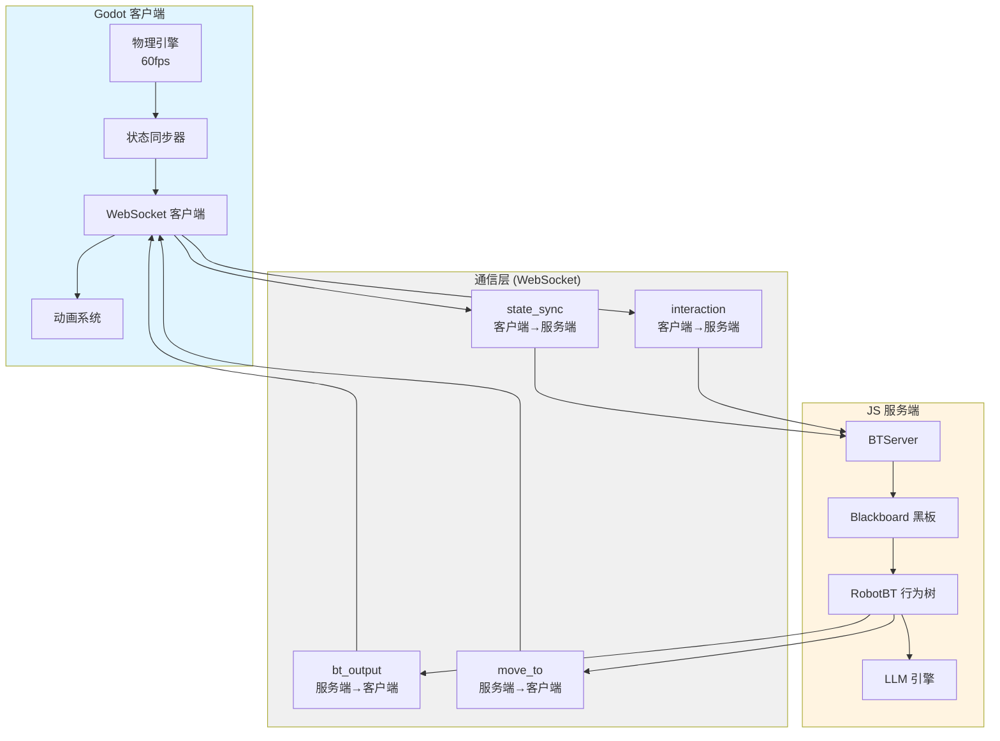
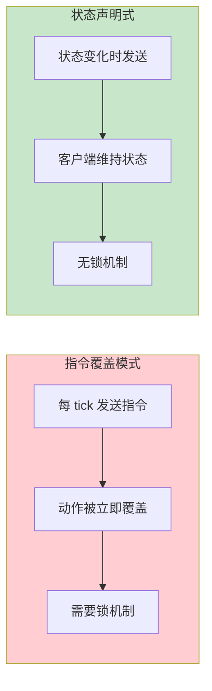
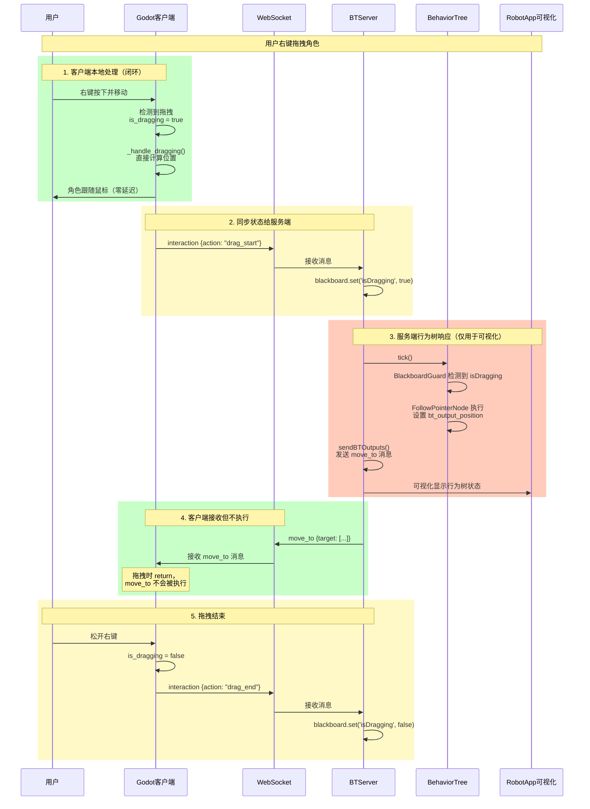
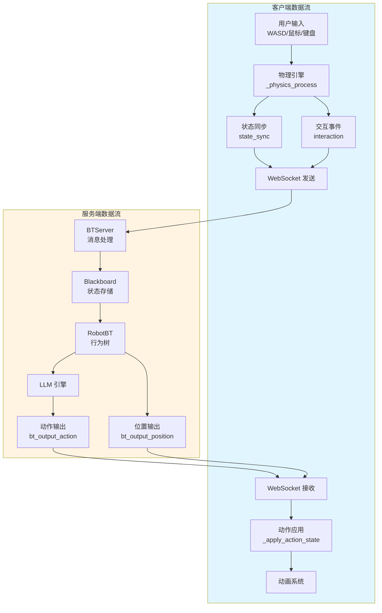
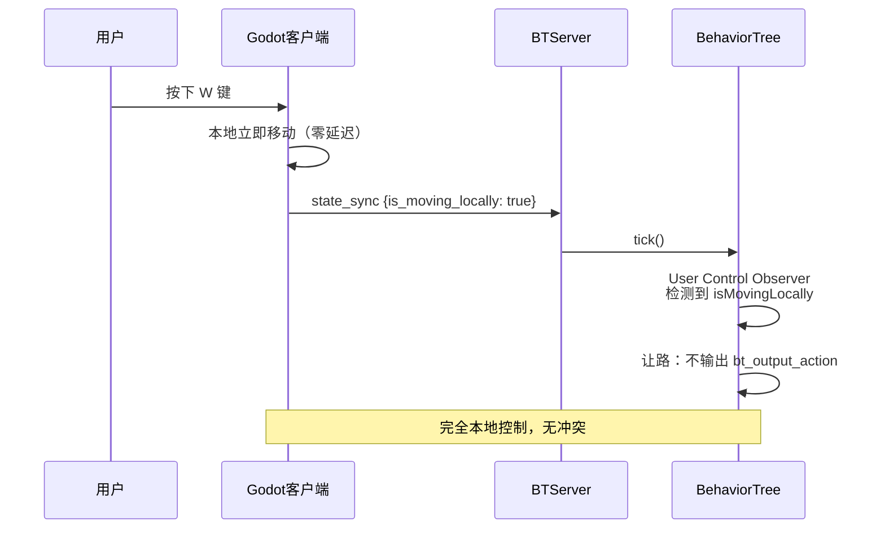
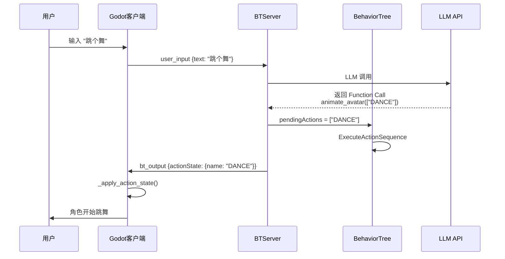
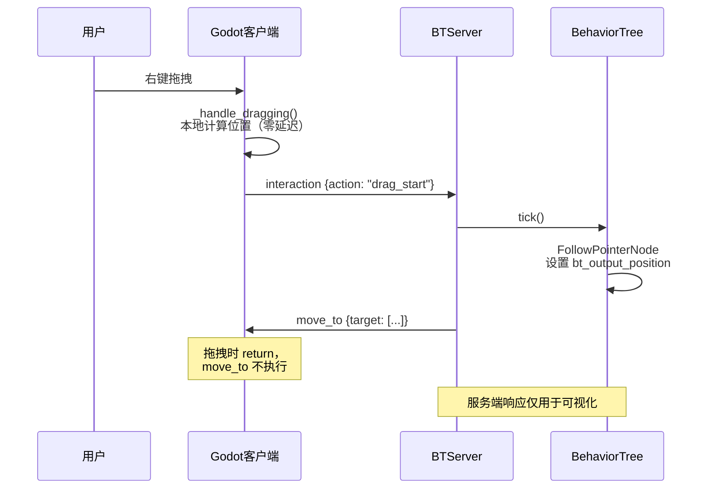

# 通信系统文档

## 概述

本文档详细说明客户端（Godot）与服务端（JS/Node.js）之间的通信架构、协议格式和数据流向。

---

## 一、通信架构

### 1.1 整体架构



### 1.2 通信方向

**客户端 → 服务端**：
- `state_sync`：状态同步（位置、速度、输入状态）
- `interaction`：交互事件（点击、拖拽、碰撞）
- `user_input`：用户输入（文本指令）
- `handshake`：握手消息（客户端类型、版本）

**服务端 → 客户端**：
- `bt_output`：行为树输出（动作状态）
- `move_to`：移动指令（目标位置）
- `bt_debug_update`：调试信息（行为树节点状态）
- `status_update`：状态更新（能量、无聊度）

---

## 二、消息协议详解

### 2.1 客户端 → 服务端

#### state_sync（状态同步）

**用途**：定期同步客户端的物理状态和输入状态到服务端黑板。

**频率**：约每秒 1 次（实时状态）或每帧（高频同步模式）

**消息格式**：
```json
{
  "type": "state_sync",
  "timestamp": 1234567890,
  "data": {
    "position": [0.0, -1.0, 0.0],
    "velocity": [1.5, 0.0, 0.0],
    "is_moving_locally": true,
    "is_on_floor": true,
    "is_jump_pressed": false,
    "current_action": "walk"
  }
}
```

**字段说明**：

| 字段 | 类型 | 说明 |
|:-----|:-----|:-----|
| `position` | Array[3] | 角色的 3D 坐标 [x, y, z] |
| `velocity` | Array[3] | 当前速度向量 [vx, vy, vz] |
| `is_moving_locally` | Boolean | 是否正在由 WASD 手动控制移动 |
| `is_on_floor` | Boolean | 是否在地面上 |
| `is_jump_pressed` | Boolean | 是否按下跳跃键 |
| `current_action` | String | 当前动作名称（可选，仅用于信息同步） |

**服务端处理**：
```typescript
// BTServer.ts
case 'state_sync':
    client.blackboard.set('penguinPosition', data.data.position);
    client.blackboard.set('isMovingLocally', data.data.is_moving_locally || false);
    client.blackboard.set('isOnFloor', data.data.is_on_floor || false);
    client.blackboard.set('isJumpPressed', data.data.is_jump_pressed || false);
    if (data.data.velocity) {
        client.blackboard.set('velocity', data.data.velocity);
    }
    break;
```

#### interaction（交互事件）

**用途**：上报用户交互事件（点击、拖拽、碰撞等）。

**触发时机**：事件发生时立即发送

**消息格式**：
```json
{
  "type": "interaction",
  "timestamp": 1234567890,
  "data": {
    "action": "drag_start",
    "position": [0.0, -1.0, 0.0]
  }
}
```

**支持的 action**：

| action | 说明 | 数据字段 |
|:-------|:-----|:--------|
| `click` | 鼠标点击 | `position` |
| `drag_start` | 开始拖拽 | `position` |
| `drag_end` | 结束拖拽 | `position` |
| `collision` | 碰撞事件 | `position`, `collider_name`, `normal` |
| `jump` | 跳跃事件 | `position`, `velocity_y` |

**服务端处理**：
```typescript
// BTServer.ts - handleInteraction()
if (action === 'click') {
    client.blackboard.set('isClicked', true);
    setTimeout(() => client.blackboard.set('isClicked', false), 500);
} else if (action === 'drag_start') {
    client.blackboard.set('isDragging', true);
} else if (action === 'drag_end') {
    client.blackboard.set('isDragging', false);
} else if (action === 'collision') {
    client.blackboard.set('lastCollision', {
        collider: data.collider_name,
        position: data.position,
        normal: data.normal,
        timestamp: Date.now()
    });
} else if (action === 'jump') {
    client.blackboard.set('lastJumpTime', Date.now());
    client.blackboard.set('isJumpPressed', true);
    setTimeout(() => client.blackboard.set('isJumpPressed', false), 500);
}
```

#### user_input（用户输入）

**用途**：发送用户的文本指令给 LLM。

**消息格式**：
```json
{
  "type": "user_input",
  "timestamp": 1234567890,
  "data": {
    "text": "跳个舞"
  }
}
```

**服务端处理**：
```typescript
case 'user_input':
    client.blackboard.set('lastUserInput', data.data.text);
    client.blackboard.set('hasNewInput', true);
    break;
```

### 2.2 服务端 → 客户端

#### bt_output（行为树输出）

**用途**：下发 AI 决策的动作状态。

**频率**：状态变化时（约每 100ms-3 秒）

**消息格式**：
```json
{
  "type": "bt_output",
  "timestamp": 1234567890,
  "data": {
    "actionState": {
      "name": "DANCE",
      "priority": 50,
      "duration": 3000,
      "interruptible": true,
      "timestamp": 1234567890
    }
  }
}
```

**字段说明**：

| 字段 | 类型 | 说明 |
|:-----|:-----|:-----|
| `name` | String | 动作名称（如 "DANCE", "WAVE", "FLY"） |
| `priority` | Number | 优先级（10-100+，数值越大越优先） |
| `duration` | Number | 持续时间（毫秒） |
| `interruptible` | Boolean | 是否可被更高优先级中断 |
| `timestamp` | Number | 服务端发送时间戳 |

**客户端处理**：
```gdscript
# pet_controller.gd
func _on_ws_message(type: String, data: Dictionary) -> void:
    match type:
        "bt_output":
            if data.has("actionState"):
                _apply_action_state(data["actionState"])
```

#### move_to（移动指令）

**用途**：指令客户端移动到指定位置。

**消息格式**：
```json
{
  "type": "move_to",
  "timestamp": 1234567890,
  "data": {
    "target": [5.0, -1.0, 3.0]
  }
}
```

**客户端处理**：
```gdscript
# pet_controller.gd
"move_to":
    if data.has("target"):
        var t = data["target"]
        target_position = Vector3(t[0], t[1], t[2])
        is_server_moving = true
```

**注意**：当前拖拽时，客户端会跳过移动逻辑，所以 `move_to` 在拖拽时不会生效。

---

## 三、状态声明式协议的作用

### 3.1 什么是状态声明式协议？

**状态声明式协议**是指：服务端在 Blackboard 上**持续声明**期望的状态，而不是发送一次性的指令。客户端负责检测状态变化，只在状态改变时执行相应操作。

### 3.2 为什么需要状态声明式协议？

#### 问题：指令覆盖模式的问题

在指令覆盖模式下，每个 tick 都会发送最新动作，导致：
- FLY 动作刚执行，下一个 tick 就被 IDLE 覆盖
- 动作序列无法正确执行完
- 需要复杂的锁定机制

#### 解决方案：状态声明式

**服务端**：
- 行为树每帧在黑板上声明期望状态（`bt_output_action`）
- `BTServer.sendBTOutputs()` 检测状态是否变化
- 只在状态变化时发送消息给客户端

**客户端**：
- 接收 `actionState` 后，保存到 `current_action_state`
- 客户端负责维持状态直到过期（duration）
- 支持优先级仲裁，防止低优先级覆盖

### 3.3 状态声明式协议的优势



**优势**：
1. **动作完整性**：动作可以执行完整个 duration，不会被覆盖
2. **网络效率**：只在状态变化时发送，减少网络流量
3. **逻辑清晰**：无需复杂的锁定机制
4. **支持优先级**：高优先级动作可以中断低优先级

---

## 四、拖拽机制详解

### 4.1 拖拽流程



### 4.2 拖拽的实现细节

#### 客户端实现（Godot）

**关键代码**：
```gdscript
# pet_controller.gd
func _physics_process(delta: float) -> void:
    # 2. 拖拽处理（最高优先级）
    if is_dragging:
        _handle_dragging(delta)
        return  # 直接返回，跳过所有其他逻辑
    
    # 3. 输入和状态检测（拖拽时不会执行到这里）
    var input_data = _get_input_data()
    # ...
```

**`_handle_dragging` 函数**：
```gdscript
func _handle_dragging(delta: float) -> void:
    var camera = get_viewport().get_camera_3d()
    if not camera: return
    var mouse_pos = get_viewport().get_mouse_position()
    var ray_origin = camera.project_ray_origin(mouse_pos)
    var ray_dir = camera.project_ray_normal(mouse_pos)
    var drop_plane = Plane(Vector3.UP, drag_height)
    var intersect_pos = drop_plane.intersects_ray(ray_origin, ray_dir)
    
    if intersect_pos:
        global_position = global_position.lerp(intersect_pos, 20.0 * delta)
        velocity = Vector3.ZERO
        _set_anim_state(AnimState.JUMP)
        # 拖拽时的程序化摆动
        mesh_root.rotation.z = sin(proc_time * 10.0) * 0.2
```

**特点**：
- ✅ **完全本地闭环**：拖拽位置计算在客户端完成
- ✅ **零延迟**：直接响应鼠标移动，无网络往返
- ✅ **最高优先级**：拖拽时 `return`，跳过所有其他逻辑（包括服务端的 `move_to`）

#### 服务端实现（JS）

**行为树节点**：
```typescript
// RobotBT.ts
new BlackboardGuard({ 
  id: 'guard_dragging',
  key: 'isDragging', 
  value: true, 
  scope: 'global',
  child: new FollowPointerNode({ id: 'action_dragging', title: 'Being Dragged' })
})
```

**FollowPointerNode**：
```typescript
// FollowPointerNode.ts
tick(tick: Tick): number {
    const isDragging = blackboard?.get('isDragging');
    const pointerPosition = blackboard?.get('pointerPosition');
    
    if (isDragging && pointerPosition) {
        blackboard?.set('bt_output_position', [pointerPosition.x, pointerPosition.y, pointerPosition.z]);
        return RUNNING;
    }
    return SUCCESS;
}
```

**BTServer 发送 move_to**：
```typescript
// BTServer.ts
const pos = blackboard.get('bt_output_position');
if (pos) {
    this.sendMessage(ws, 'move_to', { target: pos });
    blackboard.set('bt_output_position', null);
}
```

**注意**：服务端的 `move_to` 消息虽然会被发送，但**客户端拖拽时不会执行**（因为 `_handle_dragging` 会 `return`）。

### 4.3 拖拽机制总结

| 维度 | 客户端（Godot） | 服务端（JS） |
|:-----|:---------------|:------------|
| **控制权** | ✅ 完全控制（本地闭环） | ❌ 仅用于可视化 |
| **位置计算** | ✅ 客户端计算（零延迟） | ❌ 不参与计算 |
| **move_to 消息** | ❌ 拖拽时不执行（return） | ✅ 会发送（但无效） |
| **状态同步** | ✅ 发送 drag_start/drag_end | ✅ 设置 isDragging |
| **可视化** | - | ✅ 行为树节点高亮 |
| **优先级** | 最高（直接 return） | 最高（Priority 100+） |

**结论**：
- **拖拽是客户端闭环的**，服务端的行为树响应主要是为了**可视化**（在 RobotApp 中显示行为树状态）
- 服务端虽然会发送 `move_to` 消息，但**客户端拖拽时不会处理**（因为拖拽时 `return`）
- 状态同步（`drag_start`/`drag_end`）主要用于服务端的可视化，不影响客户端的拖拽逻辑

---

## 五、数据流向总结

### 5.1 完整数据流图



### 5.2 关键交互场景

#### 场景 1：用户移动（WASD）



#### 场景 2：LLM 指令



#### 场景 3：拖拽（客户端闭环）



---

## 六、通信协议最佳实践

### 6.1 状态同步频率

| 数据类型 | 推荐频率 | 说明 |
|:--------|:--------|:-----|
| 位置 (`position`) | 1 秒 | 不需要每帧同步 |
| 输入状态 (`is_moving_locally`) | 实时（状态变化时） | 重要状态需要及时同步 |
| 速度 (`velocity`) | 实时（状态变化时） | 用于可视化 |
| 碰撞事件 (`collision`) | 事件触发时 | 立即上报 |

### 6.2 消息大小优化

- **使用数组而不是对象**：`position: [x, y, z]` 而不是 `{x, y, z}`
- **只发送变化的数据**：状态声明式协议自动实现
- **批量处理**：多个状态变化可以在一次消息中发送

### 6.3 错误处理

- **连接断开**：客户端需要重连机制
- **消息丢失**：状态声明式协议自动恢复（下次状态变化会重新发送）
- **超时处理**：动作状态有 duration，超时后自动清除

---

## 七、总结

### 7.1 核心原则

1. **实时响应 → 客户端闭环**（WASD、拖拽、跳跃）
2. **复杂决策 → 服务端执行**（LLM 动作、序列编排）
3. **状态同步 → 双向通信**（客户端上报状态，服务端下发指令）
4. **可视化 → 服务端行为树**（RobotApp 实时显示）

### 7.2 通信模式

| 动作类型 | 控制方 | 通信方向 | 说明 |
|:--------|:------|:--------|:-----|
| **WASD 移动** | 客户端闭环 | 客户端→服务端（状态同步） | 本地控制，仅同步状态 |
| **拖拽** | 客户端闭环 | 客户端→服务端（状态同步） | 本地控制，服务端仅可视化 |
| **跳跃** | 客户端闭环 | 客户端→服务端（状态同步） | 本地控制，仅同步状态 |
| **LLM 动作** | 服务端决策 | 服务端→客户端（指令） | 服务端决策，客户端执行 |
| **自动寻路** | 服务端决策 | 服务端→客户端（move_to） | 服务端计算，客户端插值 |

### 7.3 关键设计决策

- ✅ **状态声明式协议**：避免指令覆盖，支持动作完整性
- ✅ **输入输出隔离**：传感器数据（Sensors）与执行器数据（Actuators）分离
- ✅ **AI 让路机制**：服务端检测到用户操作时，主动让出控制权
- ✅ **优先级仲裁**：支持动作优先级，高优先级可以中断低优先级
