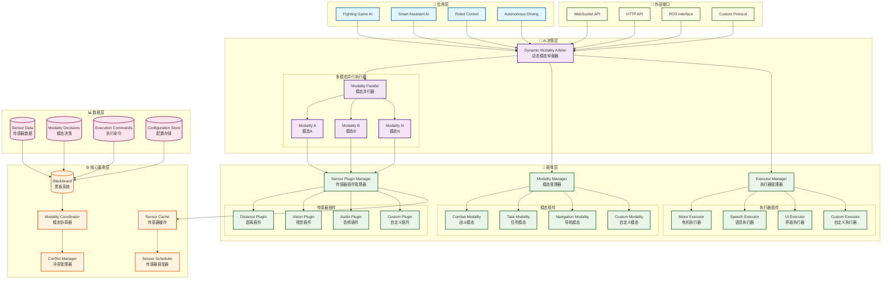
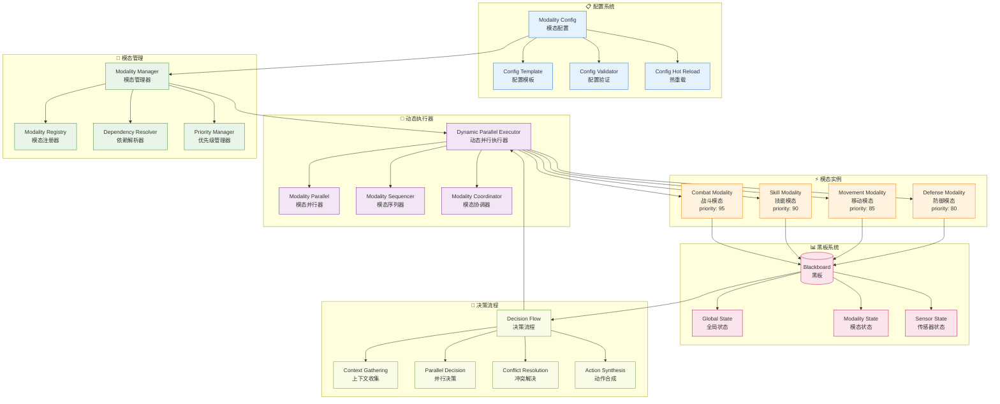
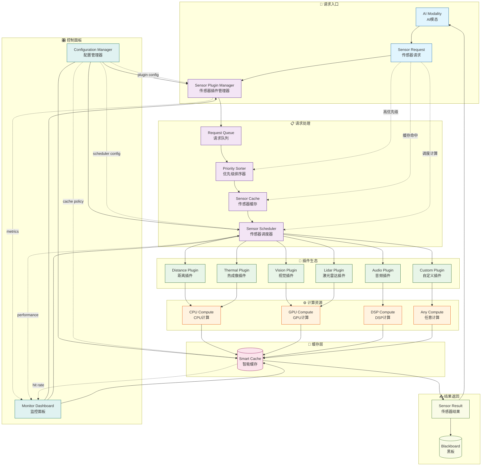
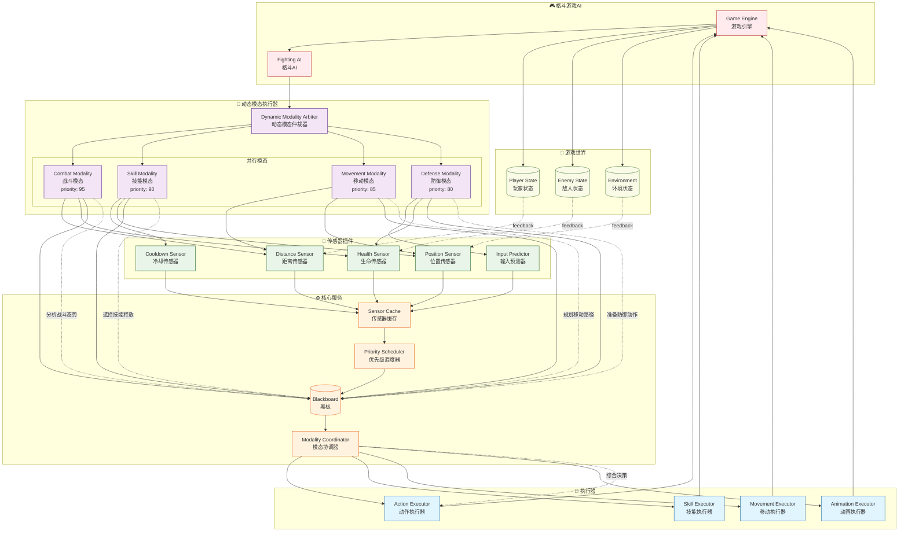
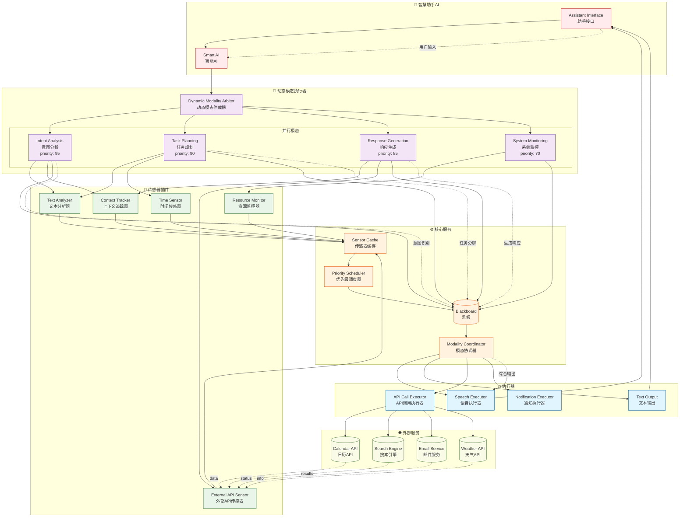
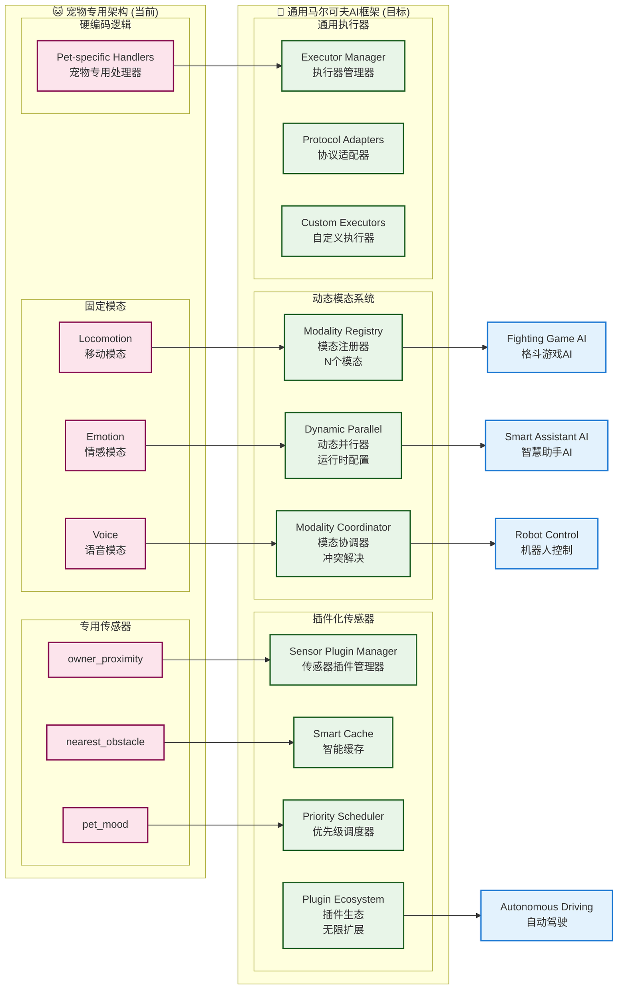

# 通用马尔可夫AI框架设计文档

## 📋 文档概述

本文档描述从宠物专用AI架构向通用马尔可夫AI框架的演进设计。该框架旨在支持格斗游戏、智慧助手、机器人控制、自动驾驶等多种AI应用场景，保持核心的马尔可夫性原则。

**设计目标**：从专用化 → 泛化，从单场景 → 多场景，从固定架构 → 动态配置

---

## 🎯 核心设计理念

### 马尔可夫性原则的泛化应用

**核心约束**：AI的未来决策只能基于当前状态，而非历史状态

```typescript
// ❌ 历史依赖（非马尔可夫）
// AI记住过去的对话历史来做决策
let conversationHistory = ["你好", "我叫小明", "今天天气不错"];
let nextResponse = generateResponse(conversationHistory);

// ✅ 当前状态驱动（马尔可夫）
// AI只基于当前对话状态做决策
let currentState = {
  userIntent: "greeting",
  emotionalState: "friendly",
  contextTopic: "weather"
};
let nextResponse = decideResponse(currentState);
```

### 架构演进路径

```
宠物专用架构 → 多模态并行架构 → 通用马尔可夫AI框架
     ↓              ↓              ↓
 固定3模态     动态模态注册    插件化生态系统
 硬编码逻辑     配置文件驱动    运行时重配置
 单场景适用     有限扩展性      无限扩展性
```

---

## 🏗️ 整体架构图



### 架构说明

#### 🏗️ **分层架构**
1. **应用层**：具体应用场景（格斗游戏、智慧助手等）
2. **AI决策层**：核心决策逻辑和模态管理
3. **插件层**：可扩展的传感器、模态、执行器插件
4. **核心服务层**：黑板、协调、缓存等核心服务
5. **数据层**：各种数据的存储和管理
6. **外部接口层**：与外部系统的通信接口

#### 🔄 **数据流向**
1. **应用请求** → **AI决策层** → **插件层** → **核心服务**
2. **传感器数据** → **缓存** → **黑板** → **模态决策**
3. **决策结果** → **执行器** → **外部系统**

#### 🎯 **核心特性**
- **插件化架构**：所有组件都可以作为插件扩展
- **马尔可夫性保证**：黑板系统确保状态的确定性和隔离
- **动态配置**：运行时可以重配置模态组合
- **智能调度**：传感器按需计算，优先级调度

---

## 🏗️ P2：动态多模态并行架构

## 🧩 P2动态多模态架构详细图



### 核心组件设计

#### 1. 模态配置系统

```typescript
interface ModalityConfig {
  // 基本信息
  id: string;                    // 唯一标识符
  name: string;                  // 显示名称
  description?: string;          // 描述信息

  // 执行配置
  priority: number;              // 执行优先级 (1-100)
  executionMode: 'parallel' | 'sequential' | 'conditional';
  dependencies?: string[];       // 依赖的其他模态ID

  // 数据配置
  blackboardPrefix: string;      // 黑板数据前缀 (bt_output_${prefix}_*)
  stateScope: 'global' | 'local'; // 状态作用域

  // 行为树配置
  subtreeConfig: SubtreeConfig;  // 子树配置
  guards?: GuardConfig[];        // 守卫条件

  // 性能配置
  maxExecutionTime?: number;     // 最大执行时间(ms)
  cooldownTime?: number;         // 冷却时间(ms)
}

interface SubtreeConfig {
  rootNode: 'priority' | 'sequence' | 'parallel';
  children: BehaviorNodeConfig[];
  properties?: Record<string, any>;
}
```

#### 2. 动态并行执行器

```typescript
class DynamicParallelExecutor extends Parallel {
  private modalityManager: ModalityManager;
  private coordinator: ModalityCoordinator;

  constructor() {
    super({
      name: 'DynamicParallelExecutor',
      policy: 'SuccessOnAll'
    });
    this.modalityManager = new ModalityManager();
    this.coordinator = new ModalityCoordinator();
  }

  // 注册模态
  registerModality(config: ModalityConfig): void {
    const subtree = this.buildSubtree(config);
    this.modalityManager.register(config, subtree);
    this.addChild(subtree);
  }

  // 动态重配置
  reconfigure(activeModalityIds: string[]): void {
    const activeModalities = activeModalityIds.map(id =>
      this.modalityManager.getModality(id)
    ).filter(Boolean);

    // 重新构建执行树
    this.children = activeModalities.map(m => m.subtree);

    // 更新依赖关系
    this.coordinator.updateDependencies(activeModalities);
  }

  // 协调模态间通信
  coordinate(fromModality: string, message: ModalityMessage): void {
    this.coordinator.processMessage(fromModality, message);
  }

  private buildSubtree(config: ModalityConfig): Priority {
    // 根据配置动态构建行为树子树
    return new Priority({
      id: `${config.id}_priority`,
      children: config.subtreeConfig.children.map(childConfig =>
        this.buildNode(childConfig)
      )
    });
  }
}
```

#### 3. 模态协调器

```typescript
interface ModalityMessage {
  id: string;
  from: string;
  to: string | 'broadcast';
  type: 'request' | 'notify' | 'coordinate' | 'conflict';
  priority: 'low' | 'medium' | 'high' | 'critical';
  payload: any;
  timestamp: number;
}

class ModalityCoordinator {
  private messageQueue: ModalityMessage[] = [];
  private conflictResolver: ConflictResolver;

  // 处理模态间消息
  processMessage(fromModality: string, message: ModalityMessage): void {
    // 优先级排序
    this.messageQueue.push(message);
    this.messageQueue.sort((a, b) => this.getPriorityWeight(b) - this.getPriorityWeight(a));

    // 处理消息
    this.processQueue();
  }

  // 解决模态间冲突
  resolveConflicts(activeModalities: ModalityConfig[]): void {
    const conflicts = this.detectConflicts(activeModalities);
    conflicts.forEach(conflict => {
      this.conflictResolver.resolve(conflict);
    });
  }

  private detectConflicts(modalities: ModalityConfig[]): Conflict[] {
    const conflicts: Conflict[] = [];

    // 检查资源冲突（例如两个模态都想控制同一个执行器）
    // 检查优先级冲突
    // 检查依赖冲突

    return conflicts;
  }
}
```

### 应用场景配置示例

#### 格斗游戏AI配置

```json
{
  "modalities": [
    {
      "id": "combat_strategy",
      "name": "战斗策略",
      "priority": 95,
      "executionMode": "parallel",
      "blackboardPrefix": "combat",
      "subtreeConfig": {
        "rootNode": "priority",
        "children": [
          {
            "type": "BlackboardGuard",
            "config": {
              "key": "enemy_in_range",
              "child": {
                "type": "CombatStrategyAction",
                "config": { "strategy": "aggressive" }
              }
            }
          }
        ]
      }
    },
    {
      "id": "skill_execution",
      "name": "技能释放",
      "priority": 90,
      "executionMode": "parallel",
      "dependencies": ["combat_strategy"],
      "blackboardPrefix": "skill",
      "subtreeConfig": {
        "rootNode": "sequence",
        "children": [
          {
            "type": "SkillCooldownGuard",
            "config": { "skillId": "fireball" }
          },
          {
            "type": "ExecuteSkillAction",
            "config": { "skillId": "fireball" }
          }
        ]
      }
    },
    {
      "id": "movement_tactics",
      "name": "移动战术",
      "priority": 85,
      "executionMode": "parallel",
      "blackboardPrefix": "movement",
      "subtreeConfig": {
        "rootNode": "priority",
        "children": [
          {
            "type": "EvadeAction",
            "config": { "evadeDistance": 2.0 }
          },
          {
            "type": "ApproachAction",
            "config": { "approachDistance": 1.5 }
          }
        ]
      }
    }
  ]
}
```

#### 智慧助手AI配置

```json
{
  "modalities": [
    {
      "id": "conversation",
      "name": "对话处理",
      "priority": 90,
      "executionMode": "parallel",
      "blackboardPrefix": "chat",
      "subtreeConfig": {
        "rootNode": "priority",
        "children": [
          {
            "type": "IntentRecognitionGuard",
            "config": { "intents": ["greeting", "question", "command"] }
          },
          {
            "type": "GenerateResponseAction"
          }
        ]
      }
    },
    {
      "id": "task_planning",
      "name": "任务规划",
      "priority": 80,
      "executionMode": "conditional",
      "dependencies": ["conversation"],
      "blackboardPrefix": "task",
      "subtreeConfig": {
        "rootNode": "sequence",
        "children": [
          {
            "type": "ParseTaskAction"
          },
          {
            "type": "PlanStepsAction"
          },
          {
            "type": "ExecutePlanAction"
          }
        ]
      }
    },
    {
      "id": "system_monitoring",
      "name": "系统监控",
      "priority": 70,
      "executionMode": "parallel",
      "blackboardPrefix": "system",
      "subtreeConfig": {
        "rootNode": "parallel",
        "children": [
          {
            "type": "MonitorResourcesAction",
            "config": { "resources": ["cpu", "memory", "network"] }
          },
          {
            "type": "HealthCheckAction"
          }
        ]
      }
    }
  ]
}
```

## 🔧 P3插件化传感器系统架构图



### 传感器系统工作流程

#### 🔄 **完整数据流**
1. **AI模态请求** → 传感器插件管理器
2. **优先级排序** → 检查缓存 → 调度计算
3. **插件计算** → 使用相应计算资源
4. **结果缓存** → 返回黑板系统
5. **监控统计** → 性能优化

#### 🎯 **智能特性**
- **按需计算**：只有被请求时才计算
- **智能缓存**：基于上下文和有效期的缓存策略
- **优先级调度**：高优先级请求优先处理
- **并发控制**：避免计算资源过载
- **插件生态**：支持自定义传感器插件

---

## 🔧 P3：插件化传感器系统

### 核心组件设计

#### 1. 传感器插件接口

```typescript
interface SensorPlugin {
  // 基本信息
  id: string;
  name: string;
  version: string;
  description: string;

  // 功能定义
  capabilities: SensorCapability[];
  dependencies?: string[];  // 依赖的其他插件

  // 计算接口
  compute: (context: SensorContext) => Promise<SensorData>;

  // 配置接口
  getConfigSchema: () => ConfigSchema;
  validateConfig: (config: any) => ValidationResult;

  // 生命周期
  initialize: (config: any) => Promise<void>;
  dispose: () => Promise<void>;
}

interface SensorCapability {
  type: string;              // 传感器类型 ('distance', 'vision', 'audio', etc.)
  dimensions: string[];      // 数据维度 (['x', 'y', 'z'], ['frequency'], etc.)
  dataType: 'scalar' | 'vector' | 'matrix' | 'custom';
  updateFrequency: 'realtime' | 'high' | 'medium' | 'low';
}

interface SensorContext {
  timestamp: number;
  position?: Vector3;
  orientation?: Quaternion;
  environment?: EnvironmentData;
  requester?: string;        // 请求者ID
  priority: 'low' | 'medium' | 'high' | 'critical';
  config: Record<string, any>; // 传感器特定配置
}
```

#### 2. 传感器插件管理器

```typescript
class SensorPluginManager {
  private plugins: Map<string, SensorPlugin> = new Map();
  private cache: SensorCache;
  private scheduler: SensorScheduler;

  // 注册插件
  async registerPlugin(plugin: SensorPlugin): Promise<void> {
    // 验证依赖
    await this.validateDependencies(plugin);

    // 初始化插件
    await plugin.initialize({});

    // 注册到缓存系统
    this.cache.registerPlugin(plugin.id, plugin.capabilities);

    // 注册到调度器
    this.scheduler.registerPlugin(plugin.id, plugin.capabilities);

    this.plugins.set(plugin.id, plugin);
  }

  // 请求传感器数据
  async requestSensor(
    sensorId: string,
    context: SensorContext
  ): Promise<SensorData> {
    const plugin = this.plugins.get(sensorId);
    if (!plugin) {
      throw new Error(`Unknown sensor plugin: ${sensorId}`);
    }

    // 检查缓存
    const cachedData = this.cache.get(sensorId, context);
    if (cachedData && this.isCacheValid(cachedData, context)) {
      return cachedData;
    }

    // 调度计算
    return await this.scheduler.scheduleComputation(plugin, context);
  }

  // 批量请求传感器数据
  async requestSensors(
    requests: SensorRequest[]
  ): Promise<Map<string, SensorData>> {
    const results = new Map<string, SensorData>();

    // 按优先级排序
    requests.sort((a, b) => this.getPriorityWeight(b.priority) - this.getPriorityWeight(a.priority));

    // 并行处理
    const promises = requests.map(async (request) => {
      try {
        const data = await this.requestSensor(request.sensorId, request.context);
        results.set(request.sensorId, data);
      } catch (error) {
        console.error(`Sensor request failed: ${request.sensorId}`, error);
      }
    });

    await Promise.all(promises);
    return results;
  }
}
```

#### 3. 智能缓存系统

```typescript
interface CacheEntry {
  sensorId: string;
  data: SensorData;
  timestamp: number;
  context: SensorContext;
  validityDuration: number;  // 缓存有效期(ms)
  accessCount: number;
  lastAccess: number;
}

class SensorCache {
  private cache = new Map<string, CacheEntry>();
  private maxSize: number = 1000;
  private cleanupInterval: number = 60000; // 1分钟清理一次

  constructor() {
    setInterval(() => this.cleanup(), this.cleanupInterval);
  }

  // 获取缓存数据
  get(sensorId: string, context: SensorContext): SensorData | null {
    const key = this.generateKey(sensorId, context);
    const entry = this.cache.get(key);

    if (!entry) return null;

    // 检查是否过期
    if (Date.now() - entry.timestamp > entry.validityDuration) {
      this.cache.delete(key);
      return null;
    }

    // 更新访问信息
    entry.accessCount++;
    entry.lastAccess = Date.now();

    return entry.data;
  }

  // 设置缓存数据
  set(sensorId: string, data: SensorData, context: SensorContext): void {
    const key = this.generateKey(sensorId, context);
    const validityDuration = this.calculateValidityDuration(sensorId, context);

    const entry: CacheEntry = {
      sensorId,
      data,
      timestamp: Date.now(),
      context,
      validityDuration,
      accessCount: 1,
      lastAccess: Date.now()
    };

    // 检查缓存大小限制
    if (this.cache.size >= this.maxSize) {
      this.evictLeastRecentlyUsed();
    }

    this.cache.set(key, entry);
  }

  // 计算缓存有效期
  private calculateValidityDuration(sensorId: string, context: SensorContext): number {
    // 基于传感器类型和上下文计算合适的缓存时间
    const baseDuration = this.getBaseDuration(sensorId);

    // 考虑移动速度等因素
    const contextFactor = this.calculateContextFactor(context);

    return Math.max(100, baseDuration * contextFactor); // 最少100ms
  }

  private getBaseDuration(sensorId: string): number {
    // 不同传感器类型有不同的缓存策略
    const sensorType = sensorId.split('_')[0];
    switch (sensorType) {
      case 'distance': return 500;    // 距离变化较慢
      case 'vision': return 100;      // 视觉需要实时
      case 'audio': return 200;       // 音频中等频率
      default: return 300;
    }
  }

  private evictLeastRecentlyUsed(): void {
    let oldestKey: string | null = null;
    let oldestTime = Date.now();

    for (const [key, entry] of this.cache.entries()) {
      if (entry.lastAccess < oldestTime) {
        oldestTime = entry.lastAccess;
        oldestKey = key;
      }
    }

    if (oldestKey) {
      this.cache.delete(oldestKey);
    }
  }

  private cleanup(): void {
    const now = Date.now();
    for (const [key, entry] of this.cache.entries()) {
      if (now - entry.timestamp > entry.validityDuration) {
        this.cache.delete(key);
      }
    }
  }

  private generateKey(sensorId: string, context: SensorContext): string {
    // 生成基于传感器ID和关键上下文的缓存键
    const contextKey = JSON.stringify({
      position: context.position,
      requester: context.requester,
      // 忽略不影响结果的上下文字段
    });
    return `${sensorId}_${contextKey}`;
  }
}
```

#### 4. 传感器调度器

```typescript
interface ScheduledComputation {
  id: string;
  plugin: SensorPlugin;
  context: SensorContext;
  priority: number;
  promise: Promise<SensorData>;
  startTime: number;
  timeout: number;
}

class SensorScheduler {
  private queue: ScheduledComputation[] = [];
  private running: Map<string, ScheduledComputation> = new Map();
  private maxConcurrent: number = 5;

  // 调度传感器计算
  async scheduleComputation(
    plugin: SensorPlugin,
    context: SensorContext
  ): Promise<SensorData> {
    const computation: ScheduledComputation = {
      id: this.generateId(),
      plugin,
      context,
      priority: this.getPriorityWeight(context.priority),
      promise: null!,
      startTime: 0,
      timeout: this.calculateTimeout(plugin, context)
    };

    // 如果未达到并发限制，直接执行
    if (this.running.size < this.maxConcurrent) {
      return await this.executeComputation(computation);
    }

    // 否则加入队列
    computation.promise = this.waitAndExecute(computation);
    this.queue.push(computation);

    // 按优先级排序队列
    this.queue.sort((a, b) => b.priority - a.priority);

    return computation.promise;
  }

  private async executeComputation(computation: ScheduledComputation): Promise<SensorData> {
    computation.startTime = Date.now();
    this.running.set(computation.id, computation);

    try {
      // 设置超时
      const timeoutPromise = new Promise<never>((_, reject) => {
        setTimeout(() => reject(new Error('Sensor computation timeout')), computation.timeout);
      });

      const computationPromise = computation.plugin.compute(computation.context);

      const result = await Promise.race([computationPromise, timeoutPromise]);

      // 缓存结果
      // this.cache.set(computation.plugin.id, result, computation.context);

      return result;
    } finally {
      this.running.delete(computation.id);
      this.processQueue(); // 处理队列中的下一个任务
    }
  }

  private async waitAndExecute(computation: ScheduledComputation): Promise<SensorData> {
    // 等待轮到自己执行
    while (this.running.size >= this.maxConcurrent) {
      await new Promise(resolve => setTimeout(resolve, 10));
    }

    return await this.executeComputation(computation);
  }

  private processQueue(): void {
    while (this.queue.length > 0 && this.running.size < this.maxConcurrent) {
      const computation = this.queue.shift()!;
      computation.promise = this.executeComputation(computation);
    }
  }

  private calculateTimeout(plugin: SensorPlugin, context: SensorContext): number {
    // 基于传感器复杂度和优先级计算超时时间
    const baseTimeout = 1000; // 1秒基础超时

    // 复杂传感器需要更多时间
    const complexityFactor = plugin.capabilities.length;

    // 高优先级任务给更多时间
    const priorityFactor = context.priority === 'critical' ? 2 :
                          context.priority === 'high' ? 1.5 :
                          context.priority === 'medium' ? 1 : 0.8;

    return baseTimeout * complexityFactor * priorityFactor;
  }

  private getPriorityWeight(priority: string): number {
    switch (priority) {
      case 'critical': return 100;
      case 'high': return 75;
      case 'medium': return 50;
      case 'low': return 25;
      default: return 50;
    }
  }

  private generateId(): string {
    return `sensor_${Date.now()}_${Math.random().toString(36).substr(2, 9)}`;
  }
}
```

### 传感器插件示例

#### 距离传感器插件

```typescript
class DistanceSensorPlugin implements SensorPlugin {
  id = 'distance_calculator';
  name = 'Distance Calculator';
  version = '1.0.0';
  description = '计算两个位置之间的距离';

  capabilities = [
    {
      type: 'distance',
      dimensions: ['value'],
      dataType: 'scalar',
      updateFrequency: 'high'
    }
  ];

  async compute(context: SensorContext): Promise<SensorData> {
    const { position: pos1, config } = context;
    const pos2 = config.targetPosition;

    if (!pos1 || !pos2) {
      throw new Error('Position data required');
    }

    const distance = Math.sqrt(
      Math.pow(pos2.x - pos1.x, 2) +
      Math.pow(pos2.y - pos1.y, 2) +
      Math.pow(pos2.z - pos1.z, 2)
    );

    return {
      sensorId: this.id,
      timestamp: Date.now(),
      data: { value: distance },
      confidence: 1.0,
      metadata: {
        units: 'meters',
        calculationMethod: 'euclidean'
      }
    };
  }

  getConfigSchema(): ConfigSchema {
    return {
      type: 'object',
      properties: {
        targetPosition: {
          type: 'object',
          properties: {
            x: { type: 'number' },
            y: { type: 'number' },
            z: { type: 'number' }
          },
          required: ['x', 'y', 'z']
        }
      },
      required: ['targetPosition']
    };
  }

  async initialize(config: any): Promise<void> {
    // 初始化逻辑
  }

  async dispose(): Promise<void> {
    // 清理逻辑
  }
}
```

#### 视觉传感器插件

```typescript
class VisionSensorPlugin implements SensorPlugin {
  id = 'vision_detector';
  name = 'Vision Detector';
  version = '1.0.0';
  description = '检测视野内的物体';

  capabilities = [
    {
      type: 'vision',
      dimensions: ['objects'],
      dataType: 'vector',
      updateFrequency: 'realtime'
    }
  ];

  async compute(context: SensorContext): Promise<SensorData> {
    const { position, orientation, environment } = context;

    // 模拟视觉检测逻辑
    const visibleObjects = environment?.objects.filter(obj => {
      // 检查物体是否在视野范围内
      const distance = this.calculateDistance(position, obj.position);
      const angle = this.calculateAngle(orientation, obj.position);

      return distance <= 10 && Math.abs(angle) <= Math.PI / 3; // 60度视野
    }) || [];

    return {
      sensorId: this.id,
      timestamp: Date.now(),
      data: { objects: visibleObjects },
      confidence: 0.85,
      metadata: {
        fieldOfView: 60,
        maxDistance: 10,
        detectedCount: visibleObjects.length
      }
    };
  }

  private calculateDistance(pos1: Vector3, pos2: Vector3): number {
    return Math.sqrt(
      Math.pow(pos2.x - pos1.x, 2) +
      Math.pow(pos2.y - pos1.y, 2) +
      Math.pow(pos2.z - pos1.z, 2)
    );
  }

  private calculateAngle(orientation: Quaternion, targetPos: Vector3): number {
    // 计算朝向与目标的夹角
    // 简化实现
    return 0;
  }

  getConfigSchema(): ConfigSchema {
    return {
      type: 'object',
      properties: {
        fieldOfView: { type: 'number', default: 60 },
        maxDistance: { type: 'number', default: 10 },
        objectTypes: {
          type: 'array',
          items: { type: 'string' },
          default: ['enemy', 'ally', 'obstacle']
        }
      }
    };
  }

  async initialize(config: any): Promise<void> {
    // 初始化视觉检测系统
  }

  async dispose(): Promise<void> {
    // 清理视觉检测资源
  }
}
```

---

## 🎮 应用场景实现

### 格斗游戏AI架构图



### 格斗游戏AI决策流程

#### ⚔️ **实时战斗决策**
1. **态势感知**：距离、健康、位置传感器实时监控
2. **并行分析**：
   - 战斗模态：分析攻防态势
   - 技能模态：评估技能释放时机
   - 移动模态：规划走位策略
   - 防御模态：预测对方攻击
3. **协调决策**：模态协调器综合各模态建议
4. **动作执行**：输出最终的战斗动作组合

#### 🎯 **马尔可夫性保证**
- 每个决策只基于当前游戏状态
- 传感器数据实时更新，无历史依赖
- 模态间状态隔离，避免状态污染

### 格斗游戏AI实现

#### 配置模态组合

```json
{
  "application": "fighting_game",
  "modalities": [
    {
      "id": "combat_analyzer",
      "name": "战斗分析",
      "priority": 100,
      "executionMode": "parallel",
      "blackboardPrefix": "combat"
    },
    {
      "id": "skill_system",
      "name": "技能系统",
      "priority": 95,
      "executionMode": "parallel",
      "dependencies": ["combat_analyzer"],
      "blackboardPrefix": "skill"
    },
    {
      "id": "movement_ai",
      "name": "移动AI",
      "priority": 90,
      "executionMode": "parallel",
      "blackboardPrefix": "movement"
    },
    {
      "id": "combo_tracker",
      "name": "连击追踪",
      "priority": 85,
      "executionMode": "conditional",
      "dependencies": ["skill_system"],
      "blackboardPrefix": "combo"
    }
  ],
  "sensors": [
    {
      "id": "distance_calculator",
      "config": { "maxDistance": 5.0 }
    },
    {
      "id": "health_detector",
      "config": { "trackTargets": ["player", "enemies"] }
    },
    {
      "id": "skill_cooldown_tracker",
      "config": { "trackedSkills": ["fireball", "lightning", "heal"] }
    }
  ]
}
```

#### 决策逻辑示例

```typescript
// 战斗分析模态
class CombatAnalyzerModality implements Modality {
  async decide(state: Blackboard): Promise<Decision> {
    const enemyDistance = await sensorManager.requestSensor('distance_calculator', {
      targetPosition: state.get('enemy_position'),
      priority: 'high'
    });

    const myHealth = state.get('my_health');
    const enemyHealth = state.get('enemy_health');

    if (enemyDistance.value < 2.0) {
      if (myHealth < enemyHealth) {
        return { action: 'retreat', confidence: 0.8 };
      } else {
        return { action: 'attack', confidence: 0.9 };
      }
    } else {
      return { action: 'approach', confidence: 0.7 };
    }
  }
}

// 技能系统模态
class SkillSystemModality implements Modality {
  async decide(state: Blackboard): Promise<Decision> {
    const combatDecision = state.get('combat_decision');
    const cooldowns = await sensorManager.requestSensor('skill_cooldown_tracker', {
      priority: 'high'
    });

    if (combatDecision.action === 'attack' && !cooldowns.fireball) {
      return { action: 'cast_fireball', confidence: 0.95 };
    }

    if (combatDecision.action === 'retreat' && !cooldowns.lightning) {
      return { action: 'cast_lightning', confidence: 0.9 };
    }

    return { action: 'basic_attack', confidence: 0.6 };
  }
}
```

### 智慧助手AI实现

#### 配置模态组合

```json
{
  "application": "smart_assistant",
  "modalities": [
    {
      "id": "intent_analyzer",
      "name": "意图分析",
      "priority": 95,
      "executionMode": "parallel",
      "blackboardPrefix": "intent"
    },
    {
      "id": "task_planner",
      "name": "任务规划",
      "priority": 90,
      "executionMode": "sequential",
      "dependencies": ["intent_analyzer"],
      "blackboardPrefix": "task"
    },
    {
      "id": "response_generator",
      "name": "响应生成",
      "priority": 85,
      "executionMode": "parallel",
      "blackboardPrefix": "response"
    },
    {
      "id": "system_monitor",
      "name": "系统监控",
      "priority": 70,
      "executionMode": "parallel",
      "blackboardPrefix": "system"
    }
  ],
  "sensors": [
    {
      "id": "text_analyzer",
      "config": { "languages": ["zh", "en"], "maxTokens": 512 }
    },
    {
      "id": "context_tracker",
      "config": { "maxHistory": 10, "decayFactor": 0.9 }
    },
    {
      "id": "resource_monitor",
      "config": { "metrics": ["cpu", "memory", "network"] }
    }
  ]
}
```

### 智慧助手AI架构图



### 智慧助手AI决策流程

#### 💬 **多轮对话决策**
1. **意图理解**：文本分析器和上下文追踪器分析用户输入
2. **并行处理**：
   - 意图分析：识别用户意图和实体
   - 任务规划：分解复杂任务为步骤
   - 响应生成：基于上下文生成合适回复
   - 系统监控：确保资源使用合理
3. **协调输出**：综合各模态结果，生成最终响应
4. **执行动作**：调用外部API、发送通知等

#### 🎯 **马尔可夫性保证**
- 每次对话只基于当前上下文状态
- 传感器数据动态更新，无会话历史依赖
- 模态决策相互独立，避免状态干扰

#### 决策逻辑示例

```typescript
// 意图分析模态
class IntentAnalyzerModality implements Modality {
  async decide(state: Blackboard): Promise<Decision> {
    const userInput = state.get('user_input');
    const context = await sensorManager.requestSensor('context_tracker', {
      priority: 'high'
    });

    const analysis = await sensorManager.requestSensor('text_analyzer', {
      text: userInput,
      context: context.history,
      priority: 'high'
    });

    return {
      intent: analysis.intent,
      confidence: analysis.confidence,
      entities: analysis.entities
    };
  }
}

// 任务规划模态
class TaskPlannerModality implements Modality {
  async decide(state: Blackboard): Promise<Decision> {
    const intent = state.get('intent_analysis');

    if (intent.intent === 'schedule_meeting') {
      return {
        action: 'plan_meeting',
        steps: [
          'check_calendar',
          'find_available_slot',
          'send_invitations',
          'set_reminders'
        ],
        confidence: 0.9
      };
    }

    if (intent.intent === 'search_information') {
      return {
        action: 'web_search',
        query: intent.entities.query,
        sources: ['google', 'wikipedia', 'news'],
        confidence: 0.85
      };
    }

    return { action: 'general_response', confidence: 0.7 };
  }
}
```

---

## 📊 架构评估

### 泛化性评分

| 维度 | 当前宠物架构 | 通用框架 | 提升 |
|------|-------------|---------|------|
| **模态扩展性** | 固定3模态 | 动态N模态 | ⭐⭐⭐⭐⭐ |
| **传感器灵活性** | 枚举类型 | 插件系统 | ⭐⭐⭐⭐⭐ |
| **配置驱动** | 硬编码 | JSON配置 | ⭐⭐⭐⭐⭐ |
| **应用场景** | 单场景 | 多场景 | ⭐⭐⭐⭐⭐ |
| **运行时重配置** | 不支持 | 支持 | ⭐⭐⭐⭐⭐ |

### 性能评估

#### 优势
- **按需计算**：只计算需要的传感器数据
- **智能缓存**：减少重复计算
- **优先级调度**：高优先级任务优先处理
- **并行执行**：模态间并行决策

#### 权衡
- **插件加载开销**：动态加载插件的初始开销
- **配置解析开销**：JSON配置解析的时间成本
- **协调通信开销**：模态间通信的延迟

### 可扩展性评估

#### 插件生态系统
- **传感器插件**：支持自定义传感器类型
- **模态插件**：支持自定义决策模态
- **执行器插件**：支持自定义输出执行器

#### 配置管理系统
- **版本控制**：配置版本管理和回滚
- **环境适配**：不同环境的配置模板
- **热更新**：运行时配置更新

---

## 🚀 实施路线图

### 第一阶段：核心框架搭建（2个月）

1. **动态多模态系统**（4周）
   - 实现ModalityConfig和DynamicParallelExecutor
   - 构建模态注册和配置系统
   - 实现基本的模态间通信

2. **插件化传感器框架**（4周）
   - 定义SensorPlugin接口
   - 实现SensorPluginManager和SensorCache
   - 构建SensorScheduler调度系统

### 第二阶段：应用场景适配（2个月）

1. **格斗游戏AI适配**（4周）
   - 实现战斗相关模态
   - 开发战斗传感器插件
   - 集成到现有游戏引擎

2. **智慧助手AI适配**（4周）
   - 实现对话和任务模态
   - 开发文本分析传感器插件
   - 构建助手决策系统

### 第三阶段：生态系统建设（2个月）

1. **插件市场**（4周）
   - 建立插件注册和发现机制
   - 实现插件版本管理和依赖解析
   - 构建插件评级和反馈系统

2. **开发工具链**（4周）
   - 插件开发SDK
   - 配置可视化编辑器
   - 调试和监控工具

---

## 🔄 架构演进对比图



### 架构演进对比表

| 维度 | 宠物专用架构 | 通用马尔可夫AI框架 | 提升效果 |
|------|-------------|-------------------|---------|
| **模态数量** | 固定3个 | 动态N个 | ⭐⭐⭐⭐⭐ |
| **传感器类型** | 枚举定义 | 插件生态 | ⭐⭐⭐⭐⭐ |
| **配置方式** | 硬编码 | JSON配置 | ⭐⭐⭐⭐⭐ |
| **运行时配置** | 不支持 | 热重载 | ⭐⭐⭐⭐⭐ |
| **应用场景** | 单场景 | 多场景扩展 | ⭐⭐⭐⭐⭐ |
| **开发效率** | 专用开发 | 复用框架 | ⭐⭐⭐⭐⭐ |
| **维护成本** | 高（定制化） | 低（标准化） | ⭐⭐⭐⭐⭐ |
| **扩展性** | 有限 | 无限 | ⭐⭐⭐⭐⭐ |

### 核心技术创新

#### 🎯 **1. 从固定到动态**
- **模态系统**：从硬编码3模态 → 动态注册N模态
- **传感器系统**：从枚举类型 → 插件化生态
- **执行器系统**：从专用接口 → 通用协议适配

#### 🔧 **2. 从专用到通用**
- **配置驱动**：JSON配置替代硬编码
- **插件生态**：标准化插件接口
- **运行时重配置**：支持热更新和动态调整

#### 🏗️ **3. 从单场景到多场景**
- **框架抽象**：提取通用AI决策模式
- **协议适配**：支持多种执行器协议
- **状态管理**：统一的马尔可夫状态管理

### 实施价值对比

#### 📅 **宠物专用架构实施（已完成）**
- ⏰ 时间：P0+P1总计2个月
- 💰 成本：中等（专用开发）
- 🎯 效果：宠物AI 9.8/10马尔可夫性

#### 🚀 **通用框架架构实施（规划中）**
- ⏰ 时间：核心框架4个月 + 生态建设8个月 = 12个月
- 💰 成本：高（前期投资）+ 低（长期复用）
- 🎯 效果：多场景AI框架，支撑无限扩展

---

## 🎯 总结

这个通用马尔可夫AI框架的设计实现了从专用化到泛化的重大跨越：

### 核心成就
1. **真正的泛化架构**：支持任意数量和类型的模态
2. **插件化生态**：传感器和模态都可以作为插件扩展
3. **配置驱动**：运行时重配置，无需重新编译
4. **多场景支持**：从宠物AI扩展到格斗游戏、智慧助手等多种场景

### 技术创新
1. **动态多模态执行器**：突破了固定模态的限制
2. **智能传感器调度**：按需计算 + 优先级调度 + 智能缓存
3. **模态协调机制**：支持模态间的通信和冲突解决

### 未来展望
这个框架为构建更复杂的AI系统奠定了基础，支持从简单的宠物陪伴到复杂的游戏AI、机器人控制、自动驾驶等各种应用场景的开发。

**核心原则**：始终坚持马尔可夫性 - AI的决策只能基于当前状态，而非历史依赖。这确保了AI系统的确定性、可预测性和可调试性。