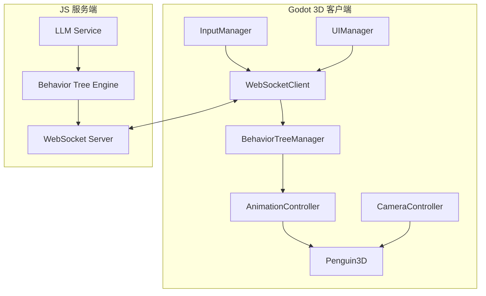

# Godot 3D 萌宠项目设计文档

## 项目概述

### 项目目标
创建一个基于Godot引擎的3D萌宠游戏，完全模仿现有JS前端萌宠的功能特性。通过WebSocket与现有的LLM+行为树服务端通信，实现统一的控制逻辑和AI驱动行为。

### 核心功能对等性
- ✅ 文字指令控制（LLM意图理解）
- ✅ 鼠标拖拽交互
- ✅ 多种动作和表情
- ✅ 状态管理系统（能量、无聊度）
- ✅ 行为树驱动AI
- ✅ 实时状态同步

## 架构设计

### 整体架构图



### 核心模块设计

#### 1. WebSocket通信模块 (WebSocketClient.gd)

**功能职责：**
- 建立与JS服务端的WebSocket连接
- 发送用户输入（文字指令、鼠标操作）
- 接收服务端指令（动作、表情、位置更新）
- 处理连接状态和重连逻辑

**核心方法：**
```gdscript
func connect_to_server(url: String) -> void
func send_user_input(input: Dictionary) -> void
func send_mouse_interaction(type: String, data: Dictionary) -> void
func _on_message_received(message: String) -> void
func _on_connection_closed() -> void
func _on_connection_error() -> void
```

**通信协议：**

**发送消息格式：**
```json
{
  "type": "user_input",
  "data": {
    "text": "跳舞",
    "timestamp": 1234567890
  }
}
```

```json
{
  "type": "mouse_drag",
  "data": {
    "start_pos": [0, 0, 0],
    "end_pos": [1, 1, 1],
    "duration": 2.0
  }
}
```

**接收消息格式：**
```json
{
  "type": "bt_output",
  "data": {
    "action": "DANCE",
    "expression": "HAPPY",
    "position": [0, -1, 0],
    "chat_messages": [
      {"role": "assistant", "content": "好的，我来跳舞给你看！"}
    ]
  }
}
```

#### 2. 行为树管理器 (BehaviorTreeManager.gd)

**功能职责：**
- 管理行为树状态同步
- 接收服务端行为树输出
- 本地状态管理和更新
- 协调各个行为树分支

**核心状态同步：**
```gdscript
var energy: float = 100.0
var boredom: float = 0.0
var current_action: String = "IDLE"
var current_expression: String = "NEUTRAL"
var penguin_position: Vector3 = Vector3(0, -1, 0)
```

**行为树分支：**
- **主行为树 (MainBT)**: 处理核心动作逻辑
- **主动服务树 (ActiveServiceBT)**: 管理生存状态（能量消耗、无聊度增加）
- **意图理解树 (IntentBT)**: 处理用户指令理解
- **情感树 (EmotionBT)**: 管理表情状态

#### 3. 动画控制器 (AnimationController.gd)

**功能职责：**
- 管理3D模型动画播放
- 处理动作和表情的混合
- 实现平滑的动画过渡

**动画树结构：**
```
AnimationTree
├── parameters/
│   ├── state/current (IDLE, WALK, RUN, etc.)
│   ├── expression/current (NEUTRAL, HAPPY, SAD, etc.)
│   ├── blend_amounts/
│   │   ├── speed (walk/run blend)
│   │   └── emotion_intensity
│   └── transitions/
│       ├── idle_to_walk
│       ├── walk_to_run
│       └── emotion_transitions
```

**动作映射：**
```gdscript
const ACTION_ANIMATIONS = {
    "IDLE": "idle",
    "WALK": "walk",
    "RUN": "run",
    "JUMP": "jump",
    "DANCE": "dance",
    "SLEEP": "sleep",
    # ... 更多动作
}
```

**表情映射：**
```gdscript
const EXPRESSION_ANIMATIONS = {
    "NEUTRAL": "face_neutral",
    "HAPPY": "face_happy",
    "SAD": "face_sad",
    "ANGRY": "face_angry",
    # ... 更多表情
}
```

#### 4. 3D企鹅角色 (Penguin3D.gd)

**继承结构：**
```
CharacterBody3D
├── CollisionShape3D
├── MeshInstance3D (企鹅模型)
├── AnimationTree
├── AnimationPlayer
└── AudioStreamPlayer3D (音效)
```

**核心功能：**
- 物理运动和碰撞检测
- 动画状态管理
- 交互响应（鼠标点击、拖拽）
- 音效播放

#### 5. 相机控制器 (CameraController.gd)

**功能特性：**
- 第三人称跟随相机
- 鼠标滚轮缩放
- 右键拖拽旋转视角
- 平滑的相机移动插值

**相机参数：**
```gdscript
const CAMERA_DISTANCE_MIN = 4.0
const CAMERA_DISTANCE_MAX = 12.0
const CAMERA_SENSITIVITY = 0.3
const CAMERA_SMOOTHING = 5.0
```

#### 6. 输入管理器 (InputManager.gd)

**支持的输入类型：**
- **鼠标输入：** 拖拽、点击、滚轮缩放
- **键盘输入：** WASD移动、空格跳跃
- **文字输入：** UI界面文字指令

**输入映射：**
```gdscript
# project.godot 中的输入映射
move_forward = KEY_W
move_back = KEY_S
move_left = KEY_A
move_right = KEY_D
jump = KEY_SPACE
camera_zoom_in = MOUSE_WHEEL_UP
camera_zoom_out = MOUSE_WHEEL_DOWN
camera_rotate = MOUSE_BUTTON_RIGHT
penguin_drag = MOUSE_BUTTON_LEFT
```

#### 7. UI管理器 (UIManager.gd)

**界面组件：**
- **状态栏：** 能量条、无聊度条、当前动作显示
- **聊天界面：** 消息历史、输入框
- **控制面板：** 连接状态、设置按钮
- **行为树可视化：** 可选的调试界面

## 技术实现方案

### Godot版本选择
- **Godot 4.2+**: 利用最新的GDScript改进和渲染特性
- **Forward+渲染器**: 更好的光照和阴影效果
- **Jolt物理引擎**: 更稳定的3D物理模拟

### 资源管理
- **3D模型：** 使用GLTF/GLB格式，支持动画
- **材质：** PBR材质，支持实时光照
- **音频：** WAV/MP3格式，支持3D空间音效
- **场景：** 基于GridMap的舞台场景

### 性能优化
- **LOD系统：** 距离相关的细节级别
- **遮挡剔除：** 减少不必要的渲染
- **对象池：** 复用临时对象
- **异步加载：** 资源按需加载

## 与JS版本的对比

### 功能对等性对比

| 功能模块 | JS版本 | Godot版本 | 实现方式 |
|---------|--------|-----------|----------|
| 文字指令 | ✅ LLM意图理解 | ✅ WebSocket转发 | 复用服务端逻辑 |
| 鼠标交互 | ✅ Three.js拖拽 | ✅ Godot输入系统 | 适配3D物理 |
| 动作系统 | ✅ 动画混合 | ✅ AnimationTree | Godot原生动画 |
| 表情系统 | ✅ 材质切换 | ✅ 动画层混合 | 更丰富的表情 |
| 状态管理 | ✅ React状态 | ✅ GDScript变量 | 实时同步 |
| 行为树 | ✅ 自定义实现 | ✅ 服务端驱动 | 统一逻辑 |

### 优势对比

**Godot版本优势：**
- 🎮 **更好的性能：** 原生C++引擎，更流畅的3D渲染
- 🎨 **丰富的视觉效果：** PBR材质、动态光照、粒子效果
- 🎵 **沉浸式体验：** 3D音效、完整物理模拟
- 🛠️ **强大的工具链：** 内置动画编辑器、场景编辑器
- 📦 **跨平台部署：** Windows、macOS、Linux、移动端

**JS版本优势：**
- 🌐 **Web原生：** 无需安装，直接在浏览器运行
- 🔄 **快速迭代：** React热重载开发体验
- 📊 **数据可视化：** 丰富的调试和可视化工具
- 🤝 **易于集成：** 与现有Web应用无缝集成

## 开发计划

### Phase 1: 核心框架 (2周)
- [ ] 项目结构搭建
- [ ] WebSocket通信模块
- [ ] 基础3D场景和角色
- [ ] 输入系统实现

### Phase 2: 动画和行为 (2周)
- [ ] 动画控制器实现
- [ ] 行为树集成
- [ ] 动作和表情系统
- [ ] 状态同步机制

### Phase 3: 交互和UI (1周)
- [ ] 相机控制系统
- [ ] UI界面实现
- [ ] 鼠标交互优化
- [ ] 调试工具

### Phase 4: 优化和测试 (1周)
- [ ] 性能优化
- [ ] 跨平台测试
- [ ] 错误处理
- [ ] 文档完善

## 部署和分发

### 开发环境
- **Godot 4.2+**: 主开发环境
- **VS Code**: 脚本编辑和调试
- **Blender**: 3D模型和动画制作

### 构建配置
- **导出模板：** 为不同平台配置构建
- **资源优化：** 压缩纹理和音频
- **启动参数：** WebSocket服务器地址配置

### 分发方式
- **独立可执行文件：** Windows、macOS、Linux
- **Steam/GOG：** 游戏平台分发
- **Itch.io：** 独立游戏平台
- **源码开源：** GitHub开源

## 总结

这个Godot 3D萌宠项目将完美复现JS版本的所有功能，同时提供更加丰富和沉浸式的3D体验。通过WebSocket通信，两者共享统一的服务端逻辑，用户可以无缝地在两种版本之间切换，享受不同的交互体验。

项目充分利用Godot引擎的优势，在3D渲染、物理模拟和动画系统方面提供超越Web版本的体验，同时保持与原有系统的完全兼容性。