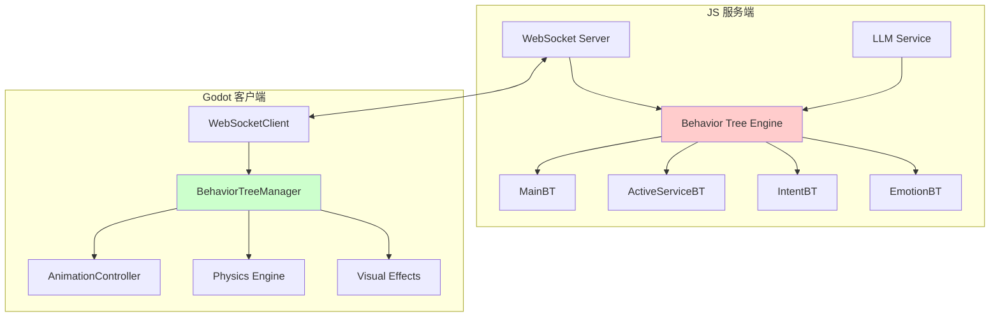
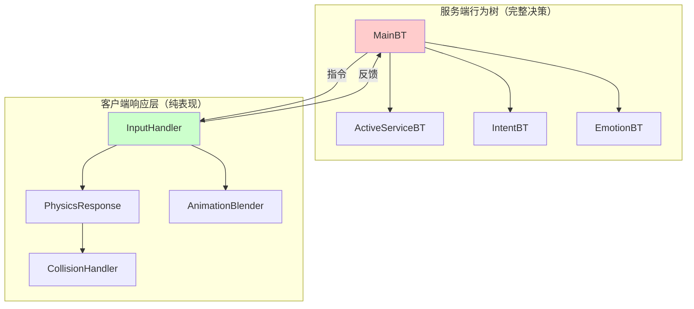
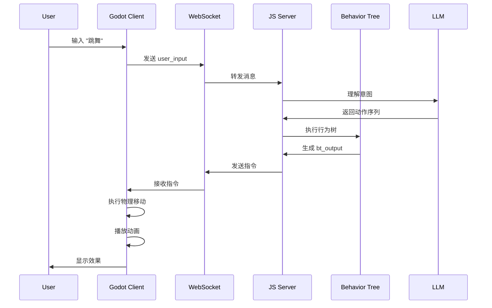
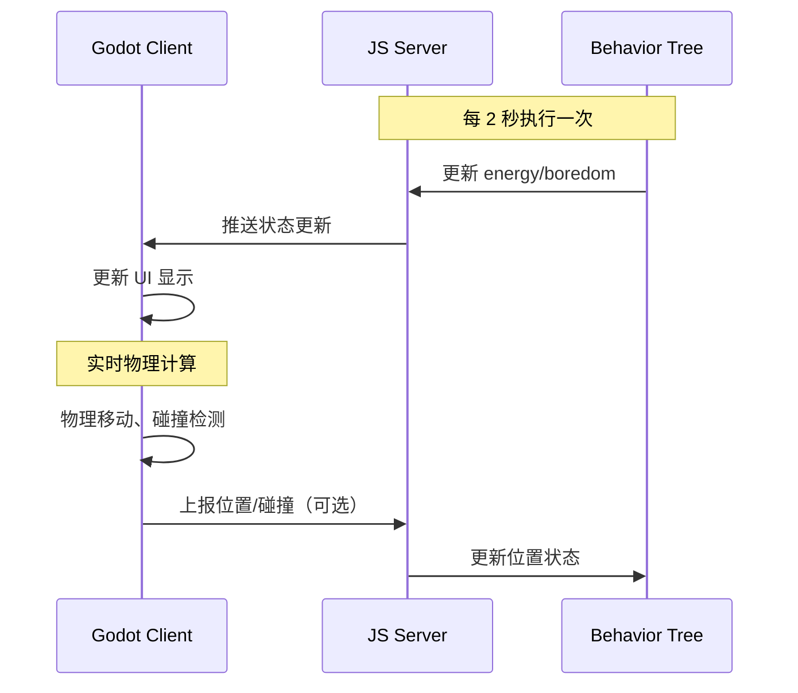
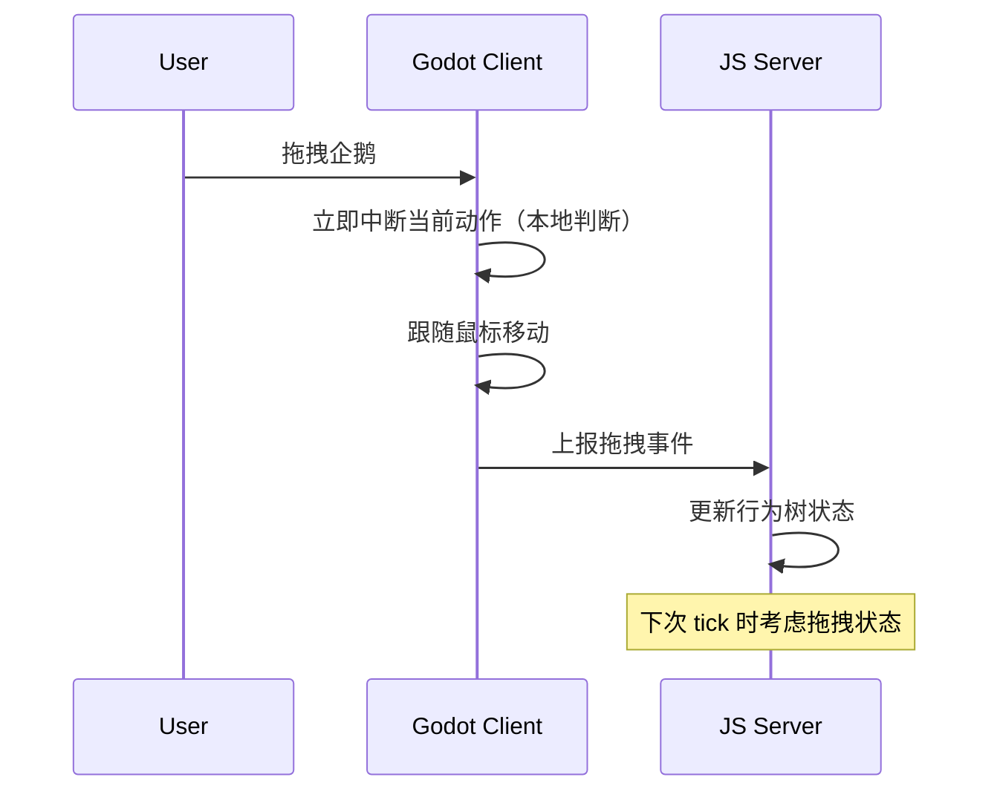

# Godot 萌宠项目：服务端客户端职责划分架构文档

## 1. 架构概述

### 1.1 核心组件对比

#### BehaviorTreeManager (Godot 客户端)
- **位置**：Godot 3D 客户端
- **职责**：
  - 接收服务端行为树输出
  - 管理本地状态同步（energy、boredom、current_action 等）
  - 协调本地行为树分支（MainBT、ActiveServiceBT 等）
  - 管理待执行动作序列
- **特点**：不执行行为树逻辑，只做状态同步和本地协调

#### Behavior Tree Engine (JS 服务端)
- **位置**：WebSocket Server (JS)
- **职责**：
  - 执行行为树逻辑
  - 根据 LLM 输出计算动作序列
  - 更新状态（能量、无聊度等）
  - 生成行为树输出并发送给客户端
- **特点**：实际执行行为树计算

### 1.2 当前架构模式

**关键点：当前只有服务端有完整的行为树执行引擎**

- **服务端**：完整的行为树系统（MainBT、ActiveServiceBT、IntentBT、EmotionBT）
- **客户端**：仅负责状态同步和执行指令，不执行行为树逻辑



## 2. WebSocket 通信协议评估

### 2.1 当前 WebSocket 方案

**通信方式：双向 WebSocket 连接**

**客户端 → 服务端消息类型：**
```json
{
  "type": "user_input",
  "timestamp": 1234567890,
  "data": {
    "text": "跳舞"
  }
}

{
  "type": "mouse_drag",
  "timestamp": 1234567890,
  "data": {
    "start_pos": [0, 0, 0],
    "end_pos": [1, 1, 1],
    "duration": 2.0
  }
}

{
  "type": "state_sync",
  "timestamp": 1234567890,
  "data": {
    "position": [0, -1, 0],
    "current_action": "IDLE",
    "action_progress": 0.5
  }
}
```

**服务端 → 客户端消息类型：**
```json
{
  "type": "bt_output",
  "timestamp": 1234567890,
  "data": {
    "action": "DANCE",
    "expression": "HAPPY",
    "position": [0, -1, 0],
    "energy": 95,
    "boredom": 10,
    "chat_messages": [
      {"role": "assistant", "content": "好的，我来跳舞给你看！"}
    ],
    "action_sequence": [
      {"action": "WALK", "target_pos": [2, -1, 0], "duration": 2.0},
      {"action": "DANCE", "duration": 4.0},
      {"action": "IDLE", "duration": 1.0}
    ]
  }
}
```

### 2.2 WebSocket 是否够用？

#### ✅ **当前场景下，WebSocket 完全够用**

**优势：**
1. **实时性足够**：行为树决策通常按秒级更新，WebSocket 延迟（< 100ms）完全满足
2. **双向通信**：支持客户端主动上报和服务端推送
3. **协议简单**：JSON 消息格式易于调试和扩展
4. **资源消耗低**：相比 HTTP 轮询，WebSocket 连接开销小

**适用场景：**
- 动作指令下发（DANCE, WALK 等）
- 状态同步（energy, boredom, position）
- 聊天消息传输
- 动作序列指令

#### ⚠️ **可能需要增强的场景**

**如果未来需要以下功能，可能需要考虑增强：**

1. **高频物理同步**（多人互动场景）
   - 需要：UDP + 状态插值
   - 当前：不需要（单客户端）

2. **二进制数据流**（音频、视频实时传输）
   - 需要：WebSocket Binary + 压缩
   - 当前：不需要（只有文本和数值）

3. **消息队列和持久化**
   - 需要：Redis + Message Queue
   - 当前：不需要（即时响应即可）

**结论：当前架构下，WebSocket 完全满足需求，无需升级。**

## 3. 服务端与客户端逻辑区分原则

### 3.1 核心设计原则

**黄金法则：服务端负责"决策"，客户端负责"表现"**

1. **服务端（决策层）**
   - 所有需要"思考"和"决策"的逻辑
   - 需要统一性和一致性的状态
   - 需要持久化和跨客户端同步的数据

2. **客户端（表现层）**
   - 所有视觉效果和交互反馈
   - 本地物理模拟和动画
   - 实时性要求高的渲染

### 3.2 具体场景分析

#### 场景 1：物理引擎

**问题：物理引擎应该在服务端还是客户端？**

**答案：客户端执行，服务端只提供目标**

```
服务端计算：目标位置、移动路径、动作意图
客户端执行：实际物理移动、碰撞检测、重力、地面跟随
```

**原因：**
- 物理模拟需要 60fps+ 的高频更新，服务端无法承担
- 物理细节（如草地效果）属于表现层，不影响逻辑
- 服务端只关心"最终到达位置"，不关心"怎么到达"

**实现方式：**
```gdscript
# 服务端发送目标指令
{
  "action": "WALK",
  "target_position": [5, -1, 3],
  "speed": 2.0,
  "duration": 3.0
}

# 客户端执行物理移动
func execute_walk(target_pos: Vector3, speed: float):
    var direction = (target_pos - penguin_position).normalized()
    velocity = direction * speed
    # 本地物理引擎处理碰撞、重力等
```

#### 场景 2：草地走过效果

**问题：草地效果应该在服务端还是客户端计算？**

**答案：完全在客户端**

```
服务端：不关心草地效果
客户端：根据角色位置实时计算草地变形、粒子效果
```

**原因：**
- 纯视觉效果，不影响游戏逻辑
- 需要与 3D 渲染管线紧密结合
- 服务端没有 3D 场景信息

**实现方式：**
```gdscript
# 客户端本地检测
func _on_penguin_moved(position: Vector3):
    var grass_area = get_grass_area(position)
    if grass_area:
        grass_area.apply_deformation(position)
        spawn_particle_effect(position)
```

#### 场景 3：能量和无聊度

**问题：状态管理应该在服务端还是客户端？**

**答案：服务端计算，客户端同步显示**

```
服务端：根据时间、动作类型计算能量消耗和无聊度增长
客户端：接收服务端的计算结果并显示，不做独立计算
```

**原因：**
- 需要统一的计算规则（避免不同客户端显示不一致）
- 可能需要跨客户端同步（未来多人场景）
- 涉及游戏平衡性，必须在服务端控制

## 4. 客户端是否需要本地行为树？

### 4.1 当前架构：客户端不需要完整行为树

**理由：**
- 所有决策都在服务端完成
- 客户端只负责执行指令
- 避免逻辑重复和状态不一致

### 4.2 但是，客户端可能需要"响应式行为树"（Reactive BT）

**定义：响应式行为树 = 纯表现层的响应逻辑**

**场景：需要客户端本地判断的情况**

#### 场景 A：紧急响应（拖拽中断）

```
用户拖拽企鹅 → 需要立即响应，不能等服务端
```

**解决方案：客户端轻量级响应树**
```gdscript
# 客户端轻量级响应
if is_dragging:
    interrupt_current_action()
    follow_pointer()
    return  # 不需要等待服务端
```

**不是完整行为树，只是简单的条件判断**

#### 场景 B：物理反馈（碰撞、地面检测）

```
企鹅撞墙 → 需要立即调整路径
企鹅掉下地面 → 需要立即停止移动
```

**解决方案：客户端物理响应层**
```gdscript
# 客户端物理响应
func _physics_process(delta):
    if is_on_wall():
        stop_movement()
        report_collision_to_server()  # 通知服务端
    
    if not is_on_ground():
        apply_gravity()
        if fall_below_threshold():
            teleport_to_safe_position()
            report_fall_to_server()
```

### 4.3 推荐方案：混合架构



**关键区别：**
- **服务端 BT**：完整的决策逻辑（能量管理、动作选择、LLM 交互）
- **客户端响应层**：纯表现和物理响应（无决策逻辑）

## 5. 详细职责划分清单

### 5.1 服务端职责（决策层）

#### 5.1.1 行为树执行
- ✅ **MainBT**：核心动作决策（睡觉、回归原点、执行指令动作）
- ✅ **ActiveServiceBT**：生存状态管理（能量消耗、无聊度增长）
- ✅ **IntentBT**：用户指令理解（与 LLM 交互，解析意图）
- ✅ **EmotionBT**：情感状态管理（根据动作和状态选择表情）

#### 5.1.2 状态计算
- ✅ **能量系统**：根据动作类型、时间计算能量消耗/恢复
- ✅ **无聊度系统**：根据用户交互频率、时间计算无聊度
- ✅ **位置管理**：计算目标位置、移动路径（不关心物理细节）

#### 5.1.3 LLM 交互
- ✅ **意图理解**：将用户文本转换为动作序列
- ✅ **对话生成**：生成企鹅的回复消息
- ✅ **主动交互**：无聊时主动触发对话

#### 5.1.4 动作序列规划
- ✅ **动作编排**：将 LLM 输出的动作组合成序列
- ✅ **时序管理**：计算每个动作的持续时间
- ✅ **优先级处理**：处理动作中断和优先级

### 5.2 客户端职责（表现层）

#### 5.2.1 物理引擎和移动
- ✅ **物理模拟**：重力、碰撞检测、地面跟随
- ✅ **路径执行**：根据服务端指令执行实际移动
- ✅ **碰撞响应**：检测碰撞并反馈给服务端
- ✅ **边界处理**：防止角色越界

#### 5.2.2 动画系统
- ✅ **动画播放**：根据服务端指令播放对应动画
- ✅ **动画混合**：动作和表情的平滑过渡
- ✅ **动画同步**：确保动画与物理移动同步

#### 5.2.3 视觉效果
- ✅ **草地变形**：角色走过时的草地效果
- ✅ **粒子特效**：动作对应的粒子效果
- ✅ **光影效果**：实时光照和阴影
- ✅ **后处理效果**：模糊、调色等

#### 5.2.4 输入处理
- ✅ **鼠标交互**：拖拽、点击检测
- ✅ **键盘输入**：WASD 移动、快捷键
- ✅ **UI 交互**：按钮点击、文本输入

#### 5.2.5 紧急响应（轻量级）
- ✅ **拖拽中断**：检测到拖拽时立即中断当前动作
- ✅ **紧急停止**：检测到危险情况时立即停止（如掉落）
- ✅ **物理修正**：自动修正物理异常（如卡在墙里）

#### 5.2.6 状态同步和显示
- ✅ **状态显示**：将服务端同步的状态显示在 UI 上
- ✅ **位置同步**：根据服务端的目标位置进行插值移动
- ✅ **动作执行**：执行服务端下发的动作序列

### 5.3 协作机制

#### 5.3.1 指令执行流程



#### 5.3.2 状态同步流程



#### 5.3.3 紧急响应流程



## 6. 实现建议

### 6.1 服务端实现要点

1. **行为树执行频率**
   - MainBT: 每秒 10-20 次 tick（可配置）
   - ActiveServiceBT: 每 2 秒 1 次 tick
   - IntentBT: 按需执行（有用户输入时）

2. **状态计算精度**
   - 能量/无聊度：整数精度即可（0-100）
   - 位置：浮点数，保留 2 位小数
   - 时间：毫秒级时间戳

3. **消息压缩**
   - 相同类型的状态更新可以合并
   - 位置更新可以设置阈值（移动距离 > 0.1 才发送）

### 6.2 客户端实现要点

1. **状态插值**
   - 位置更新：使用 lerp 平滑过渡
   - 动画切换：使用 AnimationTree 的 blend
   - 状态条更新：使用 Tween 动画

2. **物理响应优先级**
   ```
   优先级（从高到低）：
   1. 紧急物理修正（掉落、卡墙）
   2. 用户拖拽输入
   3. 服务端动作指令
   4. 自动行为（回归原点等）
   ```

3. **网络异常处理**
   - 断线重连机制
   - 指令队列缓存（断线期间接收的指令）
   - 本地降级模式（服务端不可用时进入离线模式）

### 6.3 性能优化建议

1. **服务端优化**
   - 行为树 tick 频率根据负载动态调整
   - 使用对象池管理临时对象
   - 批量处理多个客户端的状态更新

2. **客户端优化**
   - 物理计算在固定时间步长（60fps）
   - 状态同步使用增量更新
   - 视觉效果使用 LOD（距离相关的细节级别）

## 7. 总结

### 7.1 核心原则总结

| 职责类型 | 归属 | 原因 |
|---------|------|------|
| **决策逻辑** | 服务端 | 需要统一性和一致性 |
| **状态计算** | 服务端 | 涉及游戏平衡性 |
| **物理模拟** | 客户端 | 需要高频实时计算 |
| **视觉效果** | 客户端 | 与渲染管线紧密结合 |
| **紧急响应** | 客户端 | 需要即时反馈 |

### 7.2 WebSocket 适用性

✅ **完全够用**，适合当前架构：
- 实时性要求：秒级决策，WebSocket 延迟足够低
- 数据量：文本和数值，带宽占用小
- 连接数：单客户端或少量客户端，压力不大

### 7.3 客户端行为树需求

❌ **不需要完整行为树**，但需要：
- ✅ 轻量级响应层（紧急中断、物理反馈）
- ✅ 简单的条件判断逻辑
- ❌ 不需要完整的决策树和执行引擎

### 7.4 未来扩展方向

如果未来需要以下功能，架构可能需要调整：

1. **多人互动**：需要更严格的服务器权威性，客户端只能上报，不能独立决策
2. **离线模式**：需要客户端也能执行简化的行为树逻辑
3. **AI 训练**：需要客户端上报更详细的交互数据

---

**文档版本**：v1.0  
**最后更新**：2024  
**维护者**：开发团队